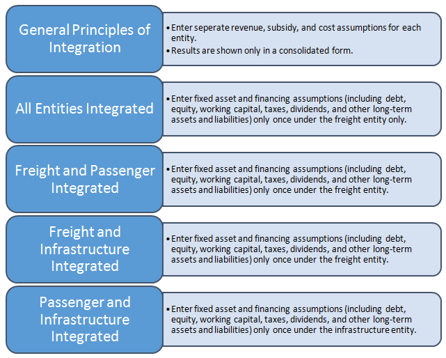

```{r include=FALSE}
# Tanuj Dutta, Sam Archivald, Corey Obermayer, Kevin Good and Clayton Vanos
library(tufte)
```

# Introduction 

## Purpose

The financial model presented in _the Infrastructure Modeling and Analysis spreadsheet_ demonstrates some key assumptions in developing financial modeling for infrastructure operations and how financial and operational results could be presented (See Figure 1 for an example structure). The target audience includes professionals in public and private entities, government agencies, and international organizations. The approach selected here is one of many potential variations of financial modeling; it is neither superior nor universal, just a point of departure for learning.


`r margin_note("Figure 1. Example Model Structure")`

# User requirements

Model users should be proficient in Microsoft Excel and financial analysis of infrastructure operations. More experienced financial modelers can calibrate the model to their specific needs, and with practice, even novice users can learn model structure and logic.

## Basic steps

The model includes no default values or data from an existing entity; instead, model users are expected to have access to recent financial and operational data for the entity they are examining. To begin, model users define the entity and enter all available historical financial and operational data, plus assumptions (Figure 2). The model will then generate a set of results, including forecast financial statements, charts, and ratio analysis. Also, the infrastructure models include a tool for users to test a range of scenarios by changing key variables.
 

`r margin_note("Figure 2. Basic steps in using a financial model")`

# General Assumptions 

## Model scope

To define model scope, users select the type and range of operations. Integrated infrastructure entities produce a single set of financial statements for any combination of operations, while separated consist of distinct legal entities which each have a separate set of financial statements. On the 'Assumptions - General', users select 'integrated' or 'separated', then select operations that are included.

Each selection runs a macro that displays only those assumptions and results relevant to the user. Users should enter assumptions only for selected entities. The scenario needs to be run only once for the selected type. After this has been done, the model can be saved in a macro-free Excel file format.

## Labeling

Users should enter the label selected for each infrastructure entity only once because labels remain constant for all relevant assumptions and results.

## Period

`r margin_note("Note: Results will be generated only for the first 30 years, even if a longer period is entered, due to the difficulty of accurate forecasting many decades ahead.")` Model users can freely select any starting and ending dates within a 30-year period.  It is recommended that the first modeling year is past and data are available. For example, if model users want to generate a forecast for 2011-2039, they should enter a `1/1/2010` starting date and a `12/31/2039` ending date, assuming data exist for year 2010.

## Macroeconomic assumptions

Users enter the primary accounting currency to be used throughout the model, plus inflation and benchmark interest rates for that currency. If debt financing is anticipated from multiple currency sources, up to two additional currencies can be entered. If debt financing involves a fourth currency, loan terms should be converted to one of the model's three available currencies.

## Data entry

`r margin_note("Note: Assumptions must be entered separately for all entities selected unless they are integrated; for example, fixed asset assumptions must be entered for each selected, and separate, entity.")` Users enter data in orange or blue cells. Orange cells indicate entry points for historical data; blue cells indicate assumptions. Data cells with white background indicate results of calculations; these should not be edited.

# Specific Assumptions

## General

Separate assumption can exist for each infrastructure entity. When defining model scope, I limited the assumptions to those relevant for the selected combination. If two or more entities are selected and integrated, users enter some assumptions only once (See Figure 3 for an integration example using a railway entity). In these cases, users can enter additional assumptions under "Consolidated" for any additional costs associated with a headquarters or coordinating authority.
 

`r margin_note("Figure 3. Example Integration of Railway Entities")`

## Network and operational

Users enter assumptions about networks, staffing levels, volumes, traffic distribution or other appropriate measures for the infrastructure entity. Users can adjust these assumptions over the entire forecast period by changing values in the blue cells. For example, shares of electric traction may change for each modeling year if a railway is expanding network electrification. Also, users can enter operational benchmarks and key productivity ratios; these benchmark ratios will appear alongside entity results on the 'Charts' section.

## Fixed assets

`r margin_note("Note: For integrated models with two or more entities, fixed asset assumptions should be entered only in one place. For example, if a freight entity is combined with a passenger or infrastructure entity, users enter fixed asset assumptions for the whole integrated entity under the freight entity (Assumptions - Freight). If an infrastructure entity is integrated with a passenger entity, users enter fixed asset assumptions under the infrastructure entity (Assumptions - Infrastructure).")` Fixed assets can be divided into as many as six asset classes, which can be labeled according to model users' needs. If the entity has more than six asset classes, these should be summarized into six classes for using the model. Next, users enter net asset values and total depreciation at the end of the first modeling year, and forecast annual capital expenditure and asset sales for each asset class. If asset sales over the forecast period exceed the starting total net asset values, the model will display a warning. Users can enter depreciation figures by hand, or the model can calculate depreciation using straight-line depreciation after users enter average remaining life of existing assets and average life of new assets for each asset class. During manual entry, if any figures are missing for required assumptions, the model will display a warning. Existing land assets are an exception because they are not expected to depreciate. If users want to add depreciation for existing land, they can only do so manually. New land assets can be depreciated using the model or manual entry. For integrated entities, users should combine any coordinating authority fixed assets, such as headquarters buildings, with as-sets of the largest entity.

## Other long-term assets

`r margin_note("Note: For integrated entities, assumptions for other long-term assets should be entered for only one segment if it is combined with other segments in the infrastructure entity.")` Users can enter the aggregate value of any other long-term assets (not property, plant, or equipment) that deviate from standard depreciation schedules. Any depreciation, amortization, or impairment should be calculated outside the model and net asset values entered for each year in the period.

## Traffic

Traffic is a critical assumption that can be entered for up to 10 commodities and/or other services. Data entry starts by selecting units of available data. The model can use average length of cargo haul/trip and net weight, together with the GTK information given earlier, to convert original data to other units of traffic volume. The model converts to GTK because some operating costs, such as energy consumption, are forecast proportionally to GTK volume. Users have the option of adjusting the gross to net ton-km ratio for any forecast year by entering a "change in GTK/NTK ratio".

## Tariff assumptions

`r margin_note("Note: Resulting tariffs/fares can also be shown for each traffic flow by clicking on 'Show/hide results'. These results feed from the Calculations section and allow the user to see the outcome of selected tariff/fare assumptions.")` Each traffic flow defined above is associated with a tariff. First, users determine if tariffs and fares rise with inflation. If they do, the proportion of the rise can be set separately for each traffic flow. For example, a 50 percent inflation indexation means that the annual tariff/fare increases half of annual inflation through the forecast period. An additional tariff/fare change, post inflation adjustment, can also be entered for each year.

## Other operating revenue

Any revenue generated outside tariffs and fares can be entered here. Outside revenues from multiple sources should be aggregated for the one line item provided in the model.

## Non-operating revenue

Users can enter tax credits, foreign exchange gains, or other revenue that is independent of operations volumes; revenues can be adjusted for inflation and for any annual changes during the forecast period. Annual changes can be applied to the quantity of a revenue stream or its 'unit price'. If a revenue stream is difficult to separate into price and quantity components, any annual change can be entered to either quantity or price. Quantity multiplied by price yields annual revenue.

## Public subsidies

Some infrastructure entities receive public subsidies under public service agreements or as compensation for discounted fares provided for special groups. Usually, governments provide operational subsidies to cover operating costs and these are shown in the income statement as part of operating revenue. Also, capital subsidies are provided for capital investments; these appear in the cash flow statement and in the capital subsidy equity account on the balance sheet. The model automatically amortizes annual capital subsidies, linking them to new assets' depreciation because some new assets are likely acquired with the capital subsidy. Similar to accounting treatment for deferred revenue, amortization means that part of the capital subsidy is recognized each year as revenue as the corresponding acquired asset is used. Asset use can be approximated by the corresponding depreciation amount each year. Users must enter the corresponding capital investment on the assumptions sheet by hand since no automatic link exists between capital subsidy and investment.

`r margin_note("Note: For integrated entities, assumptions for capital subsidies need to be entered for one segment only if it is combined with others.")` If subsidies are available, users enter the first-year amount, decide whether to link the subsidy level to inflation, and, if so, to what proportion. An additional annual change can also be entered. Alternatively, users enter the subsidy for each year by hand.

## Operating costs

Some operating costs are fixed; other operating costs vary with volume and/or inflation. All costs are calculated as quantity multiplied by price-a physical cost driver and a price. For staff cost, the number of staff (or staff count) defines the quantity, and salary, benefits and overhead form the 'price' (or 'staff member cost'). Cost driver and price variability can be defined. For example, if variability of staff count relative to staff cost is 100 percent, total staff costs increase in 1-to-1 relationship with staff count. If variability is 50 percent, total staff costs increase by only 50 percent of staff count, i.e., half of the total cost driven by quantity is fixed. 

Price or unit cost can vary with inflation to the extent defined by users. Users can also increase the price above or below inflation by entering an 'additional annual change'. The additional change will apply until the end of the forecast period, unless undone by the user through a reverse additional change. Other operating costs are defined by the same logic but with other physical cost drivers. Materials costs can be driven by total traffic, measured in GTK, and other potential costs such diesel fuel and electricity depend on diesel and electric traffic volumes respectively.
External services and other operating expenses are not linked to staff or traffic for the physical cost driver. Instead, users define the initial quantity and can change it in any year. The point is to capture the percentage change in quantity, so the physical cost driver could also be a simple index that starts with 100 and changes as defined by users. As above, users can define the variability of these costs in relation to changes in quantity. Users can define the degree of price variability with inflation, and whether price is impacted by additional changes.

`r margin_note("Note: Users can ignore the section on 'scenario analysis' when entering values for the base case. Scenario analysis is relevant only when the base case is complete and the model is ready for sensitivity testing with different variables.")` For a consolidated entity, the model assumes that the only additional costs arise from coordinating activities in headquarters, which can be captured by additional staff cost and other operating expenses. Users should enter any additional operating costs under these two categories.

## Non-operating costs

Users can freely label non-operating costs and define the variability of physical and price cost drivers because they are independent of any operational variables. The logic behind non-operating cost calculations remains similar to that of other operating costs.

## Taxes and dividends

`r margin_note("Note: Consolidated financial statements will use dividend assumptions entered on 'Assumptions - Consolidated'. Segment entity tax assumptions are used for consolidated financial statements if that segment is selected.")` Users enter the corporate income tax applicable during the modeling period and set the amount of annual dividend. The model excludes the impact of value-added taxes. Users also enter the debt service coverage ratio before a dividend can be paid, which is sometimes a financial covenant requested by lenders. If the entity's debt service coverage ratio (DSCR) for a given year is lower than the requirement, no dividend is paid. If actual DSCR exceeds the requirement, a dividend will be paid from cash flow available for dividends, as determined on the Calculations section. Users set the 'annual dividend after DSCR' as a percentage share of the cash available for dividends.

## Working capital

First-year values are important in defining working capital (current assets minus current liabilities). The model converts each working capital item into the number of days of underlying revenue or underlying cost that each account represents. For example, days in accounts receivable indicate the amount of recognized operating revenue waiting to be paid; 50 days in accounts receivable is the total operating revenue typically recognized over a 50-day period. Inventory can consist of stored materials and diesel fuel for use; other receivables are linked to other revenues.

`r margin_note("Note: In consolidation, working capital accounts for segmented entities are aggregated, excluding accounts receivable and payable arising from intra-company access charges.  The consolidated entity needs additional working capital for headquarters staff costs, other operating costs and non-operating costs.")` On the liability side, accounts payable refer to total operating costs that are due but unpaid; other payables are defined by non-operating cost amounts waiting to be paid. If revenue collections become more/less efficient and invoice payments faster/slower, users can adjust after the first, historical year, the number of days outstanding in each working capital account. Finally, users can define how much interest is earned on cash balances, if any. It would not be unusual for interest to be below the benchmark interest for a low-risk cash account or short-term money market investment.

## Debt financing

Assumptions for financing are divided into existing debt, new debt, and equity. Existing debt consists of three loans that the user defines according to source, currency, outstanding balance, repayment schedule, and interest rate. Users must ensure that the outstanding balance in the first modeling year is repaid in full by entering sufficient annual repayments in the schedule. If any amount remains outstanding, the model displays a warning.

New debt assumptions can be entered for up to four loans. First, users must name the funding source, indicate the first disbursement year (any number from 1-30) and enter the loan currency. As mentioned earlier, if debt financing involves a fourth currency, loan terms should be converted to one of three available currencies. Users must enter the disbursement schedule for the new loans by hand since, by definition, new debt is undisbursed at the time of modeling. Users select the loan term, which includes the grace period, and can select a repayment profile-bullet, equal installment, or fixed annuity.

`r margin_note("Note: For integrated entities, financing assumptions need to be entered for one segment only if it is combined with other segments.")` A bullet loan is paid off in a single principal repayment at the end of the loan term and interest is paid annually on the whole principal; equal installments divide the loan into equal principal repayments with interest charged on the outstanding balance; fixed annuity repayment maintains an annual fixed amount of combined principal and interest. Users can enter a front-end fee due in the first year of loan disbursement and/or a commitment fee assessed during loan disbursement on committed but undisbursed capital (principal amount minus dis-bursements).

## Other long-term liabilities

`r margin_note("Note: For integrated entities, assumptions for other long-term liabilities need to be entered for one segment only if it is combined with other segments.")` Users can group and enter any other long-term liabilities.

## Equity

`r margin_note("Note: For integrated entities, equity assumptions need to be entered for one segment only if it is combined with other segments.")` Equity assumptions are straightforward. Users enter the combined ending paid-in capital in the first modeling year, together with retained earnings. Changes to paid-capital, in case of new equity injection, can be entered by hand for any year in the forecast period.

# Calculations

On this section, assumptions are converted through calculations into a form required for financial statements and numerical and graphical results. Users need not enter assumptions or data because the model will automatically feed any required inputs from the Assumptions sheet or Scenario analysis, if enabled. The Calculations sheet can be used to check calculation methodology or to assist an experienced financial modeler in troubleshooting and model calibration.

# Financial Statements 

## Balance sheet

`r margin_note("Note: The Ratios section contains checks to ensure that the balance sheet is correctly presented. Always confirm that the answer to each check is 'Yes'.")` As users are entering assumptions, the model is generating financial statements, including a balance sheet, for each selected entity. For financial statements that are complete and accurate, all assumptions must be entered. Users must pay particular attention to initial historical data because they must balance assets with liabilities and equity in the first modeling year; then the model will balance following years through income and cash flow statements. The consolidated balance sheet combines individual balance sheets of selected entities and removes intracompany transactions.

## Income statement

Assumptions entered for traffic, tariffs, subsidies, access charges and other infrastructure revenue sources define income statement revenues for the selected entities. Subsidy amortization is non-cash revenue and included in other revenue. The main costs comprise from the operating costs section. Depreciation, a non-cash operating cost, is presented separately from cash-based operating costs to distinguish between earnings before interest, tax, depreciation and amortization (EBITDA) and earnings before interest and tax (EBIT). Net finance expenses are the balance between debt service and interest income. Net income is the final result after income tax and net finance expenses have been deducted.

## Cash flow statement

The indirect method is used to construct cash flow statements; first, net income is adjusted for non-cash revenues and costs to determine net cash from operating activities. Investing activities present the combined capital expenditure and sale of assets across all asset categories. Financing activities detail changes in debt and equity balances and amount of interest paid. Dividend calculation is based on user assumptions and cash flow available for dividends.

# Input and Output Summaries 

## Charts

On this section, key operational and financial results are presented as dynamic charts that automatically adjust for changes in the forecast period, currency, or input units. Productivity charts include user-defined benchmarks on the 'Assumptions'. Users are encouraged to study the charts to visually validate assumptions and modeling results, and make it easier to detect inadvertent omissions or errors.

## Results

This includes summaries of assumptions and outputs and a list of key operating and financial ratios. The input summary changes in response to changed assumptions or to enabling the 'scenario analysis' function. Users cannot enter inputs on this sheet or adjust assumptions because the summary feeds from the 'Assumptions', 'Calculation' and 'Charts' sheets. The output summary contains key financial and operational results with charts adapted from 'Charts' sheet. Results are expressed as numbers and charts, and will change if assumptions are changed or if 'scenario analysis' is enabled. The output summary is intended to present a results snapshot under assumptions selected.

`r margin_note("Note: Users cannot introduce changes directly to results or charts in the above sections, only to the assumptions or scenario analysis section.")` Finally, some common financial ratios are presented under 'Results' with minimum, maximum, and average values and their dates of occurrence. Similar to other results sheets, these ratios change if assumptions are changed or if scenario analysis is enabled. This section includes checks to validate the balance sheet and cash balances.

# Scenario and Sensitivity Testing

This section can be used after all assumptions have been entered and the financial statements and results have been validated to form a solid base case. The user can use the Scenario analysis sheet for sensitivity testing of key variables and model calibration. Each entity has a scenario analysis that has to be switched on when performing sensitivity testing.

After an entity scenario analysis has been switched on, the variable to be tested must also be switched on; the value entered for the variable will supersede the value entered on the Assumptions sheet and feed into all results and charts, including charts on the Scenario analysis sheet. When the variable is switched off, the original assumption, results, and charts are restored.

`r margin_note("Note: If users want to test more variables than are available in scenario analysis, they can return to assumptions and make changes. Sensitivity analysis should extend beyond the few variables presented here.")` Before beginning sensitivity testing, i.e., when all switches are off, users can copy-paste base-case values shown in 'Results' to the space provided for base-case results. Results shown above base-case values change as different assumptions are tested.

If any tested scenarios produce a low-equity return, low DSCR, or negative cash balance warnings will be displayed to alert users to potential financially unsustainable scenarios.