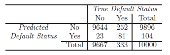
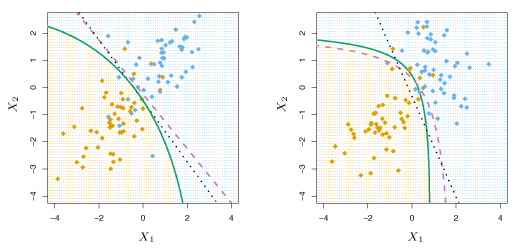

$$\newcommand{\Var}{\mathrm{Var}}
\newcommand{\MSE}{\mathrm{MSE}}
\newcommand{\Avg}{\mathrm{Avg}}
\newcommand{\Bias}{\mathrm{Bias}}$$

In many situations the response variable is *qualitative* (or *categorical*) such as eye color or birth country.
Predicting a qualitative response for an observation is referred to as *classifying* that observation since it involves assigning an observation to a category, or class.

## An Overview of Classification
Similar to the regression setting, a classification problem has a set of training observations $$(x_1, y_1), \ldots , (x_n, y_n)$$ that are used to build a classifier.

##### Examples

1. A person arrives at the emergency room with a set of symptoms that could possibly be attributed to one of three medical conditions. Which of the three conditions does the individual have?
2. An online banking service must be able to determine whether or not a transaction being performed on the site is fraudulent, on the basis of the user’s IP address, past transaction history, and so forth.
3. On the basis of DNA sequence data for a number of patients with and without a given disease, a biologist would like to determine which DNA mutations are deleterious (disease-causing) and which are not.

The left panel of Figure 4.1 shows a scatter plot of individuals who default/do not default on their credit card payments.
The orange points are the individuals who defaulted, and the blue points are those who did not.
The right panel shows boxplots of balance as a function of default status and income as a function of default status.

{:refdef: style="max-width:750px; margin:auto; text-align: center;"}
__Figure 4.1__ -- Left: *Annual incomes and monthly credit card balances colored orange for those who defaulted and blue for those who did not.* Right: *Boxplots of income as a function of default status.*
{: refdef}

## Why Not Linear Regression?
Consider the quantitative response variable $$Y$$ where
$$
Y = 
\left \{ \begin{array}{ll}
    1 \qquad & \text{if stroke;} \\ 
    2 \qquad & \text{if drug overdose;} \\ 
    3 \qquad & \text{if epileptic seizure.}
    \end{array}\right .
$$
We could perform a least squares regression to predict $$Y$$ from predictors $$X_1, \dots ,X_p$$. 
An ordering of the outcomes is implied by coding $$Y$$ in this way, so this method is only appropriate if the outcomes are truly ordered. 
In practice, there is no methodology to convert a qualitative response variable with more than two levels into a quantitative response to perform linear regression.

For *binary* (two level) qualitative variables, dummy variables can be used to code the response $$Y$$.
For example, if only stroke and drug overdose were considered, the dummy variable approach could be used as
$$
Y = 
\left\{\begin{array}{ll}
    0 \qquad & \text{if stroke;} \\ 
    1 \qquad & \text{if drug overdose.} \\ 
    \end{array}\right.
$$
Then, if $$\hat{Y} > 0.5$$, drug overdose would be the predicted response, otherwise stroke would be the predicted response.
Switching the coding scheme has no effect on the predictions.
Unfortunately, dummy variables cannot be expanded to deal with qualitative responses with more than two levels. 
In these situations, classification must be used. 

For example, in Figure 4.2, the estimated probabilities of default using least squares linear regression is shown in the left panel.
This is clearly a flawed prediction as some of the probabilities are negative.
In the right panel, logistic regression is used resulting in all probabilities falling between 0 and 1.

{:refdef: style="max-width:750px; margin:auto; text-align: center;"}
__Figure 4.2__ -- Left: *Estimated probability of default using linear regression.* Right: *Estimated probability of default using logistic regression.*
{: refdef}

## Logistic Regression
Logistic regression is useful for modeling the probability that the response $$Y$$ belongs to a certain category.

### The Logistic Model
In classification problems, the least squares linear regression model that predicts the probability $$p(X) = \Pr(Y=1 \mid X)$$ such that,
$$
    p(X) = \beta_0 + \beta_1X
    \tag{4.1}
$$
results in $$p(X) < 0$$ for small $$X$$ and $$p(X) > 1$$ for large $$X$$, as demonstrated in the left panel of Figure 4.2.
Hence, a new model is needed such that $$0 \leq p(X) \leq 1$$ for all values of $$X$$. 

Logistic regression provides a solution by modeling $$p(X)$$ with a function that always returns values between 0 and 1.
The *logistic function*
$$
    p(X) = \frac{\mathrm{e}^{\beta_0+\beta_1X}}{1 + \mathrm{e}^{\beta_0 + \beta_1X}} 
    \tag{4.2}
    \label{eq:logisticFunc}
$$
is used to fit a model by *maximum likelihood* estimation.

In the right panel of Figure 4.2, logistic regression was used to predict the response.
Low credit card balances result in default probabilities near 0 while high balances result in probabilities near 1. 

The *odds* are given by
$$
    \frac{p(X)}{1-p(X)} = e^{\beta_0 + \beta_1X} \tag{4.3}
$$
where $$0 \leq p(X)/(1-p(X)) < \infty$$.
Odds near 0 and $$\infty$$ indicate low and high default probabilities respectively.
The *log-odds* or *logit* is given by
$$
    \log \left ( \frac{p(X)}{1 - p(X)} \right ) = \beta_0 + \beta_1 X \>.
    \tag{4.4}
$$
The logistic regression model $$\eqref{eq:logisticFunc}$$ has a logit that is linear in $$X$$.

In logistic regression, p-values, standard errors and other statistical values mentioned earlier have the same meaning.

### Estimating the Regression Coefficients
The method of *maximum likelihood* is preferred for estimating the coefficients $$\beta_0$$ and $$\beta_1$$ over least squares as it has better statistical properties.
Maximum likelihood works by finding $$\hat{\beta}_0$$ and $$\hat{\beta}_1$$ such that the likelihood function
$$
    \ell(\beta_0, \beta_1) = \prod_{i:y_i = 1} p(x_i) \prod_{i':y_{i'} = 0} (1 - p(x_{i'})) 
    \tag{4.5}
    \label{eq:maxLike}
$$
is maximized.

As in linear regression, the accuracy of the coefficient estimates is measured using standard errors.
In logistic regression, the $$z$$-statistic plays the same role as the $$t$$-statistic from linear regression.

### Multiple Logistic Regression

Logistic regression can be extended to the case of $$p > 1$$ predictors $$X = (X_1, \ldots, X_p)$$ by
$$
    \log \left ( \frac{p(X)}{1 - p(X)} \right ) = \beta_0 + \beta_1 X_1 + \cdots + \beta_p X_p \>.
    \tag{4.6}
    \label{eq:multipleLogisticFunc}
$$
Equation $$\eqref{eq:multipleLogisticFunc}$$ can be rewritten as
$$
    p(X) = \frac{\mathrm{e}^{\beta_0 + \beta_1 X_1 + \cdots + \beta_p X_p}}{1 + \mathrm{e}^{\beta_0 + \beta_1 X_1 + \cdots + \beta_p X_p}},
    \tag{4.7}
$$
then maximum likelihood, as in equation$$~\eqref{eq:maxLike}$$, can be used to estimate $$\beta_0, \beta_1, \ldots, \beta_p$$.

### Logistic Regression with more than Two Response Classes
Multiple-class classification is typically performed using *discriminant analysis* rather than logistic regression.

## Linear Discriminant Analysis
Linear discriminant analysis (LDA) is preferred over logistic regression when 

- Classes are well-separated where logistic regression would result in unstable parameter estimates.
- $$n$$ is small and the distribution of the predictors $$X$$ is approximately normal in each of the classes. In this case, linear discriminant analysis is more stable.
- There are more than two response classes.

### Using Bayes' Theorem for Classification
Suppose we would like to classify observations into one of $$K \geq 2$$ classes. 
Let $$\pi_k$$ represent the overall *prior* probability that a randomly chosen observation comes from the $$k$$th class.
Let $$f_k(X) \equiv \Pr(X = x \mid Y = k)$$ denote the *density function* of $$X$$ for an observation that comes from the $$k$$th class.
*Bayes' theorem* states that
$$
    \Pr(Y = k \mid X = x) = \frac{\pi_k f_k(x)}{\sum_{l=1}^{K} \pi_l f_l(x)} \>. 
    \tag{4.10} \label{eq:bayesTheorem}
$$
In general, estimating $$\pi_k$$ is easy, but estimating $$f_k(X)$$ turns out to be more difficult.

### Linear Discriminant Analysis for $$p=1$$
Assume that $$f_k$$ follows a normal distribution. 
The normal density function (in one-dimension) takes the form
$$
    f_k(x) = \frac{1}{\sigma_k \sqrt{2 \pi}} \,\mathrm{exp} \! \left ( - \frac{1}{2 \sigma_k^2} (x - \mu_k)^2 \right ),
    \tag{4.11} \label{eq:normalDF}
$$
where $$\mu_k$$ and $$\sigma_k^2$$ are the mean and variance parameters for the $$k$$th class respectively.
Here $$\pi$$ (with no subscript) is the numerical constant $$\pi = 3.14159\ldots$$.
To simplify the analysis, let all $$K$$ classes have the same variance, denoted by $$\sigma^2$$.

Substituting $$\eqref{eq:normalDF}$$ into $$\eqref{eq:bayesTheorem}$$, we find
$$
    p_k(x) = \frac{\pi_k \frac{1}{\sigma \sqrt{2 \pi}} \,\mathrm{exp} \! \left ( - \frac{1}{2 \sigma^2} (x - \mu_k)^2 \right) }{ \sum_{l=1}^K \pi_l \frac{1}{\sigma \sqrt{2 \pi}} \,\mathrm{exp} \! \left (  - \frac{1}{2 \sigma^2} (x - \mu_l)^2 \right )} \>.
    \tag{4.12}
    \label{eq:bayesClassifier}
$$
The Bayes classifier classifies $$X = x$$ into the class $$k$$ where $$p_k(X)$$ is the largest.
By taking the log of $$\eqref{eq:bayesClassifier}$$ and rearranging terms, this is equivalent to classifying $$X = x$$ to the class $$k$$ such that 
$$
\delta_k(x) = x \cdot \frac{\mu_k}{\sigma^2} - \frac{\mu_k^2}{2\sigma^2} + \log(\pi_k)
\tag{4.13} \label{eq:deltak}
$$
is largest.

If $$K=2$$, the Bayes decision boundary is the point
$$
x = \frac{\mu_1^2 - \mu_2^2}{2(\mu_1-\mu_2)} = \frac{\mu_1+\mu_2}{2} \>.
\tag{4.14}
$$

In practice, even if our assumption that $$X$$ is normally distributed in each class is close to accurate, we must estimate $$\mu_1,\ldots,\mu_K$$, $$\pi_1,\ldots,\pi_K$$ and $$\sigma^2$$. 
Linear discriminant analysis (LDA) approximates the Bayes classifier with the estimates below for $$\pi_k$$, $$\mu_k$$ and $$\sigma^2$$,
$$
\begin{align*}
    \hat{\mu}_k &= \frac{1}{n_k}{\sum\limits_{i:y_i=k}x_i} \\
    \hat{\sigma}^2 &= \frac{1}{n-K}\sum\limits_{k=1}^K\sum\limits_{i:y_i=k}(x_i-\hat{\mu}_k)^2 
    \tag{4.15} \label{eq:sigmamuhat}
\end{align*}
$$
where $$n$$ is the total number of training observations and $$n_k$$ is the number of the training observations in the $$k$$th class.
The estimate for $$\mu_k$$ is the average of all training observations in the $$k$$th class and $$\hat{\sigma}^2$$ is a weighted average of the sample variances from each class.
LDA estimates $$\pi_k$$ by the proportion of training observations that belong to the $$k$$th class
$$
    \hat{\pi}_k = n_k/n \>.
    \tag{4.16} \label{eq:pihat}
$$
Substituting the estimates for $$\pi_k$$, $$\mu_k$$ and $$\sigma^2$$ into equation $$\eqref{eq:deltak}$$, the estimate of the LDA classifier is
$$
    \hat{\delta}_k(x) = x \cdot \frac{\hat{\mu}_k}{\hat{\sigma}^2} - \frac{\hat{\mu}_k^2}{2\hat{\sigma}^2} + \log(\hat{\pi}_k) \>.
    \tag{4.17}
$$

##### Example
The left panel of Figure 4.4 shows the density functions $$f_1(x)$$ and $$f_2(x)$$ for two distinct classes.
The mean and variances for the two classes are $$\sigma_1^2 = \sigma_2^2 = 1$$ and $$\mu_1 = -1.25$$, $$\mu_2 = 1.25$$. 
The black dashed line is the Bayes decision boundary.
Some overlap between the density functions can be seen, so for $$X=x$$, there is some uncertainty about which class the observation belongs to.
Suppose an observation has a 50% chance of being from either class. 
Then, $$\pi_1 = \pi_2 = 0.5$$, so if $$x < 0$$, the Bayes classifier assigns it to class 1. 
Otherwise, it is assigned to class 2.

The histogram in the right panel shows 20 random observations from each class.
Estimates of $$\pi_k$$, $$\mu_k$$ and $$\sigma^2$$ were found using $$\eqref{eq:sigmamuhat}$$ and $$\eqref{eq:pihat}$$.
The solid black line shows the LDA decision boundary.
Points to the left of the black line are assigned to the green class and points to the right are assigned the purple class.
Since $$\hat{\pi}_1 = \hat{\pi}_2$$, the decision boundary is the midpoint between the class sample means, $$(\hat{\mu}_1 + \hat{\mu}_2)/2$$. 
The LDA decision boundary is left of the Bayes decision boundary, $$(\mu_1 + \mu_2)/2 = 0$$.

{:refdef: style="max-width:750px; margin:auto; text-align: center;"}
__Figure 4.4__ -- Left: *Two one-dimensional normal density functions, the vertical dashed line is the Bayes decision boundary.* Right: *20 observations drawn from each of the two classes shown as histograms. The Bayes decision boundary is the dashed line and the LDA decision boundary is the solid black line.*
{: refdef}

### Linear Discriminant Analysis for $$p>1$$
Suppose $$X = (X_1, X_2, \ldots ,X_p)$$ is drawn from a *multivariate Gaussian* (normal) distribution, with a class-specific mean vector and common covariance matrix. 
The multivariate normal distribution assumes each predictor is normally distributed, with some correlation between pairs of predictors. 
Figure 4.5 shows two multivariate normal distributions for $$p=2$$.
The surface height at a fixed point corresponds to the probability that $$X_1$$ and $$X_2$$ lie in some small area around that point. 
If the surface is cut along the $$X_1$$ or $$X_2$$ axes, the cross-sections follow one-dimensional normal distributions.
In the left panel, we have $$\mathrm{Var}(X_1) = \mathrm{Var}(X_2)$$ and $$\mathrm{Cor}(X_1, X_2) = 0$$, yielding a *bell shape*. 
The bell shape will be distorted if the predictors are correlated or have unequal variances as in the right panel.

{:refdef: style="max-width:750px; margin:auto; text-align: center;"}
__Figure 4.5__ -- *Two multivariate Gaussian density functions with $$p=2$$.* Left: *The two predictors are uncorrelated.* Right: *The two predictors have a correlation of 0.7.*
{: refdef}

The notation $$X \sim N(\mu, \boldsymbol{\Sigma})$$ indicates that a $$p$$-dimensional random variable $$X$$ follows a multivariate Gaussian distribution.
Here $$E(X) = \mu$$ is the mean of $$X$$ (a vector with $$p$$ components), and $$\mathrm{Cov}(X) = \boldsymbol{\Sigma}$$ is the $$p \times p$$ covariance matrix.
The multivariate Gaussian density function is given by
$$
    f(x) = \frac{1}{(2 \pi)^{p/2} | \boldsymbol{\Sigma} | ^{1/2}} \, \mathrm{exp} \! \left ( - \frac{1}{2} (x - \mu)^T \boldsymbol{\Sigma}^{-1} (x - \mu) \right ) \> .
    \tag{4.18}
$$
For $$p > 1$$ predictors, the LDA classifier assumes the observations in the $$k$$th class are drawn from a multivariate Gaussian distribution $$N(\mu_k, \boldsymbol{\Sigma})$$ where $$\mu_k$$ is a class-specific mean vector and $$\boldsymbol{\Sigma}$$ is a covariance matrix common to all $$K$$ classes.
The Bayes classifier assigns $$X = x$$ to the class $$k$$ that maximizes
$$
    \delta_k(x) = x^T \boldsymbol{\Sigma}^{-1} \mu_k - \frac{1}{2} \mu_k^T \boldsymbol{\Sigma}^{-1} \mu_k + \log{\pi_k} \>.
    \tag{4.19}
$$
To estimate $$\mu_1,\ldots,\mu_K$$, $$\pi_1,\ldots,\pi_K$$ and $$\boldsymbol{\Sigma}$$, formulas similar to those in the one-dimensional case are used.
LDA assigns a new observation $$X = x$$ to the class that maximizes $$\hat{\delta}_k(x)$$.

In the left panel of Figure 4.6, three classes are shown with class-specific mean vectors and a common covariance matrix drawn from a multivariate normal distribution with $$p=2$$.
The three ellipses are the regions where 95% of the probability for each of the three classes falls. 
The Bayes decision boundaries are shown by the black dashed lines, the set of $$x$$ where $$\delta_k(x) = \delta_l(x)$$, i.e.
$$
    x^T \boldsymbol{\Sigma}^{-1} \mu_k - \frac{1}{2} \mu_k^T \boldsymbol{\Sigma}^{-1} \mu_k = x^T \boldsymbol{\Sigma}^{-1} \mu_l - \frac{1}{2} \mu_l^T \boldsymbol{\Sigma}^{-1} \mu_l
    \tag{4.20}
$$
for $$k \neq l$$. 
In the right panel, 20 random observations from each of the three classes are plotted. 
The LDA decision boundaries are shown by the solid black lines, clearly they are similar to the Bayes decision boundaries (dashed lines).

{:refdef: style="max-width:750px; margin:auto; text-align: center;"}
__Figure 4.6__ -- *Example with three classes. Observations from each class are drawn from a multivariate Gaussian distribution with $$p=2$$.* Left: *Ellipses that contain 95% of the probability for each of the three classes are shown. The dashed lines are the Bayes decision boundaries.* Right: *20 observations were generated from each class, and the corresponding LDA decision boundaries are shown by solid black lines.*
{: refdef}

Binary classifiers, like the one in the example above, can make two errors. They can classify someone who defaults as not defaulting, or they can classify someone who does not default as defaulting. We would like to know which type of errors our classification method is making. 
A *confusion matrix*, such as Table 4.4, can be used to determine which of these two types of errors are being made.

In the credit card example above, LDA predicted 104 defaults. 
Of these 104 default predictions, 81 actually defaulted, but 23 did not. 
Therefore, the table shows that 23/9,667 of the non-defaulters were misclassified.
At first this appears to be a low error rate, but of the 333 individuals who defaulted, 242 were missed by LDA.

{:refdef: style="max-width:750px; margin:auto; text-align: center;"}
__Table 4.4__ -- *A confusion matrix comparing the LDA predictions to the true default statuses for the 10,000 training observations. Elements on the diagonal of the matrix represent individuals whose default statuses were correctly predicted, while off-diagonal elements represent individuals that were misclassified.*
{: refdef}

The Bayes classifier assigns an observation to the class for which the posterior probability $$p_k(X)$$ is greatest.
With two classes, an observation is assigned to the *default* class if
$$
\Pr(\text{default} = \text{Yes} \mid X = x) > 0.5 \>.
\tag{4.21}
$$
Thus, the Bayes classifier and LDA use a threshold of 50% for classification. 
However, if we are concerned about incorrectly predicting the default status for individuals who default, we can lower this threshold to say 20%.
Then, we assign individuals to the default class when
$$
\Pr(\text{default} = \text{Yes} \mid X = x) > 0.2 \>.
\tag{4.22}
$$

Figure 4.7 shows the error rates as a function of the posterior probability threshold for defaulting.
The black solid line is the overall error rate, the blue dashed line is the proportion of incorrectly assigned defaulting customers and the orange dotted line represents errors amongst non-defaulters. 

{:refdef: style="max-width:750px; margin:auto; text-align: center;"}
__Figure 4.7__ -- *Error rates are shown as a function of the threshold value for the posterior probability that is used to perform the assignment. The black solid line is the overall error rate, the blue dashed line is the fraction of defaulting customers that are incorrectly classified and the orange dotted line is the fraction of errors among the non-defaulting customers.*
{: refdef}

The *ROC curve* is useful for comparing both kinds of errors at all possible thresholds.
In Figure 4.8, the ROC curve for the default data is shown.
Classifier effectiveness, over all possible thresholds, is evaluated by the *area under the (ROC) curve* (AUC). 
Ideally, the ROC curve stays near the top-left corner so the AUC is maximized.
The LDA classifier in Figure 4.8 has an AUC of 0.95, close to the maximum of 1, which indicates it is effective. 
ROC curves help determine if classifiers are effective because they consider all thresholds.

{:refdef: style="max-width:750px; margin:auto; text-align: center;"}
__Figure 4.8__ -- *ROC curve for the LDA classifier on the Default data.*
{: refdef}

### Quadratic Discriminant Analysis
As in the LDA setting, *Quadratic Discriminant Analysis* (QDA) classifiers assume that observations from each class are drawn from a Gaussian distribution.
Unlike LDA, each class has its own covariance matrix.
An observation from the $$k$$th class is of the form $$X \sim N(\mu_k, \boldsymbol{\Sigma}_k)$$ where $$\boldsymbol{\Sigma}_k$$ is the covariance matrix for the $$k$$th class.
Now, the Bayes classifier assigns $$X = x$$ to the class that maximizes
$$
\begin{align*}
    \delta_k(x) &= -\frac{1}{2}(x - \mu_k)^T \boldsymbol{\Sigma}_k^{-1} (x - \mu_k)+ \log{\pi_k} \\
    &= -\frac{1}{2} x^T \boldsymbol{\Sigma}_k^{-1} x + x^T \boldsymbol{\Sigma}_k^{-1} \mu_k - \frac{1}{2} \mu_k^T \boldsymbol{\Sigma}_k^{-1} \mu_k + \log{\pi_k} \>.    
    \tag{4.23}
    \label{eq:QDABayesClass}
\end{align*}
$$
The QDA classifier estimates $$\boldsymbol{\Sigma}_k$$, $$\mu_k$$ and $$\pi_k$$ and substitutes them into $$\eqref{eq:QDABayesClass}$$ to classify $$X = x$$ to the class $$k$$ that maximizes $$\hat{\delta}_k$$.
Note that equation $$~\eqref{eq:QDABayesClass}$$ is quadratic in $$x$$, hence the name.

When there are $$p$$ predictors, estimating a covariance matrix requires estimating $$p(p+1)/2$$ parameters.
Since QDA estimates a covariance matrix for each class, a total of $$Kp(p+1)/2$$ parameters must be estimated.
Since LDA assumes a common covariance matrix and is linear in $$x$$, only $$Kp$$ coefficients must be estimated.
However, if the common covariance matrix assumption is inaccurate, LDA will suffer from high bias.

LDA is generally better when there are less training observations and variance reduction is most important.
QDA performs better for large training sets, which reduces the importance of the classifier variance. 
QDA is also effective when the common covariance matrix assumption is clearly untrue. 

The phenomenon explained above is illustrated in Figure 4.9.
In the left panel, the two normally distributed classes have a common correlation of 0.7 between $$X_1$$ and $$X_2$$. 
Hence, the Bayes decision boundary is linear, which is well approximated by the LDA decision boundary. 
In this scenario, the QDA decision boundary performs poorly due to the higher variance without the significant bias reduction.

The right panel displays the opposite scenario. 
Here, there is a correlation of 0.7 between the variables in the orange class, while there is a -0.7 correlation between the variables in the blue class. 
The Bayes decision boundary is non-linear in this case and QDA does a better job.

{:refdef: style="max-width:750px; margin:auto; text-align: center;"}
__Figure 4.9__ -- Left: *The Bayes (purple), LDA (black) and QDA (green) decision boundaries for a two-class problem with $$\boldsymbol{\Sigma}_1 = \boldsymbol{\Sigma}_2$$.* Right: *Same as left panel except $$\boldsymbol{\Sigma}_1 \ne \boldsymbol{\Sigma}_2$$.*
{: refdef}

## Summary of Formulas

### Logistic Regression

Name                                    | Formula
--------------------------------------- | :-------------:
Logistic Function | $$p(X) = \frac{\mathrm{e}^{\beta_0+\beta_1X}}{1 + \mathrm{e}^{\beta_0 + \beta_1X}}$$
odds | $$\frac{p(X)}{1-p(X)} = e^{\beta_0 + \beta_1X}$$
logit | $$\log \left ( \frac{p(X)}{1 - p(X)} \right ) = \beta_0 + \beta_1 X$$
Maximum likelihood | $$\ell(\beta_0, \beta_1) = \prod_{i:y_i = 1} p(x_i) \prod_{i':y_{i'} = 0} (1 - p(x_{i'}))$$
Multiple logistic regression | $$ p(X) = \frac{\mathrm{e}^{\beta_0 + \beta_1 X_1 + \cdots + \beta_p X_p}}{1 + \mathrm{e}^{\beta_0 + \beta_1 X_1 + \cdots + \beta_p X_p}}$$
