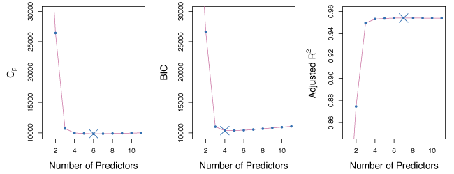
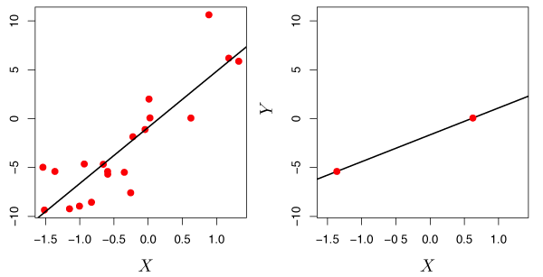
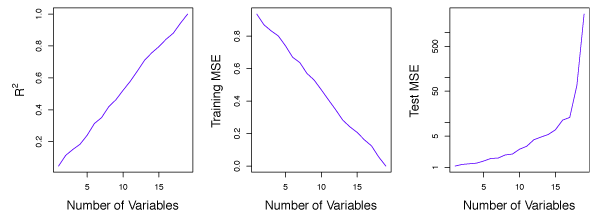

\newcommand{\Var}{\mathrm{Var}}
\newcommand{\MSE}{\mathrm{MSE}}
\newcommand{\Avg}{\mathrm{Avg}}
\newcommand{\Bias}{\mathrm{Bias}}

This lesson explores some alternative fitting procedures that may lead to better *prediction accuracy* and *model interpretability* for the standard linear model.

- *Prediction Accuracy*: If the true relationship between response and predictors is approximately linear, least squares will have low bias. 
If $n \gg p$, least squares estimates generally have low variance and will perform well on test observations.
However, if $n$ is close to $p$, the least squares fit may overfit the data leading to poor predictions on test observations.
For $p > n$, the least squares coefficient estimates are not unique and the variance is *infinite*, which renders the method useless. 
By *constraining* or *shrinking* the estimated coefficients, variance can be reduced with only a small increase in bias.
- *Model Interpretability*: Omitting variables unrelated to the response is critical as these variables lead to unnecessary complexity in the resulting model.

Note - the methods below apply to more than just linear models. For instance, the techniques can be applied to classification as seen in Lesson 4.

## Subset Selection

### Best Subset Selection
Best subset selection builds least squares regressions for all combinations of the $p$ predictors. 
The algorithm proceeds as follows: fit all $p$ models containing one predictor, then fit all $\binom{p}{2}$ models with two predictors, and so on. Then, consider the model set to choose the best model.

There are $2^p$ models output from the process above. To choose the best model, we use two steps outlined below. 

##### Algorithm 6.1 {-}
(1) Let $\mathcal{M}_0$ denote the *null model*, which contains no predictors.
(2) For $k=1,2,\ldots,p$:
    (a) Fit all $\binom{p}{k}$ models with exactly $k$ predictors. 
    (b) Pick the best among these $\binom{p}{k}$ models, and call it $\mathcal{M}_k$. Here best is defined as having the smallest RSS, or equivalently largest $R^2$.
(3) Select a single best model from among $\mathcal{M}_0, \ldots, \mathcal{M}_p$ using cross-validated prediction error, $C_p$ (AIC), BIC, or adjusted $R^2$.

Step 2 reduces the search space from $2^p$ models to $p+1$ models. 
In step 3, cross-validation prediction error, $C_p$ (AIC), BIC, or adjusted $R^2$ to select the best model as RSS will always decrease as more predictors are added and similarly $R^2$ will always increase.

Algorithm  6.1 is presented for least squares regression.
With logistic regression, *deviance* is used in place of RSS.
Deviance is similar to RSS, but applies to more classes of models. 
The deviance is negative two times the maximized log-likelihood; the smaller the deviance, the better the fit.

Best subset selection is simple, but computationally infeasible for large $p$ as the number of models increases exponentially with $p$. 
For example, for $p = 20$, there are over one million possible models to explore.

Figure 6.1 shows RSS (left) and $R^2$ (right) where the red line tracks the best model for a given number of predictors.

 

__Figure 6.1__ -- *Each point represents the RSS (left) or $R^2$ (right) from a possible model from the Credit data set with eleven predictors. The red line tracks the best model for a given number of predictors.*

### Stepwise Selection
When $p$ is large (greater than about 30), the search space in best subset selection becomes infeasible to compute.
A large search space also increases the chance of finding models that perform well on training data but are not useful on test data.
*Stepwise* methods explore more restricted sets of models and provide good alternatives to best subset selection.

#### Forward Stepwise Selection {-}
*Forward stepwise selection* considers substantially less models than best subset selection and is more computationally feasible.
It starts with the null model and adds predictors, one-at-a-time, until all of the predictors are in the model.
At each step, the variable that gives the greatest *additional* improvement to the fit is added.

Forward stepwise selection fits the null model and $p - k$ models in the $k$th iteration. 
This results in a total of $1 + \sum\limits_{k=0}^{p-1}(p-k) = 1 + p(p+1)/2$ models that must be fit.
When $p=20$, this amounts to $211$ models vs the $1,048,576$ models that best subset selection must fit.

##### Algorithm 6.2 {-}
(1) Let $\mathcal{M}_0$ denote the *null* model, which contains no predictors.
(2) For $k=0, \ldots, p-1$:
    (a) Consider all $p-k$ models that augment the predictors in $\mathcal{M}_k$ with one additional predictor.
    (b) Choose the *best* among these $p-k$ models, and call it $\mathcal{M}_{k+1}$. Here *best* is defined as having smallest RSS or highest $R^2$.
(3) Select a single best model from among the $\mathcal{M}_0, \ldots, \mathcal{M}_p$ using cross-validated prediction error, $C_p$ (AIC), BIC, or adjusted $R^2$.

Forward stepwise selection is computationally efficient, but may not find the best model out of all $2^p$ possibilities.

#### Backward Stepwise Selection {-}
*Backward Stepwise Selection* starts with the full least squares model containing all $p$ predictors and eliminates the least useful predictor, one-at-a-time.

##### Algorithm 6.3 {-}
(1) Let $\mathcal{M}_p$ denote the *full* model, which contains all $p$ predictors.
(2) For $k=p, p-1, \ldots, 1$:
    (a) Consider all $k$ models that contain all but one of the predictors in $\mathcal{M}_K$, for a total of $k-1$ predictors.
    (b) Choose the *best* among these $k$ models, and call it $\mathcal{M}_{k-1}$. Here *best* is defined as having smallest RSS or highest $R^2$.
(3) Select a single best model from among the $\mathcal{M}_0, \ldots, \mathcal{M}_p$ using cross-validated prediction error, $C_p$ (AIC), BIC, or adjusted $R^2$.

The backward selection algorithm also only considers $1 + p(p+1)/2$ models and may not select the optimal model out of the $2^p$ possibilities.
One limitation of backward selection is that $n$ must be larger than $p$ whereas forward selection can work on models where $p >  n$.

### Choosing the Optimal Model
To select the best model, an estimate of the test error is needed. Two common approaches are:

(1) Indirectly estimate test error by making an *adjustment* to the training error to account for the bias due to overfitting.
(2) Directly estimate test error using either a validation set of a cross-validation approach.

#### $C_p$, AIC, BIC, and Adjusted $R^2$ {-}
Training MSE typically underestimates test MSE ($\mathrm{MSE} = \mathrm{RSS}/n$) because the model is fit such that training RSS is minimized.
Hence, training set RSS and training set $R^2$ are poor statistics to evaluate the best models. 
In addition, as the number of predictors increases, training error will decrease but the test error may not.

For least squares linear models with $d$ predictors, $C_p$ estimates test MSE as,
$$
    C_p = \frac{1}{n}(\mathrm{RSS} + 2d\hat{\sigma}^2)
    \tag{6.2}
$$
where $\hat{\sigma}^2$ is an estimate of the variance of the error $\epsilon$ associated with each response.
$C_p$ adds a penalty of $2d\hat{\sigma}^2$ to training RSS to adjust for the fact that training error generally underestimates test error. 
As $d$ increases, the penalty increases to capture the fact that RSS decreases and $R^2$ increases naturally with increases in $d$.

*Akaike information criterion* (AIC) is defined for a large class of models fit by maximum likelihood.
For a standard linear model with Gaussian errors, maximum likelihood and least squares are the same.
AIC is given by
$$
    \mathrm{AIC} = \frac{1}{n\hat{\sigma}^2}(\mathrm{RSS} + 2d\hat{\sigma}^2)
$$
where an additive constant has been omitted for simplicity.
For least squares models, $C_p$ and AIC are proportional to each other.

*Bayesian information criterion* (BIC) is derived from a Bayesian perspective, but ends up looking similar to $C_p$ (and AIC).
For the least squares model with $d$ predictors, up to irrelevant constants, BIC is given by
$$
    \mathrm{BIC} = \frac{1}{n}(\mathrm{RSS} + \log(n)d\hat{\sigma}^2) \>.
    \tag{6.3}
$$
Like $C_p$, BIC will be small for a model with a low test error.
BIC substitutes the $2d\hat{\sigma}^2$ in $C_p$ with the $\log(n)d\hat{\sigma}^2$ term, where $n$ is the number of observations. 
Since $\log(n) > 2$ for $n > 7$, BIC places a heavy penalty on models with many predictors.
Therefore, BIC suggests choosing models with less predictors than $C_p$.

For a model with $d$ predictors, adjusted $R^2$ is given by
$$
    \text{Adjusted } R^2 = 1 - \frac{\mathrm{RSS}/(n-d-1)}{\mathrm{TSS}/(n-1)} \>.
    \tag{6.4}
$$
A large adjusted $R^2$ value indicates low test error.
Maximizing adjusted $R^2$ minimizes $\frac{RSS}{n-d-1}$. 
While RSS always decreases as the number of predictors increases, $\frac{RSS}{n-d-1}$ may increase or decrease, because of the $d$ term.
Unlike $R^2$, adjusted $R^2$ adds a penalty for irrelevant variables.

Figure 6.2 shows $C_p$, BIC and adjusted $R^2$ for the best models of each size in the Credit data set.
$C_p$ predicts a 6 variable model, BIC predicts a 4 variable model and adjusted $R^2$ predicts a 7 variable model.

 

__Figure 6.2__ -- *$C_p$, BIC and adjusted $R^2$ for the best models of each size for the Credit data set.*

#### The Validation Set Approach and Cross-Validation {-}
The test error rates can be estimated using validation set and cross-validation methods.
The model with the smallest test error is then selected.
The advantage of this approach over AIC, BIC, $C_p$, and adjusted $R^2$, is it gives a direct estimate of the test error.

Figure 6.3 compares BIC, validation set error and cross-validation error for the Credit data set.
BIC predicts a model with 4 predictors and validation and CV both predict a model with 6 predictors.

 

__Figure 6.3__ -- *BIC, Validation set errors and Cross-validation errors for the Credit data set. The overall best model is shown as a blue cross.*

## Shrinkage Methods
Subset selection methods use least squares to generate linear models with a subset of all predictors. 
Shrinkage methods provide an alternative where a model is fit with all $p$ predictors and the coefficient estimates are *constrained* or *regularized*.
Effectively, this shrinks the coefficient estimates towards zero, which may substantially reduce coefficient estimate variance.

### Ridge Regression 
The ridge regression coefficients estimates $\hat{\beta}^R$ are the values that minimize
$$
    \sum\limits_{i=1}^n(y_i - \beta_0 - \sum\limits_{j=1}^p\beta_jx_{ij})^2 + \lambda\sum\limits_{j=1}^p\beta_j^2 = \mathrm{RSS} + \lambda\sum\limits_{j=1}^p\beta_j^2
    \tag{6.5}
    \label{eq:ridge}
$$
where $\lambda \geq 0$ is a *tuning parameter*.
As with least squares, ridge regression looks for coefficient estimates that make the RSS small.
The second term $\lambda\sum\beta_j^2$, known as the *shrinkage penalty*, is small when $\beta_1, \ldots, \beta_p$ are close to zero.
Hence, ridge regression shrinks $\beta_j$ estimates towards zero. 
The parameter $\lambda$ controls the relative impact of these two terms on the coefficient estimates. 
When $\lambda = 0$, ridge regression produces the same result as least squares.
As $\lambda \to \infty$, the shrinkage penalty grows and the coefficient estimates approach zero.

Ridge regression should only be applied after *standardizing the predictors* using
$$
    \tilde{x}_{ij} = \frac{x_{ij}}{\sqrt{\frac{1}{n}\sum\limits_{i=1}^n(x_{ij}-\bar{x}_j)^2}}
    \tag{6.6}
$$
such that all predictors are on the same scale.
The denominator is the estimated standard deviation of predictor $j$.
Consequently, all predictors have a standard deviation of one.
Standardizing makes the fit independent of the scale predictors are measured with.

#### Improvement Over Least Squares {-}
Ridge regressions advantage over least squares comes from the bias-variance trade-off.
As $\lambda$ increases, flexibility decreases, resulting in lower variance, but higher bias.

The left panel of Figure 6.5 shows the bias and variance for a simulated data set with $p=45$ predictors and $n=50$ observations.
The green curve in the left panel shows ridge regression prediction variance as a function of $\lambda$. 
For the least squares coefficient estimates (i.e. $\lambda = 0$), the variance is high, but bias is 0. 
As $\lambda$ increases, coefficient shrinkage leads to significant variance reduction for the predictions, with a small bias rise. 
The right panel shows the same curves where the $x$ axis is the $\ell_2$ norm of the ridge regression coefficient estimates divided by the $\ell_2$ norm of the least squares estimates. 
From left to right, fit flexibility rises, raising variance, but lowering bias. 

 

__Figure 6.5__ -- *Squared bias (black), variance (green) and test mean squared error (purple) for the ridge regression predictions on a simulated data set as functions of $\lambda$ and $||\hat{\beta}^R_{\lambda} ||_2 / || \hat{\beta} ||_2$.*
 

In general, if the response-predictor relationship is close to linear, least squares estimates have low bias, but may have high variance. 
Small changes in the training data may lead to large changes in the least squares coefficient, especially if $p$ is close to $n$.
If $p > n$, the least squares estimates do not have a unique solution whereas ridge regression can still perform well by trading a small increase in bias for a large decrease in variance.
Consequently, ridge regression works well when least squares parameters have high variance. 

Ridge regression is less expensive to compute than best subset selection.

### The Lasso 
One main disadvantage of ridge regression is it includes all $p$ predictors.
The penalty term does not set coefficients to zero unless $\lambda = \infty$.
This may be irrelevant for prediction accuracy, but creates a challenge in the interpretation setting.

The *lasso* overcomes this drawback.
The lasso coefficients, $\hat{\beta}_\lambda^L$ , minimize:
$$
    \sum\limits_{i=1}^n(y_i - \beta_0 - \sum\limits_{j=1}^p\beta_jx_{ij})^2 + \lambda\sum\limits_{j=1}^p|\beta_j| = \mathrm{RSS} + \lambda\sum\limits_{j=1}^p|\beta_j| \>
    \tag{6.7}
    \label{eq:lasso}
$$ 
The only difference between equation $\eqref{eq:lasso}$ and $\eqref{eq:ridge}$ is that $\beta_j^2$ term in ridge regression is replaced by $|\beta_j|$.
The lasso also performs shrinkage on coefficient estimates, but the penalty sets some coefficient estimates to exactly zero when $\lambda$ is large enough.
The lasso implements *variable selection* and as a result models generated from the lasso are generally easier to interpret than from ridge regression.

Figure 6.6 shows the values of the coefficients generated using the lasso on the Credit data for various values of $\lambda$.
When $\lambda = 0$, the coefficient estimates are the same as least squares and for large $\lambda$, all coefficient estimates become zero.
For intermediate values of $\lambda$, the lasso estimates look quite different from ridge regression.
In the right panel, we see that the lasso first produces a model with rating as the only prediction.
Then the student and limit predictors are added, and after a bit income is added.
At some point all of the predictors are included in the model.

 

__Figure 6.6__ -- *The standardized lasso coefficients on the Credit data set shown as a function of $\lambda$ and $||\hat{\beta}^L_{\lambda} ||_2 / || \hat{\beta} ||_2$.*

#### Comparing the Lasso and Ridge Regression {-}
The main advantage of the lasso over ridge regression is it produces more interpretable models that only contain a subset of the predictors.
Nevertheless, ridge regression may still be more appropriate than the lasso. 
For example, the lasso generally provides stronger performance when a few predictors have large coefficients with the remaining predictor coefficients near zero. 
By contrast, ridge regression is effective when the response is related to many predictors, of a fairly similar magnitude. 
To determine whether to use ridge regression or the lasso, CV can be used to estimate the number of predictors that influence the response.

Like ridge regression, the lasso can significantly decrease variance when the least squares coefficients have large variance.
This results in a slight bias increase but improves prediction accuracy.  

### Selecting the Tuning Parameter 
Cross-validation can be used to select a value for the tuning parameter.
A grid of $\lambda$ values is selected, then the cross-validation error for each value of $\lambda$ is compared.
The value of $\lambda$ that gives the smallest cross-validation error is selected.
Once the tuning parameter is selected, the model is re-fit using all observations and the selected tuning parameter.

Figure 6.12 shows the cross-validation error for various values of $\lambda$ for the Credit data set using ridge regression.
The vertical dashed line is the value of $\lambda$ that where the cross-validation error is the smallest.
Here $\lambda$ is small implying the best fit only needs a small amount of shrinkage.

 

__Figure 6.12__ -- Left: *Cross-validation errors that result from applying ridge regression to the Credit data set with various values of $\lambda$.* Right: *The coefficient estimates as a function of $\lambda$.*
 

Figure 6.13 shows 10-fold CV on the lasso when fit on sparse simulated data.
The left panel shows CV error, while the right-hand panel shows coefficient estimates.
The vertical dashed lines represent the point where CV error is minimized.
The two colored lines in the right-hand panel are the predictors actually related to the response, while the grey lines are unrelated predictors, also known as *signal and noise variables*. 
The lasso correctly gives larger coefficient estimates to the two variables related with the response.
The minimum cross-validation error gives the set of coefficients only containing the related variables.
In contrast, the least squares solution (far right) assigns a large coefficient estimate to only one of the two signal variables.

 

__Figure 6.13__ -- Left: *Ten-fold cross-validation MSE for the lasso, applied to sparse simulated data.* Right: *The corresponding lasso coefficient estimates.*
 

## Dimension Reduction Methods
*Dimension reduction* techniques *transform* the predictors and then fit a least squares model with the transformed variables. 
Let $Z_1, Z_2, \ldots, Z_M$ be $M < p$ *linear combinations* of the initial $p$ predictors where
$$
    Z_m = \sum\limits_{j=1}^p\phi_{jm}X_j
    \tag{6.16}
$$
for some constants $\phi_{1m}, \phi_{2m}, \ldots, \phi_{pm}$, $m = 1, \ldots, M$. 
A linear regression model can be fit by
$$
    y_i = \theta_0 + \sum\limits_{m=1}^M\theta_m z_{im} + \epsilon_i, \quad i=1, \dots, n,
    \tag{6.17}
    \label{eq:dimReduce}
$$
using least squares. 
If the constants $\phi_{1m}, \phi_{2m}, \dots, \phi_{pm}$ are chosen well, such a dimension reduction can often outperform least squares regression.

Notice that from $\eqref{eq:dimReduce}$,
$$
    \sum\limits_{m=1}^M\theta_mz_{im} = \sum\limits_{m=1}^M\theta_m\sum\limits_{j=1}^p\phi_{jm}x_{ij} = \sum\limits_{j=1}^p\sum\limits_{m=1}^M\theta_m\phi_{jm}x_{ij} = \sum\limits_{j=1}^p\beta_jx_{ij}
$$
where
$$
    \beta_j = \sum\limits_{m=1}^M\theta_m\phi_{jm} \>.
    \tag{6.18}
$$
Hence $\eqref{eq:dimReduce}$ can be thought of as a special case of the original linear regression model.
Dimension reduction also constrains the estimated $\beta_j$ coefficients but has the potential to bias the estimates.
However, when $p$ is large relative to $n$, selecting $M \ll p$ can significantly lower the coefficient variance.

Dimension reduction methods work in two stages.
First, the transformed predictors $Z_1, Z_2, \ldots ,Z_M$ are obtained.
Next, the model is fit using these $M$ predictors.
However, there are many ways to select $Z_1, Z_2, \ldots ,Z_M$, or equivalently, the $\phi_{jm}$'s.

### Principal Components Regression
*Principal components analysis* (PCA) is a popular approach for deriving a low-dimensional set of features from a large set of variables.

#### An Overview of Principal Components Analysis {-}
PCA is a technique for reducing the dimension of a $n \times p$ data matrix $\mathbf{X}$. 
The *first principal component* direction of the data is the direction where the observations *vary the most*.

For example, in Figure 6.14, the green solid line is the first principal component direction of the data.
It is clear that the data has the most variability along this line.

 

__Figure 6.14__ -- *Population size and ad spending for 100 different cities are shown as purple circles. The green solid line indicates the first principal component and the blue dashed line indicates the second principal component.*
 

In the left panel of Figure 6.15, the 100 observations from Figure 6.14 were projected onto the first principal component to demonstrate that these projected data points have the highest possible variance. 
If we projected the data points onto any other line, the variance obtained would be less. 
The right panel shows a rotated view of the left panel such that the first principal component coincides with the $x$-axis.

 

__Figure 6.15__ -- *A subset of the advertising data. The mean population and advertising budget are indicated by a blue circle.* Left: *The first principal component direction is shown in green. The black dashed lines represent the distances from each observation to the principal component.* Right: *The left panel has been rotated so the first principal component direction coincides with the $x$-axis.*
 

The first principal component in Figure 6.15 is, 
$$
    Z_1 = 0.839(\texttt{pop} - \overline{\texttt{pop}}) + 0.544(\texttt{ad} - \overline{\texttt{ad}})
    \tag{6.19}
$$
where $\phi_{11} =$ 0.839 and $\phi_{21} =$ 0.544 are the principal component loadings.
$\overline{\texttt{pop}}$ indicates the mean of all pop values in this data set, and $\overline{\texttt{ad}}$ indicates the mean of all advertising spending.
Again, $Z_1$ has the highest variance of all linear combinations of pop and ad where $\phi_{11}^2 + \phi_{21}^2 = 1$.
Since $n = 100$, pop, ad and hence $Z_1$ are all vectors of length 100. 
Therefore, 
$$
    z_{i1} = 0.839(\texttt{pop}_i - \overline{\texttt{pop}}) + 0.544(\texttt{ad}_i - \overline{\texttt{ad}})
    \tag{6.20}
$$
where $z_{11}, \dots, z_{n1}$ are the principal component scores. 

Figure 6.16 shows plots of $z_{i1}$ vs. pop and $z_{i1}$ vs. ad$.
Clearly there is a strong relationship between the first principal component and pop and ad.
In other words, the first principal component appears to capture most of the information contained in pop and ad.

 

__Figure 6.16__ -- *Plots of the first principal component scores $z_{i1}$ versus pop and ad.*
 

In general, $p$ distinct principal components can be constructed.
The second principal component $Z_2$ is a linear combination of the variables that is uncorrelated with $Z_1$.
The zero correlation condition between $Z_1$ and $Z_2$ means $Z_2$ is *perpendicular*, or *orthogonal* to $Z_1$.

Figure 6.16 shows the poor relationship of the second principal component scores $z_{i2}$ against pop and ad.

 

__Figure 6.17__ -- *Plots of the second principal component scores $z_{i2}$ versus pop and ad.*

#### The Principal Components Regression Approach {-}
*Principal components regression* (PCR) constructs the first $M$ principal components, $Z_1, \ldots, Z_M$ and uses them as the predictors in a linear regression model that is fit using least squares.
The idea is that often a small number of principal components capture most of the variability in the data as well as the relationship with the response.
If this assumption holds, a least squares linear regression of $Z_1, \ldots ,Z_M$ is better than a least squares model on $X_1, \dots ,X_p$, since the majority of relevant information to the response in the data is captured by $Z_1, \dots ,Z_M$. 
By estimating $M \ll p$ coefficients and the risk of overfitting is reduced. 

Figure 6.18 displays the PCR fits a data set with $n=50$ observations and $p=45$ predictors.
The curves are functions of $M$, the number of principal components used as predictors.
As $M$ increases, bias decreases and variance increases leading to the standard U-shaped curve for the MSE.
When $M = p = 45$, PCR is equivalent to a least squares fit using all the original predictors.

A good choice of $M$ (one that minimizes MSE) can provide a much better fit than least squares.
PCR is not able to perform as well as ridge regression or the lasso on this data set.

 

__Figure 6.18__ -- *PCR applied to two simulated data sets.* Left: *Simulated data from Figure 6.8.* Right: *Simulated data from Figure 6.9.*
 

PCR generally performs well when the first few principal components capture most of the variation in the data and the relationship with the response. 
The left panel of Figure 6.19 shows a scenario where PCR performs very well because the response was simulated such that the first five principal components capture the entire response.
In this case, the bias decreases quickly to zero as $M$ rises.
A minimum MSE occurs for $M = 5$.
In the right panel, ridge regression and the lasso are used on the same data.
In general, each model is better than least squares and on this data, PCR performs the best.

 

__Figure 6.19__ -- *PCR, ridge regression and the lasso applied to a simulated data set in which the first five principal components of $X$ contain all the information about the response $Y$.* Left: *Results for PCR.* Right: *Results for lasso (solid) and ridge regression (dotted).*
 

PCR is not a *feature selection method* because all $M$ principal components are a linear combination of the $p$ initial predictors. 
Despite PCR's strong performance in certain scenarios, it does not use a subset of the initial predictors. Consequently, PCR is more similar to ridge regression than the lasso.

The best value for $M$ is generally selected using cross-validation.
In Figure 6.20, PCR is used on the Credit data set.
The right panel shows cross-validation errors as a function of $M$.
In this case, the minimum cross-validation error occurs for $M=10$, which results in little dimension reduction since $p=11$.

 

__Figure 6.20__ -- Left: *PCR standardized coefficient estimates on the Credit data set for different values of $M$.* Right: *The ten-fold cross validation MSE obtained using PCR as a function of $M$.*
 

As in ridge regression and the lasso, standardized predictors should be used for PCR.
Without standardization, high-variance variables have a greater impact on the principal components. 

### Partial Least Squares
In PCR, the principal component directions are selected in an *unsupervised* way, since the response $Y$ is not used to determine the directions.
One drawback of this is there is no guarantee that the directions that best explain the predictors will also be the best directions for predicting the response.

*Partial least squares* (PLS) is a *supervised* alternative to PCR. 
PLS is a dimension reduction method that first identifies a new set of features $Z_1, \ldots, Z_M$ that are linear combinations of the original features, then fits a linear model by least squares using the $M$ new features.
Unlike PCR, PLS makes use of the response $Y$ to identify new features that are related to the response.

PLS works by first standardizing the predictors.
Next, the first direction $Z_1$ is computed by setting each $\phi_{j1}$ to the coefficient from the simple linear regression of $Y$ onto $X_j$.
This coefficient is proportional to the correlation between $Y$ and $X_j$. 
In computing $Z_1 = \sum\limits_{j=1}^p\phi_{j1}X_{j}$, PLS places the highest weight on the variables that are most strongly related to $Y$.

Figure 6.21 shows PLS used on the advertising data.
The solid green line is the first PLS direction and the dotted line is the first PCR direction.
By observation, it is clear that the PLS direction has less change in `ad` per unit `pop` change, relative to PCR. 
Hence, `pop` is more highly correlated with $Y$ than `ad`. 
The PLS direction does not provide as tight a fit as PCR, but explains the response better. 

 

__Figure 6.21__ -- *For the advertising data, the first PLS direction (solid line) and the first PCR direction (dotted line) are shown.*
 

To identify the second PLS direction, each variables is first *adjusted* for $Z_1$ by regressing each variable on $Z_1$ and taking the *residuals*.
These residuals are the remaining unexplained information unaccounted for by $Z_1$. 
$Z_2$ is calculated with this orthogonalized data just as $Z_1$ was calculated with the initial data. 
This can be repeated $M$ times to identify PLS directions $Z_1, \ldots, Z_M$.
Finally, least squares regression can be used to fit a linear model to predict $Y$ using $Z_1, \ldots, Z_m$.

As in PCR, the tuning parameter $M$ is selected by cross-validation.

## Considerations in High Dimensions

### High-Dimensional Data
Most traditional statistical techniques for regression and classification are intended for the *low-dimensional* setting where $n \gg p$.
Modern methods often collect a large number of predictors however, $n$ is often small because of cost, sample availability, or other reasons.

Note - the points below are also relevant when $p$ is a bit smaller than $n$ and are generally useful for supervised learning techniques. 

### What Goes Wrong in High Dimensions?
For $p \geq n$, least squares and many of the other methods described so far, should not be used because they will result in a perfect fit with residuals of zero, even if there is no relationship between the predictors and response. 
Least squares and many other methods are **too flexible** and as a result overfit the observations.
Figure 6.22 illustrates this problem.

 

__Figure 6.22__ -- Left: *Least squares regression in the low-dimensional setting.* Right: *Least squares regression with $n=2$ observations and two parameters to be estimated.*
 

In Figure 6.23, there are $n = 20$ observations for $p = 1, \ldots, 20$ predictors.
In this example, each predictor has no relationship with the response.
However, $R^2$ increases to 1 when $p=20$, while the training set MSE decreases as $p$ increases.
The MSE from test observations increases significantly because increasing $p$ also increases the variance in the estimated coefficients.
This example demonstrates that only examining training set $R^2$ can easily lead to the false conclusion that increasing $p$ results in better models. 

 

__Figure 6.23__ -- *On a simulated example with $n=20$ training observations, features that are completely unrelated to the outcome are added to the model.* Left: *The $R^2$ increases to 1 as more features are included.* Center: *The training set MSE decreases to 0 as more features are included.* Right: *The test set MSE increases as more features are included.*

### Regression in High Dimensions
Many of the methods in this lesson for fitting *less flexible* least squares models, such as forward stepwise selection, ridge regression, the lasso, and principal components regression, are effective in the high-dimensional setting.
These methods reduce the risk of overfitting because they are less flexible than least squares.

### Interpreting Results in High-Dimensions
In the high dimensional setting, we must be cautions of multicollinearity, the concept that the variables in a regression might be correlated with each other.
It is unclear which variables (if any) truly are predictive of the outcome.
Furthermore, we cannot distinguish between the best regression coefficients. 
The optimal result assigns large coefficients to variables that are effective in predicting the response. 

Errors and measures of model fit can be deceiving in high dimensions. 
When $p > n$ a useless model with zero residuals can easily be obtained.
Hence, the sum of squared errors, p-values, $R^2$ statistics, or other traditional measures of model fit on the training data are irrelevant.
Instead, we must focus on errors computed on independent test sets, or use cross-validation errors. 
In this way, MSE or $R^2$ from an independent test set is relevant for assessing model fit, while MSE on training sets is irrelevant. 