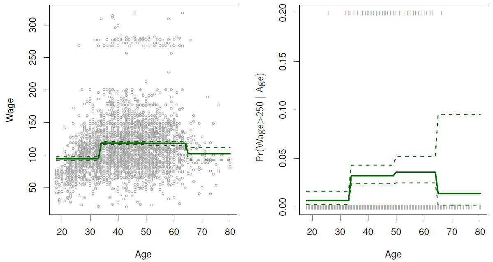
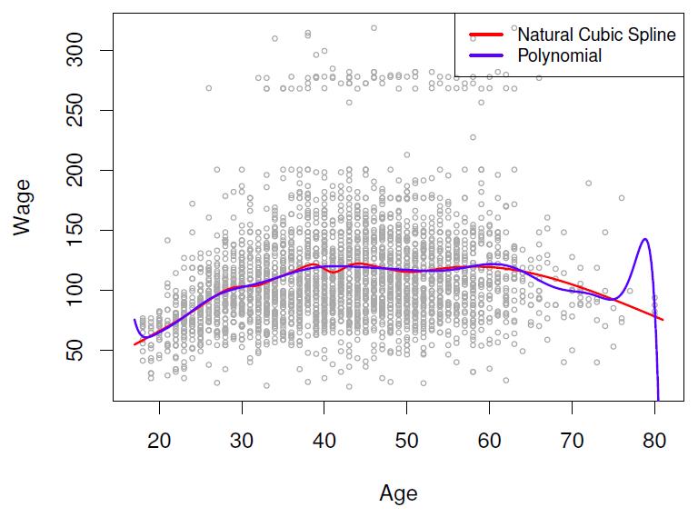
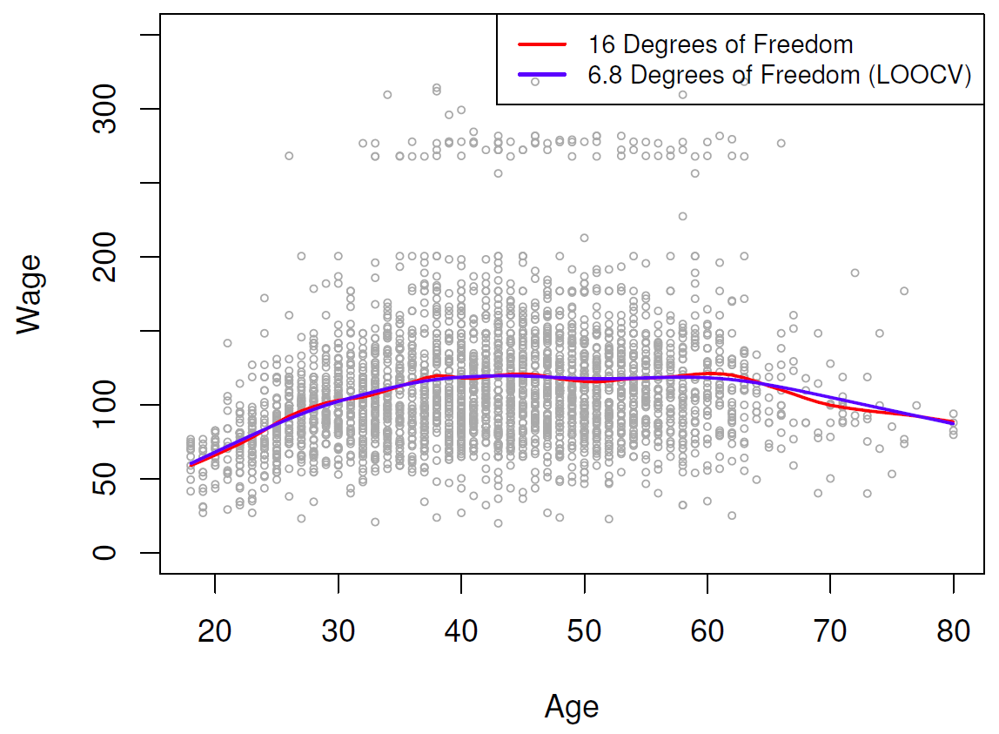
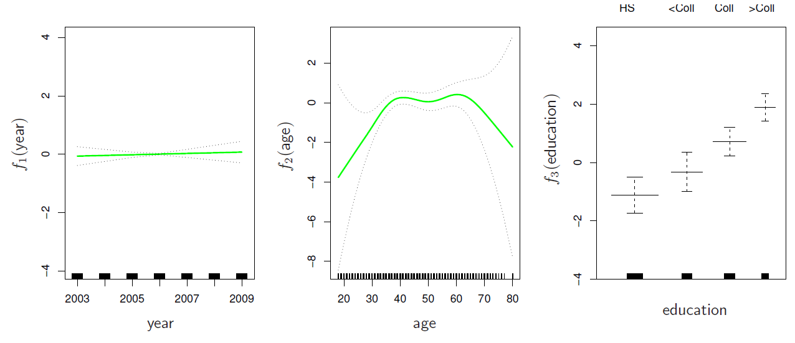

<style>
img {max-height:400px;}
</style>

## Polynomial Regression and Step Functions 

<center>
<iframe width="560" height="315" src="https://www.youtube.com/embed/gtXQXA7qF3c?list=PL5-da3qGB5IBn84fvhh-u2MU80jvo8OoR" frameborder="0" allowfullscreen></iframe>
</center>

##### Slide 1: 

*Hastie:* Well, good to see you again. Sorry you got two old guys again. In this section, we're going to talk about fitting nonlinear functions and nonlinear models. Up to now, we've focused on linear models. And what you'll see is that it is actually very easy to bring in nonlinearity into your model in a somewhat seamless way, and you'll see the tools are almost as easy as they were when we were fitting linear models. And we'll talk about a hierarchy of methods, some completely straightforward and some slightly more sophisticated. 

*Tibshirani:* And some of actually what you see today is, for Trevor and I, somewhat historical. The very first paper we ever wrote together was called Generalized Additive Models actually as graduate students here at Stanford. And the last part of this section, we'll talk generalized additive models which are a way of using the tools for nonlinearity for more than one predictor. 

*Hastie:* Oh, yeah, and you know, Rob, it just occurred to me that that paper we wrote 30 years ago. (It's still good.) It's still a good paper. OK, so, here we go. Well, the first fact is the truth is never linear. It's a shocking thing for a statistics professor to say. Maybe I should qualify, almost never. Well, that is the truth. Linearity is an approximation. And often a linearity assumption is good enough. And that's why we lack a linear model. The approximation is good enough. And it gives us a nice simple summary. But we need to go beyond linearity often. And we have lots of tools to do that. And in this section, we're going to talk about some of those. So there's the list, polynomial, step function, splines, local regression, and generalized additive models, kind of increasing in complexity as we go down the list. And as you'll, they're just as easy to work with as linear models. 

##### Slide 2: 

*Hastie:* So polynomial regression, we've really covered before. And when we introduce these nonlinear methods, we're going to introduce them, for the most part, except when we get to generalized additive models, with a single variable. But you'll see it's just as easy to do it in many variables as well. And so, here's a polynomial regression model.

$$y_i = \beta_0 + \beta_1x_i + \beta_2x_i^2 + \beta_3x_i^3 +\dotsb+\beta_dx_i^d + \epsilon_i$$

<center>

</center>
{:refdef: style="text-align:center"}
**Figure 7.1**-- *Polynomial Functions*
{: refdef}

We've got not only a linear term, but we've got polynomial terms as well. So there is $$x^2$$, $$x^3$$, and so on. And we can go up to whatever degree we like. And for the linear model, it's linear in the coefficients, but it's a nonlinear function of $$x$$. And in the left panel, we see on the wage data a polynomial function to age. That's a third degree, I believe, polynomial. And you see the fitted function. And you see the pointwise standard error bands. That's these dotted bands here. That's plus and minus 1 standard error. And it's a nonlinear function that seems to capture what's going on in the data. I notice these standard error brands are wider at the ends there, Trevor. Why is that? That's a good point, Rob. And that's a result of the-- it's called leverage. The points right at the end, you'll notice the data thins out at the end. So there's not so much data there. And so the information for fitting the curve at the end is much less, so the standard error gets wider. But also points at the end, we call it wagging the tail of the dog. A polynomial is a very flexible function. And it is especially flexible at the end. And those tails tend to wag around. And that standard error indicates it. In fact, in this figure on the right, here we're using a polynomial to fit a logistic regression. And to do that in this section, we just turn wage into a binary variable by looking at whether wage is bigger than 250k or not. And so that's a logistic regression now, trying to model the probability of that event. And notice how wide the standard errors are at the end right now. When I first saw that, I thought it was crazy. But now I realize the vertical scale is pretty stretched, right? So it's only ranging up to 0.2. Oh, good point, Rob, good point. If you saw that from zero to one, it would look a lot more narrow. That's a very good point and that's something to always bear in mind, the plotting scales. It's important how you decide on what scales to use. And in this case, as Rob said, it's only going up to 0.2. What you also notice here is we've got this so-called rag plot. We see at the bottom of the plot where all the zeros occur, that's these little spikes here. It's kind of uniform here across the range. And then above, we've got where all the ones occur. And you'll notice there's one in the middle of the range and not many ones at the end. So there's really not any data at all to estimate this function right at the end. 

##### Slide 3: 

*Hastie:* So in detail, with polynomial regression, what you do is you create new variables. And in this case, they're just transformations of the original variable. So $$x$$, we make $$x_1$$ as the original $$x$$. $$x_2$$ is $$x^2$$, and so on. And then just treat the problem as a multiple linear regression model with these new derived variables. And in these case, we're not really interested in the coefficients. We're more interested in the fitted functions at any particular value $$x_0$$.

$$\hat{f}(x_0)=\hat{\beta}_0+\hat{\beta}_1x_0+\hat{\beta}_2x_0^2+\hat{\beta}_3x_0^3+\hat{\beta}_4x_0^4$$

We're interested in the composed function. So once we fit the model, we might say, well, what does the function look like at a new value $$x_0$$. And so the coefficients themselves aren't that interesting. And since the fitted function is actually a linear function of the coefficients, the $$\hat{\beta}_{\ell}$$, we can get a simple expression for the pointwise variances. So you say what is a variance of the fitted function at $$x_0$$? Well, that fitted function at $$x_0$$ is just a linear combination of the parameters. And so by using the covariance matrix of the fitted parameters, you can then get an expression, a simple expression, for the variance of this fitted value. We describe this in more detail in the book, in somewhat more detail. And it seems like in the plot, we actually plot the fitted function plus or minus two standard errors.

$$\hat{f}(x_0)\pm2\cdot\text{se}[\hat{f}(x_0)]$$

I said one earlier. And so, getting these pointwise standard errors is fairly straightforward. Pointwise means that the standard error band is pointwise. So the band is showing at any given point what the standard error is. This is not to be confused with global confidence bands, which is another story. The other thing is, what degree do we use? Here, we were actually using a fourth degree polynomial. I said third, but we use fourth. So that $$d$$ is obviously a parameter. And often we just pick $$d$$ to be some small number like two, three, or four in this case. Or otherwise, we can actually select $$d$$ by cross-validation. Think of it as a tuning parameter. 

##### Slide 4:

*Hastie:* For logistic regression, the details are pretty much the same. As I said, in the figure, this is what we were modeling.

$$\text{Pr}(y_i>250|x_i)=\frac{\text{exp}(\beta_0+\beta_1x_i+\beta_2x_i^2+\dotsb+\beta_dx_i^d)}{1+\text{exp}(\beta_o+\beta_1x_i+\beta_2x_i^2+\dotsb+\beta_dx_i^d)}$$

And so there's our inverse logistic function. And it's just a polynomial instead of a linear function. And one small detail that's somewhat important is to get confidence intervals. What you do is, if you're trying to get confidence intervals for the probabilities using direct methods, you might get outside of the range 0 and 1. So what you do is you get confidence intervals for the fitted logit, and then you put them, the upper and lower confidence band endpoints, through the inverse logit transformations. And those give you the confidence intervals, in this case, for the fitted probabilities. So that's a useful trick to bear in mind. OK, a few other points. So we've just talked about with a single variable. For several variables, you can do it separately on each variable. So you just generate these transformations on each variable. And then just stack them together in one big matrix and fit a big linear model in all these new derived variables. So if you've got a variable $$x$$, you might make $$x_1$$, $$x_2$$, up to, say, $$x_4$$. If have another variable $$z$$, you can make $$z_1$$ up to $$z_4$$. And then you just stack them all together and make a big model matrix and fit your linear model. And then you have to unpack the pieces to compose the functions. And we'll see later on that the GAM technology, generalized additive model technology, helps you do this in a seamless way. There's some caveats with polynomial regression. Polynomials, as I mentioned before, have notorious tail behavior, very bad for extrapolation. Those tails tend to wiggle around. And you really wouldn't want to trust predictions beyond the range of the data or even to near the ends of the data. And finally, fitting a polynomial in R is very simple, `y~poly(x,degree=3)`. Yes, a simple expression for fitting a polynomial in $$x$$ to $$y$$. This is the model formula that you'd use as a poly function that generates these transformations for you. And it's as simple as that. And we'll see in the lab. We'll get some experience with that. 

##### Slide 5: 

*Hastie:* Step functions, that's another way of fitting nonlinearities, especially popular in epidemiology and biostatistics in the last 20 or so years. And what you do is you cut you continuous variable into discrete sub-ranges.

$$C_1(X)=I(X<35),  \quad C_2(X)=I(35 \leq X<50),\dotsc,C_3(X)=I(X \geq 65)$$

<center>

</center>
{:refdef: style="text-align:center"}
**Figure 7.2**-- *Piecewise Constant Function*
{: refdef}

For example here, we've cut age at 35 and again at 65. There's actually a cut at 50 as well. You can't see it here. And then the idea is you fit a constant model in each of the regions. So it's a piecewise constant model. So you can see here, when you fit it and plot them all together, you see the constant in the first range, second range, the third range is hardly visible that it's different, and then the fourth range. And so this becomes, when put together as a nonlinear function, that's a piecewise constant function. And this is often useful if there is some natural cut points that are of interest. So what is the average income for somebody below the age of 35? So you can read it straight off the plot. This is often good food for summaries in newspapers, and reports, and things like that, which has led to its popularity. And, you know, to do it is just as easy as it was for polynomials. If you think of this function over here, it's a binary variable. You make a binary variable. Is $$X$$ less than 35? If yes, you make it 1. If not, you make it a 0. And for each of these, it's the same. And so you create a bunch of dummy variables, zero-one variables. And you just fit those with the linear model. 

*Tibshirani:* You can already see the advantage this has over polynomials. This is local. With polynomials, it's a single function for the whole range of the $$X$$ variable. So, for example, if I change a point on the left side, it could potentially change the fit on the right side quite a bit for polynomials. (That's a good point, Rob, which I forgot to say.) But for step functions, a point only affects the fit in the partition it's sitting in and not the other partitions. 

*Hastie:* That's a great point. And thanks for reminding us. The polynomial, the parameters affect the function everywhere and can have dramatic effect. Here we've done the same thing as we did before for the logistic regression but with a piecewise constant function. Everything else is the same. But the fitted function is kind of blocky. And it may be considered not as attractive. 

##### Slide 6: 

*Hastie:* Step functions are easy to work with. As I said, you make a bunch of dummy variables and just fit the linear model. It's also a useful way of creating interactions that are easy to interpret. So, for example, think of the interaction effect of year and age in a linear model. So what you can do is, for example, make a dummy variable of year. So let's say cut year less than 2005 and have another one here bigger than or equal to 2005.

$$I(\text{Year}<2005)\cdot\text{Age}, \quad I(\text{Year}\geq2005)\cdot\text{Age}$$

And then if you multiply that with age, what you've done is create an interaction. And that will fit a different linear model as a function of age for the people who worked before 2005 and those after 2005. And so, visually, that's nice. You'll see two different linear functions. That's the easy way of seeing the effect of an interaction. And in r, creating these dummy variables is really easy. Creating an indicator function is pretty much the same expression we've shown up until now. There is a function, In R, which is basically an indicator, `I(year<2005)`. And year less than 2005 turns into a logical. But when wrapped in a indicator, it's essentially a zero-one variable. And if you want to cut in more than one place, there's a function called `cut`, `cut(age, c(18,25,40,65,90))`. So you can `cut` age. And you give it the `cut` points. You need to give cut the two boundary points as well. And so, in this case, 18 and 90, those are the ranges of the ages, well, beyond the range actually, and then an interior `cut` point. And it'll create a factor for you, an ordered factor, that cuts the variable into those bins. Now, the choice of the `cut` points, or *knots* as we're going to call them, can be a little problematic. For creating nonlinearities, smooth alternatives are available. And we're going to talk about them next. You might just pick an unfortunate choice of `cut` points. And it doesn't show the nonlinearity at all. So there's somewhat of an art. Usually, these piecewise constant functions are especially good if there are natural `cut` points that you want to use.

## Piecewise Polynomials and Splines

<center>
<iframe width="560" height="315" src="https://www.youtube.com/embed/7ZIqzTNB8lk?list=PL5-da3qGB5IBn84fvhh-u2MU80jvo8OoR" frameborder="0" allowfullscreen></iframe>
</center>

##### Slide 7: 

*Hastie:* OK. Now we're going to talk about more adventurous methods, and more modern, as well. And so piecewise polynomials generalize the idea of piecewise constants. So instead of having a single polynomial in $$x$$ over its whole domain, you can use different polynomials in each region. Instead of different constants, fit different polynomials. 

$$y_i = \begin{cases}\beta_{01}+\beta_{11}x_i+\beta_{21}x_i^2+\beta_{21}x_i^3+\epsilon_i  &   \quad \text{if }x_i<c \\ \beta_{02}+\beta_{12}x_i+\beta_{22}x_i^2+\beta_{23}x_i^3+\epsilon_i  &   \quad \text{if }x_i\geq c \\ \end{cases}$$

##### Slide 8: 

*Hastie:* So this next figure shows a piecewise polynomial in two regions.

<center>

</center>
{:refdef: style="text-align:center"}
**Figure 7.3**
{: refdef}

So here in the top left panel, there's a piecewise polynomial. It's a cubic polynomial. There's the knot at 50. And it's a cubic to the left and a cubic to the right. They're two different cubic polynomials. And they just fit to the data. This one's fit to the data on the left. This one's fit to the data on the right. What do you think of that, Rob? (There's a break in the middle, I just noticed.) Pretty ugly, isn't it? It's pretty ugly. But that is a piecewise cubic polynomial. But the break's ugly, so it's better to add constraints to the polynomials, for example, continuity. So in this top right panel, we've got a cubic polynomial in the left, a cubic in the right. But we forced it to be continuous at the knot. So that looks much better already. This is already starting to look like the function we got from the global polynomial. But we can actually see this little kink in the middle here. And in this case, it's not too egregious. But in some situations, continuity is not enough. So you can enforce continuity on the derivatives, as well. So this function here, this red one, is actually called a *cubic spline*. And it's a cubic polynomial in the left and the right. It's continuous at the knot. The first derivative's continuous at the knot, and the second derivative's continuous at the knot. So there's three constraints. And that's called a spline. Now, we couldn't make the third derivative continuous, because then it would just be a global cubic polynomial. So we've made as much continuity as we can, still allowing some separate functions in a cubic in each region. And that's called a cubic spline. While we're on it, we could have linear polynomials. And here's a linear spline, or piecewise linear function. It's linear in the left and the right. And it's forced to be continuous at the knot. So the amount of continuity you can enforce, the order of continuity, is one less than the degree of the polynomial. So here, we can only enforce degree zero continuity. Whereas here, we are forcing degree 2 while it's a third degree polynomial. 

*Tibshirani:* So maybe to be clear where the thoughts evolved, we started off with a global polynomial. And we didn't like that because it was global, right? Because the fit at one end would be affected by points at the other end. So then we move to somewhere which is more local, piecewise constants. And they were local, except they're not very smooth. So now you want something that's both smooth and local. So that on the top left panel, we have something which is local. It's smooth in each panel, but it's not smooth at the knots. So now we sort of move towards a compromise where it's local, but it's also smooth throughout the whole range. 

*Hastie:* Thanks, Rob. And as I said, splines are the maximum amount of continuity. By the way, it's believed that a cubic spline, the discontinuity which exists in the third derivative is not detectable by the human eye. And that certainly seems right for my eyes. But I wouldn't trust my eyes. 

##### Slide 9: 

*Hastie:* OK, so let's go into a bit more detail about these splines. So we'll first do linear splines, and then we'll do cubic splines. So in the linear spline, with knots at $$\xi_k, k=1,\dotsc,K$$. So you can put down, we've had one knot in these pictures, but you can put down multiple knots. The definition is a piecewise linear polynomial continuous at each knot. And just like in the previous cases with the global polynomials and the piecewise constant functions, you can represent this as a linear expansion in basis functions, so transformations of the variables.

$$y_i=\beta_0+\beta_1b_1(x_i)+\beta_2b_2(x_i)+\dotsb+\beta_{K+3}b_{K+3}(x_i)+\epsilon_i \\ b_1(x_i) = x_i \\ b_{k+1}(x_i) = (x_i-\xi_k)_{+}, \quad k=1,\dotsc,K$$

In this case, what you have is the variable itself. So one of these basis functions, $$b_k$$, is just the variable itself. And then you have a collection of these truncated functions, basis functions. They call truncated power functions, but this one's to power 1. And here it is. 

$$(x_i-\xi_k)_{+}=\begin{cases}x_i-\xi_k  & \quad\text{if }x_i>\xi_k \\ 0 & \quad\text{otherwise} \\ \end{cases}$$

It's $$x_i$$ minus $$\xi_k$$ positive part. And what that means is described below here. It's equal to $$x_i$$ minus $$\xi_k$$, if $$x_i$$ is bigger than $$\xi_k$$, and is 0 otherwise. So it's not allowed to go negative. And so you make one of these functions at each of the knots, these transformations. And you throw them in as additional variables. 

##### Slide 10: 

*Hastie:* So to see how this works, let's look at a figure.

<center>

</center>
{:refdef: style="text-align:center"}
**Figure 7.4**
{: refdef}

So the blue curve is just a global linear function. We've only got one knot here. So here's one of these basis functions. See? It starts off at 0 at the knot. And then it goes up linearly. So this is $$x$$ minus 0.6 positive part. Below 0.6, it's 0. So now, when you fit a linear model with a global linear function plus one of these in, and each of them gets a coefficient, what you get is, you get a function that's allowed to change its slope at the knot. So if you add in some mix of this to a linear function, it'll change the slope of this point. And so here, we see it over here. And because this starts off at 0, let's make sure it's continuous here. Very handy, and you can make a bunch of these functions for however many knots you've got. 

##### Slide 11: 

*Hastie:* Cubic splines, very similar idea. So first of all, the definition. A cubic spline with knots at $$\xi_k, k=1,\dotsc,K$$, is a piecewise cubic polynomial with continuous derivatives up to order 2 at each knot. So that's the definition of a cubic spline. Again, you can represent this as a basis expansion in the original variables.

$$y_i=\beta_0+\beta_1b_1(x_i)+\beta_2b_2(x_i)+\dotsb+\beta_{K+3}b_{K+3}(x_i)+\epsilon_i \\ b_1(x_i) = x_i \\ b_2(x_i) = x_i^2 \\ b_3(x_i) = x_i^3 \\ b_{k+3}(x_i) = (x_i-\xi_k)_{+}^3, \quad k=1,\dotsc,K$$

In this case, you need $$x$$, $$x^2$$, and $$x^3$$, so a basis for cubic polynomials. Of course, the constant's always in the model. And then you have similar truncated power functions. But now, they are raised to the power 3, one at each knot, where this guy's defined to be $$x_i$$ minus $$\xi_k$$ cubed, if $$x_i$$ is bigger than $$\xi_k$$, and 0 otherwise. But the idea is the same. 

##### Slide 12: 

*Hastie:* And here's the picture.

<center>

</center>
{:refdef: style="text-align:center"}
**Figure 7.5**
{: refdef}

So now, here's the little basis function, this truncated power basis function. And it's a little cubic polynomial that's 0 at the knot. In this figure over here, here's the global cubic polynomial, the blue one. And here's added in some little linear combination of this orange guy. And that'll change the cubic part of the function in this region. And a bit of a detail, this basis function, if you check it out for yourself, you'll find out that it's 0 at the knot. It's also got 0 first derivative and 0 second derivative at the knot. So when you add it in here, you don't change those derivatives of the function. And so it has the required continuity of a cubic spline. So really handy representation. 

##### Slide 13:

*Hastie:* So cubic splines are used all over the place. And you'll see, we've even got fancier versions. One fancier version is very handy. And it's the one I tend to use all the time. It's called a natural cubic spline. If you had the choice of a cubic spline and a natural cubic spline, which one would you use, Rob? (Natural, I guess.) I've got to say, it was a good choice of names. What the natural cubic spline is, it's a cubic spline where you've added two extra consent strains at the boundaries. And the constraints make the function extrapolate linearly beyond the boundary knots. And what that means is that the ends of the function aren't just left unconstrained. We saw for global cubic polynomial that the tail could wag quite a lot. We're not going to let that happen here. Because we're going to make the function go off linearly beyond the range of the data. And so what that does is it adds full constraints, two on each end. And that frees up four parameters. So for the same number of degrees of freedom or parameters in your model, you can put extra knots in the middle and get more flexibility. 

<center>

</center>
{:refdef: style="text-align:center"}
**Figure 7.6**
{: refdef}

So in this figure, we've got a cubic spline and a natural cubic spline. In the fitted function, you don't see much difference. You'll see the cubic spline's a bit more wigglier at this end over here. The standard errors you see are much wider in places for the cubic spline, especially at the boundary, which is where the effect of the natural spline is taking place. The standard errors for the natural spline are better there. 

*Tibshirani:* I'm actually working on something called organic cubic splines, which are even better. I can't give you details yet. (You can't.) But that one should catch on, I think. Especially here in California. Especially in California. Really good. 

##### Slide 14: 

*Hastie:* OK, fitting splines in R is easy. There's a function, `bs(x, ...)`, which takes a variable `x` and has some arguments. You can give it the knots, for example, or there's other ways of specifying the flexibility. And it'll just do the work. You put that in a formula. And you can put one of those for whichever function you want to be nonlinear, and it'll just do the work for you. (Did you think of the name of that function?) I can see you don't like the name. Now don't get rude, Rob. And that's for cubic splines, and for natural splines, `ns(x, ...)`. And here we see the function of age.

<center>

</center>
{:refdef: style="text-align:center"}
**Figure 7.7**-- *Natural Cubic Spline*
{: refdef}

There's a natural cubic spline. You can see its got three knots, interior knots, and it's a function of age. And gives you a very nice fit, standard errors all included. And here, it's done for the logistic regression at the same time. And for this, you need to use the packet `splines`. 

##### Slide 15: 

*Hastie:* So there's some details. And one is not placement, as in knot placement. So one strategy is to decide on the total number of knots, say capital $$K$$. And then given that number, just place the knots at appropriate quantiles of the observed variable $$x$$. So just spread them out sort of uniformly, having roughly the same amount of data in each of the regions created by the knots. And when you do that, that results in a certain number of parameters. So a cubic spline with $$K$$ knots, turns out that's got $$K + 4$$ parameters, or we call them degrees of freedom. And as I mentioned before, if you use a natural spline with $$K$$ knots, it only has $$K$$ degrees of freedom. Because you get back two degrees of freedom for the two constraints on each of the boundaries. 

<center>

</center>
{:refdef: style="text-align:center"}
**Figure 7.8**-- *14-degree polynomial versus natural cubic spline*
{: refdef}

And so in this figure over here, we've gone a little extreme. We show a comparison of a degree 14 polynomial and a natural cubic spline. The natural cubic spline will have also 40 knots. Turns out there's 15 degrees of freedom, because we're not counting the constants in these specifications over here. And so here, we see them. The natural cubic spline is much smoother than the very wiggly polynomial. You can see the tail of this polynomial going crazy. So generally, I think the takeaway message is, although polynomials are easy to think of, splines are much better behaved and more local. And so they're the way to go, since they're so easy to work with.

## Smoothing Splines

<center>
<iframe width="560" height="315" src="https://www.youtube.com/embed/mxXHJa1DsWQ?list=PL5-da3qGB5IBn84fvhh-u2MU80jvo8OoR" frameborder="0" allowfullscreen></iframe>
</center>

##### Slide 16: 

*Hastie:* OK. Well, these are notorious danger sign in the book. When you see one of these, you know material's getting a little bit more tricky. Certainly, mathematically more tricky. And smoothing splines are a little bit more challenging mathematically, but they're beautiful as well. So let's talk about them. The takeaway message of a smoothing spline is a way of fitting splines without having to worry about knots. But it approaches a problem from a completely different point of view. What we have is we have this criterion that we fit to the data. 

$$\displaystyle\min_{g\in\mathcal{S}}\sum_{i=1}^n(y_i-g(x_i))^2+\lambda\int g''(t)^2dt$$

So on the left here is the residual sum of squares. And so this part of it tries to make the function $$g$$-- the argument of this criterion is a function, an unknown function $$g(x)$$. And this ties to make $$g$$ as close to what the observed $$y$$ is as possible at each of the observed $$x_i$$'s. And we're searching over all functions. Now, if we didn't have the second term, we'd just pick any crazy interpolating function that visited every $$y$$ exactly. So what the second term does is it constrains the functions over which we search to be smooth. This is a somewhat complex penalty here, but what it is, is it's the second derivative of the function, squared, integrated over the whole domain. Second derivatives are going to pick up wiggles of the function. They're going to pick up departures, for example, from linearity. And if you square it, it gets rid of the sign. And integrate means add them up. So it adds up all non-linearities in the function. And this lambda is called the roughness penalty and it modulates how much of this penalty you're imposing. And so we call it a tuning parameter. And $$\lambda$$ is bigger than or equal to 0. So the smaller $$\lambda$$, the more wiggly the function can be. It means you're not putting that much weight on this penalty. And eventually, if $$\lambda$$ is 0, we'll get that interpolating function because we won't pay any price for being wiggly. And so we may as well go through all the data. On the other hand, as $$\lambda$$ gets really large, if it gets off to infinity-- we pay a big price for any contribution from this term, the function will eventually be forced to be linear. Because a function that's linear has second derivative 0. And so this term would be 0 only-- if $$\lambda$$ gets to infinity, we'd have to make this 0 to not be overwhelmed by this penalty, which means that the function has got to be linear. So this would be a linear model. So that's a really pretty way of setting up a smoothing problem, which gives us a whole range of values. As $$\lambda$$ goes from 0 to infinity, we get a range of functions-- solutions that are going to go from a linear function to a very wiggly function that goes through the data. 

##### Slide 17: 

*Hastie:* We call the solution to that problem a smoothing spline, and it turns out the reason it's called a smoothing spline is that the solution is a spline, but it's a weird spline. It's got a knot at every single unique value of the $$x$$'s. Which sounds ridiculous when you first hear about it, but that's what it is. But it turns out that it's not as crazy a function as you like, because the roughness penalty controls how wiggly the function can be. 

*Tibshirani:* It's pretty amazing though, this has a solution at all, right? That it has a nice, simple solution? Exactly. And I guess a clue as to why it's a cubic spline is that the second derivative is in the function. (Yeah.) And there's actually a whole family of splines. Whereas, if you have a third-- how does this work, Trevor? If it's a $$k^{\text{th}}$$ derivative, then it's this $$2k$$ plus first spline? 

*Hastie:* That's right. There's a whole hierarchy of families of these guys. And it's crazy. I mean, if I hadn't heard of this and you showed me this problem and said, I want to solve this problem. I'd say, forget about it. Go and visit the math department. Well actually, it was solved in the math department. But be very glad that it did because it's a very elegant-- And the proof isn't too hard, right? For those who are mathematically inclined. Our big data mining book, "The Elements of Statistical Learning", in an exercise we have a sketch of that proof. So if you like these kind of mathematical things, it's a fun proof to go through. (Yeah. And it might show up in one of the quizzes. No.) OK, a few details. As I said, the smoothing splines avoid the knot selection issues, and we have a single $$\lambda$$ that needs to be chosen. That's quite attractive rather than having to pick a whole bunch of different knots. The details are a little too complex to describe here. But fortunately, we got a function in R called `smooth.spline()` and it will fit a smoothing spline for you. And it takes some arguments and it's very easy to use. It turns out that when you fit a smoothing spline, if you take the fitted values at each of the observed $$x$$'s and put those into a vector, which we've called $$\hat{g}_{\lambda}$$ here, you can write $$\hat{g}_{\lambda} = \textbf{S}_{\lambda\textbf{y}}$$, where $$y$$ is the observed vector of responses. And $$\textbf{S}$$, of course, is going to be an $$n \times n$$ matrix. And $$\textbf{S}$$ is determined by the positions of the $$x$$'s and the particular value of $$\lambda$$ that you've used. Now, this is a special form. We call this a linear smoother because it's a linear operator, linear operator times $$y$$. Linear regression, of course, is also a linear operator, so is polynomial regression and all the methods we've talked about up till now. The cubic splines, all of them, result in expressions like this. But this one does as well. And that's somewhat important. It means that it's got mathematical properties that are attractive. Attractive. And one of them is that we can compute something called the effective degrees of freedom. So we've got knots at every observed data point here. And so potentially, it sounds like-- using now previous calculations, that there could be as many as $$n$$ degrees of freedom. It's a natural cubic spline. But the degrees of freedom are much less because of the roughness penalty. And it turns out that the naturally estimate for the degrees of freedom is the sum of the diagonal elements of this matrix. And that's the expression we've got over here. And we call those the effective degrees of freedom. 

$$df_{\lambda}=\displaystyle\sum_{i=1}^n\{\textbf{S}_{\lambda}\}_{ii}$$

##### Slide 18:

*Hastie:* So now when we use a smoothing spline, we can actually specify $$\lambda$$ by, instead, specifying the effective degrees of freedom. And a little bit of reverse engineering is done in the function to figure out what is the $$\lambda$$ that would result in such a degrees of freedom. And so it can figure it out. And so in R, it's as simple as that. You can say I want a `smooth.spline(age, wage, df=10)`. Wage is the response with degrees of freedom equals 10. 

*Tibshirani:* I mean, when you think about it, it's like a polynomial of degree 10. It has about that complexity, but it's smoother. So the degrees of freedom are not all spent on 10 polynomial terms, rather spread out over the whole spectrum of the function, from smooth to rough. 

*Hastie:* Very, very attractive way of fitting non-linear functions. If you don't want to just fix the degrees of freedom, you can actually estimate the smoothing parameter by cross-validation. So leave-one-out cross-validation is quite attractive with smoothing splines because there's a really nice expression, similar to what we got in linear regression, for the cross-validated sum of squares. So use the expression. This is the sum of cross-validated residuals. This complicated-looking thing here is the fitted smoothing spline if we leave out the $$i^{\text{th}}$$ data pair and evaluate it at the point $$x_i$$. So that's a cross-validated fit. And to compute this whole expression over the sum of that, we'd have to leave out each point and refit the function each time. Well, it turns out you can just fit a smoothing spline to the original data and divide each of the residuals by 1 minus the corresponding diagonal element of that smoother matrix. It's sort of like a magic formula. It computes a leave-one-out cross-validated residual sum of squares. And so you do this for a range of values of $$\lambda$$ and pick the value that minimizes it. So that's done automatically in the function smooth.spline if you don't specify $$\lambda$$ or the degrees of freedom. It will just automatically use this cross-validation. So it's very attractive. 

##### Slide 19:

*Hastie:* OK, so here's an example.

<center>

</center>
{:refdef: style="text-align:center"}
**Figure 7.9**
{: refdef}

These two functions look almost the same. One is using 16 degrees of freedom, of fixed degrees of freedom, for the smoothing spline. And the other ended up picking-- it used leave-one-out cross-validation and ended up picking 6.8 degrees of freedom. So that probably raises some eyebrows. How can we have 6.8? Well, the effective degrees of freedom formula doesn't guarantee you an integer. And so you can have effective degrees of freedom in non-integer values.

## Local Regression and Generalized Additive Models 

<center>
<iframe width="854" height="480" src="https://www.youtube.com/embed/N2hBXqPiegQ?list=PL5-da3qGB5IBn84fvhh-u2MU80jvo8OoR" frameborder="0" allowfullscreen></iframe>
</center>

##### Slide 20: 

*Hastie:* OK, well, we've already got a long list of ways of fitting nonlinear functions. There's another whole family of methods called local regression. In fact, Rob, wasn't there a Ph.D. thesis from Stanford on local regression? (I don't remember.) Rob's Ph.D. thesis was called Local Likelihood and was an extension of these local regression ideas to a whole range of problems. And is still used widely today. (I wouldn't say widely.) You're too modest, Rob. So here we have, we're not going to go into great detail into local regression. But I'll just give you the idea. Here we have some data.

<center>

</center>
{:refdef: style="text-align:center"}
**Figure 7.10**-- *Local Regression*
{: refdef}

And we've got a region over here where we fit a linear function just to the data in this region. The points in the region are the orange points. Right? So it's a local set of points. And so we locally fit a linear function. And in fact, we fit it by weighted least squares. And the weights are given by the heights of this kernel here. Right? So the highest weights are given to points at the target point which is where this orange dot is. And then the weights die down as we move away. OK. And from doing all that whole linear function, you'll just get one fitted value at this point over here. But then the idea is that you slide the target point along, and as you slide it along, the whole region slides along. So here we see the target point at this point over here. There's the weighting function. The orange points have moved, right? So we fit it locally at this region over here. We fit a linear function. And the fitted value is taken to be this orange point here at the target point. And so as we slide the region along, or the target point along, this whole system slides along, and we fit different linear functions. And that traces out the orange curve over here. And the reason we like to fit locally linear, as you might think, why didn't we just fit a local constant or like a moving average, is that it does much better, for example, at the boundaries. It gives you a much better extrapolation at the boundaries. So this is called local regression. And it's a very popular way of fitting non-linear functions but just focusing locally on the data. 

*Tibshirani:* It's probably fair to say that the `loess()` and cubic splines, cubic smoothing splines are probably the two best ways of doing smoothing. And if you set the degrees of freedom to be equal roughly, they look pretty similar too in general. Would you agree? (That's right.) So either one of these is a good choice. 

*Hastie:* So as Rob says, `loess()` is the functioning R for fitting this local regression. And we'll play with that a little bit in the lab, and you'll see it's very easy to use. So we're not going to say anything much more about local regression. But the concept of local regression is important. You can read more about it in the book and in our other book, Elements of Statistical Learning. And you'll see, it's actually a very rich area and allows you to do lots of flexible things. 

##### Slide 21: 

*Hastie:* OK. The final topic, generalized additive models.

$$y_i=\beta_0+f_1(x_{i1})+f_2(x_{i2})+\dotsb+f_p(x_{ip})+\epsilon_i$$

<center>

</center>
{:refdef: style="text-align:center"}
**Figure 7.11**
{: refdef}

So the general idea is that you're going to fit non-linear functions in a bunch of variables at the same time. But the additive in the name means that you're going to retain the additivity of linear models. And the reason that's attractive is because it leads to interpretable models. So here our model for $$y$$ is an additive function of the different $$x$$'s. So we've got a function of $$x_1$$, a function of $$x_2$$, and a functional $$x_p$$. These are our different variables in the model. And once you fit this model, you can plot the different contributions to the fitted model. So if the first variable is year, we've got a non-linear function of year, and then we've got a non-linear function of age. And the third variable, in this case there were three variables, was education. And that was a factor variable. And so there a piecewise constant function is a natural thing to fit. One constant for each of the levels. But the point is the additive model gives you a picture that you can look at and appreciate the contributions of each of the variables to the composite model. And so the technology is about fitting non-linear functions of several variables in this additive form. 

##### Slide 22: 

*Hastie:* So you can fit a generalized additive model very easily using some of the earlier tools, for example, natural splines. So it's as simple as this.

```
lm(wage~ns(year,df=5)+ns(age,df=5)+education)
```

Let's suppose we want to fit an additive model in year and age, we can just have a call to linear model, `lm()`. And we give it two terms. We've got the response `wage`. We have a natural spline in year with five degrees of freedom. Plus, a natural spline in age the five degrees of freedom. Oh, sorry, plus `education`. So that's the previous term here. Education is already a factor variable. So it will automatically fit a piecewise constant function. And that'll do it for you. As we said earlier, the coefficients that you end up, because term, natural spline in year, degrees of freedom equals 5 will actually generate a basis matrix for doing natural cubic splines. So that's a matrix of $$x$$'s, contributions to the model matrix. And each one of them is going to get a coefficient. But we're not interested in the separate coefficients. We're interested in the overall function that it fits. So it's a fitted function. Or for each part of it that's interesting. So this previous plot here was produced by `plot.gam`. if you try to plot this model, which is fit by `lm`, by just using the generic function `plot`, it'll make a plot for linear models which is not going to give you the right plot. But if you use `plot.gam`, it'll treat it as an additive model and plot a plot that looks very much like the one in the previous slide, focusing on the functions rather than the residuals and whatever the linear model plot does. So, of course, with generalized additive models you can mix terms. So you can have some terms linear, some non linear. And you can use, for example, the ANOVA function to compare models and test whether a term should be linear or non linear. You can also use other methods for smoothing. So, for example, here we use `gam()` to fit the model. 

```
gam(wage~s(year,df=5)+lo(age,span=.5)+eduction)
```

Because in the first variable, we want a smoothing spline in year. So there we use a symbol, `s` to tell `gam` that it wants to use a smoothing spline with 5 degrees of freedom. And just to be interesting, the second term we want to fit with low s. So there the shortcut is `lo` in age. And there we specify the width of the window, the local window by something called a `span` which is the fraction of the data in the window. And then plus `education`. So that's like a fully blown generalized additive model. Gams are additive which means they aren't interactions in the model. Now you can put directions in by just including them in a natural way. And there are several ways of doing that. You do get things called bi-variant smoothers that take several variables, two or more variables. Or you could put in interactions in other forms, for example, this is a way you could fit a bi-variant function in age and year using natural splines.

```
ns(age,df=5):ns(year,df=5)
```

It creates a tenser product of those two sets of bases and results in a bi variant function. So this somewhat more detailed. But you can do this. And, again, I don't think you'll see details in the current book. But in Elements of Statistical Learning you can certainly see about doing things like this. 

##### Slide 23: 

*Hastie:* You could fit gam models for classification. It's the same idea.

$$\text{log}\left(\frac{p(X)}{1-p(X)}\right)=\beta_0+f(X_1)+f_2(X_2)+\dotsb+f_p(X_p)$$

<center>

</center>
{:refdef: style="text-align:center"}
**Figure 7.12**
{: refdef}

Here we fit in the logit of the probability as an additive model. And in this case, when you do a plot, it'll plot the contributions to the logit. Because the fitted probabilities are not additive in the functions. But the logit is additive. And so there we get the logit. This was actually fit using the following gam expression to quarter gam.

```
gam(I(wage>250)~year+s(age,df=5)+education,family=binomial)
```

So there's our binary response. We asked for a linear term in year, a smooth term in age fit by a smoothing spline with 5 degrees of freedom, and then the education term. And we tell `gam` that the family is binomial. So that's just like glm, we told the family was binomial. And it knows to fit the logistic regression model. Interesting to see the standard error bands for the linear function. It's giving you a standard error for the slope. There's no intercept in these terms. They are all centered at zero. So the slope is of interest here. And, of course, a standard error for a slope is going to be like a cone shaped bow tie kind of standard error ban. So that's a generalized additive model. OK. Well, so that's a whole collection of tools you have for fitting non-linear functions. Some of them you can fit directly use `lm` and `glm`. And for the most sophisticated ones you use the `gam` package in R. There's also a package called `MGCB` which is another package that has gam models in it also using smoothing splines. Slightly different approach to what we take. But you can use those as well. So you can have plenty tools at your disposal. 

*Tibshirani:* In our next section, we are going to talk about tree based methods which are nonlinearities as well but involving more than one variable, the interaction between variables. So it's a good way of finding nonlinearities but of variables in combination. So we'll talk about things like CART and other tree based methods for nonlinearities.
