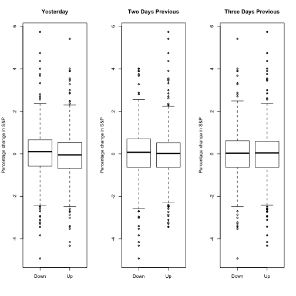

### About this Course

This is an introductory-level course in supervised learning, with a focus on regression and classification methods. The [syllabus](LINK HERE) includes: linear and polynomial regression, logistic regression and linear discriminant analysis; cross-validation and the bootstrap, model selection and regularization methods (ridge and lasso); nonlinear models, splines and generalized additive models; tree-based methods, random forests and boosting; support-vector machines. Some unsupervised learning methods are discussed: principal components and clustering (k-means and hierarchical).

This is not a math-heavy class, so I try and describe the methods without heavy reliance on formulas and complex mathematics. I focus on what I consider to be the important elements of modern data analysis. Computing is done in [R](http://www.burns-stat.com/documents/tutorials/impatient-r/). There are lectures devoted to R, giving tutorials from the ground up, and progressing with more detailed sessions that implement the techniques in each lesson.

The lectures cover all the material in An Introduction to Statistical Learning, with Applications in R by James, Witten, Hastie and Tibshirani (Springer, 2013). The pdf for this book is available for free on the book website.

**Prerequisites**: 3316K - Decision Making with Analytics

### An Overview of Statistical Learning

Statistical learning can be classified into *supervised* or *unsupervised*. Supervised learning involves predicting an output based on inputs. Unsupervised learning has only inputs, and the goal is to understand relationships and structure from the data. Both methods involve *understanding data*.

##### Wage Data

In this application, we examine factors that relate wages for a group of males in the northeastern United States. The below graphs show the variablility of wages with age, year of income, and education levels. The greater the number given to represent education, the higher the idividual's education level. Statistical learning methods will be explored to predict wage, the *response*, as a function of other variables, the *features*. The wage data involves predicting a continuous output value, or *regression*. 


```r
library(stats)
data       <- Wage #Data from package 
head(data)
```

```
##        year age     sex           maritl     race       education
## 231655 2006  18 1. Male 1. Never Married 1. White    1. < HS Grad
## 86582  2004  24 1. Male 1. Never Married 1. White 4. College Grad
## 161300 2003  45 1. Male       2. Married 1. White 3. Some College
## 155159 2003  43 1. Male       2. Married 3. Asian 4. College Grad
## 11443  2005  50 1. Male      4. Divorced 1. White      2. HS Grad
## 376662 2008  54 1. Male       2. Married 1. White 4. College Grad
##                    region       jobclass         health health_ins
## 231655 2. Middle Atlantic  1. Industrial      1. <=Good      2. No
## 86582  2. Middle Atlantic 2. Information 2. >=Very Good      2. No
## 161300 2. Middle Atlantic  1. Industrial      1. <=Good     1. Yes
## 155159 2. Middle Atlantic 2. Information 2. >=Very Good     1. Yes
## 11443  2. Middle Atlantic 2. Information      1. <=Good     1. Yes
## 376662 2. Middle Atlantic 2. Information 2. >=Very Good     1. Yes
##         logwage      wage
## 231655 4.318063  75.04315
## 86582  4.255273  70.47602
## 161300 4.875061 130.98218
## 155159 5.041393 154.68529
## 11443  4.318063  75.04315
## 376662 4.845098 127.11574
```

```r
par(mfrow=c(1,3))
plot(wage ~ age,  data=data, cex=0.5, ylab="Wage", xlab="Age")
age.spline <- smooth.spline(data$age, data$wage, df=10) #Fit spline
lines(age.spline, col="purple")


plot(wage ~ year, data=data, cex=0.5, ylab="Wage", xlab="Year")
year.line  <- lm(wage ~ year, data=data) #line of best fit
abline(year.line, col="purple")

boxplot(wage ~ education, data=data, ylab="Wage", xlab="Education Level", xaxt="n")
axis(1, 1:5, 1:5)
```


##### Stock Market Data
The goal with this data set is to predict whether the stock market will move up or down. This is a *classification* problem. We are not interested in predicting a numerical value, only predicting whether the next event is up or down. The data for this problem is given below.


```r
data <- Smarket
par(mfrow=c(1,3))
head((data))
```

```
##   Year   Lag1   Lag2   Lag3   Lag4   Lag5 Volume  Today Direction
## 1 2001  0.381 -0.192 -2.624 -1.055  5.010 1.1913  0.959        Up
## 2 2001  0.959  0.381 -0.192 -2.624 -1.055 1.2965  1.032        Up
## 3 2001  1.032  0.959  0.381 -0.192 -2.624 1.4112 -0.623      Down
## 4 2001 -0.623  1.032  0.959  0.381 -0.192 1.2760  0.614        Up
## 5 2001  0.614 -0.623  1.032  0.959  0.381 1.2057  0.213        Up
## 6 2001  0.213  0.614 -0.623  1.032  0.959 1.3491  1.392        Up
```

```r
boxplot(Lag1 ~ Direction, data=data, main="Yesterday", ylab="Percentage change in S&P")
boxplot(Lag2 ~ Direction, data=data, main="Two Days Previous", ylab="Percentage change in S&P")
boxplot(Lag3 ~ Direction, data=data, main="Three Days Previous", ylab="Percentage change in S&P")
```


A prediction method for classification is quadratic discriminant analysis. This will be expanded on later. The R implementation of this is shown below. 


```r
library(MASS)
par(mfrow=c(1,1))
train <- data[data$Year != 2005, ]
test  <- data[data$Year == 2005, ]

qda.obj   <- qda(Direction ~ Lag1 + Lag2 + Lag3 + Lag4 + Lag5, data=train)
test.vals <- predict(qda.obj, newdata=test)

test <- cbind(test, ifelse(test$Direction=="Down", test.vals$posterior[, 1],
                           test.vals$posterior[, 2])) #Combine to Plot
names(test) <- paste("X", 1:ncol(test), sep="") #Rename for ease
boxplot(X10 ~ X9, data=test, xlab="Today's Direction", ylab="Predicted Probability") #Probability ~ Realized
```


##### Gene Expression Data
The previous two examples were supervised regression, and supervised classification. This example deals with unsupervised learning. There are only inputs. The data for this example consists of 6, 830 gene expression measuremenets for each of 64 cancer cell lines. We are interested in determining whether the genes can be grouped by movement. The high dimensional data can be viewed in two dimensions by taking the principal components, and plotting based on those. This may result in some loss of information, but the benefit of visualizing data is gained.


```r
nci.labs = NCI60$labs
nci.data = NCI60$data

pr.out = prcomp (nci.data, scale =TRUE )

Cols= function (vec ){
  cols= rainbow (length(unique(vec)))
  return (cols [as.numeric(as.factor(vec))])
}
set.seed(12345)
cols <- kmeans(pr.out$x[, 1:2], 4)
plot(pr.out$x[, 1:2], col=Cols(cols$cluster), pch =19,
  xlab =" Z1", ylab ="Z2 ")
```


### A Brief History of Statistical Learning
Statistical Learning is fairly new, but many of the concepts are not. Most models before 1970 were linear in nature. By the 1980s, computer technology had imporved to the point that non-linear model fitting was possible. This book focuses more on non-linear methods.

### ISL Book

The publication of [An Introduction to Statistical Learning with Applications in R](http://www-bcf.usc.edu/~gareth/ISL/index.html) (download the book pdf) provides a gentle introduction to statistical learning (also known as "machine learning”). The book achieves a nice balance and well worth looking at both for the beginner and the more experienced HBA student needing to explain to others with less training on methods for regression and classification. As a bonus, I added Stanford's [OpenEdX] (https://lagunita.stanford.edu/courses/HumanitiesScience/StatLearning/Winter2014/about)  lecture videos and transcripts by Hastie and Tibshirani.There is also an GitHub [repository](LINK HERE) with the R code to demonstrate most of the techniques described in the book and solutions to the exercises at the end of each chapter,

**Data**

All of the data used in this class is availiable in the [ISLR](https://cran.r-project.org/web/packages/ISLR/index.html) package available on CRAN.

### Frequently Asked Questions

**Do I need to buy a textbook?**

No, a free online version of [An Introduction to Statistical Learning, with Applications in R](http://www-bcf.usc.edu/~gareth/ISL/) by James, Witten, Hastie and Tibshirani (Springer, 2013) is available from that website. Springer has agreed to this, so no need to worry about copyright. Of course you may not distribiute printed versions of this pdf file.

**Is R and RStudio available for free?**

Yes. You get R for free from http://cran.us.r-project.org/. Typically it installs with a click. You get RStudio from http://www.rstudio.com/, also for free, and a similarly easy install.

**How many hours of effort are expected per week?**

I anticipate it will take approximately 5-10 hours per week to go through the materials and exercises in each lesson.
