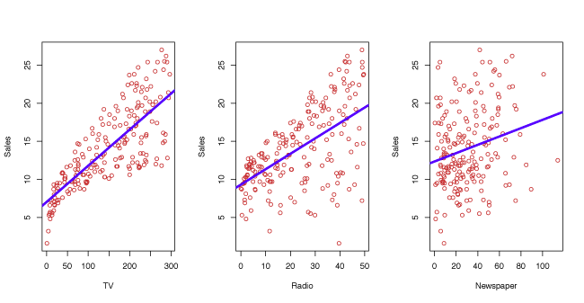
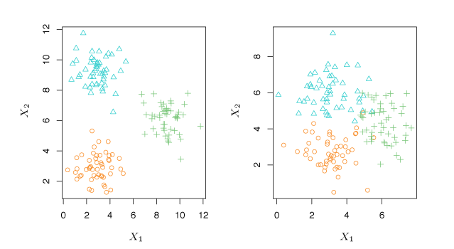
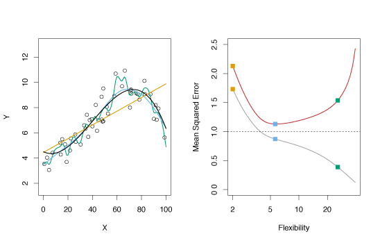
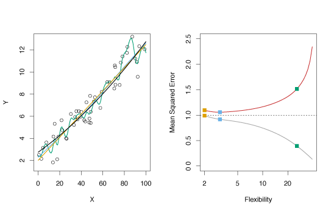
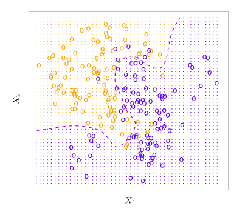
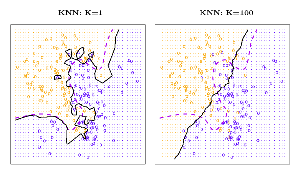

$$\newcommand{\Var}{\mathrm{Var}}
\newcommand{\MSE}{\mathrm{MSE}}
\newcommand{\Avg}{\mathrm{Avg}}
\newcommand{\Bias}{\mathrm{Bias}}$$

## What is Statistical Learning?

Consider *observed response* variable $$Y$$ and $$p$$ different *predictors* $$X_1, X_2, \ldots, X_p$$. Let $$Y$$ and $$X = (X_1, X_2, \ldots, X_p)$$ be related by

$$
    Y = f(X) + \epsilon
    \tag{2.1}
    \label{eq:estimate}
$$

where $$f$$ is an unknown function of $$X_1, \ldots, X_p$$ and
$$\epsilon$$ is a random *error term* independent of $$X$$ with mean zero.
Statistical learning provides methods for estimating $$f$$.

##### Example 1

An example of statistical learning is shown in Figure 2.1. Linear regression (Lesson 3) is used to estimate sales (in thousands of units) as functions of TV, radio and newspaper budgets (in thousands of dollars). The observed data comes from 200 different markets.

{:refdef: style="max-width:750px; margin:auto; text-align: center;"}
__Figure 2.1__ -- *Linear fit to* `sales` *based on 200 different markets for* `TV`*,* `radio` *and* `newspaper`*.*
{: refdef}

##### Example 2 

In Figure 2.2, the relationship between an individual’s income and the number of years of education they have received is estimated by a non-linear function.

{:refdef: style="max-width:750px; margin:auto; text-align: center;"}
__Figure 2.2__ -- *Non-linear fit for* `Income` *as a function of* `Years of Education`*.*
{: refdef}

##### Example 3 

Extending Example 2, two predictors are used to estimate income. Years of education and seniority are fit by a non-linear 3-dimensional surface.

{:refdef: style="max-width:750px; margin:auto; text-align: center;"}
__Figure 2.3__ -- *Non-linear fit for* `Income` *as a function of* `Years of Education` *and* `Seniority`*.*
{: refdef}

### Why Estimate $$f$$?

##### Prediction 
Often we will have a set of observations where both the input $$X$$ and exact output $$Y$$ are known.
If we are interested in predicting the output for some $$X$$ that is not in the set of observations, the known observations must be used to estimate the output.
The estimate of $$Y$$ is denoted by $$\hat{Y}$$.
Since the error term in equation $$\eqref{eq:estimate}$$ has mean $$0$$, $$Y$$ can be predicted by
$$
    \hat{Y} = \hat{f}(X)
    \tag{2.2}
$$
where where $$\hat{f}$$ and $$\hat{Y}$$ are predictions of $$f$$ and $$Y$$ respectively. 
The exact form of $$\hat{f}$$ is not important as long as it makes strong predictions of $$Y$$.

The accuracy of $$\hat{Y}$$ as a predictor depends on the *reducible error* and *irreducible error*.
Typically, $$\hat{f}$$ will not perfectly estimate the unknown function $$f$$.
The *reducible error* can be improved by selecting a better estimator $$\hat{f}$$.
Even if the *reducible error* is zero, in which case $$\hat{f}$$ will perfectly fit $$f$$, there will still be some error in the prediction.
This is known as the *irreducible error* and is contained in the variable $$\epsilon$$.
The *irreducible error* cannot be predicted with $$X$$ and cannot be reduced by selecting a better model.

The irreducible error $$\epsilon$$ may be a result of unmeasured variables that are relevant in predicting $$Y$$.
Consider $$\hat{f}$$ with predictors $$X$$ where $$\hat{Y} = \hat{f}(X)$$. 
Suppose $$\hat{f}$$ and $$X$$ are given, then
$$
\begin{align*}
E(Y - \hat{Y}) &= E[f(X) + \epsilon - \hat{f}(X)]^2 \\
&= \underbrace{[f(X) - \hat{f}(X)]^2}_{\text{Reducible}} 
+ 
\underbrace{\Var(\epsilon)}_{\text{Irreducible}} \>. \tag{2.3}
\end{align*}
$$

When estimating $$\hat{f}$$ we try to minimize the reducible error. The irreducible error will always be an unknown upper bound for the accuracy of the fit.

#### Inference 
We may want to know how $$Y$$ is influenced by changes in $$X_1, \ldots ,X_p$$. Here, we still want to estimate $$f$$, but predicting $$Y$$ is less important. We are more concerned with understanding changes in $$Y$$ as a function of $$X_1, \ldots ,X_p$$. Typical questions include: 

- *Which predictors are associated with $$Y$$?* Identifying the most important predictors can be very helpful.
- *How is each predictor related to $$Y$$?* Some predictors are positively related to $$Y$$, while others are negatively related.
- *Is there a linear relationship between $$Y$$ and the predictors?*

Different methods for estimating $$f$$ may be more appropriate for prediction than inference.
Linear models are more desirable for inference since they are highly interpretable but lead to less accurate predictions.
By contrast, non-linear models often provide higher accuracy, but are less interpretable.

### How do we Estimate $$f$$?
We always start with $$n$$ observed data points called *training data* (or observed data).
They are called training data because they are used to teach or train the method how to estimate $$f$$.
Suppose $$x_{ij}$$ is the $$j$$th predictor for the $$i$$th observation, $$i = 1, 2, \ldots ,n$$ and $$j = 1, 2, \ldots, p$$. 
Let $$y_i$$ be the response variable for the $$i$$th predictor.
Then the training data set is $$\{(x_1, y_1), (x_2, y_2), \ldots , (x_n, y_n)\}$$ where $$x_i = (x_{i1}, x_{i2}, \ldots, x_{ip})^T$$.
Our goal is to use the training data to estimate the unknown function $$f$$ such that $$Y \approx \hat{f}(X)$$ for any $$(X, Y)$$. 
To accomplish this, either parametric or non-parametric methods will be used.

#### Parametric Methods 
Parametric methods require two stages: 

- Assume a form of $$f$$ (i.e. linear in $$X$$)
$$f(X) = \beta_0 + \beta_1X_1 + \beta_2X_2 + \cdots + \beta_pX_p\tag{2.4}$$
- Use the training observations to estimate the parameters. If a linear model is used, this step requires estimating $$\beta_0, \beta_1, \ldots , \beta_p$$ such that
$$Y \approx \beta_0 + \beta_1X_1 + \beta_2X_2 + \cdots + \beta_pX_p$$

*Parametric models* estimate $$f$$ by estimating the parameters.
They simplify the problem of estimating $$f$$ because it is generally easier to estimate parameters than to fit an arbitrary function $$f$$.
One drawback of parametric models is they are often inconsistent with the true unknown form of $$f$$.
This problem can be addressed by using a more *flexible* model that can fit more functional forms.
However, this generally requires estimating many parameters, which can lead to *overfitting* the data.

##### Example 
In figure 2.4 a linear model is used to estimate income based on years of education and seniority.

{:refdef: style="max-width:750px; margin:auto; text-align: center;"}
__Figure 2.4__ -- *Linear Model fit for* `Income` *as a function of* `Years of Education` *and* `Seniority`*.*
{: refdef}

#### Non-Parametric Methods 
Non-parametric models do not make any assumptions about the form of $$f$$, but try to estimate $$f$$ by getting as close to the data points without being too rough or wiggly. 
This approach can be superior because it has the ability to fit a wide range of shapes. However, the main drawback of non-parametric models is that they do not reduce the problem of estimating $$f$$ to a small number of parameters. 
Consequently, a large number of observations is typically required for non-parametric models to obtain an accurate estimate of $$f$$.

##### Example 
In Figure 2.5, a non-parametric model called a *smooth thin-plate spline* (Lesson 7) is used to estimate income based on years of education and seniority.

{:refdef: style="max-width:750px; margin:auto; text-align: center;"}
__Figure 2.5__ -- *Non-parametric Linear smooth thin-plate spline fit for* `Income` as a function of `Years of Education` *and* `seniority`*.*
{: refdef}

### The Trade-Off Between Prediction Accuracy and Model Interpretability
Less flexible (more restrictive) models may be preferred for inference due to their greater interpretability.
Highly flexible models may be unsuitable for understanding how individual predictors are related to the response, but are more desirable when accurate prediction is the goal.
Figure 2.7 illustrates the trade-off between the flexibility and interpretability of a model for various statistical learning methods.

{:refdef: style="max-width:750px; margin:auto; text-align: center;"}
__Figure 2.7__ -- *Illustration of tradeoff between flexibility and interpretability for various statistical learning methods.*
{: refdef}

### Supervised versus Unsupervised Learning
In supervised learning, each predictor $$x_i$$ has a corresponding response $$y_i$$ for $$i = 1, \ldots, n$$.
In unsupervised learning, each predictor $$x_i$$ __does not__ correspond to a response $$y_i$$.
Without a response, the relationship between observations can be understood by a technique called *cluster analysis*.
This technique determines if observations fall into distinct groups.

##### Example 
Figure 2.8 shows two unsupervised three-group clustering data sets. The situation on the right is more difficult because of overlapping observations.

{:refdef: style="max-width:750px; margin:auto; text-align: center;"}
__Figure 2.8__ -- *Two examples using cluster analysis.* Left: *The data is clearly separated into three distinct groups.* Right: *The groupings are more difficult to identify.*
{: refdef}

### Regression versus Classification Problems
Variables can be either *quantitative* or *qualitative*. 
Quantitative variables are numerical, like shoe size or height. 
Qualitative or categorical variables come from one of $$K$$ classes, or categories, like gender or birth country. 
Problems involving quantitative responses are known as *regression* problems whereas problems with qualitative responses are *classification* problems.

## Assessing Model Accuracy

### Measuring the Quality of Fit 
With regression problems the *mean squared error* (MSE) is commonly used to
give an overall indication of how well a model fits the observations.
The MSE is computed by
$$
\label{eq:MSE}
\mathrm{MSE} = \frac{1}{n}\sum\limits_{i=1}^n{ \left (y_i - \hat{f}(x_i) \right )^2}\tag{2.5}
$$
where $$\hat{f}(x_i)$$ is the prediction of $$f$$ for the $$i$$th observation. 
If the value of the MSE is small, predictions from the model are close to the observed values.
If the MSE is large, predictions are not close to the observed values.
The MSE is calculated with training data, hence the proper name is *training MSE*. 
However, the performance of the model on training data is not important since we want accurate predictions on unseen observations. 

Suppose we train our model with observations $$\{(x_1, y_1), (x_2, y_2), \ldots , (x_n, y_n)\}$$ and get an estimate $$\hat{f}$$. 
We can then compute $$\hat{f}(x_1), \hat{f}(x_2), \ldots , \hat{f}(x_n)$$.
If $$\hat{f}(x_1) \approx y_1, \ldots, \hat{f}(x_n) \approx y_n$$, the training MSE will be low. 
However, we are more concerned whether $$\hat{f}(x_0) \approx y_0$$, where $$(x_0, y_0)$$ is an unseen observation. 
With many test observations, we could calculate

$$
\label{eq:Avg}
\Avg\left (\hat{f}(x_0) -y_0 \right )^2\tag{2.6}
$$ 

to choose the model with the smallest for which this quantity is smallest.
Often, the function with the smallest training MSE has a much higher test MSE.

##### Example 1 
In the left panel of the Figure 2.9, the true function $$f$$ is shown by the solid black curve.
The circles are generated from $$f$$ with some random error introduced.
The orange line is a linear regression fit to the data.
The blue and green curves are smoothing spline fits with different levels of smoothness.

In the right panel, the grey curve is the MSE from the training data and the red curve is the MSE from test data.
The dashed line represents the smallest possible test MSE based on the true function $$f$$.
The squares represent the training and test MSE for the three models in the left panel.
The linear regression is a highly inflexible model, while the smoothing splines have different degrees of smoothness.

As model flexibility increases, training MSE decreases while the test MSE follows a U-shaped curve.
This phenomenon always applies: as flexibility increases, training MSE decreases, while test MSE may increase or decrease. Models with low training MSE and high test MSE *overfit* the observations.

{:refdef: style="max-width:750px; margin:auto; text-align: center;"}
__Figure 2.9__ -- *Various estimates of simulated data and their mean squared errors.*
{: refdef}

##### Example 2 
This example is similar to the one in Figure 2.9 except the true function $$f$$ is approximately linear.
The linearity in the data cause the test MSE to only fall moderately before rising as flexibility increases. 
Consequently, the least squares estimate performs much better than the flexible green spline.

{:refdef: style="max-width:750px; margin:auto; text-align: center;"}
__Figure 2.10__ -- *Various estimates of simulated data and their mean squared errors for approximately linear data.*
{: refdef}

### The Bias-Variance Trade-Off
The *expected test MSE* gives the average test MSE if a large number of training sets were used and tested at $$x_0$$.
It is given by the sum of the variance of $$\hat{f}(x_0)$$, the squared *bias* of $$\hat{f}(x_0)$$ and the variance of the error. That is,

$$
\label{eq:BiasVar}
E \left (y_0 - \hat{f}(x_0) \right )^2 = \Var \! \left (\hat{f}(x_0) \right) + \left [\Bias(\hat{f}(x_0)) \right]^2 + \Var(\epsilon)\tag{2.7}
$$ 

where $$E \left (y_0 - \hat{f}(x_0) \right )^2$$ is the expected test MSE.
The overall expected test MSE can be calculated by averaging $$E \left (y_0 - \hat{f}(x_0) \right )^2$$ over all test set points $$x_0$$.
Equation $$\eqref{eq:BiasVar}$$ shows that minimizing the expected test error requires a model with *low variance* and *low bias*. 

__Variance__ reflects the magnitude of change in $$\hat{f}$$ if estimated using different training data. 
Ideally this quantity is small.
If the variance is large, small changes in the training observations can have a significant impact on $$\hat{f}$$.
Flexible models often have larger variance.

__Bias__ is error derived from approximating complicated problems with simple models. 
For example, when linear regression is used, some bias is often introduced as most phenomena are not truly linear.
More flexible models often have smaller bias.

The relative rate of change of bias and variance determines whether the test MSE increases or decreases.
Increasing flexibility typically causes bias to decrease faster than variance, with a corresponding decrease in test MSE. 
At a certain point, greater flexibility has a smaller effect on decreasing bias than increasing variance, causing the test MSE increases. 
The relationship between bias, variance, and test set MSE is called the *bias-variance trade-off*. 
The best models have low variance and low bias. 

##### Example 
Figure 2.12 illustrates the principles outlined in equation $$\eqref{eq:BiasVar}$$. 
The blue and orange curves show how squared bias and variance change with flexibility, respectively. 
The horizontal dashed line represents $$\Var(\epsilon)$$, the irreducible error. 
The test MSE is shown by the red curve.
One important observation is that the flexibility level that minimizes the test MSE differs between the three data sets because the rate the variance and squared bias change is different.

{:refdef: style="max-width:750px; margin:auto; text-align: center;"}
__Figure 2.12__ -- *Squared bias (blue), variance (orange), $$\Var(\epsilon)$$ (dashed line) and test MSE (red) for three data sets. The vertical dashed line indicates the flexibility level corresponding to the smallest test MSE.*
{: refdef}

### The Classification Setting
For training observations $$\{(x_1, y_1), \ldots , (x_n, y_n)\}$$, where $$y_1, \ldots , y_n$$ are qualitative, the *training error rate* is used to quantify the accuracy of a model.
The proportion of mistakes when $$\hat{f}$$ is used on the training observations is given by
$$
\label{eq:trainingErr}
\frac{1}{n}\sum\limits_{i=1}^n{I(y_i \neq \hat{y}_i)}\tag{2.8}
$$  
where $$\hat{y}_i$$ is the predicted class of observation $$i$$ using $$\hat{f}$$ and $$I(y_i \neq \hat{y}_i)$$ is an *indicator variable* equal to 1 when $$y_i \neq \hat{y}_i$$ and 0 when $$y_i = \hat{y}_i$$. When $$I(y_i \neq \hat{y}_i) = 0$$, observation $$i$$ was correctly classified and 
when $$I(y_i \neq \hat{y}_i) = 1$$, observation $$i$$ was misclassified. 

Equation $$\eqref{eq:trainingErr}$$ is called the *training error rate*. 
As before, the test error rate is more important and for a set of test observations of the form $$(x_0, y_0)$$ and is given by

$$\mathrm{Avg}(I(y_0 \neq \hat{y}_0)),\tag{2.9}$$

where $$\hat{y}_0$$ is the class prediction of test observation with predictor $$x_0$$.
The best classifier has the lowest test error. 
The test error rate is lowest, on average, when test observations $$x_0$$ are assigned to class $$j$$ when
$$\Pr(Y = j \mid X = x_0)\tag{2.10}$$ 
is largest. 
This is called the *Bayes classifier*.

##### Example 
Consider predictor $$X = (X_1, X_2)$$.
In Figure 2.13, the orange and blue circles represent training observations from two classes.
For each $$X$$, there is a probability that the response is orange or blue. 
Since this data was computer generated, we can calculate conditional probabilities for each $$X$$
The orange region reflects points where $$\Pr(Y=\text{orange} \mid X) > 0.5$$, while blue reflects points where the probability is less than 50%. 
The purple dashed line indicates 50% probabilities. 
This line is called the *Bayes decision boundary*.

{:refdef: style="max-width:750px; margin:auto; text-align: center;"}
__Figure 2.13__ -- *Simulated data set of 100 observations in each of two groups indicated by blue and orange. The purple dashed line is the Bayes decision boundary.*
{: refdef}

The Bayes classifier results in the lowest test error rate known as the *Bayes error rate*. The error rate at $$X = x_0$$ is $$1 - \max_j \Pr(Y=j \mid X=X_0)$$. The Bayes error rate is given by 
$$
1 - E \left (\max_j \Pr(Y=j \mid X) \right ), \tag{2.11}$$ 
which averages the probability over $$X$$.

Since the conditional distribution of $$Y \mid X$$ is unknown for real data, the Bayes classifier cannot be computed.
One method to estimate the conditional distribution of $$Y \mid X$$ and classify observations to the class with highest estimated probabilities is the $$K$$-*nearest neighbors* (KNN) classifier. 
Given a positive integer $$K$$, and test observation $$x_0$$, the KNN classifier determines the set $$\mathcal{N}_0$$ of the $$K$$ nearest training points to $$x_0$$.
It then estimates the conditional probability for $$j$$ as the proportion of observations in $$\mathcal{N}_0$$ with response $$j$$:
$$\Pr(Y=j \mid X=X_0) = \frac{1}{K}\sum\limits_{i \in \mathcal{N}_0}I(y_i=j) \>.\tag{2.12}$$
KNN then uses Bayes rule to classify test observation $$x_0$$ to the class with greatest probability.

##### Example 
Figure 2.14 illustrates the KNN classifier.
In the left panel, training data with six blue and six orange points is used to classify the black x.
For $$K = 3$$, KNN finds the three points nearest the cross (indicated by the green circle).
Since there are two blue points and one orange point inside the green circle, KNN predicts that the black x is blue with probability $$2/3$$ and orange with probability $$1/3$$.
Since there is a high probability of the black x being blue, KNN classifies it as blue.
The right hand panel shows how KNN would classify any point for all possible $$X_1$$ and $$X_2$$ with $$K = 3$$.
The KNN decision boundary is shown by the black curve.

{:refdef: style="max-width:750px; margin:auto; text-align: center;"}
__Figure 2.14__ -- *Example of KNN with $$K = 3$$. The KNN decision boundary is illustrated in the right panel by the black curve.*
{: refdef}

The value of $$K$$ has a significant impact on the KNN classifier. 
Figure 2.16 shows KNN fits for $$k = 1$$ (left) and $$K = 100$$ (right).
When $$K = 1$$, the decision boundary is too flexible and results in low bias and high variance.
As $$K$$ increases, flexibility increases, which results in a near linear decision boundary. 
High $$K$$ produces a low variance and high-bias classifier. 

{:refdef: style="max-width:750px; margin:auto; text-align: center;"}
__Figure 2.16__ -- *Example of KNN for $$K = 1$$ and $$K = 100$$. The Bayes decision boundary is shown by the purple dashed line and the KNN decision boundary is the solid black curve.*
{: refdef}

A comparison of the test and training error rates for varying values of $$K$$ is shown in Figure 2.17.
As $$1/K$$ rises (as $$K$$ decreases), the method becomes more flexible. 
The test error conforms with the results above and is a U-shape, declining until a minimum at roughly $$K = 10$$ before increasing as flexibility causes overfitting. 

{:refdef: style="max-width:750px; margin:auto; text-align: center;"}
__Figure 2.17__ -- *The KNN training error rate (blue) and test error rate (orange) as the level of flexibility increases.*
{: refdef}
