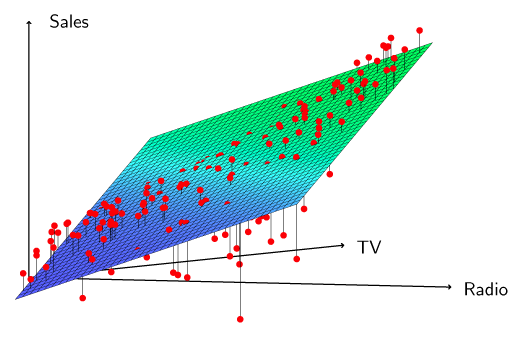
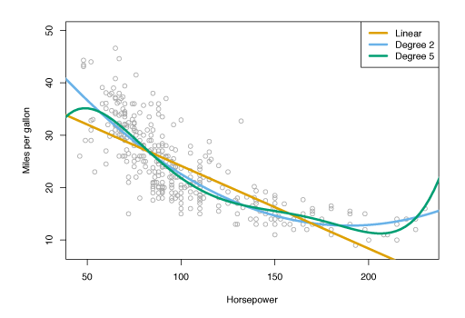
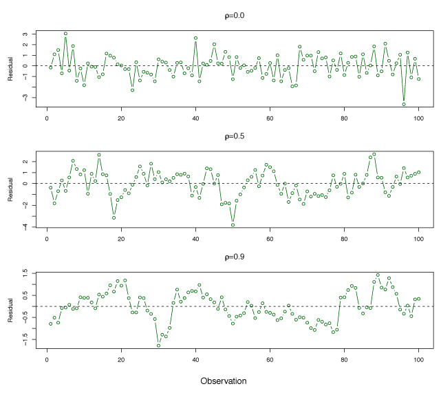
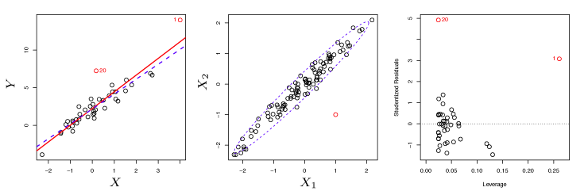
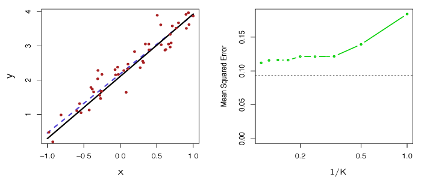

\newcommand{\Var}{\mathrm{Var}}
\newcommand{\MSE}{\mathrm{MSE}}
\newcommand{\Avg}{\mathrm{Avg}}
\newcommand{\Bias}{\mathrm{Bias}}

## Simple Linear Regression
*Simple linear regression* assumes a linear relationship between a *single predictor* variable $X$ and *quantitative response* variable $Y$.
This can be expressed as
$$
    Y \approx f(X) = \beta_0 + \beta_1 X 
    \tag{3.1}
$$
where $\beta_0$ and $\beta_1$ are unknown constants known as the model *coefficients* or *parameters*.
Training data can be used to find estimates $\hat{\beta}_0$ and $\hat{\beta}_1$ of $\beta_0$ and $\beta_1$.
From the estimated coefficients, $Y$ can be estimated by
$$
    \hat{y} = \hat{\beta}_0 + \hat{\beta}_1 x 
    \tag{3.2}
$$
where $\hat{y}$ is a prediction of $Y$ for $X = x$.
The *hat* symbol, $\hat{\phantom{y}}$, represents an estimated value for an unknown parameter or predicted value of the response.

### Estimating the Coefficients 
Consider $n$ observation pairs
$$
    (x_1, y_1), (x_2, y_2), ... , (x_n, y_n) \>.
$$
Linear regression determines estimates $\hat{\beta}_0$ and $\hat{\beta}_1$ such that $y_i \approx \hat{\beta}_0 + \hat{\beta}_1 x_i$ for $i = 1, \ldots, n$.
*Least squares* can be used to find the estimates of the parameters.

Suppose $\hat{y}_i = \hat{\beta}_0 + \hat{\beta}_1 x_i$ is our prediction for $Y$ from the $i$th observation of $X$. 
Then, $e_i = y_i - \hat{y}_i$ represents the $i$th residual and the *residual sum of squares* (RSS) is defined as
$$
\begin{align*}
    \mathrm{RSS} &= e_1^2 + e_2^2 + \cdots + e_n^2\\
    &= (y_1 - \hat{\beta}_0 - \hat{\beta}_1 x_1)^2 + (y_2 - \hat{\beta}_0 - \hat{\beta}_1 x_2)^2  + \cdots + (y_n - \hat{\beta}_0 - \hat{\beta}_1 x_n)^2 \>. \label{eq:rss}\tag{3.3}
\end{align*}
$$
Least squares estimation finds the values of $\hat{\beta}_0$ and $\hat{\beta}_1$ such that equation$~\eqref{eq:rss}$ is minimized.
Using some simple calculus, these values can be found to be
$$
\begin{aligned}
    \hat{\beta}_1 &= \frac{\displaystyle\sum\limits_{i=1}^n(x_i - \bar{x})(y_i - \bar{y})}{\displaystyle\sum\limits_{i=1}^n(x_i - \bar{x})^2}\\
    \hat{\beta}_0 &= \bar{y} - \hat{\beta}_1\bar{x} \> ,
\end{aligned}\label{eq:lsEst}\tag{3.4}
$$
where $\bar{y} = \displaystyle\frac{1}{n}\sum\limits_{i=1}^n y_i$ and $\bar{x} = \displaystyle\frac{1}{n}\sum\limits_{i=1}^nx_i$.

Figure 3.1 shows the linear regression estimate to `sales` from `TV` ad spending using the the `Advertising` data. 
The blue line is the linear regression fit found by least squares and has parameter values $\hat{\beta}_0 = 7.03$ and $\hat{\beta}_1 = 0.0475$. 

 

__Figure 3.1__ -- *Least squares fit to the regression of* `sales` *onto* `TV`*.*

### Assessing Coefficient Estimate Accuracy 
If the *true* relationship between $X$ and $Y$ takes the form $Y = f(X) + \epsilon$, and $f$ is approximated by a linear function, this relationship can be expressed as
$$
Y = \beta_0 + \beta_1 X + \epsilon \>. \label{eq:lmwithErr}\tag{3.5}
$$
The error is assumed to be independent of $X$ and captures the fact that the true relationship is probably not linear and measurement error likely exists. 
Equation$~\eqref{eq:lmwithErr}$ defines the *population regression line*, the strongest linear approximation of the relationship between $X$ and $Y$.

The left-hand panel of Figure 3.3 uses simulated data to illustrate how close the least squares fit is.
The true relationship is $f(X) = 2 + 3X$ and data is generated by $Y = 2 + 3X + \epsilon$ where $\epsilon$ was generated from a normal distribution with mean zero.
The red line is the population regression line illustrating the true relationship and the blue line is the least squares estimate for $f(X)$.
In the right-hand panel, 10 light blue lines show the estimates from different samples of the simulated data.
Each least squares line is different, but on average, they are near the population regression line.

 

__Figure 3.3__ -- *A simulated data set.* Left: *True relationship shown by red line, least squares line in blue.* Right: *The 10 light blue lines show the least squares fit when computed on different samples of the simulated data.*
 

The *standard error* of the estimates of the coefficients gives an idea of how close the estimates are to the true values of the coefficients.
The standard errors for $\hat{\beta}_0$ and $\hat{\beta}_1$ are
$$
    \mathrm{SE}(\hat{\beta}_0)^2 = \sigma^2 \left [ \frac{1}{n} + \frac{\bar{x}^2}{\sum\limits_{i=1}^n(x_i - \bar{x})^2} \right ]
    ,\quad
    \mathrm{SE}(\hat{\beta}_1)^2 = \frac{\sigma^2}{\sum\limits_{i=1}^n(x_i - \bar{x})^2}
    \tag{3.8}
$$
where $\sigma^2 = \Var(\epsilon)$. 
These formulas assume the errors $\epsilon_i$ are uncorrelated with variance $\sigma^2$.
This is not universally true, but results in good approximations. 
In general, $\sigma^2$ is not known but can be estimated from the observed data. 
This is known as the *residual standard error*, defined by $\mathrm{RSE} = \sqrt{\mathrm{RSS}/(n - 2)}\>$.

Standard errors can be used to compute *confidence intervals* (CI).
A 95% CI is the range of values such that the true value falls inside the CI with probability 95%.
For linear regression, the 95% CI for $\beta_1$ is approximately
$$
    \hat{\beta}_1 \pm 2\cdot\mathrm{SE}(\hat{\beta}_1) \>. 
    \tag{3.9}
$$
That is, the true value of $\hat{\beta}_1$ has a 95% chance of being in the interval  
$$
    \big [\hat{\beta}_1 - 2\cdot\mathrm{SE}(\hat{\beta}_1),\, \hat{\beta}_1 + 2\cdot\mathrm{SE}(\hat{\beta}_1) \big ] \>.
    \tag{3.10}
$$
The 95% CI for $\beta_0$ is approximately
$$
    \hat{\beta}_0 \pm 2\cdot \mathrm{SE}(\hat{\beta}_0) \>. 
    \tag{3.11}
$$

Standard errors can be used to perform *hypothesis tests* on the coefficients $\beta_0$ and $\beta_1$. 
The most common hypothesis test involves testing the *null hypothesis* of
$$
    H_0 \text{: There is no relationship between } X \text{ and } Y
    \tag{3.12}
$$ 
versus the *alternative hypothesis*
$$
    H_A \text{: There is some relationship between } X \text{ and } Y \>. 
    \tag{3.13}
$$
This corresponds to testing
$$
    H_0 : \beta_1 = 0
$$
versus 
$$
    H_A : \beta_1 \neq 0,
$$
since if $\beta_1 = 0$, equation$~\eqref{eq:lmwithErr}$ becomes $Y = \beta_0 + \epsilon$ and $X$ is not associated with $Y$.

To test the null hypothesis, we need to determine if $\hat{\beta}_1$, is far enough from zero that we can be confident that $\beta_1$ is non-zero.
In practice, we calculate a *t-statistic* given by
$$
    t = \frac{\hat{\beta}_1 - 0}{\mathrm{SE}(\hat{\beta}_1)}\label{eq:tstat}
    \tag{3.14}
$$
which measures the number of standard deviations $\hat{\beta}_1$ is from zero.

If $X$ and $Y$ are unrelated, then we expect that equation$~\eqref{eq:tstat}$ will follow a $t$-distribution with $n-2$ degrees of freedom. 
The $t$-distribution is similar to the normal distribution for $n \geq 30$. 
We can calculate the *p-value*, the probability of observing values greater or equal to $|t|$, assuming $\beta_1 = 0$.

A **small** p-value indicates that $\beta_1$ has a **low probability** of being zero and hence there is an association between the predictor and response.
Thus, we *reject the null hypothesis* -- that is, we declare a relationship exists between $X$ and $Y$.
The smaller the p-value, the more likely it is that a relationship between predictor and response exists.
Typical cutoffs for rejecting the null hypothesis are 5% or 1%.

### Assessing Model Accuracy 
Two quantities are typically used to assess the quality of the linear regression:  *residual standard error* (RSE) and $R^2$.

#### Residual Standard Error {-}
RSE estimates the standard deviation of $\epsilon$ which represents the average deviation of the response from the true regression line. 
This is calculated as
$$
    \mathrm{RSE} = \sqrt{\frac{1}{n-2}\mathrm{RSS}}
    \tag{3.15}
$$
for simple linear regression (a more general definition will be given in section 3.2).
RSE gives a measure of the *lack of fit* of the model $\eqref{eq:lmwithErr}$ and the data. 
If $\hat{y}_i \approx y_i$ for $i = 1, \ldots , n$ then the RSE is small, indicating the model fits well.
Alternatively, if the $\hat{y}_i$ values are far from $y_i$, the RSE will be large, indicating the model does not fit the data well.

#### $R^2$ Statistic {-}
Since the RSE is calculated in the units of $Y$, it may be unclear what a suitable value is.
The $R^2$ statistic gives an indication of the proportion of variance explained by the model and is independent of the units of $Y$, so it always takes on values between 0 and 1.
$R^2$ can be computed by
$$
    R^2 = 
    \frac{\mathrm{TSS} - \mathrm{RSS}}{\mathrm{TSS}} = 
    1 - \frac{\mathrm{RSS}}{\mathrm{TSS}} 
    \tag{3.17}
$$
where $\mathrm{TSS} = \sum{(y_i - \bar{y})^2}$ is the *total sum of squares*, and $\mathrm{RSS} = \sum{(y_i - \hat{y}_i)^2}$ is the *residual sum of squares* as before.
TSS measures the total variance of $Y$, and can be interpreted as the amount of variability inherent in the response before the regression is performed. 
In contrast, RSS measures unaccounted variability after the regression. 
Hence, $\text{TSS}-\text{RSS}$ measures the variability removed through the regression, while $R^2$ measures the proportion of variability in $Y$ explained by $X$. 
An $R^2$ value close to 1 indicates that most of the response variability is captured by the regression and the regression fits the data well.
What is considered a good value for $R^2$ depends on the context.

The *correlation* between $X$ and $Y$ is given by
$$
    \mathrm{Cor}(X,Y) = 
    \frac{\displaystyle\sum\limits_{i=1}^n(x_i - \bar{x})(y_i -     \bar{y})}{\sqrt{\displaystyle\sum\limits_{i=1}^n(x_i-\bar{x})^2}\sqrt{\sum\limits_{i=1}^    n(y_i-\bar{y})^2}}
    \tag{3.18}
$$
and is related to the $R^2$ value.
In the simple linear regression setting, $\mathrm{Cor}(X, Y) = \sqrt{R^2}$.

## Multiple Linear Regression
With more than one predictor, the best linear model has a slope coefficient for each predictor. 
With $p$ distinct predictors, the multiple linear regression model is,
$$
    Y = \beta_0 + \beta_1 X_1 + \beta_2 X_2 + \cdots + \beta_p X_p + \epsilon
    \tag{3.19}
$$
where $X_j$ is the $j$th predictor and $\beta_j$ is the average change in $Y$ for a unit increase in $X_j$ when all other predictors remain constant.

Figure 3.4 shows a multiple linear regression fit with $p=2$ predictors.

 

__Figure 3.4__ -- *With two predictors and one response the least squares fit becomes a plane. The plane is chosen to minimize the vertical distances between each observation and the plane.*

### Estimating the Regression Coefficients
As in simple linear regression, the coefficients $\beta_0, \beta_1, \ldots , \beta_p$ are estimated by minimizing the residual sum of squares (RSS)
$$
\begin{align*}
\mathrm{RSS} &= \sum\limits_{i=1}^n (y_i - \hat{y}_i)^2 \\
&= \sum\limits_{i=1}^n(y_i - \hat{\beta}_0 - \hat{\beta}_1x_{i1} - \hat{\beta}_2x_{i2} - \cdots - \hat{\beta}_p x_{ip})^2 \>. \label{eq:mulLinReg} \tag{3.22}
\end{align*}
$$
The values $\hat{\beta}_0, \hat{\beta}_1, \ldots, \hat{\beta}_p$ that minimize $\eqref{eq:mulLinReg}$ are the multiple least squares regression coefficient estimates.

### Some Important Questions

#### Is there a relationship between the response and predictors? {-}
To answer this question, we test the null hypothesis
$$
    H_0 : \beta_1 = \beta_2 = \dots = \beta_p = 0
$$
versus the alternative hypothesis
$$
    H_a \text{ : at least one } \beta_j \text{ is non-zero.}
$$
This time the *F-Statistic* is used,
$$
    F = \frac{(\mathrm{TSS} - \mathrm{RSS}) / p}{\mathrm{RSS} / (n - p - 1)}
    \tag{2.23}
$$
where, $\mathrm{TSS} = \sum(y_i - \bar{y})^2$ and $\mathrm{RSS} = \sum(y_i - \hat{y}_i)^2$. 
If the linearity assumption holds, then
$$
    E[\mathrm{RSS}/(n - p - 1)] = \sigma^2
$$
and provided $H_0$ is true
$$
    E[(\mathrm{TSS} - \mathrm{RSS})/p] = \sigma^2 \>.
$$
Hence, when there is no relationship between the response and predictors, the F-statistic takes values close to 1.
Alternatively, if $H_a$ is true then $E[(\mathrm{TSS} - \mathrm{RSS})/p] > \sigma^2$ and $F$ is greater than 1.

To reject $H_0$ we must consider $n$ and $p$ in the F-statistic. 
For large $n$, an F-statistic just greater than 1 may provide reason to reject $H_0$. For small $n$, we need a higher F-statistic to reject $H_0$. 
When $H_0$ holds and the $\epsilon_i$ are normally distributed, the F-statistic follows a F-distribution. 
For any $n$ and $p$, the p-value associated with the F-statistics can be computed and used to decide whether to reject $H_0$ or not.

Above, we are testing the null hypothesis that all coefficients are zero. 
We may prefer testing whether some subset of $q$ of the coefficients are zero. 
This generates a similar null hypothesis,
$$
    H_0 : \beta_{p-q+1} = \beta_{p-q+2} = \cdots = \beta_p = 0
$$
where we placed the excluded variables last.
Here, we produce another model with each variable *except* the final $q$. 
Define the RSS for this model by $\mathrm{RSS}_0$.
Then, the F-statistic is given by
$$
    F = \frac{(\mathrm{RSS}_0 - \mathrm{RSS})/q}{\mathrm{RSS} / (n - p - 1)} \>. 
    \tag{3.24}
$$

#### Selecting Important Variables {-}
If we conclude from the p-values that some predictors are related to the response, we must determine *which* predictors are related.
We may consider individual p-values, but when the number of predictors is large this may lead to incorrect choices.
Ideally, we would consider all $2^p$ models with subsets of the $p$ variables. 
However, even for moderate $p$, this method is infeasible.
The following three methodologies produce a subset of models to choose from: 

- *Forward selection* - Begin with the *null model* -- a model with an intercept but no predictors. Then, fit $p$ simple linear regressions and add to the null model the variable with minimum RSS. Add to the one predictor model, the predictor with the lowest two-variable RSS. Repeat until reaching a stopping condition.
- *Backward selection* - Begin with all variables and remove the variable with the largest $p$-value. Create a $(p - 1)$-variable model and again discard the largest p-value variable. Continue until a stopping condition is met (i.e. each p-value is below some bound $l$). Backward selection does not work when $p > n$.
- *Mixed Selection* - Begin with the null model and add the variable that achieves the best fit. Continue adding variables one-by-one.
Because the p-values can become large as new variables are added, discard any variables if their p-values become larger than some bound $l$. Repeat until all variables have p-values below $l$, and all omitted variables have p-values greater than $l$ if added.

#### Model Fit {-}
RSE and $R^2$ are calculated and interpreted as above. However, $R^2$ increases as variables are added, even if response associations are low. This phenomenon results because more variables improve training data fit. However, they do not guarantee greater test data fit. 

RSE for multiple predictors is defined as
$$
    \mathrm{RSE} = \sqrt{\frac{1}{n - p - 1}\mathrm{RSS}} 
    \tag{3.25} \>.
$$

Plotting can be useful for revealing issues that may not be visible in numerical statistics.
For example, in Figure 3.5 it can clearly be seen that the relationship between radio, TV and Sales is non-linear.

 

__Figure 3.5__ -- *Linear regression fit to* `sales` *using* `TV` *and* `radio` *as predictors.*

#### Predictions {-}
There are three types of uncertainty with the prediction: 

- $\hat{\beta}_0, \hat{\beta}_1, \ldots , \hat{\beta}_p$ estimate $\beta_0, \beta_1, \ldots , \beta_p$. That is,
$$\hat{Y} = \hat{\beta}_0 + \hat{\beta}_1 X_1 + \cdots + \hat{\beta}_p X_p$$
estimates the *true population regression plane* 
$$f(X) = \beta_0 + \beta_1 X_1 + \cdots + \beta_p X_p \>.$$
The coefficient estimate inaccuracy is related to *reducible error*. A confidence interval can be computed to estimate how close $\hat{Y}$ is to $f(X)$.
- The assumption that $f(X)$ is linear is rarely true. This potentially reducible error is known as *model bias*.
- Even if we knew $\beta_0, \beta_1, \dots , \beta_p$,  the model still would not fit perfectly due to the random *irreducible error* $\epsilon$. To determine how much $Y$ differs from $\hat{Y}$, *prediction intervals* can be used, which are wider than confidence intervals. 

## Other Considerations in the Regression Model

### Qualitative Predictors

#### Predictors with Two Levels {-}
If a qualitative variable has two levels, such as male or female, we can use an indicator or *dummy variable*. For example, with gender we can create a variable of the form
$$
x_i =
\begin{cases}
1 \quad \text{if the } i \text{th person is female,}\\
0 \quad \text{if the } i \text{th person is male.}
\end{cases}
\tag{3.26}
$$
This gives the model
$$
y_i = \beta_0 + \beta_1x_i + \epsilon_i = 
\begin{cases}
    \beta_0 + \beta_1 + \epsilon_i &\text{if the } i \text{th person is female,}\\
    \beta_0 + \epsilon_i & \text{if the } i \text{th person is male.}
\end{cases}
\tag{3.27}
$$  

#### Predictors with More than Two Levels {-}
For qualitative predictors with more than two levels, we can add additional dummy variables. 
For example, for ethnicity, we could create two indicator variables
$$
x_{i1} = 
\begin{cases}
1 \quad \text{if the } i \text{th person is Asian,}\\
0 \quad \text{if the } i \text{th person is not Asian.}
\end{cases}
\tag{3.28}
$$
$$
x_{i2} = 
\begin{cases}
1 \quad \text{if the } i \text{th person is Caucasian,}\\
0 \quad \text{if the } i \text{th person is not Caucasian.}
\end{cases}
\tag{3.29}
$$
Using these variables, we have the model
$$
y_i = 
\beta_0 + \beta_1 x_{i1} + \beta_2 x_{i2} + \epsilon_i = 
\begin{cases}
    \beta_0 + \beta_1 + \epsilon_i & \text{if the } i \text{th person is Asian,}\\
    \beta_0 + \beta_2 + \epsilon_i & \text{if the } i \text{th person is Caucasian,}\\
    \beta_0 + \epsilon_i & \text{if the } i \text{th person is African American.}\\
\end{cases}
\tag{3.30}
$$

### Extensions 
The standard linear regression model is interpretable and often works well, but makes several assumptions that often do not hold. 

- *Additivity* assumes changes in $X_j$ have an effect on $Y$ independent of the other predictors.
- *Linearity* assumes a one unit change in $X_j$ results in a constant change in $Y$.

#### Removing the Additivity Assumption {-}
Consider a standard linear model with two variables
$$Y = \beta_0 + \beta_1X_1 + \beta_2X_2 + \epsilon \>.$$
Increasing $X_1$ by one unit results in $Y$ increasing by an average of $\beta_1$. 
One way of extending this model allows for interaction effects with a third predictor, called an *interaction term*, the product of $X_1$ and $X_2$. This new model is
$$
Y = \beta_0 + \beta_1 X_1 + \beta_2 X_2 + \beta_3 X_1 X_2 + \epsilon
\tag{3.31}$$
which is the same as,
$$
\begin{align*}
Y &= \beta_0 + (\beta_1 + \beta_3 X_2) X_1 + \beta_2 X_2 + \epsilon \tag{3.32}\\
&= \beta_0 + \tilde{\beta}_1 X_1 + \beta_2 X_2 + \epsilon
\end{align*}
$$
where $\tilde{\beta}_1 = \beta_1 + \beta_3 X_2$.
The interaction terms mean changes in $X_2$ result in changes in both $X_1$ and $Y$. 

To determine if the new model with an interaction term better fits the data we look at the 
$R^2$ value, p-values, and the F statistic. 
The *hierarchical principle* states that if we include an interaction in a model, we should also include the main effects, even if the p-values associated with their coefficients are not significant.
In other words, if the $X_1, X_2$ interaction is important (low p-value), then $X_1$ and $X_2$ must be included even if their individual coefficient estimates p-values are high. 
The reasoning for this principle is because if $X_1 X_2$ is related to the response, then whether $X_1$ or $X_2$'s coefficients are zero is irrelevant. 
Furthermore, $X_1 X_2$ is generally correlated with $X_1$ and $X_2$. 
Omitting them alters the meaning of their interaction.

The concept of interactions is relevant to qualitative variables, and combinations of quantitative and qualitative variables.

#### Non-Linear Relationships {-}
The linear model can be extended to accommodate non-linearity by *polynomial regression*.
To include non-linearity in a linear model, we add transformed predictors. 
Consider the equation
$$
    \mathrm{mpg} = \beta_0 + \beta_1\cdot\mathrm{horsepower} +\beta_2\cdot\mathrm{horsepower}^2 + \epsilon
$$
which predicts mpg by a non-linear function of horsepower.
This model is linear in $X_1$ and $X_2$ if we let $X_1 = \mathrm{horsepower}$ and $X_2 = \mathrm{horsepower}^2$.
Standard linear regression can be used to estimate $\beta_0$, $\beta_1$, and $\beta_2$, to provide a non-linear fit.
Again, $R^2$ and p-values should be used to decide if this model is an improvement over the linear model.

Figure 3.8 shows a linear regression fit in orange ($R^2 = 0.606$), a linear regression fit with a $\mathrm{horsepower}^2$ term ($R^2 = 0.688$) in blue and a linear regression fit with terms up to fifth degree in $\mathrm{horsepower}$ in green.

 

__Figure 3.8__ -- *Regression for* `mpg` *and* `horsepower` *for a number of cars. The orange line is the linear regression fit. The blue curve contains a quadratic term. The green curve contains up to fifth degree terms.*

### Potential Problems
Some common problems with linear regression include

- True relationship between response and predictor is non-linear
- Correlation of the error terms
- Non-constant variance of error terms
- Outliers
- High-leverage points
- Collinearity

#### Non-linearity {-}
If the true relationship between response and predictors is non-linear, the conclusions found from a linear fit will not represent the data well.
Graphing the residuals,  $e_i = y_i - \hat{y}_i$, versus $x_i$ can be helpful in identifying non-linearity.
If patterns arise in the residual plots, this suggests a problem with the linear model.

For example, Figure 3.9 shows a residual plot. 
In the left panel, the residual shows a pattern suggests non-linearity whereas the right panel does not show a comparable pattern.

 

__Figure 3.9__ -- *Plots of residuals vs fitted values. The red lines are a smooth fit to the residuals to make identifying trends easier.*

#### Error Term Correlation {-}
Both the linear regression model and the standard errors assume uncorrelated error terms, $\epsilon_1, \epsilon_2, \ldots, \epsilon_n$. 
If there is correlation between the error terms, the estimated standard errors will underestimate the true standard errors.
This will lead to confidence intervals, prediction intervals and p-values that are too small.
Correlations of error terms can often be found in *time series* data where observations at adjacent points in time will be positively correlated.

Figure 3.10 demonstrates how error term correlation can be identified using residuals. 
If the errors are uncorrelated there should be no noticeable pattern.
In the top panel, the residuals for error terms are uncorrelated because there is no time-related residual trend. 
In the bottom panel, adjacent residuals have highly similar results with correlation of 0.9 between adjacent errors. 
The center panel has medium correlation of 0.5. 

 

__Figure 3.10__ -- *Plots of residuals from simulated time series data sets generated with differing levels of correlation between error terms for adjacent time points.*

#### Non-constant variance of error terms {-}
An important assumption in linear models is that error terms have constant variance. $\mathrm{Var}(\epsilon_i) = \sigma^2$.
Standard errors, confidence intervals, and hypothesis tests rely on this assumption. 
Non-constant variances in the errors, or *heteroscedasticity* can be identified from a *funnel shape* in the residual plot.

Figure 3.11 shows and example of the funnel shape in the residuals and the use of a log-transform to minimize the effect of heteroscedasticity.

 

__Figure 3.11__ -- *Residual plots. The red line is a smooth fit to the residuals, useful for identifying trends. The blue lines track the outer quantiles of the residuals, and emphasize patterns.* Left: *The funnel shape indicates heteroscedasticity.* Right: *The predictor has been log-transformed, and there is now no evidence of heteroscedasticity.*

#### Outliers {-}
An *outlier* is a point for which $y_i$ is far from the predicted value $\hat{y}_i$.
Outliers without strange predictor values have a small impact on the least squares fit. 
However, they can have a large impact on the RSE or $R^2$ value.
This can also lead to inaccurate confidence intervals.

Residual plots can help identify outliers. 
However, it is unclear how large the residual should be to decide an observation is an outlier. 
Plotting the *studentized* residuals, computed by dividing each residual $e_i$ by its estimated standard error, can help resolve this problem. 
In general, points with studentized residuals greater than 3 in absolute value may be outliers.
One can usually remove an outlier from the data however, care should be taken as outliers may reflect issues with the model. 

For example, the red point in the left-hand panel of Figure 3.12 is an outlier. 
This is evident from the residual plot in the center panel and studentized residual above 6, in the right-hand panel.

 

__Figure 3.12__ -- Left: *The least squares regression line is shown in red, and the regression line after removing the outlier is shown in blue.* Center: *The residual plot clearly identifies the outlier.* Right: *The outlier has a studentized residual of 6; typically, we expect values between −3 and 3.*

#### High Leverage Points {-}
Observations with *high leverage* have an unusual $x_i$ value and can have a substantial impact on the regression.

The *leverage statistic* for a simple linear regression is
$$
    h_i = \frac{1}{n} + \frac{(x_i - \bar{x})^2}{\sum\limits_{i'=1}^n(x_{i'} - \bar{x})^2} \>.
    \label{eq:leverageStat}\tag{3.37}
$$
As $h_i$ increases, the distance of $x_i$ from $\bar{x}$ increases.
The leverage statistic always falls between $1/n$ and $1$ with an average of $(p+1)/n$.
If a given observation has an $h_i$ value that greatly exceeds $(p+1)/n$ then the point may have high leverage.
A simple extension of $\eqref{eq:leverageStat}$ exists for the case of multiple predictors.

As an example, observation 41 in the left panel of Figure 3.13 has high leverage because the predictor value for this observation is high relative to the other data points. The red line is the least squares line, while the blue dashed line is the least squares line when observation 41 is removed. The high leverage point has a larger effect than the outlier.  

 

__Figure 3.13__ -- Left: *Observation 41 is a high leverage point, while 20 is not. The red line is the fit to all the data, and the blue line is the fit with observation 41 removed.* Center: *The red observation is not unusual in terms of its $X_1$ value or its $X_2$ value, but still falls outside the bulk of the data, and hence has high leverage.* Right: *Observation 41 has a high leverage and a high residual.*

#### Collinearity {-}
*Collinearity* occurs when two or more predictors are closely related. 
Collinearity makes it challenging to determine individual variable effects on $Y$. 

The left panel of Figure 3.14 shows no clear relationship between credit limit and age.
However, the right panel shows that limit and rating are highly correlated, and are said to be *collinear*.
This makes it difficult to know the individual effect of limit or rating on the response since they increase/decrease together.

 

__Figure 3.14__ -- *Scatterplots of observations of* `age` *versus* `credit limit` *and* `rating` *versus* `credit limit`*.*
 

Collinearity reduces the accuracy of the estimates of the regression coefficients thereby increasing the standard error for $\hat{\beta}_j$. 
This also causes a decrease in the t-statistic and as a result we may fail to reject $H_0 : \beta_j = 0$.

The *correlation matrix* can be used to identify collinearity.
If an element of the matrix is large in magnitude, then the two variables that correspond to the element are highly correlated.
However, *multicollinearity* may exist between more than two variables, even when the matrix indicates low correlation between individual variable pairs. 
To detect multicollinearity, we calculate the *variance inflation factor* (VIF).
The VIF is the ratio of $\mathrm{Var}(\hat{\beta}_j)$ when fitting the full model divided by $\mathrm{Var}(\hat{\beta}_j)$ if fit on its own. 
The VIF has a lower bound of 1 where 1 represents no collinearity.
There is generally some collinearity between predictors and a VIF above 5 or 10 reflects problematic collinearity. 
Variable VIF is calculated as,
$$
    \mathrm{VIF}(\hat{\beta}_j) = \frac{1}{1-R^2_{X_j \mid X_{-j}}}
$$
where $R^2_{X_j \mid X_{-j}}$ is the $R^2$ when regressing $X_j$ onto all other predictors.

There are two solutions to collinearity amongst predictors. 
We can omit one of the correlated variables, generally without too much impact on the regression since the impact of the variable is captured by the others. 
Or, we can combine collinear variables to produce one predictor.

## Linear Regression versus K-Nearest Neighbours
The K-nearest neighbour classifier was described in Lesson 2. 
Given $K$ and observation $x_0$, KNN finds the $K$ training observations nearest $x_0$, represented by the set $\mathcal{N}_0$.
Then, $f(x_0)$ is estimated using the average of the training values in $\mathcal{N}_0$.
That is,
$$
    \hat{f}(x_0) = \frac{1}{K}\sum\limits_{x_i \in \mathcal{N}_0}y_i \>.
$$

Figure 3.16 illustrates KNN with $p = 2$. The $K = 1$ example is shown in the left panel, and $K = 9$ example is in the right panel. 
When $K = 1$, KNN exactly interpolates the training data by a step function, whereas $K = 9$ provides a smoother fit to the training data.
The optimal value for $K$ depends on the *bias-variance tradeoff*. 
Small $K$ is the most flexible with low bias and high variance while
large $K$ increases smoothness, decreases variability and increases bias.

 

__Figure 3.16__ -- *Plots of $\hat{f}(X)$ using KNN regression on a two-dimensional data set with 64 observations (orange dots).* Left: *$K = 1$ results in a rough step function fit.* Right: *$K = 9$ produces a much smoother fit.*
 

In Figure 3.17, the black solid lines represent $f(X)$ and the blue curves reflect KNN with $K = 1$ and $K = 9$. 
The $K = 1$ predictions are too variable, so the smoother $K = 9$ fit is better. 
With an approximate linear relationship, neither method compares well with linear regression.

 

__Figure 3.17__ -- *Plots of $\hat{f}(X)$ using KNN regression on a one-dimensional data set with 100 observations. The true relationship is given by the black solid line.* Left: *The blue curve corresponds to $K = 1$ and interpolates (i.e. passes directly through) the training data.* Right: *The blue curve corresponds to $K = 9$, and represents a smoother fit.*
 

In Figure 3.18, the dashed blue line is the least squares fit to the same data.
This is a much better fit than KNN found.
The right panel illustrates the superior performance of linear regression for these observations, the black line is least squares MSE and the green line is the error from KNN.

 

__Figure 3.18__ -- *The same data set as in Figure 3.17.* Left: *The blue dashed line is the least squares fit.* Right: *The dashed horizontal line represents the least squares test set MSE, while the green solid line corresponds to the MSE for KNN as a function of $1/K$.*
 

In practice, the relationship between $X$ and $Y$ is rarely linear. 
Figure 3.19 examines least squares regression versus KNN as non-linearity increases. 
In the top row, KNN performs better than linear regression for $K \geq 4$, even with a near linear relationship in the data. 
As linearity decreases, KNN preforms better for all $K$. 
As non-linearity increases, the test set MSE does not change significantly for the non-parametric KNN method, but increases significantly for linear regression.

 

__Figure 3.19__ -- Top Left: *Slightly non-linear relationship between $X$ and $Y$ (solid black line), KNN fits with $K=1$ (blue) and $K=9$ (red).* Top Right: *Test set MSE for least squares regression (black) and KNN with various values of $1/k$ (green).* Bottom Left and Bottom Right: *Same as top panel but with a strongly non-linear relationship between $X$ and $Y$.*
 

Even when the data is highly non-linear, linear regression may be better than KNN. 
Figures 3.17-3.19 are all for a single predictor.
In higher dimensions, linear regression is generally better than KNN. 
Parametric methods often beat non-parametric ones when there are few observations per predictor, or if we are seeking interpretability.

## Summary of Formulas {-}

### Simple Linear Regression {-}

Name                                    | Formula
--------------------------------------- | :-------------:
Simple Linear Model | $$Y = \beta_0 + \beta_1 X + \epsilon$$
Estimate for simple linear model | $$\hat{y} = \hat{\beta}_0 + \hat{\beta}_1 x$$
Least squares estimates for simple linear model | $$\hat{\beta}_1 = \frac{\displaystyle\sum_{i=1}^n (x_i - \bar{x})(y_i - \bar{y})}{\displaystyle\sum_{i=1}^n (x_i - \bar{x})^2}, \quad \hat{\beta}_0 = \bar{y} - \hat{\beta}_1 \bar{x}$$
Mean of $x$ | $$\bar{x} = \frac{1}{n} \sum_{i=1}^n x_i$$
Mean of $y$ | $$\bar{y} = \frac{1}{n} \sum_{i=1}^n y_i$$
Standard Error for $\hat{\beta}_0$ | $$\mathrm{SE}(\hat{\beta}_0)^2 = \sigma^2 \left [ \frac{1}{n} + \frac{\bar{x}^2}{\displaystyle\sum_{i=1}^n (x_i - \bar{x})^2} \right ]$$
Standard Error for $\hat{\beta}_1$ | $$\mathrm{SE}(\hat{\beta}_1)^2 = \frac{\sigma^2}{\displaystyle\sum_{i=1}^n (x_i - \bar{x})^2}$$
95% Confidence Intervals | $$\begin{align*} \hat{\beta}_1 &\pm 2\cdot\mathrm{SE}(\hat{\beta}_1)\\ \hat{\beta}_0 &\pm 2\cdot\mathrm{SE}(\hat{\beta}_0)\end{align*}$$
Residual Sum of Squares | $$\mathrm{RSS} = \sum_{i=1}^n (y_i - \hat{y}_i)^2$$
Residual Standard Error | $$\mathrm{RSE} = \sqrt{\mathrm{RSS}/(n-2)}$$
Total Sum of Squares | $$\mathrm{TSS} = \sum_{i=1}^n (y_i - \bar{y})^2$$
Null Hypothesis | $$H_0 : \text{ There is no relationship between } X \text{ and } Y$$
Alternative Hypothesis | $$H_A: \text{ There is some relationship between } X \text{ and } Y$$
$t$-statistic | $$t = \frac{\hat{\beta}_1 - 0}{\mathrm{SE}(\hat{\beta}_1)}$$
$R^2$ | $$R^2 = \frac{\mathrm{TSS} - \mathrm{RSS}}{\mathrm{TSS}} = 1 - \frac{\mathrm{RSS}}{\mathrm{TSS}}$$
Correlation | $$\mathrm{Cor}(X,Y) =  \frac{\displaystyle\sum\limits_{i=1}^n(x_i - \bar{x})(y_i - \bar{y})}{\sqrt{\displaystyle\sum\limits_{i=1}^n(x_i-\bar{x})^2}\sqrt{\sum\limits_{i=1}^n(y_i-\bar{y})^2}}$$

### Multiple Linear Regression {-}

Name                                    | Formula
--------------------------------------- | :-------------:
Linear Model | $$Y = \beta_0 + \beta_1 X_1 + \beta_2 X_2 + \cdots + \beta_p X_p + \epsilon$$
Estimate for linear model | $$\hat{y} = \hat{\beta}_0 + \hat{\beta}_1 x_1 + \hat{\beta}_2 x_2 + \cdots + \beta_p x_p$$
Residual Standard Error | $$\mathrm{RSE} = \sqrt{\mathrm{RSS}/(n-p-1)}$$
Null Hypothesis | $$H_0 : \beta_1 = \beta_2 = \cdots = \beta_p = 0$$
Alternative Hypothesis | $$H_a: \text{ At least one } \beta_j \text{ is non-zero}$$
F-statistic | $$F = \frac{(\mathrm{TSS} - \mathrm{RSS}) / p}{\mathrm{RSS} / (n - p - 1)}$$

### Other Considerations in the Regression Model {-}

Name                                    | Formula
--------------------------------------- | :-------------:
Leverage statistic | $$h_i = \frac{1}{n} + \frac{(x_i - \bar{x})^2}{\sum\limits_{i'=1}^n(x_{i'} - \bar{x})^2}$$
