## Introduction to Classification

<iframe width="560" height="315" src="https://www.youtube.com/embed/sqq21-VIa1c?list=PL5-da3qGB5IC4vaDba5ClatUmFppXLAhE" style="border:none;" allowfullscreen></iframe>

*Tibshirani:* Welcome back. So in the last section of the course, we talked about the situation where the response was quantitative, a regression. In this section, we're going to talk about classification where the response variable has got two or more values. And this is actually a very commonly occurring problem-- actually, probably more commonly occurring than regression. In machine learning, especially, there's a big concentration on classification where, for example, we're trying to predict whether an email is a good email or spam, or in a medical area, trying to predict whether a patient is going to survivor or die with a given disease. So it's a very commonly occurring problem, and very important. So we're going to spend some time today on this, actually in the next set of lectures, on classification. And Trevor and I are both here. Trevor's going to give most of the talk. And I'm going to pipe in and correct him when he makes mistakes and make fun of his accent and things like that. That means we won't hear much from you, no? We'll see. 

*Slide 1 :* 

*Hastie:* Anyway, let's go to the slides. The first thing we do is just show you what categorical variables look like. I'm sure you know-- so for example, eye color. That takes on three values-- brown, blue, and green. Those are discrete values. There's no ordering. They're just three different values. Email we've talked about already. There's spam and ham. I like that word, ham. (I like ham myself.) I wish I had thought of it. Anyway, ham is good email. So spam filters need to classify into spam or ham. 

$$\text{eye color} \in {\text{brown,blue,green}} \\ \text{email} \in {\text{spam,ham}}$$

So what is a classifier? Well, you've got a feature vector $$X$$, just like we had in regression. And now, you have one of these qualitative response variables like those above. And here's the mathy description of a classifier. The response takes values in a set $$C$$, which is a set of discrete values. And the classification task is to build a function that takes $$X$$ as input and delivers one of the elements of the set $$C$$. And so this is how we write it in math language-- $$C(X)$$ gives you values in the set $$C$$. So for example, in the spam/ham problem, $$C(C)$$ would either come back as spam or ham. Now, although classification problems are always couched in this form, we're often more interested in estimating the probabilities that $$X$$ belongs to each category $$C$$. So for example, it's more valuable for an insurance company to have an estimate of the probability that an insurance claim is fraudulent than a classification fraudulent or not. You can imagine, in the one situation, you might have a probability of 0.9 the claim is fraudulent. And in another case, it might be 0.98. Now in both cases, those might both be above the threshold of raising the flag that this is a fraudulent insurance claim. But if you're going to look into the claim, and you're going to spend some hours investigating, you'll probably go for the 0.98 first before the 0.9. So estimating the probabilities is also key. 

*Slide 2:* 

*Hastie:* OK, so here's some data. Two variables-- this is the credit card default data set that we're going to use in this section. And the part on the left here is a scatter plot of balance against income.

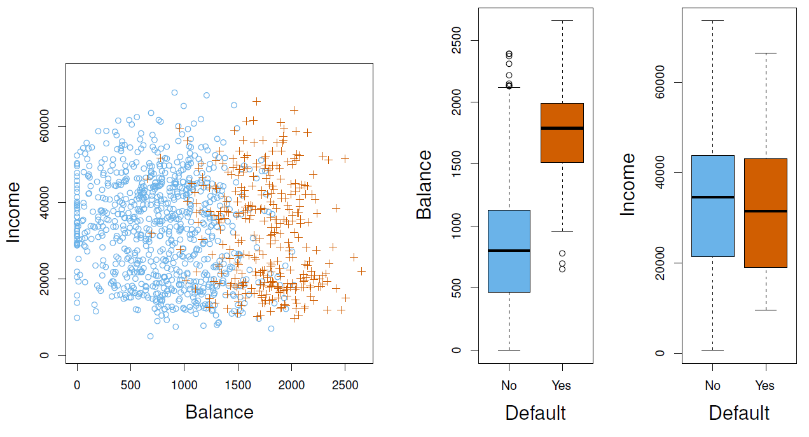

{:refdef: style="text-align:center;"}
**Figure 4.1**
{: refdef}

So those are two of the variables. And as we can with classification problems, we can code the response variable into the plot as a color. And so here, we have the blue points and the brown points. And the brown points are going to be those that defaulted. And the blue points are those that did not. Now, this is a fictitious data set. Typically, you don't expect to see that many defaulters. But we'll talk about balance in classification tasks a little bit later as well. So in this plot, it looks like balance is the important variable. Notice that there's a big separation between the blues and the browns, the defaulters and those that didn't, OK? Whereas with income, there doesn't seem to be much separation at all, OK? In the right, we actually show box plots of these two variables. And so we see, for example, for default, there's-- oh, I beg your pardon. Default is at the bottom-- no or yes, no, yes in both cases. We've got balance, and we've got income. And here, we also clearly see that there's a big difference in the distributions-- balance default or not, whereas for income, there hardly seems to be any difference. 

*Tibshirani:* I've never seen a box plot before. What is that? 

*Hastie:* Oh, you tell me, Rob. 

*Tibshirani:* OK, well, a box plot, what's indicated there-- Trevor, you can point-- the black line is the median. So that's the median for the S, the median income for people who have defaulted. And then, the top of the box are the quartiles. That's the 75th quartile, 75th percentile, quartile. And the 25th is the bottom of the box. 

*Hastie:* So really, it's a good summary of the distribution of income for those in category yes. What about these things at the end, Rob? 

*Tibshirani:* OK, I think they're called hinges. And those are the ranges, are they, or approximately the ranges of the data? 

*Hastie:* Yeah, I think a hinge is defined to be a fraction of the interquartile range. And so it gives you an idea of the spread of the data. And if data points fall outside the hinges, they're considered to be outliers. 

*Tibshirani:* By the way, it's a very useful data display. Almost one of the first things you should do when you get some data to analyze is do some scatter plots and create some box plots. 

*Hastie:* Who invented the box plot, Rob? 

*Tibshirani:* John Tukey. 

*Hastie:* John Tukey, one of the most famous statisticians-- he's no longer with us, but he's left a big legacy behind. 

*Slide 3:* 

*Hastie:* OK, well, one question we can ask is, can we use linear regression to solve classification problems? It seems like we may be able to. So supposed for the default classification task that we code the response 0 if no default, 1 if yes default, right?

$$Y=\begin{cases}0 & \quad\text{if No}\\1  & \quad\text{if Yes}\\ \end{cases}$$

It's somewhat arbitrary, but 0 and 1 seem sufficient. And then, we could simply perform a linear regression of $$Y$$ on $$X$$ with $$X$$ being the two predictors in this case, and classify as yes if $$\hat{Y} > 0.5$$, 50%, right? 0.5 is halfway between 0 and 1. It seems like a reasonable idea. It turns out that you actually can do this. For a binary outcome, *linear regression* does a pretty good job and is equivalent to *linear discriminant analysis*. And that's something we're going to discuss later. So for a two class classification problem like this, it doesn't do a bad job at all. And there's even some theoretical justification. In the population, remember, in the population, we think of regression as estimating the conditional mean of $$Y$$ given $$X$$. Well, in our coding here of 0 and 1, the conditional mean of the 0, 1 variable given $$X$$ is simply the probability that $$Y$$ is 1 given $$X$$ just by simple probability theory. So for that reason, you might think that regression is perfect for this task. What we're going to see, however, is that linear regression might actually produce probabilities that could be less than 0, or even bigger than 1. And for this reason, we're going to introduce you to *logistic regression*, which is more appropriate. 

*Slide 4:* 

*Hastie:* And here's a little picture that illustrates it. 

{:refdef: style="text-align:center;"}
**Figure 4.2**-- *Logistic regression ensures our estimates fall between 0 and 1*
{: refdef}

Here, we've got out balance variable. Now, we've plotted against balance. We've plotted the 0's at the bottom as little dashes here, the browns. And the little brown spikes are all clumped together at the bottom. And the 1's are plotted at the top here. And we see the separation. The brown 0's are towards the left of balance. And the 1's are towards the right. And the blue line is a linear regression line. And lo and behold, it goes below 0. So that's not a very good estimate of a probability. It also seems not to go high enough on the right-hand side where it seems clear that there's a preponderance of yeses on the right-hand side. In the right-hand plot, we've got the foot of logistic regression. And it seems to do a pretty good job in this case. It never gets outside of 0 and 1, and it seems to go up high where it's meant to go up high. 

*Slide 5:* 

*Hastie:* So it seems things aren't looking terrific for linear regression in terms of estimating probabilities. So now, what happens if we have a three category variable? So here's a variable that measures the patient's condition at an emergency room and takes on three levels.

$$Y=\begin{cases}1 & \quad\text{if stroke;}\\2 & \quad\text{if drug overdose;}\\3  & \quad\text{if epileptic seizure.}\\ \end{cases}$$

So it's 1 if it's a stroke, 2 if it's a drug overdose, and 3 if it's an epileptic seizure. So if we code those as, say, 1, 2, and 3, which would be an arbitrary but natural choice, this coding might suggest an ordering when in fact there's not necessarily an ordering here at all. And it might in fact imply that the difference between stroke and drug overdose, which is one unit, is the same as the difference between drug overdose and epileptic seizure. So when you have more than two categories, assigning numbers to the categories just arbitrarily seems a little dangerous, especially if you're going to use it in linear regression. And it turns out linear regression is not appropriate here. And for problems like this, we're going to prefer multiclass logistic regression or discriminant analysis. And both of those we will discuss.

## Logistic Regression and Maximum Likelihood

<iframe width="560" height="315" src="https://www.youtube.com/embed/31Q5FGRnxt4?list=PL5-da3qGB5IC4vaDba5ClatUmFppXLAhE" style="border:none" allowfullscreen></iframe>

*Slide 6:* 

*Hastie:* OK, logistic regression. So now we're going to get a little bit more mathy. Let's, for shorthand, write $$p(X)$$ for the probability that $$Y$$ is 1 given $$X$$, $$p(X)=\text{Pr}(Y=1|X)$$. And we're going to consider our simple model for predicting default, yes or no, using balance-- one of the variables. So single variable. So here's the form of logistic regression.

$$p(X)=\frac{e^{\beta_0+\beta_1X}}{1+e^{\beta_0+\beta_1X}}$$

So that $$e$$ is the scientific constant, the exponential value, and we raise $$e$$ to the power of a linear model. We've got a $$\beta_0$$, which is the intercept, and $$\beta_1$$ is the coefficient of $$X$$. And you see that appears in the numerator and in the denominator, but there's 1 plus in the denominator. So it's a somewhat complicated expression, but you can see straight away that the values have to lie between 0 and 1. Because in the numerator, $$e$$ to anything is positive. And the denominator is bigger than the numerator, so it's always got to be bigger than 0. And you can show that's it's got to be less than 1. When $$\beta_0 + \beta_{1}X$$ gets very large, this approaches 1. So this is a special construct, a transformation of a linear model to guarantee that what we get out is a probability. So that's called the *logistic regression model*. And actually, the name logistic comes from the transformation of this model. So this is a monotone transformation. 

$$log\left(\frac{p(X)}{1-p(X)}\right)=\beta_0+\beta_1X$$

We take log of $$p(X)$$ over 1 minus $$p(X)$$ and out pops our linear model. And that transformation is called the *log odds* or the *logit* transformation of the probability. And this is the model that we're going to talk about right now. To summarize, we got a linear model still. But it's modeling the probabilities on a non-linear scale. 

*Slide 7:* 

*Hastie:* And so back to our picture again, Figure 4.2. The picture on the right was produced by a logistic regression model and that's why the probabilities lie between 0 and 1. 

*Slide 8:* 

*Hastie:* So we've written down the model, how do we estimate the model from data? Well, the popular way is to use maximum likelihood. Maximum likelihood was introduced by who, Rob? 

*Tibshirani:* Me, actually. Just last week.

*Hastie:* Oh, you? Did you reinvent it? 

*Tibshirani:* I didn't realize-- actually, yeah. Because the correct answer is Fisher back in the 1920s, Ronald Fisher. Fisher. 

*Hastie:* Ronald Fisher, a very famous statistician, invented a lot of the tools that we use in modern applied statistics, and maximum likelihood is one of them. 

$$\ell(\beta_0,\beta)=\prod_{i:y_i=1}p(x_i)\prod_{i:y_i=0}(1-p(x_i))$$

Well, the way maximum likelihood works is you've got a data series of observed 0's and 1's and you've got a model for the probabilities. And that model involves parameters. In this case, $$\beta_0$$ and $$\beta$$. So for any values of the parameters, we can write down the probability of the observed data. And since each observation is meant to be independent of each other one, the probability of observed data is the probability of the observed string of 0's and 1's. So wherever we observed a 1, we write down the probability of a 1, which is $$p(x)$$. So if $$x_i$$, if observation $$i$$ was a 1, the probability is $$p(x_i)$$, and we write that down. And since they're all independent, we just multiply these probabilities. And these are the probabilities of a 0, which is 1 minus the probability of a 1. So this is the joint probability of the observed sequence of 0's and 1's. And of course, it involves the parameters. And so the idea of maximum likelihood is pick the parameters to make that probability as large as possible. Because after all, you did observe the sequence of 0's and 1's. And so that's the idea. Simple to say, not always simple to execute. But likely, we have programs that can do this. And for example, in R, we've got the `glm` function, which in a snap of a finger will fit this model for you and estimate the parameters. And in this case, this is what it produced.

{:refdef: style="text-align:center;"}
**Figure 4.3**
{: refdef}

The coefficient estimates were minus 10 for the intercept and 0.0055 for the slope for balance. That's beta and beta 0. So there are the coefficient estimates. It also gives you standard errors for each of the coefficient estimates. It computes a Z-statistic and it also gives you P-values. 

*Tibshirani:* I think I just realized something. So you had a picture a couple slides ago of a curve? And is that how you found-- I was wondering how you found the parameters for that curve. Is that how you found-

*Hastie:* That's exactly right, Rob. So this curve over here (Figure 4.2) is the curve corresponding to those estimates that we just produced in the table. And you might be surprised because the slope is very small here. Yet, it seemed to produce such a big change in the probabilities. But let's look a bit closer. Look at the units of balance. They're in dollars. So we got $2,000, $2,500. And so the values of the coefficients, which are going to multiply that balance variable, they sort of take into account the units that are used. So this is 0.005 per dollar, but it would be 5 per thousand dollars. So slopes, you have to take the units into account. And so the Z-statistic, which is a kind of standardized slope, does that. And then if we look at the P-value, we see that the chance that actually this balance slope is 0 is very small. Less than 0.001. So both intercept and slope strongly significant in this case. How do I interpret that P-value for the intercept? Do I care about that? We usually don't care so much about the P-value for the intercept. The intercept's largely to do with the preponderance of 0's and 1's in the data set. And so that's of less importance. That's just inherent in the data set. It's the slope that's really important. 

*Slide 9:* 

*Hastie:* What do we do with this model? We can predict probabilities. And so let's suppose we take a person with a balance of $1,000. Well, we can estimate their probability. So we just plug in the $1,000 into this formula over here.

$$\hat{p}(X)=\frac{e^{\hat{\beta}_0+\hat{\beta}_1X}}{1+e^{\hat{\beta}_0+\hat{\beta}_1X}}=\frac{e^{-10.6513+0.0055\times1000}}{1+e^{-10.6513+0.0055\times1000}}=0.006$$

And notice I've put hats on $$\beta_0$$ and $$\beta_1$$ to indicate that they're now being estimated from the data. Put a hat on the probability. And yeah, we've plugged in the numbers and we use our calculator or computer and we get 0.006. So somebody with a balance of $1,000 has a probability of 0.006 of defaulting. In other words, pretty small. What if they've got a credit card balance of $2,000? That means they owe $2,000 rather than $1,000. 

$$\frac{e^{-10.6513+0.0055\times2000}}{1+e^{-10.6513+0.0055\times2000}}=0.586$$

Well, if we go through the same procedure, now the probability has jumped up to 0.586. So it's got much higher. And you can imagine if we put in $3,000, we'd get even higher. 

*Slide 10:* 

*Hastie:* Let's do this again using some of the other variables. We haven't seen student yet, but one of our predictors is student. And it's a binary variable in this case. It's a yes or no variable. Is the credit card owner a student or not?

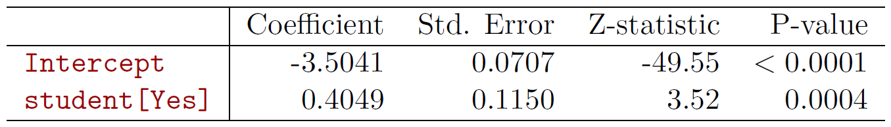

{:refdef: style="align-text:center;"}
**Figure 4.4**
{: refdef}

And so we code that as a 0, 1 variable and we fit a simple logistic regression model. And it gets a coefficient of 0.4049. And that's also significant. OK, let's do it again using the variable student as a predictor. This is a binary variable. Is the credit card holder a student or not? And we find we get a coefficient of 0.4049 in this case, which is also significant. So this is another variable in our database. And just like before, we can evaluate the probability of default is yes.

$$\widehat{\text{Pr}}(\text{default}=\text{Yes}|\text{student}=\text{Yes})=\frac{e^{-3.5041+0.4049\times1}}{1+e^{-3.5041+0.4049\times1}}=0.0431\\ \widehat{\text{Pr}}(\text{default}=\text{Yes}|\text{student}=\text{No})=\frac{e^{-3.5041+0.4049\times0}}{1+e^{-3.5041+0.4049\times0}}=0.0292$$

Given that the card holder is a student, it comes out to 0.04. And if they're not a student, it comes out to be a bit lower, 0.029, close to 0.03. And we're going to examine the interactions between student and balance and the other variables in a little while.

## Multivariate Logistic Regression and Confounding

<iframe width="560" height="315" src="https://www.youtube.com/embed/MpX8rVv_u4E?list=PL5-da3qGB5IC4vaDba5ClatUmFppXLAhE" style="border:none" allowfullscreen></iframe>

*Slide 11:* 

*Hastie:* So that's a good segue into what do we do when we have more than one variable. The two models we've considered so far just perform logistic regression with single variables. But of course, if we've got a collection of variables, we want to take them all into account. And so, in that case, we're going to build a *multi-variant logistic regression model*. So the transformation of the probability is the same as we had before, except now we've got a general linear model with an intercept and a coefficient for each of the variables. And if you invert that transformation, that, again, gives you a form for the probability that's guaranteed to be between zero and one. 

$$\text{log}\left(\frac{p(X)}{1-p(X)}\right)=\beta_0+beta_1X_1 +\dotsb+\beta_pX_p\\ p(x)=\frac{e^{\beta_0+\beta_1X_1+\dotsb+\beta_pX_p}}{1+e^{\beta_0+\beta_1X_1+\dotsb+\beta_pX_p}}$$

Well, we can fit that using `glm` and R just like we did before. And we'll throw in our variable balance, income, and the student variable. And now, we get three coefficients, three standard errors, three z statistics, and three p values. 

{:refdef: style="text-align:center;"}
**Figure 4.5**
{: refdef}

And the first thing we see here is that as they were in the single variable case, balance and student are significant. Income is not significant. So it seems like two of the variables are important. But here's something rather striking. We know this at the coefficient for student is negative while it was positive before. So before, when we just measured student on its own, it had a positive coefficient. But when we fit it in a multivariate model, the coefficient is negative. Do you think this is an error, Rob? So how could that happen? 

*Tibshirani:* I don't think so. Well, remember the last time we talked about in regression models how difficult it is to interpret coefficients in a multiple regression model, because the correlations between the variables can affect the signs. 

*Hastie:* So there's going to be-- we're going to see now the role of correlations in the variables. 

*Slide 12:* 

*Hastie:* So here's a picture. 

{:refdef: style="text-align:center"}
**Figure 4.6**
{: refdef}

There we see credit card balance. And we see the default rate the vertical axis. And the student center of, let's see-- so students status, brown is yes and blue is no. So students tend to have higher balances than non-students. So their marginal default rate is higher than for non-students. Because we just saw that. Balance plays a role. But what we see in this plot on the left is that for each level of balance, students default less than non-students. So when you just look at student on its own, it's confounded with balance. And the strong effect of balance makes it looks like students are worse defaulters. But this plot explains it all. For each level of credit card balance, if we look separately for students and non-students, students tend to have a lower default rate. And so, that we can tease out by multiple logistic regression, which takes these correlations into account. 

*Slide 13:* 

*Hastie:* Let's move on to another example with more variables. We talked about this example in the introduction. This is a South African heart disease data set. Remember, South Africans eat a lot of meat. Rob, did I ever tell you the story about the South Africans and-(More than once.) More than once. I think Rob doesn't want to hear the story again. Any way, they do eat a lot of meat. So they did a study in South Africa. It was a retrospective study. They went and found 160 cases of white males who'd had myocardial infarction, which is a fancy name for a heart attack. And amongst the many people who hadn't had a heart attack, they took a sample of 302 controls. It's called a case control sample. And for these people, they were all white males in the age range 15 to 64. And they were from this Western Cape region of South Africa. This was done in the early 1980s. So in this region, the overall prevalence was very high for heart disease, 5.1%, which is very high risk. So in the study we have measurements on seven predictors or, in this case, known as risk factors. And they show in the scatter plot matrix, which I'll show you right here. 

*Slide 14:* 

*Hastie:* Remember, the scatter plot matrix is a very nice way of plotting every variable against every other variable. 

{:refdef: style="text-align:center"}
**Figure 4.7**-- *Scatterplot matrix of SA Heart Disease data. Cases are red, controls are blue.*
{: refdef}

And now, because it's a classification problem, we can code into the plot the heart disease status. And so the red points here are those cases that had heart disease. And the blue points are the controls. And look at the top plot, for example, if you were high in tobacco usage and your systolic blood pressure is high, you tend to be a red point. To those are the people who tended to have heart attacks. So each of these plots shows a pairwise plot of two of the risk factors and codes in the heart disease status. (You forgot one risk factor.) What was that? (Talking with a funny accent.) Talking with a funny accent. (You've all got that.) Very good, Rob. I'm doing all the hard work here. And he's just sitting here thinking of jokes. (The coffee's good, too.) There's one funny variable here, family history. Well, it's a categorical variable. It turns out to be an important risk factor, apart from being South African or not. If you have a family history of heart disease, the risk is high. And you can see that it's a zero-one variable in this case. And you probably can see there's more reds in the right-hand category than the left-hand category. 

*Back to Slide 13:* 

*Hastie:* So in this case, we're not really trying to predict the probability of getting heart disease. What we're really trying to do is to understand the role of the risk factors in the risk of heart disease. And actually, this study was an intervention study aimed at educating the public on healthier diets. But that's a whole other story. (Did it work?) Um, I think it might have worked a little bit. But this crowd is really hard to get them away from their meat. Do you know that they call a barbecue in South Africa? (No.) Braaivleis. (OK.) Every South African loves their braaivleis and their bull tongue. 

*Slide 15:* 

*Hastie:* So here's the result of GLM for the heart disease data. And here I actually show you some of the code used to fit it. 

{:refdef: style="text-align:center"}
**Figure 4.8**
{: refdef}

We'll get into the code session later. But it's just interesting to see that it's pretty easy to do. Here's a call to `glm`. We tell it the response is `chd`, which is the name of the response variable. And `~` means to be modeled as. And `.` means all the other variables in the data frame which, in this case, is heart. So that's a data frame that's got all the variables in the study. And the response here is `chd`. And we tell it the family's binomial, which just tells it to fit the logistic regression model. And then we fit that model. Save it in the object called `heartfit`. And then we do a `summary()` of `heartfit`. And we get printed out this summary, which is the same summary that we've seen before. And so now we get coefficients for each of the variables. In this column, we get standard errors, c values, and p values. And here the story is a little bit mixed. We're not too interested in the intercept. Tobacco usage is significant. Low density lipoproteins, that's a cholesterol measure, that's significant. Remember, there's a good and bad cholesterol. This is the bad cholesterol. Family history, very significant. And age is significant. We know the risk of heart disease goes up with age. Now, interest in the obesity and alcohol usage are not significant here, which seems a little surprising, no? Mm hmm. But this is a case, again, of having correlated variables. 

*Back to Slide 14:* 

*Hastie:* If we look in the previous plot, Figure 4.7, you see that there is a lot of correlation between variables. So age and tobacco usage are correlated. Alcohol usage and LDL seem to be negatively correlated. LDL is the good cholesterol. So there's lots of correlations. And so those are going to play a role. 

*Slide 15:* 

*Hastie:* And so, for example, we've got LDL is significant in the model. And once LDL is in the model, perhaps alcohol usage is not needed anymore. Because it's been taken care of. These variables act as surrogates for each other.

## Case-Control Sampling and Multiclass Logistic Regression

<iframe width="560" height="315" src="https://www.youtube.com/embed/GavRXXEHGqU?list=PL5-da3qGB5IC4vaDba5ClatUmFppXLAhE" style="border:none;" allowfullscreen></iframe>

*Slide 16:* 

*Hastie:* OK. Now we slipped one thing by you. We said in South Africa the risk for heart disease is about 5% in this age category. But in our sample, we've got 160 cases and 302 controls, so in the sample we're showing a risk of 0.35. It seems like the model is going to be off. It's going to estimate probabilities too high. Well, case-control sampling is one of the favorite tools in epidemiology. Especially when you have a rare disease, you take all the cases you can find, and then you can just sample from the controls. The reason is that for the logistic regression model it turns out that you can estimate the regression parameters of interest-- these of the coefficients of the $$x$$'s in this case-- accurately. That's if the model's correct. But the constant term will be incorrect. Then you can just go ahead and correct the constant too by a simple transformation. And in fact, for those that are interested, I just give you the transformation.

$$\hat{\beta}_{0}^{*}=\hat{\beta}_0+\text{log}\frac{\pi}{1-\pi}-\text{log}\frac{\tilde{\pi}}{1-\tilde{\pi}}$$

So $$\tilde{\pi}$$ here is the apparent risk of heart disease, in this case in our population, which is 0.35. And after all, this is just the logit transformation of the prior probability or the prior apparent probability. And here's the logit transformation of the true risk, which is $$\pi$$, in this case, 0.05. And so we take the logit transformation of those two, and we correct the intercept. This is the currently estimated intercept. We correct it by adding in the log odds of the true probability, subtract the apparent one. That'd correct the intercept. 

*Tibshirani:* Maybe it's worth saying a little bit about case control sampling, why the sampling's done this way. One thing we could have done instead, or the investors could have done was to take maybe 1,000 people and to follow them for 20 years and to record their risk factors and then see who gets heart disease. We think about 5% will get heart disease. That's a valid thing to do, but the problem is it takes 20 years and maybe more than a few thousand people to get enough-- Actually, with 1,000 people, we'd get, what 50 cases, right? (Right.) So that's not very practical. We need a large sample, and we need many years to do it. (Right.) Case-control sampling says, well, let's not do things prospectively like that. Let's rather find people who we already know have heart disease or don't have heart disease and then sample them. Now in the proportion in this case, we'll take 160 cases and 302 controls and then record their risk factors. We start with cases and controls, and we get lots of cases. And we do this without waiting 20 years. We can do it right now. And then we record the risk factors. 

*Hastie:* That's a good point, Rob. Yeah. And that's very popular in epidemiology. There are other issues involved with case-control sampling, retrospective sampling. Yeah. We won't take that up now. But that's the reason it's so popular. 

*Slide 17:* 

*Hastie:* On the same issue, in many modern data sets, we'll have very imbalanced situations. For example, if you're modelling the click through rate on an ad on a web page, the probability of someone clicking is less than 1%, maybe 0.005 or even smaller, 0.001, which means if you just take a random sample of subjects who've been exposed to ads, you're going to get very, very few 1's and a huge amount of 0's. OK? And these data sets get really large. So the question is, do we need to use all of that 0, 1 data to fit the models? Well, from what we've told you, no. You can take a sample of the controls. And this picture over here just gives an indication of the trade-off. 

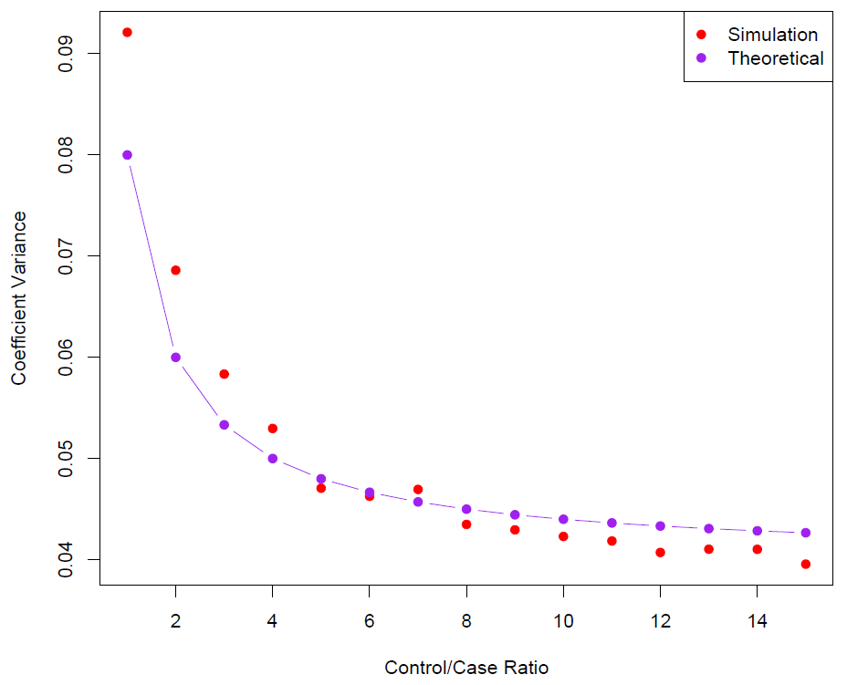

{:refdef: style="text-align:center"}
**Figure 4.9**-- *Sampling more controls than cases reduces variance, but after a ration of 5:1, the variance reduction flattens.*
{: refdef}

The main point is that ultimately the variance of your parameter estimates has to do with the number of cases that you got, which is the smaller class. And so what this plot shows is it's showing the variance of the coefficients as a function of the case-control ratio, in fact the control case ratio. What it says is when you've got about 5 or 6 to 1, the variance kind of levels off here. And so there's diminishing returns in getting even more controls. So if you've got a very sparse situation, sample about 5 or 6 controls for every case, and now you can work with a much more manageable data set. So it's very handy, especially in modern extremely large data sets. 

*Tibshirani:* Just a comment about what this case-control sampling is. The most obvious way to study the risk factors for heart disease would be to take a large group of people, maybe 1,000 or 100,000 people, follow them for maybe 20 years, record their risk factors, and see who gets heart disease and who doesn't after 20 years. (If you're still around.) If we're still around. Right. Now that actually is a good way to do things, except its very expensive and it takes a long time. You have to get a lot of people, and you have to wait for many years. Case-control sampling is a lot more attractive. Because what you do is rather than taking people and following them forward in time, you sample people who you know have heart disease. You also get a comparison sample of people who do not have heart disease, the controls. And then you record their risk factors. So it's much cheaper, and it's much quicker to do. And that's why case-control sampling is a very commonly used technique in epidemiology. 

*Slide 18:* 

*Hastie:* OK. What if we have more than two classes? Can we still do logistic regression? Well, we can. It easily generalizes to more than two classes. There's various ways of doing this. And one version-- which actually is how we do it in the `glmnet` package in R, which you'll be learning more about-- is we have this exponential form that we saw before but modified for multiple classes.

$$\text{Pr}(Y=k|X)=\frac{e^{\beta_{0k}+\beta_{1k}X_1+\dotsb+\beta_{pk}X_p}}{\sum_{\ell=1}^{K}e^{\beta_{0\ell}+\beta_{1\ell}X_1+\dotsb+\beta_{p\ell}X_p}}$$

So notice in the numerator we've got an e to the linear model. And this is for the probability that $$Y$$ is $$k$$ given $$X$$, a small $$k$$. And we've got, say, capital $$K$$ classes, where capital $$K$$ is bigger than 2. In the denominator, we've just got the sum of those exponentials for all the classes. In this case, each class gets its own linear model. And then we just weigh them against each other with this exponential function, sometimes called the softmax function. OK? The mathier students would recognize that some cancellation is possible in this ratio. And that's true. What that means is actually you only need $$K - 1$$ linear functions, as you do in a 2-class logistic regression. That's somewhat of a detail. It turns out for our `glmnet` application this is a more symmetric representation, and it's actually more useful. This multiclass logistic regression is also referred to as *multinominal regression*.

## Linear Discriminant Analysis and Bayes Theorem

<iframe width="560" height="315" src="https://www.youtube.com/embed/RfrGiG1Hm3M?list=PL5-da3qGB5IC4vaDba5ClatUmFppXLAhE" style="border:none" allowfullscreen></iframe>

*Slide 19:* 

*Hastie:* We're not going to go into more detail on multinomial regression now. What we're going to do is tell you about a different classification method, which is called *discriminant analysis*, which is also very useful. And it approaches a problem from a really quite different point of view. In discriminant analysis, the idea is to model the distribution of $$X$$ in each of the classes separately. And then use what's known as *Bayes theorem* to flip things around to get the probability of $$Y$$ given $$X$$, $$\text{Pr}(Y|X)$$. In this case, for linear discriminant analysis, we're going to use Gaussian (normal) distributions for each class. And that's going to lead to linear or quadratic discriminant analysis. So those are the two popular forms. But as you'll see, this approach is quite general. And other distributions can be used as well. But we'll focus on normal distributions. 

*Slide 20:* 

*Hastie:* So what is Bayes' theorem for classification? It sounds pretty scary, but not too bad. So, of course, Thomas Bayes was a famous mathematician. And his name now, today, represents a burgeoning subfield of statistical and probabilistic modeling. But here we're going to focus on a very simple result which is known Bayes theorem. And it says that the probability of $$Y$$ equals $$k$$ given $$X$$ equals $$x$$.

$$\text{pr}(Y=k|X=x)=\frac{\text{Pr}(X=x|Y=k)\cdot\text{Pr}(Y=k)}{\text{Pr}(X=x)}$$

So the idea is you've got two variables. In this case, we've got $$Y$$ and $$X$$. And we're looking at aspects of their joint distribution. So this is what we're after, the probability of $$Y = k$$ given $$X$$. And Bayes theorem says you can flip things around. You can write that as a probability that $$X$$ is $$x$$ given $$Y$$ equals $$k$$-- that's the first piece on the top there-- multiplied by the marginal probability or prior probability that $$Y$$ is $$k$$ and then divided by the marginal probability that $$X$$ equals $$x$$. So this is just a formula for probability theory. But it turns it's really useful and is a basis for discriminant analysis. And so we write things slightly differently in the case of discriminant analysis.

$$\text{pr}(Y=k|X=x)=\frac{\pi_kf_k(x)}{\sum_{l=1}^{K}\pi_lf_l(x)}$$

So this probability $$Y = k$$ is written as $$\pi_k$$. So if there's three classes, there's going to be three values for $$\pi$$, just the probability for each of the classes. But here we've got class little $$k$$, so that's $$\pi_k$$. Probability that $$X$$ is $$x$$ given $$Y = K$$, well, if $$X$$ is a quantitative variable, what we write for that is the density. So that's a probability density function for $$X$$ in class $$k$$. And then the marginal probability $$f(x)$$ is just this expression over here, $$f_k(x)=\text{Pr}(X=x|Y=k)$$. So this is summing over all the classes. And so that's how we use Bayes theorem to get to the probabilities of interest, which is $$Y = k$$ given $$X$$. Now, at this point it's still quite general. We can plug in any probability densities. But now what we're going to do is go ahead and plug in the Gaussian density for $$f_k(x)$$. 

*Slide 21:* 

*Hastie:* Before we do that, let me just show you a little picture to make things clear. 

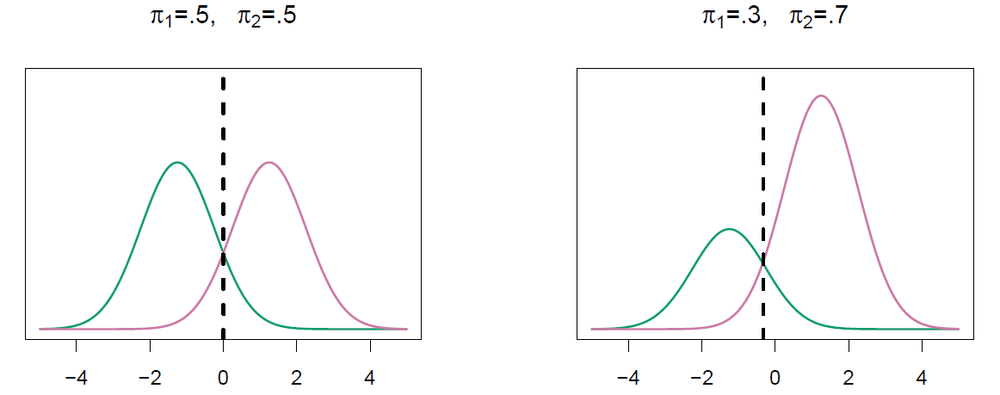

{:refdef: style="text-align:center;"}
**Figure 4.10**-- *Probability of k=1 (green) and k=2(purple)*
{: refdef}

In the left-hand plot, what have we got here? We've got a plot against $$x$$, single variable $$x$$. And in the vertical axis, what we've got is actually $$\pi_k$$ multiplied by $$f_k(x)$$. For both classes, $$k$$ equals 1 and $$k$$ equals 2. Now, in this case, remember in the previous slide, the probability was essentially proportional to $$\pi_kf_k(x)$$. And in this case, the $$pi$$'s are the same for both. So it's really to do with which density is the highest. And you can see that the decision boundary, or the vertical dash line, is at zero. And that's the point at which the green density is higher than the purple density. And so anything to the left of zero we classify as green. And anything to the right we'd classify as purple. And it sort of makes sense that that's what we do there. The right-hand plot has different priors. So here the probability of 2 is 0.7 and of 1 is 0.3. And now, again, we're plotting $$\pi_kf_k(x)$$ against $$x$$. And that big prior has bumped up the purple. And what it has done is move the decision boundary slightly to the left. And that makes sense, too. Again, that's where they intersect. That makes sense as well. Because we've got more purples here. There's more of them. So everything else being equal, we're going to make less mistakes if we classify it to purples and to greens. So that's how these priors and the densities play a role in classification. 

*Slide 22:* 

*Hastie:* So why discriminant analysis? It seems like logistic regression was a pretty good tool. Well, it is. But it turns out there's room for discriminant analysis as well. And so it's three points we make here. When the classes are well separated, it turns out that the parameter estimates for logistic regression are surprisingly unstable. In fact, if you've got a feature that separates the classes perfectly, the coefficients go off to infinity. So it really doesn't do well there. Logistic regression was developed in largely the biological and medical fields where you never found such strong predictors. Now, you can do things to make logistic regression better behave. But it turns out linear discriminant analysis doesn't suffer from this problem and is better behaved in those situations. Also, if any small, the sample size is small, and the distribution of the predictor's $$x$$ is approximately normal in each of the classes, it turns out that discriminant model is again more stable than logistic regression. And finally, if we've got more than two classes, we'll see logistic regression gives us nice low dimensions views of the data. 

*Tibshirani:* And the other point, remember, in the very first section, we showed that the Bayes rule, if you have the right population model, Bayes rule is the best you can possibly do. So if our normal assumption is right here, then this discriminant analysis in the Bayes rule is the best you can possibly do. Good point, Rob.

## Univariate Linear Discriminant Analysis

<iframe width="560" height="315" src="https://www.youtube.com/embed/QG0pVJXT6EU?list=PL5-da3qGB5IC4vaDba5ClatUmFppXLAhE" style="border:none" allowfullscreen></iframe>

*Slide 23:* 

*Hastie:* So let's look again in the simple case when we've got one variable, one $$x$$. Again, we're going to get a bit more math-y now. This is the form, the mathematical form, of the Gaussian density function for class $$k$$ when you've got a single $$x$$.

$$f_k(x)=\frac{1}{\sqrt{2\pi}\sigma_k}e^{-\frac{1}{2}\left(\frac{x-\mu_k}{\sigma_k}\right)^2}$$

So there's some constants over here. The important part that depends on $$x$$ is in this exponential form over here. And we see there is a $$\mu_k$$, which is the mean for the observations in class $$k$$, or the population meaning class $$k$$. And $$\sigma_k$$ is the variance for that variable in class $$k$$. Now, in the first instance, we can assume that the variance, $$\sigma_k$$, is actually just $$\sigma$$, the same in each of the classes. Now, that's a convenience. It turns out this is an important convenience. And it's going to determine whether the discriminant function that we get, the discriminant analysis, gives us linear functions or quadratic functions. So, if we could plug into Bayes' formula, the formula we had two slides back, we get a rather complicated expression.

$$p_k(x)=\frac{\pi_k\frac{1}{\sqrt{2\pi}\sigma}e^{-\frac{1}{2}\left(\frac{x-\mu_k}{\sigma}\right)^2}}{\sum_{l=1}^{K}\pi_l\frac{1}{\sqrt{2\pi}\sigma}e^{-\frac{1}{2}\left(\frac{x-\mu_l}{\sigma}\right)^2}}$$

So we've just plugged in a form of the density in the numerator. And there's the sum of the classes in the denominator. And it looks pretty nasty. Well, luckily there's some simplifications and cancellations. 

*Slide 24:* 

*Hastie:* Now, we get this, because to classify an observation to a class, we don't need to initially evaluate the probabilities. We just need to see which is the largest. So if we take logs-- whenever you see exponentials the first thing you want to do is take the logs. And if you discard terms that do not depend on $$k$$, that amounts to doing a lot of cancellation of terms that don't count. This is equivalent to assigning to the class with the largest *discriminant score.* And so that complicated expression boils down to a much simpler expression here.

$$\delta_k(x)=\underbrace{x\cdot\frac{\mu_k}{\sigma^2}}_{x\textit{ coefficient}}-\underbrace{\frac{\mu_k^2}{2\sigma^2}+\text{log}(\pi_k)}_{\textit{constant term}}$$

And notice it involves $$x$$, a single variable in this case. And then it involves the mean and variance for the distribution. And it involves the prior. And importantly, in this case, this is a linear function of $$x$$. So there's a single coefficient for $$x$$. There's a constant. And then there's a constant term, which consists of these two pieces over here. And so we get one of those functions for each of the classes. If there are two classes, you can simplify even further. And let's suppose now that the probability of class one is equal to the probability of class two, which is 0.05. Then you can see, in this case, that the *decision boundary* is exactly at $$x=\frac{\mu_1+\mu_2}{2}$$. So it's back to this picture (Figure 4.10). In the previous slide, in this case, the priors were equal. These are actually two Gaussian distributions. And the decision boundary here is at zero. In this case, the two means were exactly the equal amount on the opposite side of zero. So the average is at zero. So intuitively, that's the right value for the decision boundary, which is the point at which we classify to one class, the boundary at which we switch from classifying to one class versus the other. It's not that hard to show. So see if you can show that. You basically use this expression for each of the two classes and look to see when the one is bigger than the other. It's not that hard to do. 

*Back to Slide 23:* 

*Tibshirani:* I'm confused. There was a square term in the previous expression. And it's gone. 

*Hastie:* Oh, Rob, are you causing trouble here again? I was hoping to avoid that nasty bit. Rob's right. If you expand out this squared term here, there's going to be an $$x^2$$. But, you know, there's an $$x^2$$ in the numerator. And there's $$x^2$$s in each of the terms in the denominator. And there's no coefficients in front of that $$x^2$$ that's specific to a class. So that's one of the things that cancel out in this ratio. You knew that, didn't you, Rob? Rob knew that. 

*Slide 25:* 

*Hastie:* All right, this is with populations. What happens if we have data? We can't draw nice density functions like we've done over here. But we just estimate them. So here's a picture where we've actually got data.

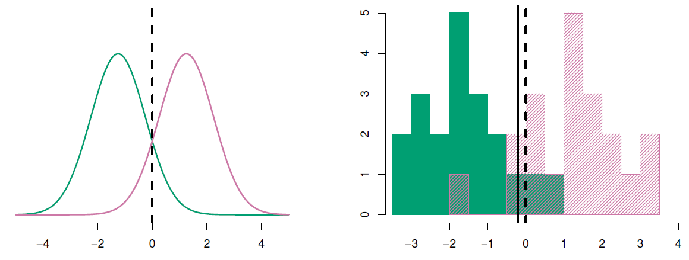

{:refdef: style="text-align:center"}
**Figure 4.11**-- $$\mu_1=-1.5, \mu_2=1.5, \pi_1=\pi_2=0.5, \textit{ and } \sigma^2=1$$
{: refdef}

So we've drawn histograms instead of density functions. Now, what we do is we actually need to estimate, for the Gaussian rule, the means, and the two populations, and the common standard deviation. Well, in this case, the true means are -1.5 and 1.5, which means the average mean is 0. And the probabilities were 0.5. But we don't know these. So we're going to estimate them from the observed data and then plug them into the rule. 

*Slide 26:* 

*Hastie:* So this is how we estimate them. The priors, we need to estimate them. So that's just the number in each class divided by their total number.

$$\hat{\pi}_k=\frac{n_k}{n}$$

That's obvious. The means in each class, we just compute the sample mean in each of the classes. 

$$\hat{\mu}_k=\frac{1}{n_k}\displaystyle\sum_{i:y_i=k}x_i$$

This is a tricky little notation here. This is $$\frac{1}{n_k}$$, that's the number in class $$k$$. And this is the sum over $$i$$ such that $$y_i$$ is equal to $$k$$. So $$y_i$$ is recording the class label. So this will just sum those $$x_i$$'s that are in class $$k$$. And clearly that's the right thing to do to get the sample mean. The $$\sigma^2$$ is a little trickier.

$$\hat{\sigma}^2=\frac{1}{n-K}\displaystyle\sum_{k=1}^{K}\displaystyle\sum_{i:y_i=k}(x_i-\hat{\mu}_k)^2$$

We're assuming that the variance is the same in each of the classes. And so this is a formula, it's called a pooled variance estimate. So we subtract from each $$x_i$$ the mean for its class. So this is what we do if we were computing the variance in class $$k$$. But we sum all those square differences. And we sum them over all the classes and then divide it by $$n - k$$. So if that doesn't make too much sense, another way of writing that is in this form over here, which says we estimate the sample variance separately in each of the classes.

$$=\displaystyle\sum_{k=1}^{K}\frac{n_k-1}{n-K}\cdot\hat{\sigma}_k^2$$

And then we average them using this formula over here. So this is just like a weight on each of those variances. And that weight is to do with how many observations were in that class relative to the total number of observations. And then the minus 1 and the minus $$k$$, that's a detail. And it's to do with how many parameters we've estimated for each of these estimates. It's one parameter. It's a mean. Rob's falling asleep. Sorry. Too much detail, Rob? (Exactly. Way too much detail.) OK. So there we have it. Those are the formulas. You plug those back in, you'll now get estimated decision boundary. And instead of being exactly zero, it's, in this case, slightly to the left of zero, but pretty close.

## Multivariate Linear Discriminant Analysis and ROC Curves

<iframe width="560" height="315" src="https://www.youtube.com/embed/X4VDZDp2vqw?list=PL5-da3qGB5IC4vaDba5ClatUmFppXLAhE" style="border:none" allowfullscreen></iframe>

*Slide 27:* 

*Hastie:* OK, so that was with a single variable, and usually when you do classification, we've got more than one variable. So now we're going to go to multi-variant Gaussians. So here's a picture of the Gaussian density when we've got two variables.

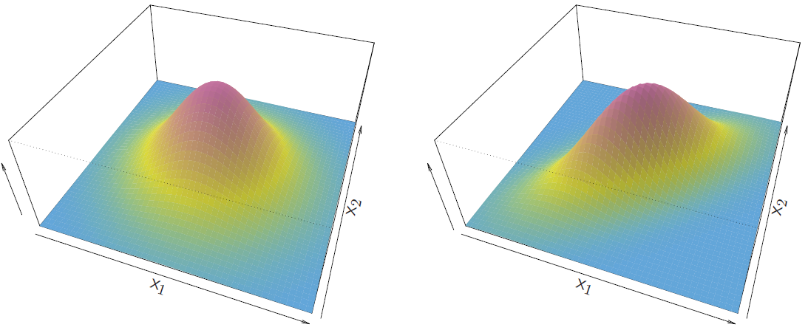

{:refdef: style="text-align:center"}
**Figure 4.12**-- *Gaussian density with 2 variables*
{: refdef:}

So it's one of these fancy-looking three dimensional plots. (It's beautiful.) Beautiful, isn't it? The height's color coded, could you make a plot like this, Rob? (I could try, and then you'd criticize it. You do criticize it.) The beautiful thing is that R made this plot with very little work from us. So there's two variables, $$x_1$$ and $$x_2$$, and you can see the Gaussian density in two dimensions looks like a bell function. And this is-- left hand case is the case when two variables are uncorrelated, so it's just really like a bell. And the right hand case is when there's correlation, so now it's like a stretched bell. See there's positive correlation between $$x_1$$ and $$x_2$$. So those are pictures of the densities. The formula for the density doesn't look nearly as pretty, and here it is over here.

$$f(x)=\frac{1}{(2\pi)^{\frac{p}{2}}|\Sigma|^{\frac{1}{2}}}e^{-\frac{1}{2}(x-\mu)^T\Sigma^-1(x-\mu)}$$

And it's somewhat complex. (We should go over this in great detail. Excruciating detail, please.) I have a feeling that's a hint not to go into it in great detail. Anyway, this is just a generalization of the formula we had for a single variable. This is called a covariance matrix, and if you stare at this formula, and you stare at the previous formula, you will see that they're somewhat similar, especially if you know a bit of vector algebra. If you go through the simplifications, if you know your linear algebra, you can go through and do the cancellation similar to what we did before, you can get the discriminant function which is given over here. 

$$\delta_k(x)=\underbrace{x^T\Sigma^{-1}\mu_k}_{x\textit{ coefficient}}-\underbrace{\frac{1}{2}\mu_k^T\Sigma^{-1}\mu_k+\text{log}\pi_k}_{\textit{constant term}}$$

And it looks complex, but important thing to note is that it's, again, linear in $$x$$. Here's $$x$$ alone multiplied by a coefficient vector, and these are all just constants. So this, again, is a linear function. If the math's beyond you, don't let it bother you. This is a linear function, and we'll make that more clear a little bit later on, as well, that this is a linear function. In fact, we make it clear right here. It might look complex, but this can just be written in this form over here.

$$\delta_k(x)=c_{k0}+c_{k1}x_1+c_{k2}x_2+\dotsb+c_{kp}x_{p}$$

It's a linear function. So the $$c_{k0}$$-- so this is a function for class $$k$$-- $$c_{k0}$$ is built up of all these pieces over here. And then each of the coefficients of $$x_1$$, $$x_2$$, up to $$x_p$$ come from this part over here. Remember, $$x$$ is a vector in this case. And so you can expand this expression and get this term over here. And I think I forgot to mention it before. What the idea of the discriminant function is, you compute one of these for each of the classes, and then you classify it to the class for which it's largest. You pick the discriminant function that's largest. 

*Slide 28:* 

*Hastie:* Well, we can draw other nice pictures for discriminant analysis similar to the one-dimensional picture we drew before. So here, we've got two variables and three classes. 

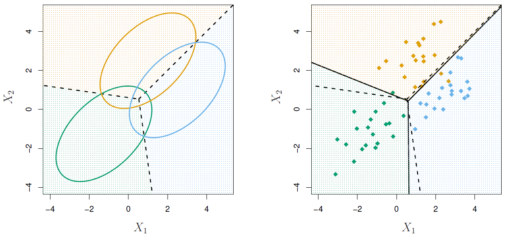

{:refdef: style="text-align:center"}
**Figure 4.13**-- $$p=2$$ *and* $$K=3$$ *classes, where* $$\pi_1=\pi_2=\pi_3=\frac{1}{3}$$
{: refdef}

And instead of showing those density plots, what we do is show contours, in this case, of the density. So here's the blue class. And we show the contour of a particular level of probability for the blue class, for the green class, and for the orange class. And lo and behold-- and the decision boundary is the dotted line here. And it's really very pretty. It shows you where you classify to blue versus orange, and it's exactly where it cuts-- the line goes exactly through the points where the contours are cut, both for the orange to blue, for the blue to green, and for the green to orange. And you can see they all meet in the middle over here, right in the center over here. And so if you knew the true densities, it would tell you exactly-- and in this case, the Gaussian-- you get the exact decision boundaries. Again, these are called the *Bayes decision boundaries.* These are the true decision boundaries. Now, of course, we don't. But we go ahead and estimate the parameters for the Gaussians in each of the class using formulas similar to what we had before, but appropriate for this multivariate case. So in this case, we've got to get the mean for $$x_1$$ and $$x_2$$ for the blue class-- it's about there-- for the green class, with data points about there, for the orange class, say there. And then we plug them into the formula. Instead of getting the dotted lines, we get the solid lines. And in this case, it's remarkably close. Now, these data were actually generated from a Gaussian distribution, so it's not too surprising that we got close. But with relatively few points, we get decision boundaries that look pretty close to the real ones. 

*Slide 29:* 

*Hastie:* You cannot learn about discriminant analysis without seeing Fisher's iris data. 

{:refdef: style="text-align:center"}
**Figure 4.14**-- *Blue is Setosa, Orange is Versicolor, Green is Virginica*
{: refdef}

It's maybe one of the most famous datasets around. It studies three species of iris. These species are setosa, versicolor, and virginica, and they're color-coded in a scatter plot matrix again, with three colors in this case. And the four variables that are going to be used to try and automatically classify these three classes, sepal length, sepal width, petal length, and petal width. So these are aspects of the flower. And there's 50 samples in each class. Now, if you look at these scatter plots, you can see that there's some really good separation. For example, in this plot of petal length and petal width, the blue class really stands out as being different from the other two classes. They seem to be more confused in some of the plots, and in some, there's slightly more separation. But the idea here is to use all of these variables together to come up with a discriminant rule and classify. And so this was a motivating example that Fisher used in his first description of linear discriminant analysis. And in fact, it's often known as Fisher's linear discriminant analysis. Importantly, what comes with discriminant analysis is a nice plot. In this previous picture, there's four variables, so we showed a scatter plot matrix of each variable against the rest. 

*Slide 30:* 

*Hastie:* But it turns out that there's a single plot that captures the classification information for all of them. And here it is.

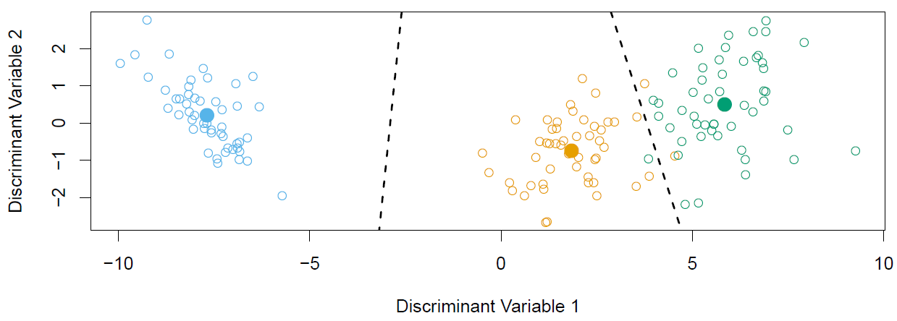

{:refdef: style="text-align:center"}
**Figure 4.15**
{: refdef}

And I've got discriminant variable one and discriminant variable two as the horizontal and vertical axes. And it turns out these are linear combinations of the original variables. But they're special linear combinations. And when you plot the variables against these two, you see really good separation. And these arise from actually performing the linear discriminant analysis. Because you've got three classes, what Fisher's linear discriminant analysis is really doing-- or Gaussian LDA is really doing-- is it's measuring which centroid is the closest. But it's measured in a distance that takes into account the covariance of the variables. But ignoring the covariance for a moment, the three centroids actually line in a plane, a subspace of the four-dimensional space. And it's really distance. So if you have three points, they span a two dimensional subspace. And that's essentially what we plot in here, is the two-dimensional subspace. So seeing which class is closest really amounts to distance in that subspace. And that leads to these nicely dimensional plots. And so we have three classes here. We can make a two-dimensional plot, and it captures exactly what's important in terms of the classification. And when we have more than three classes, we can still find two-dimensional plots. But in that case, it doesn't capture all the information, the two-dimensional plot. But you can find the base two-dimensional plot for visualizing the discriminant rule. And that's another important reason why linear discriminant analysis is very popular for multi-class classification. 

*Tibshirani:* Keep in mind, this case, we only have four features, four variables, right? Discriminant analysis was a very attractive method. But imagine we had 4,000 features. Then, what we just did was the covariance matrix. We had to plug in an estimate of the covariance matrix. If you have 4,000 features, that covariance matrix would be of size 4,000 by 4,000. 

*Hastie:* Yes, that's a great point, Rob. And we just can't carry out discriminant analysis without other modifications if the number of variables are very large. And we can talk about some ways of doing that. And later on in the class, we'll talk about it in more ways. 

*Slide 31:* 

*Hastie:* We've talked about discriminant functions, which is telling you how you classify. But it turns out that you can turn these into probabilities very easily. And here's the expression over here.

$$\widehat{\text{Pr}}(Y=k|X=x)=\frac{e^{\hat{\delta}_k(x)}}{\sum_{l=1}^{K}e^{\hat{\delta}_l(x)}}$$

And so remember we got the $$\delta_k$$s by doing a lot of simplification. Well, it turns out that those simplifications and cancellations hold exactly for computing the probabilities. So in other words, those expressions we had earlier for computing the probabilities-- let's go back to it-- for example, here's an expression here that's used for computing the probabilities (Slide 27). Where is it? This is the expression for the single variable case, with all these constants in there. All the cancellation happens, and we get to this nice simple expression over here, which just involves the discriminant functions. So see, you can see if you can actually show that as well. It's not that hard to show. And so not only does discriminant analysis give us a classified. It also gives us the probabilities. When $$K$$ is 2, we'll classify to class two if these probabilities are bigger than 0.5, else to class one, just like in logistic regression. 

*Slide 32:* 

*Hastie:* Here's the credit data. And we produce, in this case, misclassification table. So this table, along the horizontal, it's got the true status.

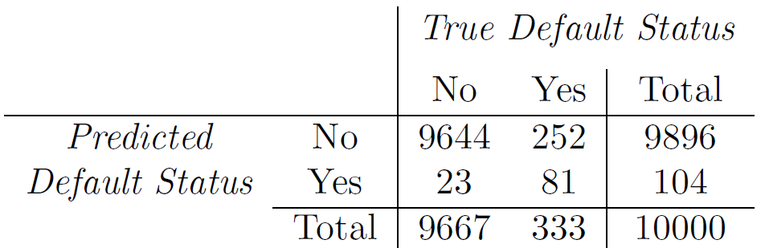

{:refdef: style="text-align: center;"}
**Figure 4.16**
{: refdef}

So it's a true default status, which is no or yes. You can see we have 10,000 samples in the credit data. And in the vertical, we've got the predicted status, no or yes. So of course, we'd like everything to lie on the diagonal. It turns out we got a lot of the no's right and not that many of the yes's right. So on the diagonal is what you got correct. On the off diagonals is what you got incorrect. Nevertheless, overall we make 2.75% misclassification errors here. So this is called a confusion matrix. It tells how well you did. Now, there's some caveats. This is training error. We fit the rule to these data, and now we see how well it performs on these data. So we may be over-fitting. Well, we've got 10,000 training samples here, and we've only fit a handful of parameters. So it's very unlikely in this case that we're over-fitting. For small training sets, that would be an issue, and you would need to have a separate test set. Another thing to note is that although 2.75% seems like a really good misclassification, right? If we just use a very naive classification rule and say always classify to the largest class-- in other words, classify according to the prior-- we'd only make 3.33% errors because there's a predominance of no's in this dataset. The total number of no's is 333 out of 10,000. So this we call the null rate. And so you always bear in mind the null rate when getting excited about a misclassification error rate. The other thing to look at, though, is you can break the errors into different kinds. So of the true no's, we make 0.2% errors. So we hardly ever misclassify a no. But of the yes's, we make a whopping 75.7% errors. So the errors are very lopsided in this case. And that's maybe not such a good idea. 

*Slide 33:* 

*Hastie:* So we break down these errors into finer categories. So we call the *false positive rate* the fraction of negative examples that are classified as positive. So they're false positives. In that case, that was the 0.2% in this case. And the *false negative rate*, that's a fraction of positive examples that are classified as negative, 75.7% in this case. Now we produce the classification table by intuitively correct classifying default as yes if the probability of default was bigger than 0.5. But it gave us this very lopsided false positive and false negative rate. In some cases, especially for these kinds of screen-in examples, you may want to change the false positive and false negative rates and skew them to one side or the other. And you can do this by changing this *threshold.* Instead of classifying-- in this case, to default if it's bigger than 0.5, you can change the threshold and maybe make the threshold in this case smaller so that you can catch more of the high risk cases for default. 

*Slide 34:* 

*Hastie:* And so here we've done it as a function of the threshold. And we've just looked at negative thresholds, or decreasing thresholds.

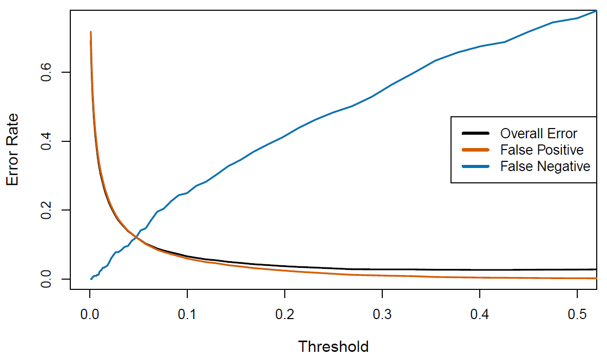

{:refdef: style="text-align:center"}
**Figure 4.17**-- *Varying the threshold*
{: refdef}

And so in this plot, we've got in black the overall error rate. In orange, we've got the false positive rate, and in blue, we've got the false negative rate. And so as we decrease the threshold, the false positive rate increases because now we're going to classify more and more negatives as positive. But it increases very slowly, you'll see, for a long part of the threshold going down, the decrease in threshold, the false positive rate doesn't increase very fast. Of course, the false negative rate increases as we do that. And so even at 0.1, the false positive rate hasn't increased a huge amount. And the false negative hasn't increased a huge amount. But we've changed the balance of classification. 

*Slide 35:* 

*Hastie:* And so you can change the threshold. Well, you can capture that change in threshold in what's known as an ROC curve.

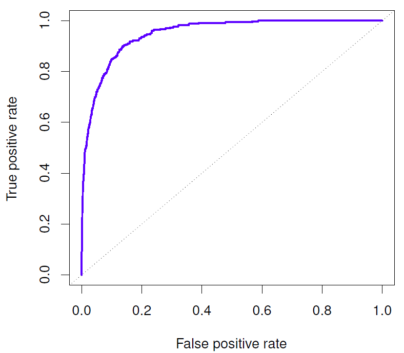

{:refdef: style="text-algin:center"}
**Figure 4.18**
{: refdef}

So what this shows is the two error rates, in this case, false positive rate and true positive rate, as we change the threshold. And we'd like the false positive rate to be low and the true positive rate to be high. And so this ROC curve traces out as we change the threshold. And the 45 degree line is the kind of no information line. And what you'd like is you'd like this curve to be right up as far as possible into the top left hand corner, so if you had a true positive rate of one and a false positive rate of zero. If you flipped a coin, you'd be on the straight line. You'd be on the straight line. And so this is a single curve that sort of captures the behavior of the classification rule for all possible thresholds. And you can compare different classifiers by comparing the ROC curves. And to summarize it even more, we sometimes use the *area under the curve*, or *AUC,* which captures the extent to which you're up in the northwest corner. And higher AUC is good.

## Quadratic Discriminant Analysis and Naive Bayes

<iframe width="560" height="315" src="https://www.youtube.com/embed/6FiNGTYAOAA?list=PL5-da3qGB5IC4vaDba5ClatUmFppXLAhE" style="border:none" allowfullscreen></iframe>

*Slide 36:* 

*Hastie:* OK. That's discriminant analysis when we use Gaussian densities. But now the form that we wrote down is quite general. 

$$\text{pr}(Y=k|X=x)=\frac{\pi_kf_k(x)}{\sum_{l=1}^{K}\pi_lf_l(x)}$$

And you can use other estimates of densities and plug them into this rule and get classification rules. Up till now we've been using Gaussian densities with the same variance for the $$X$$'s in each class. What if the variances are different in each class? Well, you can plug those forms in. And then remember we had that magic cancellation because of the equal variances? Well, when the variances are different in each class, the quadratic terms don't cancel. And so now your discriminant functions are going to be quadratic functions of $$X$$. OK? That's one form. It's called quadratic discriminant analysis. Another thing you can do-- and especially this is useful when you have a large number of features, like the 4,000 or so that Rob mentioned, when you really wouldn't want to estimate these large covariance matrices-- you can assume that in each class the density factors into a product of densities. That amounts to saying that the variables are conditionally independent in each of the classes. And if you do that and plug it into this formula over here, you get something known as the naive Bayes classifier. 

$$f_k(x)=\prod_{j=1}^{p}f_{jk}(x_j)$$

For linear discriminant analysis, this means that the covariances, $$\sigma_k$$ are diagonal. And instead of estimating the covariance matrix, if you've got $$p$$ variables it's got $$p^2$$ parameters. But if you assume that it's diagonal, then you need to estimate $$p$$ parameters again. 

*Tibshirani:* And although the assumption seems very crude-- the assumption is wrong-- this naive Bayes classifier is actually very useful in high-dimensional problems. And it's one actually we'll return to later in different forms. 

*Hastie:* Right. In fact, we'd probably think it's always wrong, wouldn't we, Rob? (Right.) Yeah. And so what happens is we end up with quiet flattened and maybe biased estimates for the probabilities. But in terms of classification, you just need to know which probability's the largest to classify it. So you can tolerate quite a lot of bias and still get good classification performance. And what you get in return is much reduced variance from having to estimate far fewer parameters. Then there's much more other general forms where we don't assume Gaussian at all. We can estimate the densities using our favorite density estimation technique and then go and plug them back into this formula, and that'll give you a classification rule. That's a very general approach that can be used. And in fact, many of the classifiers that we know we can understand from this point of view. 

*Slide 37:* 

*Hastie:* So here we have it. Quadratic discriminant analysis uses a different covariance matrix for each class. 

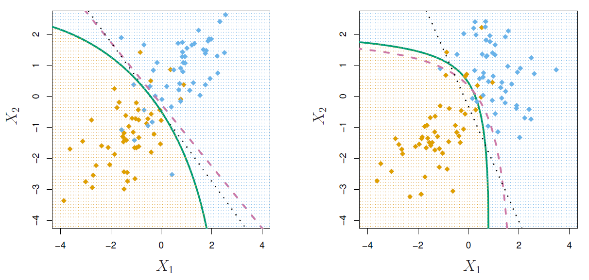

{:refdef: style="text-align:center"}
**Figure 4.19**-- $$\delta_k(x)=-\frac{1}{2}(x-\mu_k)^T\sigma_k^{-1}(x-\mu_k)+\text{log}\pi_k$$
{: refdef}

And so there's no cancellation of the $$\sigma$$s. The discriminant functions now have this distance term that involves $$\sigma_k$$, which is for the $$k^{\text{th}}$$ class. There's a term to do with the prior probability, and there's a determinant term that comes from the covariance matrix. And you can see it gives you a curved discriminant boundary. And the quadratic terms matter here, because they're different. In the left plot here, we see a case when the true boundary really should be linear. That's the dotted curve. And in this case, of course linear discriminant analysis does a good job. Quadratic discriminant analysis curves somewhat and gives a slight bent boundary. But it won't really affect most classification performance much. In the right hand plot, on the other hand, the true data came from a situation where the covariance were different. The Bayes decision boundary is curved, and the quadratic discriminant analysis pretty much got it, whereas linear discriminant analysis gives you quite a different boundary in that case. 

*Slide 38:* 

*Hastie:* Quadratic discriminant analysis is attractive if the number of variables is small. When the number of variables or features is large, you've got to estimate these big covariance matrices, and things can break down. And even for LDA it can break down. Here's where naive Bayes becomes attractive. It makes a much stronger assumption. It assumes that the covariance in each of the classes, although different, are diagonal.

$$\delta_k(x)\propto\text{log}\left[\pi_k\displaystyle\prod_{j=1}{p}f_{kj}(x_j)\right]=-\frac{1}{2}\displaystyle\sum_{j=1}^{p}\frac{(x_j-\mu_{kj})^2}{\sigma_{kj}^2}+\text{log}\pi_k$$

And so that's much fewer parameters. Now when you look at the discriminant functions, because diagonal and Gaussian means that the densities are independent and so we have this product here, when we take logs we get a relatively simple expression, which is in each class there's a contribution of the feature from the mean for the class scaled by the variance, there's the determinant term, and there's the prior term. This is the discriminant function for the $$k^{\text{th}}$$ class for naive Bayes. And you compute one of these for each of the classes, then you classify it. You can use *mixed* features for naive Bayes. And in that case, what we mean by that is some qualitative and some quantitative futures. For the quantitative ones, we'd use the Gaussian. And for the qualitative ones, we replace the Gaussian densities by just histograms or probability mass functions, in this case, over the discrete categories. Naive Bayes is very handy from this point of view. And even though it has strong assumptions, it often produces good classification results. Because also, once again in classification, we're mainly concerned about which class has the highest probability and not whether we got the probabilities exactly right. 

*Slide 39:* 

*Hastie:* OK. We've seen two forms of classification, logistic regression and linear discriminant analysis. And we saw its generalizations. How do they differ? It seems there may be similarities between the two. Now it turns out you can show for linear discriminant analysis that if you take it's-- We had expression for the probabilities for each of the classes. So if you have two classes, we can show that if you take the log odds, just like we did in logistic regression, which is the log of the probability for class one versus the probability for class two, it's a linear function of $$X$$ for two classes. It's got exactly the same form as logistic regression. They both give you linear logistic models. So the difference is in how the parameters are estimated. Logistic regression uses the conditional likelihood based on probability of $$Y$$ given $$X$$. Remember, it was using the probabilities of a 1 or a 0 given $$X$$ in each of the classes. And in machine learning, this is known as discriminative learning using the conditional distribution of $$Y$$ given $$X$$. Discriminant analysis, it turns out it's estimating these parameters over here using the full likelihood. Because it's using the distribution of $$X$$'s and $$Y$$'s, whereas logistic regression was only using the distribution of $$Y$$'s. And in that case, it's known as generative learning. Remember, we modelled the means and variances of $$X$$ in each of the classes, and we modeled the prior probability. So that can be seen as modelling the joint distribution of $$X$$ and $$Y$$. That's one way of seeing what's different between the two. But despite these differences, in practice the results are often very similar. And you can use one method with the other, and you're going to get very similar results. As a footnote, logistic regression can also fit quadratic boundaries. We used quadratic discriminant analysis to get quadratic boundaries. But we can fit quadratic boundaries by explicitly including quadratic terms in the model. Just like we did in linear regression, in logistic regression we can put in $$X^2$$'s and $$X_i$$'s times $$X_j$$'s and terms like that and just explicitly get a quadratic boundary. 

*Slide 40:* 

*Hastie:* OK. That's the end of this section. That's an introduction to classification using these two very popular methods. And later on in the class, you're going to see that we're going to come back to some of these methods and look at more general versions of them and build richer classification rules. And importantly, we'll discuss another very popular method called the support vector machine, which is another approach to classification. 

*Tibshirani:* And by way of coming attractions, the next section is going to be on cross-validation and bootstrap. In that section, we'll get to meet Brad Efron, who's our colleague and also was my PhD supervisor many years ago. And he was the person who invented the bootstraps. So he'll tell us a bit about the bootstrap and how he proposed it in his 1980 paper. Oh, fantastic.
