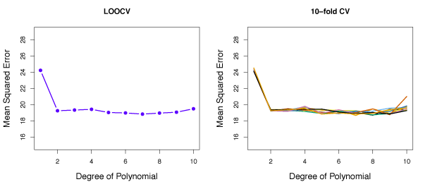
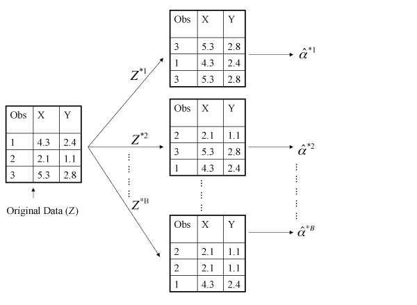

$$\newcommand{\Var}{\mathrm{Var}}
\newcommand{\MSE}{\mathrm{MSE}}
\newcommand{\Avg}{\mathrm{Avg}}
\newcommand{\Bias}{\mathrm{Bias}}$$

*Resampling methods* involve repeatedly drawing samples from training data and refitting a model.
This technique is useful in obtaining additional information about the fitted model.

## Cross-Validation

Cross-validation methods estimate the test error rate by *holding out* a subset of the training observations from the fitting process and modeling those held out observations.

### The Validation Set Approach
The *validation set approach* randomly splits the original samples into two sets: a *training set* and a *validation* or *hold-out set*.
The training set is then fit to the model and used to predict the responses for the observations in the validation set.
This allows the error rate from the validation set to be used as an estimate for the test error rate.

Figure 5.1 illustrates the validation set approach. 
A set of $$n$$ observations are randomly split into a training set (blue) and a validation set (beige).
The model being used would then be fit to the training set and tested with the validation set.

{:refdef: style="max-width:750px; margin:auto; text-align: center;"}
__Figure 5.1__ -- *Schematic of the validation set approach. A set of $$n$$ observations are randomly split into a training (blue) and validation set (beige).*
{: refdef}

While the validation set approach is simple to implement it has some shortcomings.

- The test error rate estimate may be highly variable depending on the data points included in the training and validation sets. 
- Statistical methods tend to perform worse when trained on fewer observations. The validation set error rate may overestimate the test error rate when fit on the entire data set.

### Leave-One-Out Cross-Validation
As in the validation set approach, *Leave-one-out cross validation* (LOOCV) splits the set of observations into training and validation sets, except the validation set contains only one observation.
The training set is $$\{ (x_2, y_2), \ldots, (x_n, y_n)\}$$ and the validation set is only the observation $$(x_1, y_1)$$.
The model is now fit using the $$n-1$$ training data points and a prediction $$\hat{y}_1$$ is made for the validation point $$x_1$$.
$$\mathrm{MSE}_1 = (y_1 - \hat{y}_1)^2$$ gives an approximately unbiased estimate of the test error.
However, $$\mathrm{MSE}_1$$ is highly variable because it is based on only one observation.

To offset the high variability, LOOCV repeats the above process where the validation set is $$(x_2, y_2)$$ and the training set is $$\{(x_1, y_1), (x_3, y_3), \ldots, (x_n, y_n)\}$$ which gives $$\mathrm{MSE}_2 = (y_2 - \hat{y}_2)^2$$.
Repeating this approach $$n$$ times gives squared errors $$\mathrm{MSE}_1, \ldots, \mathrm{MSE}_n$$.

The test MSE is then estimated by averaging the $$n$$ test error estimates
$$
\mathrm{CV}_{(n)} = \frac{1}{n} \sum_{i=1}^n \mathrm{MSE}_i \>.
\tag{5.1}
$$

Figure 5.3 illustrates the LOOCV where $$n$$ observations are continuously partitioned into a blue training set and a beige validation set containing only one observation point. 

{:refdef: style="max-width:750px; margin:auto; text-align: center;"}
__Figure 5.3__ -- *Schematic of LOOCV. A set of $$n$$ observations is repeatedly split into a training set (blue) with $$n-1$$ points and a validation set (beige) with only one point.*
{: refdef}

One advantage of LOOCV over the validation set approach is a lower bias as a result of repeatedly fitting sets containing $$n-1$$ observations.
LOOCV tends not to overestimate test error rates and always gives the same estimate because the partitions are not chosen randomly.

In Figure 5.4, cross-validation is performed on the `Auto` data set to estimate the test error when predicting mpg with polynomial functions of horsepower. 
The left panel shows the LOOCV error. The right panel shows the nine distinct CV error curves from performing 10-fold CV nine times. We will discuss $$k$$-fold CV next.

{:refdef: style="max-width:750px; margin:auto; text-align: center;"}
__Figure 5.4__ -- *Cross validation used on the* `Auto` *data set for estimating the test error.* Left: *LOOCV error curve.* Right: *10-fold CV was run nine separate times, each with a different random split of the data into 10 parts.*
{: refdef}

One disadvantage of using LOOCV is it can be computationally expensive, especially for large $$n$$ as the model must be refit $$n$$ times.
In the case that least squares linear or polynomial regression is used, LOOCV is computationally equivalent to fitting a single model because $$\mathrm{CV}_{(n)}$$ can be written as
$$
\mathrm{CV}_{(n)} = \frac{1}{n} \sum_{i=1}^n \left ( \frac{y_i - \hat{y}_i}{1 - h)i} \right )^2 \, ,
\tag{5.2}
$$
where $$\hat{y}_i$$ is $$i$$th estimate of $$y_i$$ from the least squares fit. 
$$h_i$$ is the leverage as defined in equation (3.37) from Lesson 3.
Unfortunately, this formula only holds for linear or polynomial least squares regression. 

### $$k$$-Fold Cross-Validation
$$k$$-fold cross-validation is similar to LOOCV except the set of observations is randomly divided into $$k$$ groups or *folds* of roughly the same size.
The first fold is called the validation set and will be used to estimate the test error rate.
The other $$k-1$$ folds are then used to fit the model.
Next, $$\mathrm{MSE}_1$$ is computed using observations in the first fold and the fit from the other folds.
This method is performed $$k$$ times using each fold once as a validation set to obtain $$\mathrm{MSE}_1, \mathrm{MSE}_2, \ldots, \mathrm{MSE}_k$$. 
The $$k$$-fold CV test MSE estimate is:
$$
\mathrm{CV}_{(k)} = \frac{1}{k} \sum_{i=1}^k \mathrm{MSE}_i \>.
\tag{5.3}
$$

Figure 5.5 outlines the $$k$$-fold CV approach with $$k=5$$ folds.

{:refdef: style="max-width:750px; margin:auto; text-align: center;"}
__Figure 5.5__ -- *Schematic of 5-fold CV. A set of $$n$$ observations is randomly split into five non-overlapping groups. Each of these fifths acts as a validation set (beige) and the remainder as a training set (blue).*
{: refdef}

$$k$$-fold CV with lower values of $$k$$ are preferable as they are less computationally expensive.
Note that LOOCV is $$k$$-fold CV with $$k=n$$.

### Bias-Variance Trade-Off for $$k$$-Fold Cross-Validation
Another advantage of $$k$$-fold CV over LOOCV is improved test error rate estimates because of the bias-variance trade-off.

LOOCV provides approximately unbiased test error estimates because the training set is essentially the entire data set. 
$$k$$-fold CV has some bias because each training set contains $$(k - 1)n/k$$ observations, which is less than LOOCV, but still more than the validation set method. 
From the perspective of bias reduction, LOOCV is preferred to $$k$$-fold CV.

However, LOOCV has a greater variance than $$k$$-fold CV for $$k < n$$. 
LOOCV takes the mean of $$n$$ models, each trained on essentially the same observations resulting in estimates of the MSE that are highly correlated.
$$k$$-fold CV ($$k < n$$) uses the mean of $$k$$ fitted models resulting in less correlation between the MSE estimates as a result of less overlap between the training sets.
The mean of many highly correlated values has higher variance than the mean of many less correlated values. 
Consequently, LOOCV estimates have higher variance than $$k$$-fold CV estimates.

The previous two paragraphs highlight the bias-variance tradeoff for the choice of $$k$$ in $$k$$-fold CV. 
The standard values of $$k$$ are $$k = 5$$ or $$k = 10$$ as they have been shown to yield test error rate estimates that do not suffer from excessively high bias nor from high variance.

### Cross-Validation for Classification
Cross-validation works in the classification setting just as described above, except that rather than using MSE to quantify the test error, the number of misclassified observations is used.
The LOOCV error rate takes the form
$$
\mathrm{CV}_{(n)} = \frac{1}{n} \sum_{i=1}^n \mathrm{Err}_i\, ,
\tag{5.4}
$$
where $$\mathrm{Err}_i = I(y_i \ne \hat{y}_i)$$.
The number of misclassified observations is used to define the $$k$$-fold CV and validation set error rates.

In Figure 5.7, logistic regression has been used to fit a model to classification observations. 
The Bayes decision boundary is the purple dashed line and estimated decision boundaries for linear, quadratic, cubic and quartic logistic regressions are shown in black. 
The test error rates for these four models are 0.201, 0.197, 0.160, and 0.162, respectively. 
The Bayes error rate is 0.133.

{:refdef: style="max-width:750px; margin:auto; text-align: center;"}
__Figure 5.7__ -- *Logistic regression fits on two-dimensional classification data. The Bayes decision boundary shown by the purple dashed line. Estimated decision boundaries from linear, quadratic, cubic and quartic logistic regressions are shown.*
{: refdef}

When the Bayes decision boundary and the test error rates are unknown, CV can be used to estimate the test error rates.
In the left panel of the Figure 5.8, the 10-fold CV error rates from fitting logistic regression models with polynomials of degree up to 10 is shown.
The true test error is shown in brown and the training error is in blue.
Clearly, CV underestimates the true error but the minimum error rate occurs close to the true minimum.
The right panel shows the same curves except using KNN classifier with different values for $$K$$.

{:refdef: style="max-width:750px; margin:auto; text-align: center;"}
__Figure 5.8__ -- *Test error (brown), training error (blue) and 10-fold CV error (black) on the two-dimensional classification data displayed in Figure 5.7.* Left: *Logistic regression using polynomials.* Right: *KNN classifier with different values of $$K$$.*
{: refdef}

## The Bootstrap
Bootstrapping can be useful in quantifying the uncertainty associated with a given estimate of statistical learning method.
For example, bootstrapping can be used to estimate standard errors for the coefficients from linear regression. 
Bootstrapping is appropriate for many different statistical learning methods and is most useful for the methods where variability is difficult to quantify. 

Since statistical parameters cannot be estimated by random sample generation from an unknown population, the bootstrap provides a clever way to generate new sample sets without new samples.
Bootstrapping generates samples by continuously drawing samples with replacement *from the original data set*. 
This process is repeated $$B$$ times, where $$B$$ is large, to produce $$B$$ different bootstrap data sets, $$Z^{*1}, \ldots, Z^{*B}$$, and $$B$$ parameter estimates $$\hat{\alpha}^{*1}, \ldots, \hat{\alpha}^{*B}$$, call them $$\alpha$$.
The standard error of these bootstrap estimates can be computed by
$$
\mathrm{SE}_B (\hat{\alpha}) = \sqrt{\frac{1}{B-1}\sum\limits_{r=1}^B \left( \hat{\alpha}^{*r} - \frac{1}{B}\sum\limits_{r' = 1}^B\hat{\alpha}^{*r'}\right)^2} \>.
\tag{5.8}
$$

Figure 5.11 shows bootstrapping on a data set with $$n = 3$$ points. 
Each bootstrapped data set contains $$n$$ observations, sampled with replacement, to estimate some statistical parameter $$\alpha$$.

{:refdef: style="max-width:750px; margin:auto; text-align: center;"}
__Figure 5.11__ -- *Graphical illustration of the bootstrap approach on a small sample containing $$n=3$$ observations. Each bootstrap data set contains $$n$$ observations, sampled with replacement from the original data set.*
{: refdef}