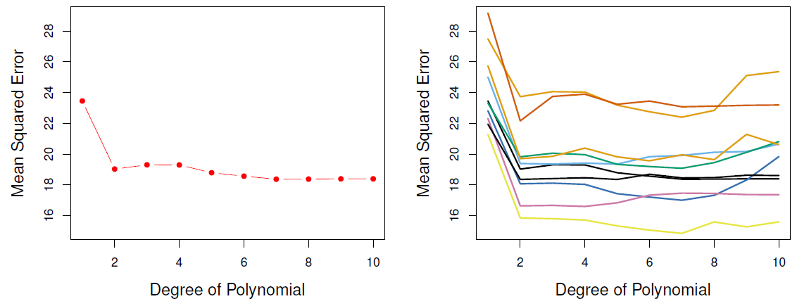
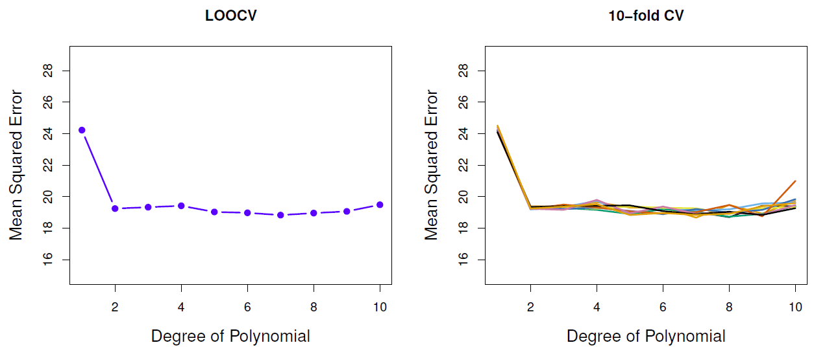
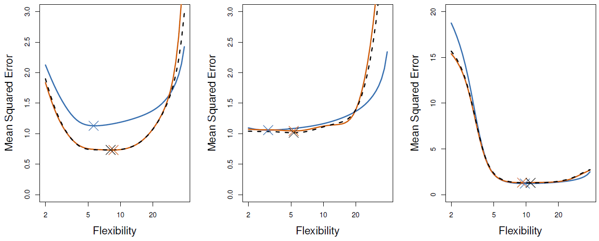
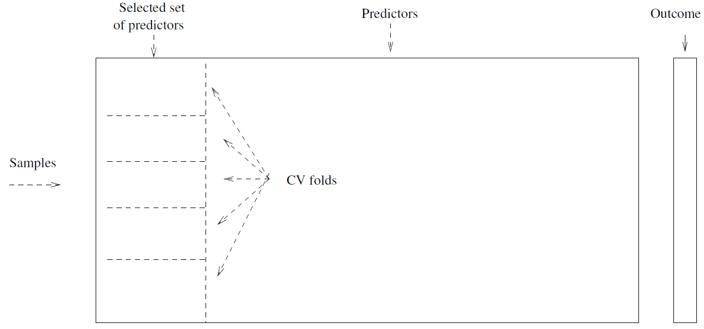
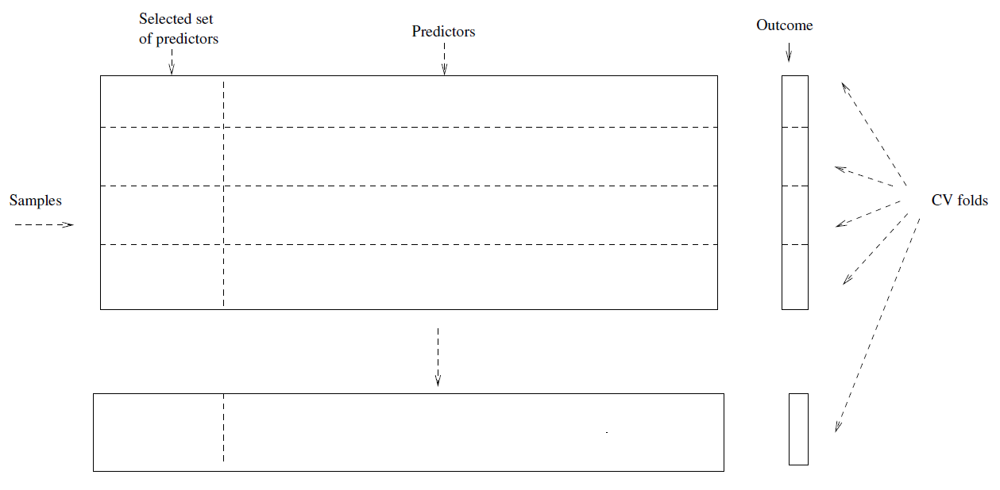
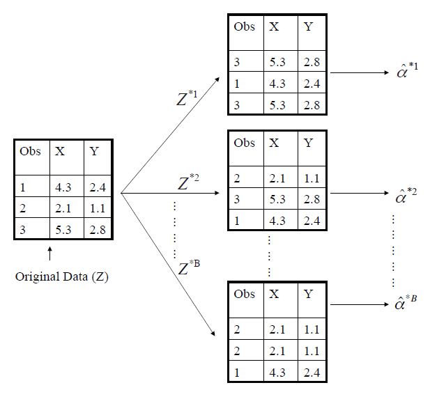

## Estimating Prediction Error and Validation Set Approach

<iframe width="560" height="315" src="https://www.youtube.com/embed/_2ij6eaaSl0" frameborder="0" allowfullscreen></iframe>

##### Introduction:

*Hastie:* OK. We've learned about methods for regression and for classification involving predictors and for making predictions from our data. How do we test these out? Well, ideally, we'd like to get a new sample from the population and see how well our predictions do. Well, we don't always have new data. So what do we do? And we can't use our training data just straight off, because it's going to be a little bit optimistic. So we're going to tell you about cross-validation. Rob's going to tell you about cross-validation, which is a very clever device for using the same training data to tell you how well your prediction method works. The other thing-- You're going to give my entire lecture? Oh, I'll try not to, Rob. Just in case you miss out some of the salient points. The other thing we're going to look at is standard errors of estimators. Sometimes our estimators are quite complex and we'd like to know the standard error, which means what happens if we got new samples from the population over and over again, and we'd recomputed our estimate? And the standard error is the standard deviation of those estimates under resampling. Well, of course, we can't resample from the population. We only have one sample. Again, Rob's going to tell you about the bootstrap, which is a very clever device for using the one, single training sample you have to estimate things like standard deviations. Rob? 

##### Slide 1: 

*Tibshirani:* OK. Well, thanks for that great introduction. Good overview. So we're going to talk about cross-validation and the bootstrap as Trevor mentioned. And these are *resampling* methods. So the word resampling, our original data is a sample. We're going to resample. We're actually going to sample from a data set in order to learn about the quantity of interest. And the cross-validation and the bootstrap are both ways of resampling from the data. And the purpose of it is to get information, additional information, about the fitted model. For example, the main thing we use cross-validation for is to get an idea of the test set error of our model. We're going to review that concept of training error. And we'll see, as we've talked about before, the training error is too optimistic. The more we fit to the data, the lower the training error. But the test error can get higher if we over fit. It often will. So cross-validation is a very important tool that we're going to talk about in this section. And we'll use, throughout the course, to get a good idea of the test set error of a model. Bootstrap, on the other hand, is most useful to get an idea of the variability or standard deviation of an estimate and its bias. So we'll talk about first cross-validation validation, and then bootstrap. 

##### Slide 2: 

*Tibshirani:* But let's, before we get into those, let's review the idea of the concept of *training error* versus *test error.* Remember, *test error* is the error that we incur on new data. So we fit our model to the training set. We take our model, and then we apply it to new data that the model hasn't seen. The test error is actually how well we'll do on future data the model hasn't seen. *Training error* is much easier to compute. We can do it in the same data set. What is it? It's the error we get applying the model to the same data from which we trained. And as you can imagine, train error is often lower than test error. The model has already seen the training set. So it's going to fit the training set with lower error than it was going to occur on the test set. And the more we over fit, the harder we fit the data, the lower the training error looks. On the other hand, the test error can be quite a bit higher. So training error is not a good surrogate for test error. 

##### Slide 3: 

*Tibshirani:* And this picture is a good one to look at to summarize the concepts here.

{:refdef: style="text-align:center"}
**Figure 5.1**-- *Training- versus Test-Set Performance*
{: refdef}

So what do we have here? Well, first of all, along the horizontal axis is the model complexity, from low to high. For example, in a linear model, the model complexity is the number of features, or the number of coefficients that we fit in the model. So low means a few number of features or coefficients or predictors. High means a large number. Think about fitting a polynomial with the higher and higher degree. You can see how model complexity increases with degree. So if we move to the right, we'd have a higher complexity, a higher order of polynomial. The predictor error is on the vertical axis. And we have two curves here-- the training error in blue, and test error in red. So what do we see? Let's first look at the blue curve. On the left, the model complexity is low. For example, we're fitting a small number of parameters, maybe just a single constant. The training error is high. Now, as we increase the model complexity, we fit more and more features in the model or higher complexity or higher order polynomial, the training error goes down. And actually in this picture, it continues to go down a consistent way. In most cases, for most models, the more complex the model, the training error will go down as it does in this case. On the other hand, the test error is the red curve. It does not consistently go down. It starts off high like the training error. It comes down for a while, but then it starts to come up again. It has a minimum, looks like around the middle here. But after this point, the more complex the model, the higher the test error. What's happened there? Well, that is an example of over fitting, right? On the left, we've added complexity, some features that actually are important for predicting the response. So they reduce the test error. But at that point, we seem to have fit all the important features. And now we're putting in things which are just noise. The trainer error goes down as it has to, but the test error is starting to go up. That's over fitting. So we don't want to over fit, because we'll increase the test error. The training error has not told us anything about over fitting, because it's using the same data to measure error. The more parameters, the better it looks. So it does not give us a good idea of the test error. The test error curve, on the other hand, is minimized around this level, at this complexity. And beyond that is over fitting. The ingredients of prediction error are actually bias and variance. So the bias is how far off on the average the model is from the truth. The variance is how much that the estimate varies around its average. When we don't fit very hard, the bias is high. The variance is low, because there are few parameters being fit. As we increase the amount of complexity moving to the right, the bias goes down because the model can adapt to more and more subtleties in the data. But the variance goes up, because we have more and more parameters to estimate from the same amount of data. So bias and variance together give us prediction error. And there's a trade off. They sum together to get protection error. And the trade off is minimized, in this case, around a model complexity in the middle here. So bias and variance together give us test error. We want to find the model complex given the smallest test error, and training error does not give us a good idea of test error. 

*Hastie:* They refer to it as the bias-variance trade off. 

##### Slide 4: 

*Tibshirani:* OK, so we can't use training error to estimate test error, as the previous picture shows us. So what do we do? Well, the best solution, if we have a large test set, we can use that. So we typically take our model that we've applied to fit on the training set applied to test set. But very often, we don't have a large test set. We if we can't do that, what do we do? Well, there are some ways to get an idea of test error using an adjustment to training error. Basically, training error can be too small, as we've see in the previous picture. So these methods adjust the training error by increasing it by a factor that involves the amount of fitting that we've done to the data and the variance. And these methods include the *C~p~* statistic, the *AIC* and the *BIC*. We'll talk about these later on in the course, not in this section. Here instead, we're going to talk about cross-validation, validation and cross-validation. And these involve removing part of the data, then holding it out, fitting the model to the remaining part, and then applying the fitted model to the data that we've held out. And this is called validation, or cross-validation, as we'll see. 

##### Slide 5: 

*Tibshirani:* So let's first of all talk about the validation approach. So here, the simple idea is basically we're going to divide the data into two parts at random, approximately of equal size. We'll call the first part a *training set* and the second part the *validation* or *hold-out set.* So the idea is simple. We take the model. We fit it on the training half. And then we apply the fitted model to the other half, the validation or hold-out set. And we record the error that we get on hold-out set. And that error, the validation set error, provides us a good idea of the test error. Well, at least some idea of the test error. And the error we'll measure by mean squared error in the case of quantitative response, or misclassification error rate in the case of a qualitative or a discrete response classification.

##### Slide 6: 

*Tibshirani:* So just to make that clear, let's look at the next slide.

{:refdef: style="text-align:center;"}
**Figure 5.2**-- *The Validation Process*
{: refdef:}

We have our data set here. I've divided it in two at random. The blue part on the left is the training set. And the orange part on the right is the validation or hold-out set. These observations, for example, 7, 22, 13 and more of them were at random chosen to be in the training set. Observation 91 was at random chosen to be in the hold-out set. We fit the model to the blue part. And then we apply it and predict the observations in the orange part. And that's validation. Or we might call that twofold validation, where we-- well, maybe I shouldn't call it twofold, because as we'll see, we don't cross over. This is simply a one-stage process. We divide it in half, train on one half and predict on the other half. 

*Hastie:* It seems a little wasteful if you've got a very small data set, Rob. 

*Tibshirani:* Yeah. That is wasteful. And as we'll see, cross-validation will remove that waste and be more efficient. 

##### Slide 7: 

*Tibshirani:* But let's first see how this works in the auto data. Recall, we're comparing the linear model to high-order polynomials in regression. And we have 392 observations divided up into two parts at random, 196 in one part and 196 in the other part. The first part being the training set and the other part being the validation set. If we do this once, do a single split, and we record the mean squared error, we get this red curve as a function of the degree of the polynomial. So a linear fits on the left, and quadrant is here, et cetera, as we increase the polynomial order.

{:refdef: style="text-align:center"}
**Figure 5.3**-- *Left: Single split, Right: Multiple splits*
{: refdef}

And we see the minimum seems to occur maybe around 2. Well, it's rising a bit and coming down a bit after that. It's pretty flat after about 2. So it looks like a linear model. Or actually, a quadratic model, excuse me, is probably the best. And after that, we're not getting much gain, if any at all. But look what happens when we repeat this process with more and more splits at random into two parts. We get a lot of variability. The minimum does tend to occur around 2 generally. But look at the error. It's varying from about 16 up to 24, depending on the split. So this is a consequence part of the fact that we divided up into two parts. And when you divide data in two, you get a lot of variability depending on the split. The training set, for example, is half as big as it was originally. 

*Hastie:* It's interesting, Rob, that even though you get that variability, it seems to often have this pattern where the shape of the curves are much the same. But the height, the level, hops around. 

*Tibshirani:* So that's a good point. And it actually reminds me to say there's two things you want to use validation for, cross-validation. Both to pick the best size of the model-- and in this case, the degree of polynomial. And also to give us an idea of how good the error is, because of the idea of the actual test error at the end of the fitting process. So a twofold, this breaking up into two parts, is successful at the first thing as Trevor just mentioned. The minimum's around 2 pretty consistently. 

##### Slide 8: 

*Tibshirani:* So that seems to be OK. But the actual level of the curve is varying a lot. So it wouldn't be so good at telling an idea of the error, because we get a very wide range here in error. So I've said a little bit of this first point already, that this method is highly variable because we're splitting into two parts. And there's lots of ways of splitting into two parts. And because we're splitting in two, we're losing a lot of the power of the training set. We're throwing away half the data each time in training. And another consequence of that that, remember, one of our original questions was, well, what's the best size model to pick? Second of all, how well does that model do in terms of test error? Our training sets here are half as big as our original training set. And if we go back to this previous slide, we split the data in half. We actually want the test error for a training set of size n. We're getting an idea of test error for a training set of size $$n$$/2. And that's likely to be quite a bit higher than the error for a training set of size $$n$$. Why, Rob? Why? That was my question. Well, that's because in general, the more data one, the lower the error. If I offer you a choice of, would you rather have 100 observations or 200 observations, you'd generate like 200 observations to train on. Because the more data, the more information you have, and in general, the lower your error is. So if your training sets only half as big as your original training set, as it is in this situation, the error that it yields is probably be higher n the actual error you want to get. 

##### Outro: 

*Tibshirani:* So as we can see, there are some drawbacks of validation. In the next section, we'll talk more cross-validation, which will help to remove some of these drawbacks.

## K-fold Cross-Validation

<iframe width="560" height="315" src="https://www.youtube.com/embed/nZAM5OXrktY" frameborder="0" allowfullscreen></iframe>

##### Slide 9: 

*Tibshirani:* Welcome back. In the last section, we talked about validation, and we saw some drawbacks with that method. Now we're going to talk about K-fold cross-validation, which will solve some of these problems. This is actually a very important technique that we're going to use throughout the course in various sections, and also something we use in our work all the time. So it's really important to understand K-fold cross-validation. It's used for a lot of methods. It's an extremely flexible and powerful technique for estimating prediction error and to get an idea of model complexity. So what's the idea of K-fold cross-validation? Well, it's really in the name. It's validation, as we've seen, but done sort of like a $$K$$ part play. It's done $$K$$ times, with each part, again, playing the role of the validation set. And you have the $$K$$ minus 1 parts playing the role of the training set. Which I say here. 

##### Slide 10: 

*Tibshirani:* But let me go to the picture here, and I'll sort of point to the pictures as I say it. 

{:refdef: style="text-align:center;"}
**Figure 5.4**
{: refdef}

So here, you're doing 5-fold cross validation. As we'll talk about in more detail, the best choices for $$K$$, the number of folds, is usually about 5 or 10. And we'll talk about that in a few minutes, about why those are good choices. But let's fix here $$K$$ equals 5. So I've taken the data set. I've divided at random the samples into five parts. Again, a size about the same. The first box looks a bit bigger, huh? OK, well, that's my lack of drawing ability. But anyway, it's supposed to be the same. I was trying to squish the word validation in. So the boxes are supposed to be about the same size and number of observations. But in this case, the first part's the validation set. The other four are the training parts. So what we're going, what cross-validation does, it forms these five parts. We're going to train the model on the four training parts put together as one big block, take the third model, and then predict on the validation part, and record the error. And then, that's phase one. Phase two, the validation set will be part two. This block. All the other four parts will be the training set. We fit them all to the training set, and then apply it to this validation part. And the third stage, this is the validation piece, et cetera. So we have five stages. In each stage, one part gets to play the role validation set. The other four parts are the training set. We take all the prediction errors from all five parts, we add them together, and that gives us what's called the cross validation error. 

##### Slide 11: 

*Tibshirani:* Now, in algebra, I'll just basically give you the details of what I said in words. So let the $$K$$ parts of the data be $$C_1$$ through $$C_K$$. So these are the observations that are in each of the five parts. $$K$$ was 5 in our example. And we'll try to make the number of observations about the same in every part, if $$N$$'s not a multiple of $$K$$ or 5, we can't do that exactly, but we'll do it approximately. So we'll let $$n_k$$ be the number of observations in the $$k$$th part. So here's the cross validation error rate.

$$\text{CV}_{(K)}=\displaystyle\sum_{k=1}^{K}\frac{n_k}{n}\text{MSE}_k \\ \text{where MSE}_k=\sum_{i\in C_k}(y_i-\hat{y}_i)^2/n_k$$

Basically, this is the mean square error we get by applying the fit to the $$K$$ minus 1 parts that don't involve part number $$k$$. That gives us our fit $$\hat{y}_i$$ for observation $$i$$. 4/5 of the data in this case. Right. And then we add up the error. This is the mean square error that we obtain now on the validation part using that model. So this is for the $$k$$-th part. And now we do this for all five parts in turn. The five acts of the play. And then we get the cross-validation error rate. And a special case of this is leave-one out cross-validation, where the number of folds is the same number of observations. So that means in this picture that actually would be one box per observation. And in *leave-one out cross-validation* (LOOCV), each observation by itself gets to play the role of the validation set. The other $$n$$ minus 1 are the training set. 

##### Slide 12: 

*Tibshirani:* Now, actually, leave-one out cross-validation is a nice special case of that. It represents a nice special case in the sense that this cross-validation can be done without actually having to refit the model at all. So leave-one out cross-validation, at least for a least squares model, or a polynomial model, the leave one out cross-validation has the following form.

$$\text{CV}_{(n)}=\frac{1}{n}\displaystyle\sum_{i=1}^{n}\left(\frac{y_i-\hat{y}_i}{1-h_i}\right)^2$$

So the $$\hat{y}_i$$ hat is now just to fit on the full data set. Each $$i$$ is the diagonal of the hat matrix. So have a look in the book for details. But the hat matrix is the projection matrix that projects $$y$$ onto the column space of $$x$$ to give you the fit. 

*Hastie:* This is something that can get computed easily when you fit your mean squares model. We haven't emphasized it, but it's available. It's one of the things that's available when you fit your least squares model. 

*Tibshirani:* So the overall point of this is that to do a leave-one out cross-validation for these particular models, you don't actually have to leave anything out. You can do the fit on the overall data set, and then extract the information you need to get the cross-validation sum of squares. 

*Hastie:* And it's interesting. Because the $$h_i$$ tells you how much influence an observation has on its own fact. It's a number between 0 and 1. And so as an observation, it's very influential on its own fit. You can see it punishes the residual, because it divides by a number that's small, and it inflates the residual. So, it sort of does the right thing there. 

*Tibshirani:* OK. Although leave-one out cross-validation does have this nice computation formula. For most of the methods we talk about in this book and most statistical learning methods, it's better to choose $$K$$ to be 5 or 10, rather than have a leave-one out cross-validation. And why is that? Well, one problem with the leave-one out cross-validation is that each of the training sets look very much like the other ones. Right? They only differ by one observation. So when you take the average-- cross-validation is you take the average of errors over the $$n$$ folds. And in leave-one out cross validation, the $$n$$ folds look very similar to each other, because the training sets are almost the same. They only differ by one observation. So as a result, that average has a high variance, because the ingredients are highly correlated. So that's the main reason why it's thought, and we also agree, that a better choice for $$K$$ in cross-validation is 5 or 10. 

*Hastie:* On the other hand, the leave-one out cross-validation is actually trying to estimate the error rate for the training sample of almost the same size as what you have. So it's got low bias. But as Rob said, high variance. So actually, picking $$K$$ is also a bias variance trade-off for prediction error. And as Rob said, $$K$$ equals 5 or 10 tend to be a good choice. 

##### Slide 13: 

*Tibshirani:* So the next slide I've got a comparison of a leave-one out cross-validation and 10-fold CV for the auto data.

{:refdef: style="text-align:center;"}
**Figure 5.5**
{: refdef}

Remember, before we started 2-fold validation, we started with just validation into two parts, we've got a lot of variability between when we change the sample, the half sample that we took. Now let's see what happens with leave-one out cross-validation. We get a curve that's, again, got the minimum around the same place, as we saw before. And it's pretty flat after that. A 10-fold cross-validation, now again, it's also showing the minimum around 2, but there's not the-- what we're seeing here is the 10-fold cross-validation as we take different partitions into 10 parts of the data. And we see there's not much variability. They're pretty consistent. In contrast to when you divide it into two parts, we got much more variability. (And those get averaged as well, those curves on the right.) Right. Exactly. So they're averaged together, which we saw here. They're averaged together to give us the overall estimate of cross-validation. Which the overall cross-validation curve will look very much like this, with its minimum around 2. 

##### Slide 14: 

*Tibshirani:* OK. This is figure 5.6 from the textbook. 

{:refdef: style="text-align:center;"}
**Figure 5.6**-- *Blue: True Error, Orange: 10-fold, Broken Black: LOOCV*
{: refdef}

And this is the simulated example, which is from figure 2.9 of the book. Just recall that this is smoothing splines in three different situations. In this case, the true error curve is the blue curve. And again, there's three different functions that we're examining. It says mean square error simulated data. 

*Hastie:* The true error curve. How did we get that, Rob? (Well, it's simulated diagram.) So we just-- Oh. So we can get a very big test set and estimate the error. 

*Tibshirani:* Exactly, leave-one out cross-validation is the black broken line, and the orange curve is 10-fold cross-validation. So what do we see? Well here, we see that the test error curve is a little higher than the 10-fold and leave-one out cross-validation. The minimum's fairly close, but the minimum of cross-validation is around 8, whereas the true curve minimum is around 6. In this case, the two cross-validation methods are doing a better job of approximating the test error curve. Well, the minimum's fairly close. Not exactly on the mark. Black curve is minimized around 6. And the true error curve is minimize around-- it's maybe 3. 

*Hastie:* Although those error curves are fairly flat. So there's obviously a high variance in where the minimum should be. And it doesn't really matter, really. 

*Tibshirani:* That's right. It's not going to matter much if you choose a model with a flexibility of 2, or maybe even 10 here, because the error is pretty flat in that region. And then in the third example, the two cross-validation curves do quite a good job of approximating the test error curve, and the minimum's around 10 in each case. 

##### Slide 15: 

*Tibshirani:* So actually, I said this already, but I'll say it again. One issue with cross-validation is that since the training set is not as big as the original training set, the essence of prediction will be biased up a little bit, because you have less data that you're working with. And I also said, and I'll say again, that leave-one out cross-validation has smaller bias in this sense, because the training set is almost the same in size as the original set. But on the other hand, it's got higher variance, because the train sets that it's using are almost the same as the original set. They only differ by one observation. So $$K$$ equals 5 or 10-fold is a good compromise for this bias-variance trade-off. 

##### Slide 16: 

*Tibshirani:* OK. So we talked cross-validation for a quantitative response, and we used mean square error. The classification problems, that is exactly the same. The only thing that changes is the measure of error. Of course, no longer square error, but a misclassification error. Otherwise, cross validation process is exactly the same. Divide the data up into $$K$$ parts. We train on $$K$$ minus 1 parts. We record the error on the $$K$$th part, and we add things up together to get the overall cross-validation error. 

$$\text{CV}_K=\displaystyle\sum_{k=1}^{K}\frac{n_k}{n}\text{Err}_k \\ \text{where Err}_k=\sum_{i\in C_k}I(y_i\neq\hat{y}_i)/n_k$$

*Hastie:* It looks like a weighted average formula, right? With $$n_k$$ over $$n$$? (Do you want to explain that?) Each of the folds might not be exactly the same size. So, we actually compute a weight which is the relative size of the fold, and then use a weighted average. 

*Tibshirani:* Right. And if we are lucky that the $$n$$ divides by $$K$$ exactly, then that weight will just be 1/$$k$$. Right. 1/$$k$$. One other thing to add is that since this cross-validation error is just an average, the standard error of that average also gives us a standard error of the cross-validation estimate. So we take the error rates from each of the folds. Their average is the cross-validation error rate. The standard error is the standard deviation of the cross-validation estimate. So here's the formula for that.

$$\widehat{\text{SE}}(\text{CV}_K)=\sqrt{\displaystyle\sum_{k=1}^{K}(\text{Err}_k-\overline{\text{Err}_k})^2/{K-1}}$$

So this is a useful quantity. When we would draw a CV curve, we should always put a standard error band around the curve to get an idea of the variability. So in these previous pictures, we should've had a standard error band around the curves to give us an idea of how variable they are. I say here is a useful estimate, but not quite valid. Why is that? Dr. Hastie? 

*Hastie:* Well, I wonder why. Well, the thing is, we're computing the standard error if these were independent observations. But they're not strictly independent. Error~$$k$$~ overlaps with, Error~$$j$$~ because they share some training samples. So there's some correlation between them. But we use this anyway. 

*Tibshirani:* We use it, and it's actually quite a good estimate. And people have shown this mathematically. An important point being that is that the cross-validation separates the training part of the data from the validation part. When we talk about bootstrap method in the next part of this section, we'll see that that's not the case, and that's going to cause a problem. So cross-validation explicitly separates the training set from the validation set in order to get a good idea of test error. OK. So this again, I'll reemphasize that cross-validation is a very important technique to understand, both for quantitative responses and classification.

## Cross-Validation: The Right and Wrong Ways

<iframe width="560" height="315" src="https://www.youtube.com/embed/S06JpVoNaA0" frameborder="0" allowfullscreen></iframe>

##### Slide 17: 

*Tibshirani:* OK, so we just talked about cross-validation, which is an important technique for both regression classification for getting an idea of test error and for assessing how complex a model to fit. For example, how many features to include in a model or the order of the polynomial. And it's a very important technique. And sometimes with important techniques like this, it's a good idea to see how one might do it wrong. And this is actually an area that we've seen people-- a way in which people use cross-validation in the wrong fashion. Which can have actually very serious consequences. Especially these days, when you get very wide data sets. And this next example is going to show you such a case. So we'll go into detail of how one could do it wrong, and how people use it wrong. And we'll try to avoid that error, and help you to avoid that error. So let's think of a simple thought experiment. We've got 5,000 predictors, for example, and 50 samples. This is, again, a more and more commonly occurring case, we have more predictors than samples. And we have two classes we're trying to predict. OK? And suppose we did the following. We built a simple classifier in the following way. First of all we filtered the predictors, find the 100 predictors having the largest correlation on their own with the class labels. So we're going to cherry pick here. We pick the top 100 predictors. Keep them-- and again, they're chosen on the basis of their correlation with the class labels on their own. And we throw away the remaining 4,900 predictors. And then we use 100 predictors, we use them in a classifier such as a logit model using only these 100 predictors. And we omit the other 4,900. So that's not unreasonable with building a classifier. For example, maybe we don't have to deal with 5,000 predictors. We just want a small number of them. The question we address here is, how do we get an idea of the test set error of this classifier? Cross-validation. OK, thank you. But how? What's tempting is to say, well, let's just forget the fact that we filtered the predictors in step one. That we chose the 100 best among the 5,000. Let's just pretend like we started in step two. That we started with the 100 predictors, and that was our data. Can we apply cross-validation in step two, forgetting about step one? 

##### Slide 18: 

*Tibshirani:* Well, no. This is a serious error. Why is it an error? Well, the problem is that the procedure of the classifier *has already seen the labels of the training data* in step one. In choosing the best 100 predictors, it's looked at all the labels of all the samples. So the predictors have already used the full set of observations in the fitting when we chose those predictors. So that's a form of training. And we can't ignore it in the validation process. The point is, we're not allowed to just start in step two and ignore the fact that we applied step one. Why is that? Well, this is something you should try yourself. You can simulate data with class labels having no correlation with the outcome. So with equal classes, the true test error is 50%. But cross-validation, if we ignore step one will give you an error rate of 0. So it's a serious, serious bias. Cross-validation is telling you your classifier is perfect, when in fact your classifier is the same as flipping a coin. Think about why this happens. It will make the point more clearly if we increase the 5,000 to maybe 5 million predictors. Suppose we have 5 million predictors and 50 samples. And again, there's no correlation in the population between the predictors and the class labels. We go ahead and we pick the best 100 among those 5 million predictors. We're going to find some very good-looking predictors. Despite the fact in the population no predictor has correlation with the outcome. In the data, if we look at the best among 5 million, we're going to find some very good predictors that look in the data like they have a lot of power for classifying. If we then pretend like those were the predictors we started with, those 100 cherry picked out of 5 million, they're going to look very good to cross-validation. So we fooled cross-validation by leaving out the first filtering step and giving it a very cherry-picked set of predictors in the second step. 

*Hastie:* This seems like it was done on purpose here, but actually in some genomic studies researchers are faced with tens of thousands of genes, maybe. And it's just hard to handle them. So they do some kind of screening in the beginning just to reduce the number of variables down to a manageable set. And then forget about it afterwards, but that leads to this kind of bias. 

*Hastie:* As I said earlier, I think it's good to understand this by actually trying this yourself. You can simulate a situation just like this where the true test error is 50%. And simulate a large number of predictors. And apply cross validation in step two. And you'll see the error is actually very low. You can see the error is low. And as Trevor mentioned, this is not something we made up. This is actually an error which commonly occurs in genomics in published papers and high profile journals. 

##### Slide 19: 

*Tibshirani:* So we told you the wrong way to do things, applying cross-validation in step two. The right way is to apply cross-validation to both steps. 

##### Slide 20: 

*Tibshirani:* The next few pictures will make this clear. Here I've got the wrong way I just described.

{:refdef: style="text-align:center;"}
**Figure 5.7**
{: refdef}

So I've got my samples here and my predictors here. And now in this first approach, we first select the best set of predictors based on the correlation with the outcome, that's over here. And we keep these predictors and throw the rest away. And now in step two, we're going to apply cross-validation. What does that mean? We divide the data up into, say, five parts. We apply our classifier to four parts. And we predict the response in the left-out part. So again, this is wrong because the filtering step which selected these predictors has used the response variable for all the samples. So this is the wrong way to do things. 

##### Slide 21: 

*Tibshirani:* The right way is as follows.

{:refdef: style="text-align:center"}
**Figure 5.8**
{: refdef}

We first define our folds, five folds cross-validation. Before we do any fitting, we remove one of the folds. All the data for that fold, the predictors and the response variable. And now we can do whatever we want on the other four parts. We can filter and fit however we want. When we've finished our fitting, we then take the model and we predict the response for the left out part. Key point being, though, that we form the folds before we filter or fit to the data. So that we're applying cross-validation to the entire process, not just the second step. So that's the right way to do it. 

*Hastie:* So in each of the 4/5ths folds, we might screen off a different set of predictors each time. And we probably will. And so that variability is going to get taken into account here. 

*Tibshirani:* So this wrong way of doing cross-validation is not something that we've made up. It's actually something which I mentioned occurs in a lot of published papers. I've actually experienced it a number of times myself. A few years ago I was at a PhD oral in engineering here at Stanford. And a lot of people engineering are doing statistics as part of their work. This particular student was trying to predict heart disease from SNPs. SNPs are single-base changes in the genome. So basically had a classification problem with I think about 100,000 predictors and to a class response. We get done something very much like this. He had so many predictors, he wanted to filter them. So he applied a filtering of some sort to the data set to reduce the 100,000 predictors I think down to 1,000. And then he fit some sort of a model to the 1,000 predictors. And he got an error rate of about 35%, I think. Which doesn't sound that impressive, but for this particular area it was actually quite a low error rate. And during the oral, he presented this. And I said, actually, I think there's a problem with this. And I pointed out the point you've just seen. That he actually had filtered the data-- oh, sorry, I didn't give you enough detail. He had applied cross-validation in the second step. So he had filtered the data down to 1,000 predictors. He applied cross-validation. And the cross-validation error rate was about 35%. And he was quite happy, and this was part of this presentation. And I mentioned, well, that doesn't look right to me. Because you have done cross-validation wrong in the way I just described. He didn't agree, and his supervisor didn't even agree. I will not name the person. (Wasn't me.) Wasn't you. The supervisor said, well, maybe you're right. But you're really being picky, you're splitting hairs here. It's not going to make much difference. And I said, well, I think it might make a difference. You really have to go back and do it. So a few months later, the student knocked on my door, my office. (Did he pass?) He did pass, because he had other things in the thesis which were reasonable. But a few months later, he knocked on my door, came to my office, said I redid the experiment. And the error rate is now 50%. He was quite surprised, and a bit upset. But basically, it was I told you so. That with a large number of predictors, if you filter them you've got to include that in your cross-validation. And if you don't, you can incur a serious error in your cross-validation estimate. So that was again, it happens, and Trevor and I talk about this a lot. And other people have written papers about this error. But people continue to make this error in cross-validation. (So that's a big heads up. And of course, another heads up is not have Rob Tibshirani on your oral committee.) 

*Tibshirani:* OK, so that completes our discussion of cross-validation. We spent quite a bit of time on that topic, because it's a very important technique for all the methods we'll see in this course. In the next session we'll talk about a closely related idea, but a different one, called the bootstrap.

## The Bootstrap

<iframe width="560" height="315" src="https://www.youtube.com/embed/p4BYWX7PTBM" frameborder="0" allowfullscreen></iframe>

##### Slide 22: 

*Tibshirani:* Welcome back. In the last session, we talked about cross validation for the estimation of test air for supervised learning. Now we'll talk about a closely related idea called the bootstrap. It's a powerful method for assessing uncertainty in estimates. And particularly good for getting standard errors of an estimate, and getting confidence limits. It sounds like a powerful technique, Rob. Are there any good books on the topic? As a matter of fact-- Rob has got a very famous book with Brad Efron on the bootstrap. Actually, speaking of famous, my supervisor was Brad Efron, who is now our colleague. And he's the inventor of the bootstrap. And there's a conversation with Brad in this course, in which he talks about how he came to think of the bootstrap. The bootstrap was something he thought of in 1979, and it's become one of the most important techniques in statistics in the last 30 years. 

##### Slide 23: 

*Tibshirani:* So where does the name come from? Well, it's the idea of pulling yourself up by your bootstraps, which is from a fable by Rudolph Erich Raspe, The Adventures of Baron Munchausen. The Baron had fallen to the bottom of a deep lake and couldn't get out. So he had an idea. He thought he'd pull himself up by his bootstraps, his own bootstraps. And in the fable, he managed to pull himself out of the lake and save his life. So that's thought where the term bootstrap came from. And that's the term we're using here. It's not the same as the term bootstrap that one uses in computer science to boot a computer. But it's the same idea. You're trying to pull yourself up from what you've got. In this case, we'll see the bootstrap, is we're going use the data itself to try to get more information about our estimator. 

##### Slide 24: 

*Tibshirani:* So let's start with a simple example. Suppose we have a fixed sum of money which we want to invest, in two assets that yield returns $$X$$ and $$Y$$, where $$X$$ and $$Y$$ are round quantities, depending on how the assets do. And we want to invest a fraction $$\alpha$$ of our money in $$X$$, and the remaining 1 minus $$\alpha$$ in $$Y$$. You want to choose the fraction $$\alpha$$ to minimize the total risk or the variance of our investment. So we have random variables $$X$$ and $$Y$$. We want to choose the $$\alpha$$ to minimize the variance of $$\alpha X + (1 - \alpha)Y$$. Now in this population model, you can show that the best fraction $$\alpha$$ is given by this formula.

$$\alpha=\frac{\sigma_Y^2-\sigma_{XY}}{\sigma_X^2+\sigma_Y^2-2\sigma_{XY}} \\ \text{where } \sigma_X^2=\text{Var}(X)\text{, }\sigma_Y^2=\text{Var}(Y)\text{, and }\sigma_{XY}=\text{Cov}(X,Y)$$

$$\sigma_Y^2$$, that's the difference of $$Y$$, there's the variance of $$X$$. This is the covariance between $$X$$ and $$Y$$. And they're defined here. So in other words, if we know the variance of $$X$$, the variance of $$Y$$, and their covariance, then this is the best amount proportion to put into $$X$$, and the remaining goes into $$Y$$, to minimize the total variance. (Those are population quantities, aren't they?) Those are population quantities. 

##### Slide 25: 

*Tibshirani:* So since they're population quantities, they're are not known to us in general. But if we have a data set from the population under study here, we can get an idea of these quantities, the variances and the covariances, from the sample values from the data set. And then plug them into the formula to get the $$\hat{\alpha}$$, which is the proportion that we should invest in $$X$$. So again, if we have a sample of $$X$$ and $$Y$$, we can get the empirical estimates of the variances and covariances, plug them in, and get an estimate of alpha. 

##### Slide 26: 

*Tibshirani:* So in this next slide, we see we've created a simulated population.

{:refdef: style="text-align:center;"}
**Figure 5.9**-- *Resulting $$\alpha$$ estimates from left to right, top to bottom:* 0.576, 0.532, 0.657, 0.651.
{: refdef}

We've simulated investments $$X$$ and $$Y$$. There are four different simulations here, each one containing 100 pairs of $$X$$ and $$Y$$. And for each one, we take that data. We compute the variances and covariances. And we plug it into the formula to get an estimate for $$\alpha$$. And here, we see the four estimates of $$\alpha$$ for the four panels. 0.576 et cetera to 0.651. So they're averaging around 0.6. 

##### Slide 27: 

*Tibshirani:* So if we want to get an idea of the standard deviation of $$\hat{\alpha}$$, we can just repeat this process lots of times. Let's say 1,000 times. So we would get 1,000 panels like this. Each one gives us an $$\hat{\alpha}$$ from the formula on the previous slide. And we do this 1,000 times. We take the standard error of those-- well, actually, let's. If it's 1,000 times, we'll go to look at the histogram in a couple of slides. 

##### Jump to Slide 29: 

*Tibshirani:* This histogram on the left shows the 1,000 values over 1,000 simulations from this experiment.

{:refdef: style="text-align:center;"}
**Figure 5.10**
{: refdef}

Each one is a value of $$\hat{\alpha}$$, and they average around 0.6. (It's called the sampling distribution of that estimator.) Right. And the true value, actually, since we know in this case-- we're playing God, right? -- We know the true variances and covariances. We know the true $$\alpha$$. And it's about 0.6. So I've indicated here with a purple line the 0.6. And the sampling distribution is averaging around 0.6, as we think it should. 

##### Back to Slide 27: 

*Tibshirani:* Here's the histogram we've seen. For the simulations actually, these were the values, the parameters that we set. And that implied a true of alpha of 0.6, which was that middle value in the histogram. That's the true value of alpha. 

##### Slide 28: 

*Tibshirani:* And now we can also use this histogram to get the standard deviation of the estimates, just by picking the standard deviation of those 1,000 values of $$\hat{\alpha}$$. 

$$\bar{\alpha}=\frac{1}{1000}\displaystyle\sum_{r=1}^{1000}\hat{\alpha}_r=0.5996$$

And here we've done that, and that's 0.083. So the standard error of $$\hat{\alpha}$$ is roughly 0.083. 

*Hastie:* The standard error of an estimator is the standard deviation in that sampling distribution. So if you're able to recompute the estimator many, many times from your samples, the standard deviation is called the standard error. 

*Tibshirani:* Right. So if we repeat this experiment, we expect each time that, on average, $$\hat{\alpha}$$ will be about 0.6, and would vary by a standard deviation of 0.0.83. 

$$\sqrt{\frac{1}{1000-1}\displaystyle\sum_{r=1}^{1000}(\hat{\alpha}_r-\bar{\alpha})^2}=0.083$$

##### Slide 29: 

*Tibshirani:* Which we're seeing in this histogram, right? It's averaging about 0.08, and the standard deviation is about 0.08 of this histogram. 

##### Slide 30: 

*Tibshirani:* OK. So that's all fine, except we can actually apply this with real data. If we had a sample of investments, $$X$$ and $$Y$$, we don't actually have the ability to sample from the population. We don't have the population. We have a single sample. So most of statistics, we don't have access to the population. All we have is a sample. If we had access to the population, we actually wouldn't need statistics at all, for the most part. We could learn all we wanted to know from the population. But in the real world, we have data. We don't actually know the populations from which that data arose. We have an idea of what it might look like, but we can't generate more data. So we can't actually. We can't produce the histogram on the left because we don't have the ability to generate more data. But the bootstrap is going to try. It's going to mimic this process by sampling not from the population, but from the data itself. So the data itself is going to act as the population. So instead of obtaining independent data sets from the population, which we can do without access to the population, we're going to sample from the data itself with replacement. And I'll remind you in a minute what that means. But basically, we're going to sample from the data set itself, and then use those samples to get an idea of the variability, in the same way that we use the samples from the population to produce this histogram. We're going to sample from the data, the data itself as a population. 

##### Slide 31: 

*Tibshirani:* So here's an idea. This is an illustration of bootstrap sampling, which is sampling with replacement. 

{:refdef: style="text-align:center;"}
**Figure 5.11**-- *Each bootstrap data set contains $$n$$ observations sampled from the orginal data.*
{: refdef}

I've created a data set here just with three observations, just so we could draw it on a single slide. Here's our original data. Here's our three observations. And now, each of these is a bootstrap sample. A bootstrap sample is drawn with replacement of the same size as original data. So the original data here's about three observations. So we're going to draw three observations with replacement. What does that mean? It means that the chance of each observation being sampled is the same, 1/3. But it's done with replacement. So imagine you put three balls into a bag, say, numbered 1, 2, and 3. We put our hand in the bag. We pull out one at random. Maybe we'll get number 1. That's our first observation. Now to get our second observation, we put the ball back in the bag. That's why it's called with replacement. And we sample again, from all three balls. So at every stage, each ball has the same probability of being sampled. And it can be sampled more than once, from stage one to end. So here, for example, we've got observation 3 twice, conservation 1 once. Observation 2 didn't get sampled at all. In this second bootstrap sample-- and we're drawing three samples from these three observations-- we happen to get to 2, 3, and 1. So each observation actually occurred once. This next sample, we've got observation 2 twice, and then observation 1. So just to summarize, we sampled the same number of observations as in our original sample, with replacement. Meaning, each observation can appear more than once, or maybe not at all, depending on what happens as we draw the samples. So these are called bootstrap samples, or bootstrap data sets. And then to each bootstrap data set, we apply the estimator-- in this case, the $$\alpha$$. This is the proportion of investment $$X$$. We compute it from this sample just as we computed it from the original sample. And we use the standard deviation of these numbers to give us an idea of the standard error, the standard deviation of $$\hat{\alpha}$$. So having drawn 1,000 bootstrap samples and got our estimates of $$\hat{\alpha}$$, we can draw the histogram as we did before. Let's go back to the slide. 

##### Back to Slide 29: 

*Tibshirani:* So now, back to figure 5.10, remember on the left is the histogram, the one we sampled from the population, the histogram of $$\hat{\alpha}$$ values. We can't sample from the population because we don't have the population. So we did bootstrap sampling. Look at the histogram in the middle, the blue histogram. It looks very much like the one on the left. It's averaging around 0.6, and its variability is about the same as we got sampled from the population. As a matter of fact, over here we've got the box plots of the $$\hat{\alpha}$$ values, the true ones from the sample from the population and the bootstrap ones. And they're looking pretty similar. They're averaging around 0.6, although the bootstrap's a little lower in this case. But in general, this gives you a pretty good idea of what we get if we could sample from the population. 

##### Slide 32: 

*Tibshirani:* In the standard error estimate-- let's see, we have back here? Yeah, the standard error estimate is 0.087. Which is similar, we got 0.083 before when we used a sample from the population. So the bootstrap has use the data itself as the population and got us a good estimate the standard error, very similar to the one we'd get if we could sample from the population. 

*Hastie:* So we've seen some examples of the bootstrap in simple problems. In the next session, we'll talk about the method in more generality. 

## More on the Bootstrap

<iframe width="560" height="315" src="https://www.youtube.com/embed/BzHz0J9a6k0" frameborder="0" allowfullscreen></iframe>

##### Slide 33: 

*Tibshirani:* OK, so we're back. Some more discussion of the bootstrap-- we saw an example of the bootstrap with the investments. And now, in general, we're going to talk about the bootstrap and think about it in more complex situations. So here's a schematic, which I think is very useful, actually. 

{:refdef: style="text-align:center;"}
**Figure 5.12**
{: refdef}

It's due to David Friedman at Berkeley. It's the real world bootstrap worldview of the bootstrap. So on the left, we have a cloud. And the ingredients we're imagining-- there's a real population that gives our data, which I'm calling genetically $$Z$$, observations $$z_1$$ through $$z_n$$. So these are like our training data? Right, that's our training data. For example, in the investment example we just saw, this training data was a set of investments $$X$$, $$Y$$-- $$x_1$$, $$y_1$$ to $$x_n$$, $$y_n$$. All right, but we're going to call each of these pairs a $$Z$$, $$z_1$$ through $$z_n$$. So we imagined in that situation that we have our training data from a population of investments. This is in the real world. We have a training sample. And from that training sample, we derive a statistic, an estimate. In that particular case, it was the $$\hat{\alpha}$$, which is the optimal proportion of investments for $$X$$. So this is a summary, in a sense, of what we did in the investment example for our training data. And what we wanted to get was an idea of the standard error of $$\hat{\alpha}$$. Now, we made the point earlier that ideally, if we had access to the population, we could get more training data. We could simply grab more samples of training data from the population, more investments from the possible population investments. You mean like a new sample, the same size? Yeah, exactly, a new sample-- and from the new sample, do the same analysis, get an estimate $$\hat{\alpha}$$, and do that many times. And we showed how you could do that on the computer in the previous example. But we made the point that not often can you actually do that in practice. Because you don't have access to the population. You can't get more training data, typically. What you have to work with is just your given training example. So a way of thinking of the bootstrap in the abstract is to say, well, we don't have access to the population. Let's replace the population, which we don't have, by $$\hat{P}$$, which in the bootstrap's case is the training sample itself. It's a population that puts probability 1 over $$n$$, $$n$$ being the sample size, on each of the training points. So it says, our guess for the population-- which we don't have access to but we have from a training sample-- is we have no more information. We're going to say with equal probability, a training point can come from the first point we saw, the second point we saw, up to the nth point we saw. So that's what we'll call $$\hat{P}$$-- the empirical distribution function. That's another name for that-- empirical distribution function. So when you draw from this empirical distribution function, that is sampling with replacement. And that's what the bootstrap does, right? It samples-- we saw that we draw samples with replacement from the training sample. That's this random sampling here-- $$\hat{P}$$ given $$Z^*$$. This is now the bootstrap sample. Remember, we're going to use a superscript star to indicate a bootstrap sample as distinct from a training sample, which has no superscript. So this is one bootstrap draw. It's the sample of size $$n$$ from our training sample now, our bootstrap sample, giving us the bootstrap data. And from that, we derive the estimate. Again, in this case, it's $$\alpha$$. And we'll call it $$\hat{\alpha}^*$$. So bootstrap sampling simply repeats this operation a few hundred times, say. For each time, we get a bootstrap sample of size $$n$$, and we get a bootstrap quantity $$\hat{\alpha}^*$$. And then, the standard error of $$\hat{\alpha}^*$$ is the bootstrap estimate of standard error of $$\hat{\alpha}$$. Since there's nothing new here, we're simply describing what we already saw in more general terms, OK? But we can now think about how we carry this out in more complex situations.

##### Slide 34: 

*Tibshirani:* So in general, we need to figure out how we can carry out bootstrap sampling. For example, suppose we have a time series. So let's draw the time axis here. And we have a series, like for example stock price. And let's just draw some imaginary data, all right? So this is-- let's call it $$y_1$$. This is stock price at time one, stock price at time two, et cetera. And we want, for example, to predict the stock price for a given day from the previous day's stock price. So we'll fit a model, a regression model like we've seen, to each stock price as a function of the stock price on the previous day. Well, that's fine. We can do that by least squares. But now, we might imagine doing bootstrap sampling like the way we just described where we sample with replacement from the data. Well, one problem with that that's a significant problem is that the data are not independent, right? There's correlation in the time series. We expect the stock price for a given day to be correlated with the stock price from the previous day. As a matter of fact, if we're trying to predict the stock price from a given day from the previous day, we hope there's correlation. If they were independent, the prediction wouldn't be very useful. But this creates a problem for the bootstrap. Because in the schematic, we were sampling here where we assumed that the sampling was IID from the population. But in this situation, that's not a reasonable assumption. Because the observations are not independent. So in general, when you set up the bootstrap and arrange for the sampling, you must figure out what parts of the data are independent. So one thing people do in a time series-- because the observations are not independent-- to correlate across time is to use what's called the block bootstrap. The block bootstrap divides the data up into blocks. And between blocks, one assumes that things are independent. Oops, my spelling's not good. OK, so for example, if we use a block size of three, we might-- these would be the first block, these three observations. These three would be the second block. These would be the next block. And now our sampling units are not individual observations. But they're entire blocks. So we would sample with replacement from all the blocks and then paste them together into a new time series. In other words, if this guy's sampled, he might become the first block, second block, et cetera. And then, we paste them together in order. And that becomes the bootstrap sample to which we apply the estimate-- in this case, a regression model. So the point is you have to sample the things that are uncorrelated. You have to arrange for-- find the parts of the data that are uncorrelated and use that as a basis for bootstrap sampling. In this case, we use a block of size three under the assumption that beyond a time lag of three, things are somewhat uncorrelated. But within a block, we expect correlation. So we keep the blocks intact and sample them as units. That's called the block bootstrap. 

##### Slide 35: 

*Tibshirani:* I say that here, OK? So we talked about the bootstrap for standard errors. The main use of the bootstrap is to estimate the standard errors of an estimate like the $$\hat{\alpha}$$ in our investment example. Another very common use of the bootstrap is for confidence interval. So let's go back to confidence interval for our parameters. 

##### Jump to Slide 29: 

*Tibshirani:* Let's go back to slide 29. And remember, this is the histogram we got from the bootstrap for the values of $$\hat{\alpha}$$ over bootstrap sampling, 1,000 bootstrap samples. And if you look at this histogram, a reasonable way to derive a confidence interval is to take the percentiles from this histogram. Suppose I want a 0.9 confidence interval so that it contains a true value with probability 90%. It makes sense to grab the fifth and 95th percent quartiles. In other words, find the 5% point of this histogram and the 95% point of that histogram. There's 1,000 points here. So actually, the 5% point would be the 50th biggest and 9/50 biggest value of $$\alpha$$. (You mean smallest and biggest.) Did I say that wrong? (You said it wrong.) I'm sure they understood, just like I did. OK, so if we do that, that provides a confidence interval for $$\alpha$$. 

##### Slide 35: 

*Tibshirani:* And what do we actually get? It's that, so 0.43 and 0.72. So this is actually an appropriate confidence interval for $$\alpha$$. And remember how to interpret this confidence interval. What this means is that if we were to repeat this experiment from the population many times, it would be the case that the confidence interval that we obtain would contain the true value of alpha 90% of the time. That's what a 90% confidence interval is. We talked about that earlier. This particular way of constructing intervals is called a bootstrap percentile interval. And there's actually an entire field in statistics to do with confidence intervals in the bootstrap. And there's many, many, many papers and books that have been written about this topic. This bootstrap percentile interval is the simplest way of constructing a confidence interval from the bootstrap. And it's very useful. We just use the histogram of bootstrap values themselves, and use their percentiles. 

##### Slide 36: 

*Tibshirani:* So we've talked about the bootstrap for standard errors and confidence intervals. How about prediction error like misclassification error that we've seen in the course already? Well, the major tool we talked about for that was cross-validation. And let's think back on cross-validation, how it worked. We have $$K$$ folds in K fold cross-validation. We divide the data up into $$K$$ parts, let's say five. And I'll just draw this again. Remember, what we did is our five parts created at random. K fold cross validation is like, remember, a five act play if $$K$$ is 5. At one stage of the play, these four are the training set, these four parts. And the remaining fifth part is the validations part, set. And cross-validation fits to the four parts, fits a model, and then uses that model to predict the fifth part. And then, in turn, this guy gets to play the role of the validation set in the next stage, and this guy, et cetera. And this is five stages. But a crucial part of cross-validation was that when we do one stage like this, there's no overlap between the training set and the validation set. In other words, the observations in one do not appear in the other. And that's important, because we're trying to get an idea of test set error on new data. So cross-validation is taking a piece of data, separating it out from the training set so that when I fit on this data, predicted on this data, this data is, in a sense, new. It hasn't been seen by the model train on the first four. So there's a separation, a clean separation, between training and validation. 

##### Slide 37: 

*Tibshirani:* Well, what if we were to try to use the bootstrap to estimate prediction error? Let's just draw in the bootstrap sampling process. Here's my training set. And I'm going to draw samples with replacement from the training set, bootstrap samples, each one of the same size, and a few hundred them. Well, the first kind of obvious idea is to say, well, let's train on a bootstrap data set and then predict the original training set as my validation set. I can do that for each bootstrap sample. Each bootstrap sample gets to play the role of the training set to fit. And then, I'm going to predict my original training sample as my validation set. Well, there's a big problem with that. And the problem is there's an overlap between the bootstrap data sets and the original data set. In particular, about 2/3 of the original data points appear in each bootstrap sample. And you should think about how to prove this. It's not hard, but you'll find out that about 2/3 of these points, so the training set points, are in the bootstrap sample. This creates a problem, because now when I train here and I do the prediction of a training set, 2/3 of the points in this training set have already been seen by the model. Because they're in the bootstrap data set. So on average, this 2/3 overlap means that most of the training points are not novel. So this is a big problem, because the prediction error from this process will be biased downward. It'll be a lot lower than the actual prediction error, because 2/3 of the points I'm predicting I've already seen in the bootstrap data set. So this is not a good way of estimating prediction error. OK, I say that it underestimates the true prediction error quite dramatically. Now, you can think about it the other way around. You could train on the training set and use the bootstrap samples as the validations sets. And that's even worse. And you can think about why that is. So it's even worse in the sense that it's going to be even more biased. 

##### Slide 38: 

*Tibshirani:* Well, how do you fix this problem? You can fix it by, when you train on the bootstrap sample and then predict the training sample, just recording the predictions for the points that did not occur in the bootstrap sample-- in other words, the points that are actually novel points. But then, this gets complicated. And in the end, it's really not worth it. If you push this idea to its conclusion, you can get something which is about as good as cross-validation. But it's much more complicated. So our view is for this particular problem, cross-validation is easier, and better, and the thing we recommend. 

*Hastie:* If I can just interrupt, Rob-- that actually brings up an interesting point. A lot of the time, we have simple methods like cross-validation. And then, a new method comes along like using bootstrap to estimate prediction error. And we see it's quite a lot more complicated. And you don't get much in return. And so our general philosophy is if you can get the job done with a simple method, it's far better than using a more complicated method just because it maybe looks sexy or whatever. So keep it simple-- that's the idea.
