

## Linear Model Selection and Best Subset Selection

<iframe width="560" height="315" src="https://www.youtube.com/embed/91si52nk3LA" frameborder="0" allowfullscreen></iframe>

##### Introduction:

*Tibshirani:* So, welcome back. Today we're going to cover model selection and regularization. But we have a special guest, my former graduate Daniela Witten. Hi. Welcome, Daniela. (Thank you.) Daniela's now at University of Washington. But maybe you want to tell students a bit about yourself and how you got to be here? 

*Daniela:* Yeah. Well, in college I studied math and biology. And when I was graduating I knew I wanted to go to grad school in something. But I couldn't really decide on one particular thing that I wanted to study for the rest of my life. And so I ended up doing a PhD. In statistics. And I was lucky enough to do it at Stanford with Rob. And I graduated in 2010, moved up to Seattle, and I'm now an assistant professor at the University of Washington in the biostat department there. 

*Tibshirani:* And I didn't invite Daniela here just because she's a great student and friend. But also she's a co-author of the textbook this course is based on. So Daniela and I are going to give today's talk together. So we're going to talk about model section and regularization. 

##### Slide 1:

*Tibshirani:* So let's recall the linear model we've talked about already in course.

$$Y=\beta_0+\beta_1X_1+\dotsb+\beta_pX_p+\epsilon$$

We have response variable $$Y$$ and we're going to model it as a function of some predictors or features, $$X_1$$ through $$X_p$$. And we've talked about at least squares for doing that earlier in the course. And later on in the course we'll talk about ways of making that model more general. Making it *non-linear* for example. Or we'll have *additive* but non-linear models in the lectures that cover chapter seven. We'll consider non-linear models in chapter eight, things like trees in boosting. But today, actually, we're going to stick to the linear model and talk about a different way of fitting the linear model. 

##### Slide 2:

*Tibshirani:* Why? Well, because the model, though it's very simple-- and it's actually been around since probably the 1920s or 1930s-- it's a very important model because it's simple. Which means it can be *interpreted.* There's a small number of coefficients, typically, if we have a small number of features that are important. It also *predicts* future data quite well in a lot of cases, despite the fact its simple. So we want to talk today about a faintly linear model that improving on least squares by selecting or shrinking the coefficients of features to make the model more interpretable, and in some cases to predict better. So we'll talk about a number of methods of doing that today. 

##### Slide 3:

*Tibshirani:* And just to say a little more about the two objectives, when the number of features is bigger than the number of samples-- and we've talked about that in the course already. This is a situation that comes up more and more often these days, where you have a lot of features you measure on patients or in business. Maybe on a stock. Or in other situations it's cheap to measure things now. And it's often the case that $$p$$ might be much bigger than $$n$$, the number of samples. So in that situation, of course, we can't use full least squares, because the solution's not even defined. So somehow we have to reduce the number of features. And thus it becomes more and more important not just to obtain a solution, but to avoid fitting the data too hard. So when we want to predict better, we'll shrink, or regularize, or select features in order to improve the prediction. Along the same lines, when we have a small number of features the model becomes more interpretable. If we hand our collaborator a few features and say, these are important, that might be hard to interpret. If we can pare them down to the most important 5 or 10, it's easier to interpret and, from a scientific point of view, more useful. So *feature selection* is a way of choosing among features to find the ones that are most informative. 

##### Slide 4:

*Tibshirani:* So we'll talk about three classes of techniques in today's lecture. *Subset selection*, where we try to find among the $$p$$ predictors-- the ones that are the most related to the response. And we'll see different flavors of subset selection. Best subset selection, we'll try to look among all possible combinations of features to find the ones that are the most productive. And then we'll talk about forward and backward stepwise methods which don't try to find the best among all possible combinations, but try to do an intelligent search through the space of models. So forward stepwise, backward stepwise, and all subsets. And then some more modern techniques known as *shrinkage* methods in which we don't actually select variables explicitly. But rather, we put on a penalty to penalize the model for the number of coefficients or the size of coefficients in various ways. So we'll talk about ridge regression and the Lasso in the shrinkage section. Now finally in the third section *dimension reduction*, we'll talk about ways of finding combinations of variables, extracting important combinations of variables, and then using those combinations as the features in regression. We'll talk about PCR, Principle Components Regression, and partial least squares in those settings. So three classes of methods we'll talk about today. 

*Daniela:* And one of the things about today's lecture is that we're going to be looking at all of these ideas within the context of linear regression. So if you're trying to pick some quantitative response and you want to fit a less flexible but perhaps more predictive and also more interpretable model, these are ways that you can shrink, in a sense, your usual least squares solution in order to get better results. But these concepts can just as well be applied in the context of logistic regression or really your favorite model, depending on the data set that you have at hand and the type of response that you're trying to predict. And so even though linear regression is really what we'll be talking about here, these really apply to logistic and other types of models. 

##### Slide 5:

*Tibshirani:* OK, so Danielle's going to first of all tell us about subset selection. 

*Daniela:* So *best subset selection* is a really simple idea. And the idea here is, suppose that we have access to $$p$$ predictors but we want to actually have a simpler model that involves only a subset of those $$p$$ predictors. Well, the natural way to do it is to consider every possible subset of $$p$$ predictors and to choose the best model out of every single model that just contains some of the predictors. And so the way that we do this is in a very organized way. We first create a model that we're going to call $$\mathcal{M}_0$$. And $$\mathcal{M}_0$$ is the *null model* that contains no predictors. It just contains an intercept. And we're just going to predict the sample mean for each observation. So that's going to give us $$\mathcal{M}_0$$. And now we're going to try to create a model called $$\mathcal{M}_1$$. And $$\mathcal{M}_1$$ is going to be the best model that contains exactly one predictor. So in order to get $$\mathcal{M}_1$$ we need to look at all $$p$$ models that contain exactly one predictor. And we have to find the best among those $$p$$ models. Next we want to find a model called $$\mathcal{M}_2$$. That's going to be the best model that contains two predictors. So how many models are there that contain two predictors if we have $$p$$ predictors in total? And the answer is $$\left(\begin{array}{c}p \\2 \end{array}\right)$$.

$$\left(\begin{array}{c}p \\2 \end{array}\right)=\frac{p!}{2!(p-2)!}$$

So if you haven't seen this notation before, this notation is written like this. It's pronounced choose. So this means $$p$$ choose 2. And it's equal to $$p$$ factorial divided by 2 factorial times $$p$$ minus 2 factorial. And that is actually the number of possible models that I can get that contain exactly two predictors out of $$p$$ predictors total. And so I can consider all $$\left(\begin{array}{c}p \\2 \end{array}\right)$$ models containing two predictors. I'm going to choose the best one. And I'm going to call it $$\mathcal{M}_2$$ and so on. I can keep on getting the best model with three predictors, four predictors, and so on, up to the best model with $$p$$ predictors. So if I'm choosing the best model out of all models containing three predictors in order to get, let's say, $$\mathcal{M}_3$$, I can do that in a pretty straightforward way. Because I can just say that out of all models containing three predictors the best one is the one with the smallest residual sum of squares, or equivalently, the largest $$R^2$$. And so in this way I get a best model containing 0, 1, 2, all the way through $$p$$ predictors. I've called them $$\mathcal{M}_0$$, $$\mathcal{M}_1$$, $$\mathcal{M}_2$$, all the way through $$\mathcal{M}_p$$. And now I'm on to step three. And in this final step, all that I need to do is choose the best model out of $$\mathcal{M}_0$$ through $$\mathcal{M}_p$$. And in order to do this, actually, this step three is a little bit subtle. Because we need to be very careful that we choose a model that really has the smallest test error rather than the model that has the smallest training here. And so there are number of techniques that we can use to choose the single best model from among $$\mathcal{M}_0$$ to $$\mathcal{M}_p$$. And these include prediction error estimated through cross validation, as well as some methods the we're going to talk about later in the lecture which you might not have seen before. And these include Mallow's $$C_p$$, Bayesian Information Criterion, and adjusted $$R^2$$. So we'll come back to some of those topics in a few minutes. 

##### Slide 6:

*Daniela:* So here's an example on the credit data set. 

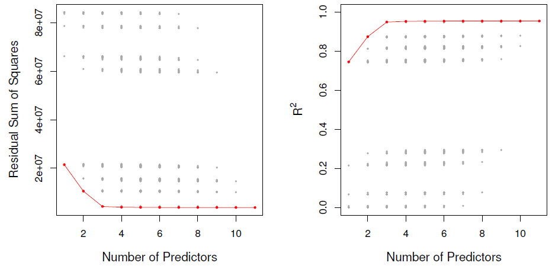

{:refdef: style="text-align:center;"}
**Figure 6.1**
{: refdef}

And we saw this data set in one of the earlier chapters. And this is a data set that contains 10 predictors involving things like number of credit cards, and credit rating, and credit limit. And the goal is to predict a quantitative response which is credit card balance. And so what we can do is we can look at every single model that contains a subset of these 10 predictors. And these models are actually plotted here on the left hand side. So here, this x-axis is the number of predictors. It actually goes from 1 to 11 because one of these predictors is categorical with three levels. And so we used a couple of dummy variables to encode that. And on the y-axis is the residual sum of squares for each of the possible models. So for instance, like this dot right here indicates a model that contains one predictor with a pretty terrible residual sum of squares. And all the way down here we've got a model with 11 predictors that has a pretty decent residual sum of squares. So the reason that there's a lot of dots in this picture is because there's a lot of possible sub models given 10 total predictors. And in fact, as we're going to see in a couple minutes, there's $$2^{10}$$ sub models. So there's actually $$2^{10}$$ dots in this picture, although some of them are sort of on top of each other. And so this red line here indicates the best model of each side. So this red dot right here is $$\mathcal{M}_0$$. Excuse me, this is $$\mathcal{M}_1$$, what I just showed you is $$\mathcal{M}_1$$. So that's the best model containing one predictor, because that is the smallest residual sum of squares. This is the best model containing two predictors, this is $$\mathcal{M}_3$$, best model containing three predictors, and so on. So when we perform best subset selection, what we really do is we trace out this curve to when we get $$\mathcal{M}_0$$ through $$\mathcal{M}_p$$. And now we're just going to need to find a way to choose, is $$\mathcal{M}_{10}$$ better than or worse than $$\mathcal{M}_4$$ and so on? We're just going to have to choose among that lower frontier. So on the left hand side here we see number of predictors against residual sum of squares. And on the right hand side, we've got number of predictors against $$R^2$$. And as we saw in Chapter three, $$R^2$$ just tells you the proportion of variance explained by a linear regression model, by a least squares model. And so once again we see a whole lot of gray dots indicating every possible model containing a subset of these 10 predictors. And then the red line shows the best model of each size. So again, this is the $$\mathcal{M}_1$$ that we saw earlier. This is $$\mathcal{M}_2$$. Over here is $$\mathcal{M}_{10}$$. And what we noticed is that as the models get bigger, as we look at larger and larger models, the residual sum of squares decreases and the $$R^2$$ increases. So do we have any idea of why that's happening? Maybe Rob can tell us. 

*Tibshirani:* I can tell you that. So it's because as you add in variables, things can not get worse. If you have a subset of size three, for example, and you look for the best subset of size four, at the very worst you could set the coefficient for the fourth variable to be 0. And you'll have the same error as for the three variable model. So a curve can never get worse. It can be flat, if you clear slide here we can see. It looks like is actually flat from 3 predictors about up to 11. But it's certainly not going to go up. It can be flat as it is in this case. But we can't do any worse by adding a predictor. 

*Daniela:* And actually what Rob just said relates to the idea that-- remember on the previous slide here in step three when we were talking about best subset selection. We had this step, and I said that in order to choose among the best model of each size we're going to need to be really careful. We're going to have to use cross validation or $$C_p$$, BIC, adjusted $$R^2$$. And that really relates to what's going on here. Because if I asked you, hey, what's the best model with eight predictors? You'd say, OK, here are all of the models with eight predictors. And clearly this is the best one. It's got the smallest residual sum of squares, there's no argument. But if I ask you, which is better, this model here or this model there? Suddenly it's not so straightforward. Because you're kind of comparing apples and oranges. You're comparing a model with four predictors to a model with eight predictors. You can't just look at which one has a smaller residual sum of squares because of course the one with eight predictors is going to have a smaller residual sum of squares. So in order to really in a meaningful way choose among a set of models with different predictors, we're going to have to be careful. And we'll talk about that in a few minutes. Good.

## Forward Stepwise Selection

<iframe width="560" height="315" src="https://www.youtube.com/embed/nLpJd_iKmrE" frameborder="0" allowfullscreen></iframe>

##### Slide 7:

*Daniela:* So as I mentioned earlier, we're talking about best subset selection here for a least squares. But we can just as well do this for logistic regression, or for any other type of model. And in particular, when we're talking about other types of models, we don't usually talk about residual sum of squares. Instead we talk about something that's called the *deviance*, which is negative 2 times the log likelihood. And in the case of least squares, the deviance and the residual sum of squares are equivalent. But for other model types the deviance is really just a generalization of residual sum of squares. But here we're going to talk about residual sum of squares for simplicity. 

##### Slide 8:

*Daniela:* So in that figure we were looking at a couple slides ago with the credit data, we saw that there were all of those gray dots. And I mentioned that there's actually $$2^{10}$$ gray dots in that picture. And the idea is that if I have access to $$p$$ predictors, and I want to consider every possible sub model, I'm actually looking at 2 to the $$p$$ subsets. And that is an absolutely huge number. So just to put this in perspective, $$2^{10}$$, that's like 1,000. So that's OK. Fitting 1,000 models, if you've got a decent computer is no problem. But $$2^{40}$$ is a really big number. And so the idea is that when $$p$$ is large, we're really not going to be able to do best subset selection. And 40 predictors isn't large. I work on data out where there's easily tens or hundreds of thousands of predictors. And so best subset selection just does not scale for many of the types of problems that people are interested in today. I think the limit for most packages that do subset selection is about 30 or 40. And beyond that they just say, I can't look at all the combinations. Right. So putting aside computational concerns, though, best subset selection also suffers from statistical problems. And the idea is if I'm considering, gosh, what is this? This is a trillion models. If I have 40 predictors, and I'm considering a trillion models, I'm going to over fit the data. I'm just looking at so many models, I'm going to choose a model that looks really, really great on this data by chance. But it's not going to look great on an independent test set that I didn't use in training the model. And so I'm going to have a problem with over fitting. And so for these two reasons-- computational and statistical - best subset selection isn't really great unless $$p$$ is extremely small. And in this setting, we can use stepwise methods, which sort of are the same ideas as best subset selection. But they look at a more restrictive set of models. So instead of looking at $$2^p$$ models, they look at more like $$p^2$$ models. And of course, $$2^p$$ is much more than $$p^2$$ for any $$p$$ of any reasonable size. 

*Tibshirani:* So this point that Daniela made is actually somewhat counter-intuitive. Especially since people in computer science might think it's always best to do the most exact computation you can. If you can do the optimization over all models, it's usually thought to be better. But Daniela said something that's actually somewhat counter-intuitive, that actually to avoid fitting too hard, it's good to actually not look at all possible models, but only a subset of the models. So for stepwise, and forward stepwise in particular, it doesn't try to look at all possible models. In cases when $$p$$ is less than 40, where you can look at all possible models, it may not be the best thing to do that. So forward stepwise on purpose looks only at a subset of the models. And that can actually be helpful. 

*Daniela:* Yeah, so Rob, best subset selection, what would $$p$$ be if you were going to use it? What would be your limit, where if $$p$$ is larger than that number you wouldn't want to go beyond best subset? 

*Tibshirani:* I wouldn't want to use best subset maybe not beyond 10 or 20. 

*Daniela:* Yeah, I don't think I would probably even use it for 20. I think I would use best subset if I've got a handful of predictors. And if I've got 10, I wouldn't be using that anymore, most likely. 

*Tibshirani:* So the point is not always best to do a full search, even when you can do it. Because you pay a price in variance. 

##### Slide 9:

*Daniela:* So now we're going to talk about these two stepwise methods-- forward and backward stepwise. And these are really pretty similar. But there's just one fundamental difference, which is whether you're starting with a model with no predictors or you're starting with a model with all the predictors. So in forward stepwise selection we start with a model that contains no predictors. This is just a model with only the intercept. It's what we were calling the null model, $$\mathcal{M}_0$$, earlier. And then we're going to add predictors to the model, one at a time, until all of the predictors are in the model. So this sounds like best subset selection. But there's actually a really major difference, which is that at each step we're not looking at every single possible model in the universe that contains $$k$$ predictors. We're just looking at the models that contain the $$k$$ minus 1 predictors, we already chose in the previous step, plus one more. So at the $$k^{\text{th}}$$ step, we're looking at a much, much, much more restricted set of models than we are in best subset selection. In particular, at each step we're just going to choose the variable that gives the biggest improvement to the model we just had a moment earlier. 

##### Slide 10:

*Daniela:* So the idea behind forward stepwise selection is that once again we start with this model, $$\mathcal{M}_0$$. It's the null model. And it just contains an intercept. So you're just going to predict the mean for every observation. And then we're going to try to create a model $$\mathcal{M}_1$$. And the model $$\mathcal{M}_1$$ is going to just contain one more predictor than $$\mathcal{M}_0$$. So we're just going to take $$\mathcal{M}_0$$, and we're going to look for the best predictor to add that's going to lead to the smallest RSS or the largest $$R^2$$. So that gives us $$\mathcal{M}_1$$. And now, in order to get $$\mathcal{M}_2$$, we're going to take $$\mathcal{M}_1$$. And we're going to consider adding all $$p-1$$ possible predictors to $$\mathcal{M}_1$$. And we're going to see which of those $$p-1$$ predictors gives us the best model $$\mathcal{M}_2$$. And you get $$\mathcal{M}_3$$ we look at $$\mathcal{M}_2$$. We consider adding all $$p-2$$ predictors that aren't in $$\mathcal{M}_2$$. We choose the best one. And that gives us $$\mathcal{M}_3$$, and so on. So the really key thing here is that, in this step this is different from what we were doing in the best subset selection case. Because here we're not looking at every possible model containing $$k$$ predictors. Instead, we're just looking at every possible model that contains one more predictor than $$\mathcal{M}_{k-1}$$, where we're going to take the model we just got, and we're just going to add one predictor to it to get a slightly bigger model. So just like in best subset selection, we're going to get $$p+1$$ models from $$\mathcal{M}_0$$ to $$\mathcal{M}_p$$. But the difference is that these models are nested. So $$\mathcal{M}_1$$ contains the predictor in $$\mathcal{M}_0$$, plus one more. $$\mathcal{M}_2$$ contains $$\mathcal{M}_1$$ plus one more predictor. $$\mathcal{M}_3$$ contains the predictors in $$\mathcal{M}_2$$ plus one more, and so on. These models are nested in a way that wasn't the case for best subset selection. So after we get these $$p+1$$ models, we're going to choose among them. And as I mentioned earlier, we can't use RSS or $$R^2$$ to choose among these $$p+1$$ models. Because they all have different sizes. And in a few minutes we'll talk about some approaches like cross validation and AIC and BIC to choose among these $$p+1$$ models. 

##### Slide 11:

*Daniela:* So we've said that forward stepwise selection has a computational advantage over best subset selection. And just to really reiterate why that's true, in best subset selection we're considering $$2^p$$ models. Which, as we said, is like a trillion when $$p=40$$. But in contrast, in forward stepwise selection for $$\mathcal{M}_0$$ we're just considering one model. And to get $$\mathcal{M}_1$$ we're considering adding $$p$$ different predictors. So we're considering $$p$$ models. For $$\mathcal{M}_2$$ we're considering adding $$p-1$$ additional predictors. So that's $$p-1$$ models, and so on. And so actually, when we do forward stepwise selection we're considering around $$p^2$$ models. And so $$p^2$$ is much less than $$2^p$$. So we're considering far fewer predictors when we do forward stepwise. 

*Tibshirani:* And here's another picture to help see what's going on. See if I can draw it. But if you think of the RSS picture as a function of model size, and this is RSS. And for best subset, remember, we said the curve keeps going down. It might flatten out. But this is for best subset. We saw that before. But forward stepwise is also going to have the same shape. But it's not going to go down. It's going to be above that curve. It'll start in the same place. Because for one variable it's going to pick the same best variable. But it's going to be typically above that curve-- I'm not drawing it very well-- until the very end. Whoops. These are meant to join at the end. So the point is that forward stepwise is not doing a search among all possible models. So for a given model size, it's going to have an RSS that typically will be above that for best subset. 

*Daniela:* So yeah. That relates to the fact that forward stepwise isn't actually guaranteed to find the best possible model out of all $$2^p$$ models that best subset considers. So if you look at Rob's picture, right here the forward stepwise and best subset curves have the same RSS. Because they each contain just the null model. And then over here, these two models are the same. Because forward stepwise and best subset are each considering the model with all $$p$$ predictors. So those are the same. But in between there is this gap. And the reason for the gap is because that subset selection is going to find the best model with, let's say, $$k$$ predictors. But forward stepwise might not. And the reason that it might not is because it could be that the best model containing $$k$$ predictors is not a superset of the best model containing $$k-1$$ predictors. 

##### Slide 12:

*Daniela:* So we can actually see an example of that if we look a little more carefully at the credit data. So this table shows the results that you get if you look for $$\mathcal{M}_0$$, $$\mathcal{M}_1$$, $$\mathcal{M}_2$$, $$\mathcal{M}_3$$, and $$\mathcal{M}_4$$ on the credit data. 

{:refdef: style="text-align:center;"}
**Figure 6.2**
{: refdef}

So this is $$\mathcal{M}_1$$, $$\mathcal{M}_2$$, and $$\mathcal{M}_3$$, and $$\mathcal{M}_4$$. And so if we do best subset selection, then $$\mathcal{M}_1$$ just contains rating, the reading variable. And if we do forward stepwise, $$\mathcal{M}_1$$ just contains the rating variable. So, so far so good. If we look at $$\mathcal{M}_2$$ then best subsets, $$\mathcal{M}_2$$ contains rating and income. And same with forward stepwise as $$\mathcal{M}_2$$. If we look at $$\mathcal{M}_3$$, best subset has rating, income, student. And same thing with forward stepwise-- rating, income, student. But when we get to $$\mathcal{M}_4$$, things suddenly change. Because now, in the context of a model with four variables, the best that we can do is cards, income, student, and limit. But that is not a model that forward stepwise can give us. Because remember, forward stepwise can only give us a model that contains rating, income, student, and one other variable. So forward stepwise is going to give us rating, income, student, and it's going to add in limit when we ask for the best model with four variables. And in contrast, best subset isn't going to have rating. It's instead going to have cards. And it's lost rating. And so this $$\mathcal{M}_4$$ that the best subset gives us is going to have a smaller residual sum of squares. It's a different model than we would have gotten with forward stepwise. But just because best subset has a better model on the training data doesn't mean that it's really going to be a better model overall in the context of test data, which is what we really care about. 

*Tibshirani:* One more point about that, you might wonder why this happens. It only happens when there's correlation between the features. It's pretty easy to show that if the variables had no correlation, then the variables chosen by the two methods would be exactly the same. Because of the correlation between the features, which is typically there, you can get a discrepancy between best subset and forward stepwise.

## Backward Stepwise Selection

<iframe width="560" height="315" src="https://www.youtube.com/embed/NJhMSpI2Uj8" frameborder="0" allowfullscreen></iframe>

##### Slide 13:

*Daniela:* So that's forward stepwise selection. And now we're briefly going to talk about *backward stepwise*. And backward stepwise is, once again, just like forward. It's an efficient alternative to best subset selection. But it actually is exactly the opposite of forward stepwise. So remember, in forward stepwise, we built the model $$\mathcal{M}_0$$ and then we added a feature to get $$\mathcal{M}_1$$, added a feature to get $$\mathcal{M}_2$$. And in contrast, for backward stepwise, we're going to start with $$\mathcal{M}_p$$-- which is the model containing $$p$$ predictors-- and we're going to remove predictors one at time, one at a time, until we get to $$\mathcal{M}_0$$, which is the model with just an intercept. 

##### Slide 14:

*Daniela:* So in a little more detail, we start with $$\mathcal{M}_p$$, which is just the regular least squares model if you just didn't do any feature selection and you just wanted to use all of your predictors. And then we're going to take that model $$\mathcal{M}_p$$ and we're going to consider removing predictors one at a time. Excuse me, we're going to consider removing each of the $$p$$ predictors. And we're going to see which predictor is the least useful to. Which predictor can we remove that's going to have to the smallest effect on either RSS or $$R^2$$? So we're going to remove the least useful predictor. And that'll give us the model $$\mathcal{M}_{p-1}$$. And then we're going to take $$\mathcal{M}_{p-1}$$, and we're going to again ask which predictor is the least useful? Which one can we remove in order to have the least detrimental effect on our model fit? And we're going to keep doing this until we make it down to the model with just one predictor, $$\mathcal{M}_1$$, and finally to the model which was no predictors, which is $$\mathcal{M}_0$$. So that's once again going to give us a set of models from $$\mathcal{M}_0$$ to $$\mathcal{M}_p$$. And we're going to choose among them using, once again, cross validation, AIC, BIC, or adjusted $$R^2$$. So just as was the case for forward stepwise selection, backward stepwise considers around $$p^2$$ models instead of $$2^p$$. So it's a fantastic computational alternative to best subset selection, especially when $$p$$ is moderate or large. 

##### Slide 15:

*Daniela:* And actually, the exact number of models that backward selection considers, you know I've been saying it's around $$p^2$$. It's actually more like $$p^2/2$$. That's the exact formula.

$$\frac{1+p(p+1)}{2}$$

And that's a good thing to work out at home. So think about it. Why is it that if you do forward stepwise selection or backward stepwise selection, you're actually considering this number of models? So just like forward stepwise selection, backward stepwise is not guaranteed to give us the best model containing a particular subset of the $$p$$ predictors. So it was that same picture that Rob drew a few minutes ago, where we thought that forward stepwise for any given model size might give a larger RSS-- or equivalently, a smaller $$R^2$$-- than best subset. So similarly, backward stepwise may not give quite as good of a model in terms of RSS or $$R^2$$. But that can still be OK. And in the long run, it could give us better results on a test set, not to mention it's more computationally efficient. So one major difference as we mentioned between backward and forward stepwise is that with backward stepwise we start with the model containing all of the predictors. So to do that, we need to be in a situation where we have more observations than variables. Because remember, we can do least squares regression when $$n$$ is greater than $$p$$. But if $$p$$ is greater than $$n$$, we cannot fit a least squares model. It's not even defined. So we can only do backward selection when $$n$$ is greater than $$p$$. And in contrast, we can do forward stepwise whether $$n$$ is less than $$p$$ or $$n$$ is greater than $$p$$. 

##### Slide 16:

*Daniela:* So we mentioned that the model containing all of the predictors is always going to have a smaller RSS and a larger $$R^2$$ than any other model, because these quantities are really related to the training error. So again, this is the picture that Rob drew. But if I think about fitting a model with the number of predictors on the y-axis and RSS on the-- if I think about fitting a model with the number of predictors on the x-axis and RSS on the y-axis, this is going to be monotone decreasing. And similarly, if I think about a picture with number predictor is on the x-axis and $$R^2$$ on the y-axis, it's going to be monotone increasing. So remember, when we do best subset or forward or backward stepwise, we end up with these models $$\mathcal{M}_0$$ through $$\mathcal{M}_p$$. And I cannot just choose among them using $$R^2$$ or using RSS, because I'll always choose the biggest model. And again, that just boils down to the fact that these quantities are just based on the training error. But I want a model with blow test error, because I want it to do well on future observations that I haven't seen, like patients who haven't walked into the clinic yet for whom I'm going to want to predict some sort of response. And unfortunately, just choosing a model with the best training error isn't going to give me a model that has a low test error. Because in general, training error is a really bad predictor of test error, a really bad estimate of test error. And so RSS and $$R^2$$ just are not suitable for the task of choosing among models with different numbers of predictors.

## Estimating Test Error Using Mallow's $$C_p$$, AIC, BIC, Adjusted $$R^2$$ 

<iframe width="560" height="315" src="https://www.youtube.com/embed/LkifE44myLc" frameborder="0" allowfullscreen></iframe>

##### Slide 17:

*Daniela:* So what I need is actually a way to estimate the test error for each of these models, $$\mathcal{M}_0$$, $$\mathcal{M}_1$$, $$\mathcal{M}_2$$, all the way through $$\mathcal{M}_p$$, so that I can choose among them. And basically in order to estimate the test error, I have two approaches. And one approach is that I can indirectly estimate the test error by somehow computing the training error and then adjusting it. And the idea behind this adjustment is that if I can somehow adjust the training error to account for the bias due to overfitting, then that can give me an estimate of test error that's again, based on the training error, but somehow looks more like a test error. And the alternative approach is that I can try to directly estimate the test error. And I can do that using some of the approaches that are in chapter five of this book. And those involved either cross-validation or a validation set approach. So that's a really direct approach to estimating the test error where I fit models on part of the data, and then I evaluate them on a holdout set. So we're now going to talk about both of these approaches. 

##### Slide 18:

*Daniela:* So $$C_p$$, AIC, BIC, and adjusted $$R^2$$ all *adjust* the training error in order to give us an estimate of the test error. And they all can be used to select among models with different numbers of variables. So we're now going to look at a figure showing us $$C_p$$, BIC, and adjusted $$R^2$$ for the best model of each size that we get using best subset selection on the Credit data. So we're first going to look at this figure, and then we'll talk about how these quantities are defined. 

##### Slide 19:

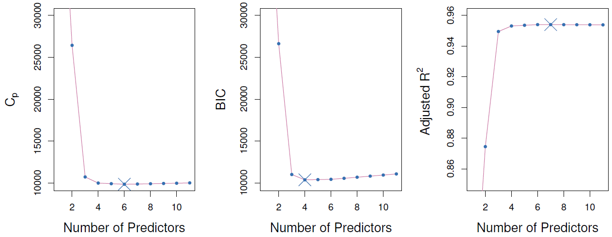

{:refdef: style="text-align:center"}
**Figure 6.3**
{: refdef}

*Daniela:* So again, this is on the Credit data example. And on the x-axis here, we have the number of predictors in each of these figures. And on the y-axis, we have $$C_p$$, BIC-- which stands for Bayesian Information Criterion-- and adjusted $$R^2$$. And again, we'll define all three of these quantities in a minute. But the idea is, roughly speaking, we want these quantities to be small. So we prefer a model in which $$C_p$$, BIC are as small as possible. And actually, I misspoke. We want adjusted $$R^2$$ to be as large as possible. So if I look at the shape of this curve, I can see that $$C_p$$ is minimized when we look at the model with six predictors. BIC is smallest when we look at the model with four predictors. And adjusted $$R^2$$ is smallest when we look at a model with six predictors again. So that suggests that we should use somewhere between four and six predictors. And actually, if we look at these figures a little more closely, we can see that basically these curves are more or less flat after we get to around three or four predictors. And so on the basis of these figures, I would say I really don't think we need more than three, or max four, predictors to do a good prediction on this Credit data. And now I've scribbled all over this slide. Oops. 

*Tibshirani:* On this picture-- it's hard to see here-- but actually, the curve is going upright as we go to the right, despite the fact it's flat. Unlike the RSS curve. 

*Daniela:* Exactly. It's a little hard to see, but this is slightly increasing. Its smallest with four predictors, and then it goes up a little bit. But I don't really think that there's compelling evidence here that four is really better than three or better than five. So if it were me, I think simpler is always better. So I would probably choose a model with three predictors, maximum four predictors. (Agreed.) 

##### Slide 20:

*Daniela:* So now we're going to talk about Mallow's $$C_p$$. And once again, this is an adjustment to the training $$R^2$$, the training RSS that gives us an estimate for the test RSS. And it's defined in this formula.

$$C_p=\frac{1}{n}(\text{RSS}+2d\hat{\sigma}^2)$$

So let's say we're looking at a model with $$d$$ predictors. So then we're going to calculate the RSS for that model with $$d$$ predictors. And we're going to add to the RSS two times $$d$$, where again, $$d$$ is the number of predictors, times $$\hat{\sigma}^2$$, where $$\hat{\sigma}^2$$ is an estimate of the variance associated with each error $$\epsilon$$ in the linear model. And so the idea is we can calculate $$C_p$$ for those models, $$\mathcal{M}_0$$, $$\mathcal{M}_1$$, $$\mathcal{M}_2$$, through $$\mathcal{M}_p$$, that we were looking at a few minutes ago. And we can just choose the model with the smallest $$C_p$$. So if we're looking at the model $$\mathcal{M}_3$$, then that model contains three predictors and an intercept, so that model has $$d$$ equals 4. And we can calculate the RSS for the model $$\mathcal{M}_3$$. And we just calculate $$\hat{\sigma}^2$$. There's a formula for that. It gives us the $$C_p$$. And out of all these models, $$\mathcal{M}_0$$ to $$\mathcal{M}_p$$, we're just going to choose the one for which the $$C_p$$ is smallest because that's the one we believe is going to have the smallest test set RSS. 

*Tibshirani:* And just to clarify a bit about the $$\hat{\sigma}^2$$-- first of all, if $$p$$ is bigger than $$n$$, we're going to have a problem. Because typically, $$\hat{\sigma}^2$$, the same estimate is used for all models being compared. So usually what you do is you fit the full model, all $$p$$ predictors, then you take the mean square residual for that model to give you $$\hat{\sigma}^2$$. So that's the way you do it. Of course, that's going to create a problem when $$p$$ is bigger than $$n$$ because that full model was not defined and the error will be zero. So already we see that $$C_p$$ is restricted to cases where you've got $$n$$ bigger than $$p$$. That's right. And even if $$p$$ is close to $$n$$, you're going to have a problem because your estimate of $$\sigma^2$$ might be far too low. 

*Daniela:* So that's Mallow's $$C_p$$. And then another very closely related idea is called the AIC criterion. So the AIC stands for Akaike Information Criterion. Akaike was the name of the guy who came up with this idea. And the way that this is defined is:

$$\text{AIC}=-2\text{log}L+2\cdot d$$

Where $$d$$ is, once again, the number of predictors in the model that I'm looking at. So for $$\mathcal{M}_3$$, $$d$$ equals 4. And now capital $$L$$ here is the maximized value of the likelihood function for the estimated model. So this looks a little bit complicated. And in fact, it's written in this very general way because AIC is a quantity that we can calculate for many different model types, not just linear models, but also logistic regression and so on. But it turns out that in the case of a linear model, $$-2\text{log}L$$ is just equal to RSS over $$\hat{\sigma}^2$$. So if you look at that and you plug in RSS over $$\hat{\sigma}^2$$ for $$-2\text{log}L$$, then what you realize is that AIC and Mallow's $$C_p$$ are actually proportional to each other. And since we're just going to choose the model for which $$C_p$$ is smallest, that's equivalent to choosing the model for which AIC is smallest. So AIC and $$C_p$$ are actually really the same thing for linear models. But for other types of models, these things are not the same and AIC is a good approach. 

##### Slide 21:

*Daniela:* So we've talked about $$C_p$$ and AIC. And another very related idea here is the BIC, where B stands for Bayesian. So this is the Bayesian Information Criterion. And it's like the AIC and Mallow's $$C_p$$, but it comes from sort of a Bayesian argument. And once again, we've got a very similar formula.

$$\text{BIC}=\frac{1}{n}(\text{RSS}+\text{log}(n)d\hat{\sigma}^2)$$

We calculate the residual sum of squares. And then we add an adjustment term which is the log of the number of observations times $$d$$, which is once again, the number of predictors in the model I'm looking at. So like $$\mathcal{M}_3$$-- since it has three predictors and an intercept-- $$\mathcal{M}_3$$ has $$d$$ equals 4. And once again, $$\hat{\sigma}^2$$ is an estimate of the error variance which may or may not be available depending on whether $$n$$ is greater than $$p$$ or less than $$p$$. And so once again with BIC, we're estimating the test set RSS, or rather the average test set RSS across the observations. And so we want it to be as small as possible, so we're going to choose the model with the smallest BIC. So what's the difference between BIC and AIC? Well, remember AIC, it looked just like this, but in AIC, this term was actually $$2d\hat{\sigma}^2$$. So the only difference between AIC and BIC is the choice of log$$n$$ versus 2. BIC has this log$$n$$ here and AIC has a 2. And so in general, if $$n$$ is greater than 7, then log$$n$$ is greater than 2. And so what that means is that if you have more than seven observations in your data, BIC is going to put more of a penalty on a large model. And in other words, BIC is going to tend to choose smaller models than AIC is. So BIC is going to give you the selection of models that have fewer variables than either $$C_p$$ or AIC. So we see that these three ideas, BIC, $$C_p$$, and AIC, are really almost identical. They just have slightly different formulas. We want to minimize them. And they all require an estimate for $$\hat{\sigma}^2$$, which again, is not available necessarily. It's only going to be available if $$n$$ is greater than $$p$$. 

##### Slide 22:

*Daniela:* So the last of these approaches that I'm going to talk about that sort of indirectly adjusts the training error to get an estimate of the test error is the adjusted $$R^2$$. And so we saw in chapter three the idea of the $$R^2$$. And remember, $$R^2$$ was defined, just as a little refresher, $$R^2$$ is defined as:

$$\text{Adjusted }R^2=1-\frac{\text{RSS}/(n-d-1)}{\text{TSS}/(n-1)}$$

Where-- in case we need a reminder-- the total sum of squares is just the sum of $$y_i$$ minus $$\bar{y}$$ squared.

$$\text{TSS}=\displaystyle\sum_{i}(y_i-\bar{y})^2$$

So $$\bar{y}$$ is the average response. $$y_i$$ is the $$i^{\text{th}}$$ response. And we're just taking the sum of those squared values. And so this was the $$R^2$$. And as we know, a big $$R^2$$ indicates a model that really fits the data well. But unfortunately, you can't compare models of different sizes by just taking the one with the biggest $$R^2$$ because you can't compare the $$R^2$$ of a model with three variables to the $$R^2$$ of a model with eight variables, for instance. So the adjusted $$R^2$$ tries to fix this. And the way that it does that is that it makes you pay a price for having a large model. So the idea is adjusted $$R^2$$ adjusts the $$R^2$$ so that the values that you get are comparable even if the numbers of predictors are different. So the way that it does this is by adding a denominator to RSS and to TSS in this ratio. So instead of just taking 1 minus RSS over TSS, we take 1 minus RSS over $$n$$ minus $$d$$ minus 1, divided by TSS over $$n$$ minus 1, where again, $$d$$ is the number of variables in the model that we're considering. And so basically, the idea here is that when $$d$$ is large, this denominator is really large. And so you're dividing the RSS by a really big number, and you're going to end up with the smaller $$R^2$$. So what's happening is that we're going to pay a price for having a large model in the adjusted $$R^2$$, unlike the classical $$R^2$$, where we pay no price for having a large model with a lot of features. So the adjusted $$R^2$$, we want it to be large. If it's large, then that indicates a model that really fits the data well. And again, the idea is that adjusted $$R^2$$ is something that we can actually compare in a meaningful way, regardless of the number of predictors in the model. 

*Tibshirani:* Something I just noticed-- it doesn't require an estimate of $$\sigma^2$$. That's good. And you can also apply it when $$p$$ is bigger than $$n$$. 

*Daniela:* Yeah, that's right. So that's a really nice advantage of RSS. As Rob said, we don't need to estimate $$\sigma^2$$, which can be a problem. And in principle, we can apply it when $$p$$ is larger than $$n$$. So we want a large value of adjusted $$R^2$$. And so the adjusted $$R^2$$, in practice, people really like it. It tends to work really well. Some statisticians don't like it as much as $$C_p$$, AIC, and BIC. And the reason is because it sort of works well empirically, but some statisticians feel that it doesn't have the theoretical backing of some other approaches. What do you think of that, Rob? 

*Tibshirani:* That's true. There is a bias in our field towards things which have more theory behind them. And I guess this is an example of that. 

*Daniela:* But one nice thing about adjusted $$R^2$$ is if you're working with someone who's not a statistician-- like scientists who aren't statisticians are really familiar with $$R^2$$. And so to understand $$R^2$$, adjusting $$R^2$$ is just a really small one off. And it's kind of easier to explain to someone, in a certain sense, than AIC, $$C_p$$, or BIC. And so that's one really nice thing about it. But adjusted $$R^2$$, you can't really generalize to other types of models. So if you have logistic regression, you can't do this. 

*Tibshirani:* So you'll see in the next section, we'll talk about cross-validation, which is our favorite method, which you can generalize. One major advantage is you don't need to know $$d$$. So the $$d$$ in this method, in adjusted $$R^2$$ and $$C_p$$ and AIC, is the number of parameters. But in some methods like regression and the Lasso, which we'll also talk about again in a few minutes, the value of $$d$$ is not even known. So we can't apply any of these methods. But cross-validation can still be applied. 

*Daniela:* Yeah, that's true. So in this whole discussion, I've been talking about least squares models. And then I've been occasionally mentioning logistic regression. But I could have some totally crazy model that I come up with that is like something that nobody's ever seen before. And it would be totally hopeless to apply an AIC type of idea to it or an adjusted $$R^2$$ type of idea. But I can always perform cross validation, or the validation set approach, no matter how wacky my model is. And that's actually a really nice thing about those two approaches.

## Estimating Test Error Using Cross-Validation 

<iframe width="560" height="315" src="https://www.youtube.com/embed/3p9JNaJCOb4" frameborder="0" allowfullscreen></iframe>

##### Slide 23:

*Tibshirani:* So validation and cross-validation we actually talked about in quite a bit of detail in this section along with the bootstrap. So I won't cover it in much detail now. Just to remind you, so the basic problem. We have a sequence of models like, for example, from subset regression-- forward stepwise or backward stepwise-- each one with a model size $$K$$. And we want to choose the best model size. We just talked about some methods based on adjusting the RSS, $$C_p$$, AIC, and BIC. Validation and cross validation, rather than making an adjustment, they're more direct. So just to remind you what the idea of the validation is, we divide the data up into two parts, a training set and a validation part. So let's just draw that. So here's my training part at random. Maybe I'm going to choose, say 1/2 or 3/4 to be my training set and the balance to be the validation set. And then the basic idea is we're going to fit the models of various sizes, of various $$K$$. For example, if it's forward stepwise I'm going to find the best forward stepwise model of each size $$K$$ on my training set. And then evaluate its error on the validation part. And the validation error as a function of $$K$$ will be what I use to estimate prediction error and to choose the model size. So this is validation. And the cross-validation is much like that, except it's sort of a $$K$$ act play. So it's five fold cross-validation. I'll divide the data up into five parts. Two, three, four, five. And then at each stage of the play, four of the parts are the training set. So let's say these first four parts are the training set. And this last guy is the validation in this phase. So I will fit the models of a all size $$K$$ to these four parts of the data, the train set, and evaluate the error on the validation part. And I'll do that in turn for the five different possibilities. Where at each stage one of the pieces is the validation and the other four pieces are the training. And then we'll summarize the results together to get an idea of the error as a function of $$K$$. That's called cross-validation error estimate. And then we'll find the minimum of that curve. So again, I said that quickly because we've gone over that in detail in the previous section of this course. So here I have said this again in words on the second bullet item. So either using validation or cross-validation we'll get an idea of the error for each model size $$K$$. And then select the $$K$$ that gives us the lowest test error over the validation part of the process. And this is actually a very attractive approach. And we've said this already, but it's good to say it again. Compared to the other method we've talked about, there's a number of advantages. One big advantage, it doesn't require an estimate of $$\sigma^2$$. You might think that's a small advantage, but it's actually quite important. Because if $$p$$'s bigger than $$n$$, as it is quite often in data that we see these days, to get an idea of an estimate of $$\sigma^2$$ is very difficult. We can't fit a full model, because a full model will totally saturate and give an error of 0. So we have to pick some kind of a smaller model. But it's quite arbitrary the model we pick. And it's hard to know-- we'd like to fit a model that has all the good variables and leaves out the noise variables. But we don't know, of course, what's the signal and what's the noise. If we did know that we wouldn't have to find these models. So getting an idea of $$\sigma^2$$ seems like it may be a trivial matter. But it's actually very challenging for models, for situations with large numbers of features. And that's actually challenging to the point where it's an open area in statistical research. So I'm an associate editor for a journal. And we get submissions from statisticians at top tier universities who are coming up with ways to estimate $$\sigma^2$$. So maybe in 10 years this will no longer be a challenge. But right now it's really hard to do. And that's actually one of the reasons it's so much fun to be a statistician. Because we get new kinds of data, for example, high dimensional data with large numbers of variables. And it presents challenges to-- things which were simple with smaller numbers of variables now become very challenging but are very important. So the technology and the kinds of data that we see bring new challenges to our field every day. So cross validation helps us solve that problem by avoiding an estimate $$\sigma^2$$. We don't need to plug in $$\sigma^2$$ anywhere. The other point is you don't need to know $$d$$. Remember these previous formulas, for example, the adjusted $$R^2$$ had a $$d$$ in it. And $$C_p$$, and AIC, and BIC all had the number of parameters. Well again, that might seem sort of a silly thing. Well, of course you know the number of parameters in your model. Well, that's true when your model is a linear model. And you're choosing predictors as coefficients. But for methods like ridge regression and Lasso, which are shrinkage methods we'll talk about next, it's not at all clear what $$d$$ is. And it's actually another whole area of research, figuring out what is meant by $$d$$, the number of parameters, in a model which is not fit by least squares. So again, cross-validation finesses that problem by not requiring you to plug in a value for $$d$$. So $$d$$ and $$\sigma^2$$ are both challenges. And cross-validation relieves the worry of having to come up with good estimates of those. So I've said all these things. 

##### Slide 24:

*Tibshirani:* So let's see what it looks like on the credit data example. So again, the number predictors.

{:refdef: style="text-align:center"}
**Figure 6.4**
{: refdef}

Here we apply to the square root BIC, just to make it comparable to the other two estimates, the validation set error and the cross-validation error. So here we did, actually, validation set was 3/4, 1/4. So 3/4 of the data was randomly chosen to be the training set, 1/4 was the validation set. And we see the error tracked as a function of the number of predictors. We have marked the minimum. In here it's about six predictors. cross-validation, I think this was-- do I say here? A 10 fold cross-validation. We like 5 or 10 fold cross-validation in general. They're good values. It's producing about the same model size, 6, as the minimum. Again, the curve is very flat. It's hard to see here. It's rising very slightly to the right. But there's not much to choose between, say, 4 and 11 predictors. They give you basically the same error. BIC as is often the case, remember we said when compared to AIC it imposes a stronger penalty on the model size. It tends to produce models which are a little bit smaller. And it did so here. Here's it's about 4. But again, the curve is so flat. There's not much we can really say about these models between three and eleven predictors. And actually, I mention at the bottom here the ones standard error rule. We talked about this a bit in the cross-validation section. Let me just remind you what that is. The one standard error rule says, well we're not going to put the actual minimum of the curve. But we'll acknowledge the fact that the curves have variation. Because they're random variables just like the data are. They're functions of the data. So the one standard error rule. Let's draw it just in pictures here. So let's suppose we have one of these curves. Here's the actual minimum. The standard error of the curve which we didn't indicate in these examples but we should have, we can get. The cross-validation just an average over the $$K$$ folds. So the standard error of that mean of $$K$$ fold things, like $$K$$ is 10. The standard error of those ten numbers give us the standard error of this curve. So we could draw plus or minus one standard errors from the minimum. So the one standard error rule says-- remember this is the number of predictors along the horizontal axis. Says don't choose the minimum. But take the simplest model that comes within one standard error of the minimum. So that would be, we'd come across to here and we'd choose this model. So the idea being, well, if these models are within one standard error of each other, we really can't tell them apart on the basis of the data. Because the error is almost the same. So all else equal, we'd rather have a simpler model. So that's why we moved to a model to the left here which has fewer predictors. And its error is no more than one standard error away from the error of the best model. So the one standard error rule, which is pretty popular now, is not use the model with the absolute minimum. But use a simpler model that comes within one standard deviation of the minimum. 

##### Slide 25:

*Tibshirani:* So the rationale for this, again I've said it, is that if the models are within one standard error of each other, let's choose the simplest one. Because it's easier to interpret.

## Shrinkage Methods and Ridge Regression 

<iframe width="560" height="315" src="https://www.youtube.com/embed/cSKzqb0EKS0" frameborder="0" allowfullscreen></iframe>

##### Slide 26:

*TIbshirani:* So welcome back. So we've talked about a forward stepwise selection and backward stepwise and all subsets as well as some techniques for choosing the model size. All of those methods fit by least squares. So whenever you consider model, the subset, we always fit the coefficients by least squares. Now we're going to talk about a different method called shrinkage-- namely two techniques, the ridge regression and Lasso. And as we'll see that these methods do not use full least squares to fit but rather different criterion that has a penalty that will shrink the coefficients towards, typically, 0. And we'll see these methods are very powerful. In particular, they can be applied to very large data sets, like the kind that we see more and more often these days where the number of variables might be in the thousands or even millions. 

*Daniela:* And one thing that's worth mentioning is that ridge regression, Lasso, and shrinkage methods like this are a really contemporary area of research right now. There's papers every day written by statisticians about variants of these methods and how to improve them, as opposed to some of the other things that we've covered so far in this course where the ideas have been around for 30, 40 years. 

*Tibshirani:* Although, actually, ridge regression I think was invented in the '70s. But it is true that it wasn't very popular for many, many years. It's only with the advent of fast computation in the last 10 years that it's become very popular along with the Lasso. So some of these methods are old. Some are new. But they're really quite hot now in their applications. 

##### Slide 27:

*Tibshirani:* So ridge regression-- well, let's first of all just remind ourselves what least squares is, the training error. So the RSS or training error is the sum of squares of deviation between $$y$$ and the predictions. So when you do least squares, we simply find the coefficients that make this as small as possible. Now with the ridge regression, we're going to do something a little bit different. We're going to use training error, RSS. We're going to add a penalty to that, namely a tuning parameter, which we'll choose in some ways-- and as you can guess, it will be by cross-validation-- times the sum of the squares of the coefficients.

$$\text{RSS}=\displaystyle\sum_{i=1}^n\left(y_i-\beta_0-\displaystyle\sum_{j=1}^p\beta_jx_{ij}\right)^2$$

So we're going to try to make this total quantity small, which means we're going to try to make the fit good by making the RSS small. But at the same time, we're going to have something which is going to push us the other direction. This is going to penalize coefficients which get too large. The more non-zero a coefficient is, the larger this is. So we're going to pay a price for being non-zero. And we'll pay a bigger price the larger the coefficients are. So it's basically fit versus the size of the coefficients. And that penalty is called a shrinkage penalty because it's going to encourage the parameters to be shrunk toward 0. And the amount by which they are encouraged to be 0 will be determined by this tuning parameter, $$\lambda$$.

$$\displaystyle\sum_{i=1}^n\left(y_i-\beta_0-\displaystyle\sum_{j=1}^p\beta_jx_{ij}\right)^2+\lambda\displaystyle\sum_{j=1}^p\beta_j^2=\text{RSS}+\lambda\displaystyle\sum_{j=1}^p\beta_j^2$$

Let's go back to this. If $$\lambda$$ is 0, of course, we're just doing least squares, because this term will be 0. But the larger $$\lambda$$ is, this tuning parameter, the more and more of a price we'll pay for making these coefficients non zero. If we make $$\lambda$$ extremely large, then at some point, the coefficients are going to be very close to 0 because they'll have to be close to 0 to make this term small enough. No matter how good they help the fit, we're going to pay a large price in the penalty term. 

##### Slide 28:

*Tibshirani:* So in other words, this term has the effect of shrinking the coefficients towards 0. And why 0? Well 0 is a natural value. Remember 0, of course, if a coefficient is 0, the feature is not appearing in the model. So if you're going to shrink towards some value, a 0 is a natural place to shrink towards. And the size of the tuning parameter, it trades off the fit versus the size of the coefficients. So as you can imagine, choosing a good value for the tuning parameter, $$\lambda$$, is critical, and cross-validation is what we're going to use for this. So let's see what happens for the credit data. 

##### Back to Slide 27:

*Tibshirani:* Well, let me just go back here. So if we think of this for a fixed value of $$\lambda$$, we have to define the smallest value of this criterion. And again, it's just an optimization problem with an, actually, very simple solution. And there are computer programs for doing that. So I've used such a program. And we'll talk, actually, in the R session about an R function for ridge regression. 

##### Slide 29:

*Tibshirani:* But let's see what it looks like in this example, in the credit example.

{:refdef: style="text-align:center"}
**Figure 6.5**
{: refdef}

So here you've plotted the coefficients, standardized coefficients versus $$\lambda$$, for the credit data. And let's see what happens. Well first of all, on the left-hand side, $$\lambda$$ is close to 0, so there's almost no constraint on the coefficients. So here we're pretty much getting the full least squares estimates. And now, as $$\lambda$$ gets larger, it's pushing the coefficients towards 0 because we're paying more and more of a price for being non-zero. In the extreme, over here, where $$\lambda$$ is a little more than 10,000, the coefficients are all essentially 0. In between, they're shrunken towards 0 as $$\lambda$$ gets larger, although not uniformly so. The rating variable actually gets bigger for a while and then shrinks back down to 0. 

*Daniela:* And I remember when I was a student, seeing this figure again and again-- actually, it was in a class that Rob was teaching-- and being totally confused for three lectures. So I just want to spare everyone this confusion in case anyone shares the confusion I had. So if we look here, this red line indicates the spot at which $$\lambda$$ equals 100. And at that spot, the income coefficient takes on a value of negative 100. These other six coefficients here are all around 0. Student takes on a value of around 100. Limit and Rating take on values of around 250. And so the point is, what we're plotting here is a ton of different models for a huge grid of $$\lambda$$ values. And you just need to choose a value of $$\lambda$$ and then look at that vertical cross-section. 

*Tibshirani:* Good. So as Daniella said, if we chose the value of $$\lambda$$ about 100, then it seems like it chooses about three non-zero coefficients, the black, the blue, and the red-- oh, maybe four. And then these guys here are basically essentially 0, the gray ones. 

*Daniela:* So they're not quite 0, but they're small. 

*Tibshirani:* Right-- exactly. So an equivalent picture on the right now, we've plotted the standardized coefficient as a function of the $$\ell2$$ norm, the square root of the sum of the squares of the coefficients divided by the $$\ell2$$ norm of the full least squares coefficient. (So Rob, what's the $$\ell2$$ norm?) OK, so the $$\ell2$$ norm of the vector $$\beta_1$$ through $$\beta_p$$ in written this way-- so the $$\ell2$$ norm. 

$$\|\beta\|_2=\sqrt{\sum_{j=1}^{p}\beta_j^2}$$

So it's the square root of the sum of $$\beta_J$$ squared. So that's the $$\ell2$$ norm, and so that's it. So we see here, when the $$\ell2$$ norm is 0-- so when the coefficients are all 0, the $$\ell2$$ norm is 0-- that corresponds to the right side of this picture. So the $$\lambda$$ is very large here. It's large enough that it's driven the $$\ell2$$ norm down almost to 0. So the coefficients are basically 0. And then on the right, $$\lambda$$ is very small, and we get the full least squares estimates. And in between, we get, again, a shrunken coefficient. So these two pictures are really the same, but they've been flipped from left to right. And the x-axes are parametrized in a different way. So Rob, why does this x-axis on the right hand side go from 0 to 1? Why does it end at 1? It ends at 1 because we're plotting as a function of this standardized $$\ell2$$ norm. So at the right-hand side, we have basically the full least squares estimate, so these numerator and denominator are the same. 

*Daniela:* Right. So on the right-hand side here on this right hand plot, $$\lambda$$ is 0. And so your ridge regression estimate is the same as your least squares estimate. And so that ratio is just 1. 

##### Slide 30:

*Tibshirani:* Exactly. I think we've actually just said all this, thanks to the questions from Daniella. So there's the $$\ell2$$ norm defined. I wrote it in the previous slide. And that's what was used for the plotting axis. 

##### Slide 31:

*Tibshirani:* One important point with ridge regression is that it matters whether you scale the variables or not. Now just to remind you, if you just do standard least squares, so standard least squares is what we call *scale-invariant*. If I multiply feature by a constant, it's not going to matter, because I can divide the coefficient by the same constant, and I get the same answer. So in least squares, the scaling of the variable doesn't matter. So whether I measure a length in feet or inches is not going to matter because the coefficient can just account for the change in units. But it's a little bit subtle here now. For ridge regression and penalized methods like ridge regression, the scaling does matter in an important way. And that's because, if we go back to the definition of ridge regression, these coefficients are all put in a penalty together, and there's a sum of squares. So if I change the units of one variable, it's going to change the scale the coefficients. Well if I change the units of one variable, the coefficient has to change to try to accommodate for that change. But it's competing against the coefficients for other features. So because they're all put together in their penalty in a sum, the scale of the features matters. And as a result, it's important to *standardize* the predictors in regression before applying ridge regression. So in most cases, before you do a ridge regression, you want to standardize the variables. What does that mean, to standardize the variables? Well, you take the variable or feature, and you divide it by the standard deviation of that feature over all the observations. And now the standard deviation of this guy is 1. And you do that for each feature. And that makes the features comparable and makes their coefficients comparable. 

##### Slide 32:

*Tibshirani:* So let's see an example of ridge regression compared to least squares.

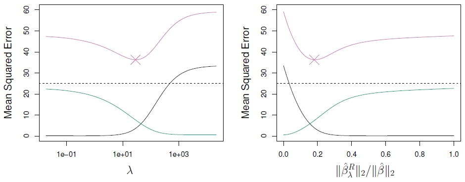

{:refdef: style="text-align:center"}
**Figure 6.6**-- *Black: Squared bias, Green: Variance, Purple: Mean squared error*
{: refdef}

Here's a simulated example with 50 observations and 45 predictors in which all of predictors have been given non-zero coefficients. So on the left, we see the bias in black, the variance in green, and the test error in purple for a ridge regression as a function of $$\lambda$$ and the same thing on the right as a function of the $$\ell2$$ norm of ridge regression divided by the $$\ell2$$ norm of full least squares. So again, these are the same pictures, essentially, but the x-axes have been changed. But let's look over here. We can see that the bias-- so full least squares is over here on the left. $$\lambda$$ is close to 0. As we make $$\lambda$$ larger, the bias is pretty much unchanged, but the variance drops. So a ridge regression, by shrinking the coefficient toward 0, controls the variance. It doesn't allow the coefficient to be too big, and it gets rewarded because the mean square error, which is the sum of these two, goes down. So here's the place where the mean square is minimized, and it's lower than that for, then, the full least squares estimate. So in this example, ridge regression has improved the mean square error of full least squares by shrinking the coefficients by a certain amount. And we see the same thing in this picture. 

*Daniela:* And actually, this U-shaped curve that we see for the mean squared error in this figure in purple comes up again and again where, when we're considering a bunch of different models that have different levels of flexibility or complexity, there is usually some sweet spot in the middle that has the smallest test error. And that's really what we're going for. So that's what's marked as an X in these two figures. 

##### Jump to Slide 29:

*TIbshirani:* So I want to go back to this picture of ridge (Figure 6.5). And let me clear the-- and one thing you might have notice here and that we mentioned is that the coefficients are never exactly 0. They're close to 0. Here, these gray guys are all close to 0. But they're never exactly 0. As a matter of fact, you can show mathematically that, unless you're extremely lucky, you're not going to get a coefficient exactly of 0. So ridge regression shrinks things in a continuous way toward 0 but doesn't actually select variables by setting a coefficient equal to 0 exactly. 

*Daniela:* But it seems like a pity in this example because all those gray variables are so tiny. It would just be more convenient if they were 0. 

*Tibshirani:* Which is a great set-up for the next method, called the Lasso.

## The Lasso

<iframe width="560" height="315" src="https://www.youtube.com/embed/A5I1G1MfUmA" frameborder="0" allowfullscreen></iframe>

##### Slide 33:

*Tibshirani:* And we just said this, that one drawback of ridge regression, it doesn't actually select variables, and set things to zero, when, as you said, in situations like that previous picture, when things are small, it'd be nice if you were able to say if these are zero, we can forget about them. So the Lasso is a more recent technique for shrinking coefficients in regression. It looks very much like ridge regression, but with one change. So here's the Lasso criterion. 

$$\displaystyle\sum_{i=1}^n\left(y_i-\beta_0-\displaystyle\sum_{j=1}^p\beta_jx_{ij}\right)^2+\lambda\displaystyle\sum_{j=1}^p|\beta_j|=\text{RSS}+\lambda\displaystyle\sum_{j=1}^p|\beta_j|$$

Again, we have the RSS as before. Now, we have a penalty, but whereas before, the penalty was the sum of the squares of the coefficients, now it's the sum of the absolute values of the coefficients. So it's a shrinkage towards zero using an absolute value rather than a sum of squares. And this is called an $$\ell1$$ penalty. By analogy to the $$\ell2$$ penalty, the $$\ell1$$ penalty is just the sum of the absolute values. It's a norm, but it's called the $$\ell1$$ norm, rather than the $$\ell2$$ norm. So what's the effect of changing this from a square to an absolute value? It's actually a small change, but it's quite important. 

##### Slide 34:

*Tibshirani:* It turns out that the Lasso, like the ridge, shrinks toward zero. But it has the effect of actually setting the coefficients of variables exactly equal to 0 when $$\lambda$$'s large enough. So it's neat. It shrinks, but also, it does subset selection, in a similar way to best subset selection. So it'll set coefficients to 0 exactly if that feature's not important and $$\lambda$$'s large enough. There's a term for this. It's called *sparsity*. So the Lasso yields what's called sparse models. Models which only involve a subset of the variables. And again, it's a function of this tuning parameter, $$\lambda$$, which, as in ridge regression, we have to choose somehow, and we do so by cross-validation. 

##### Back to Slide 33:

*Daniela:* So wow. The Lasso seems like a really good idea. That's so clever. I wonder who came up with it, Rob? 

*Tibshirani:* Thanks. So Danielle was trying to embarrass me. So this is actually a paper that I wrote in 1996. And at the time, actually, it was published, and didn't get a lot of attention, but in the last, about, 10 years or so, it's become a very hot topic, both in statistics, and computer science, and other areas. And there's been a lot of work in sparsity in general, not just in regression, but the use of $$\ell1$$ penalties in a lot of different areas. I think one reason for its popular now is computation. This computation's, actually, this is what's called a convex optimization. So that's good news. And there's a lot of work in convex optimization, especially in the last 10 or so years. And along with the progress in convex optimization and fast computation, fast computers, people can solve this problem now, a Lasso, for very large values of $$p$$ and $$n$$. 

*Daniela:* And this actually has just been a fun thing that I've even seen. Like, when I started grad school, there was, like, one approach that statisticians were using to fit this model. And this was a famous paper that had just come out when I started, and it was written by Rob, and Trevor, and a few other people at Stanford in statistics. And then, a new paper came out with a better idea, and then 20 more papers came out with better ideas for how to fit this model. And this has suddenly become something that anyone can solve on their laptop, no matter how big your data is, basically. And so it's just become an incredibly useful tool in a way that it even wasn't when I started grad school. 

*Tibshirani:* So we'll talk about the GLM now, which is in our library, which we use a lot in this book, and in the book in the course. And we'll show you how you can solve a problem, like, solve a Lasso using GLM in R. Again, with numbers or variables, it might be in the tens of thousands, you can solve it on a standard desktop computer in less than a minute. So we'll talk about computation later on in the course. But let's first see what it looks like in the same example now. So again, the credit dataset, and we're plotting the standardized coefficients as a function of $$\lambda$$ for the Lasso. Again, we haven't talked about how to choose $$\lambda$$. Now, it's going to be important. We use cross-validation. 

##### Slide 35:

*Tibshirani:* But let's, for now, look at the solutions as a function of $$\lambda$$ for all values of $$\lambda$$. 

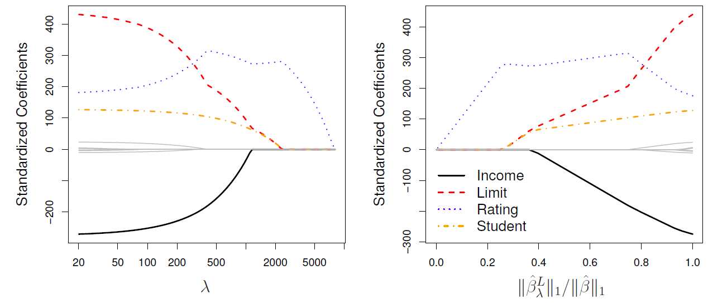

{:refdef: style="text-align:center"}
**Figure 6.7**
{: refdef}

And now you can see, again, when $$\lambda$$ is small, we get, essentially, the full least squares estimates. When $$\lambda$$'s 0, we get exactly least squares, if I plotted this all the way to the left. Now, as we increase $$\lambda$$, we get shrinkage, as we did for ridge regression. But something special happens. At this point, for example, here, beyond this point, all of these gray variables, the coefficients are exactly 0. And whereas, for ridge regression, they were small, but they weren't 0. So actually, it tells us you can throw away all these variables at this point, and just retain these three, the blue, red, and orange. Similarly, this plot shows you the same thing in the other direction. So it's a combination of both shrinkage and selection of variables. 

*Daniela:* And so, one thing that's worth mentioning is that in a lot of applications, selecting variables is actually really important, because let's say I'm working with a doctor who wants to come up with a really good way to test for some particular disease. And he might start out by getting 30,000 gene expression measurements for patients with this type of disease. So he starts out with $$p$$ equals 30,000. And he wants to find a really great model that can be used to test for this disease. But when push comes to shove, and he's actually going to use this test in the clinic, he doesn't want a test that involves all 30,000 genes, because a test like that would be too expensive. It just wouldn't be feasible to actually use. But if he can get a test that works really well that only involves 6, or 8, or 25 genes, that could be a real breakthrough in testing for this disease. And so, just from a practical perspective, the Lasso is just hugely useful, because it allows us to efficiently find these types of sparse models that involve just a really small subset of the features. 

*Tibshirani:* You should be my personal salesman. You're doing a good job. But seriously, and Danielle is right. And I, myself, I use the Lasso in schools, and projects here at the medical school. And it's very satisfying to apply it and to see it helping scientists to find the signal in their data, and come up with interpretable subsets among the thousands of features they present to me. 

##### Slide 36:

*Tibshirani:* So at this point, it might seem like magic. Why it is that just using absolute value penalty gives us this sparsity property. Why do we get exactly 0. And I'm going to show you that in the picture. So let's think about that. First of all, we can formulate the problem in an equivalent way.

$$\displaystyle\min_{\beta}\sum_{i=1}^{n}\left(y_i-\beta_0-\sum_{j=1}^{p}\beta_jx_{ij}\right)^2 \text{ subject to } \sum_{j=1}^{p}|\beta_j|\leq s$$

Rather than putting a penalty, remember, before I had the RSS plus $$\lambda$$ times the sum of the absolute values. An equivalent way to pose the Lasso problem is to say, minimize the RSS with a constraint, a budget, on the total $$\ell1$$ norm of the coefficients. So this is an equivalent problem in the sense that if you give me a budget, s, there's a $$\lambda$$ in the previous formulation that corresponds to the same problem, and vice versa. 

*Daniela:* And by the way, if that looks like a total mystery, if you can reach back to your distant or not so distant past, if you ever took AP calculus, and you saw Lagrange multipliers in high school, this is really something that you might have truly seen in high school calculus a long time ago, but for simpler types of problems. And this is just a more complex application of the same idea. 

*Tibshirani:* But in a way, its bound form is, to me, more intuitive than the Lagrange form, because think of it this way. Suppose that you do a full least squares, and you get a certain answer. And let's suppose the sum of the absolute values of your coefficients is 10. So you give me an answer, and I say, well, actually, I want to make your budget smaller. You've spent too much coefficient. So rather than 10, I want to give you a budget of maybe 5. So now, I ask you to solve the same problem, but you're not allowed to use the coefficients as large as you want. The total budget you have is 5. And that's the bound here. So the Lasso is giving you a budget on that total $$\ell1$$ norm that you can spend, and within that budget, you have to fit as well as possible. And as that budget gets smaller and smaller, the coefficients get smaller and smaller. If the budget is 0, the coefficients have to be 0. If the budget is large enough, you're free use full least squares. But in-between, the budget's going to trade off the size of the coefficients with the fit. So I think that it's quite an intuitive way of looking at these problems. For ridge regression, you get exactly the same analogy, but now the budget is in terms of the sum of squares.

$$\displaystyle\min_{\beta}\sum_{i=1}^{n}\left(y_i-\beta_0-\sum_{j=1}^{p}\beta_jx_{ij}\right)^2 \text{ subject to } \sum_{j=1}^{p}\beta_j^2\leq s$$

So again, this is equivalent to the Lagrange formulation for ridge regression we saw earlier. But the reason I want to bring this up is this following picture, which helps to explain why the Lasso gives sparsity. 

##### Slide 37:

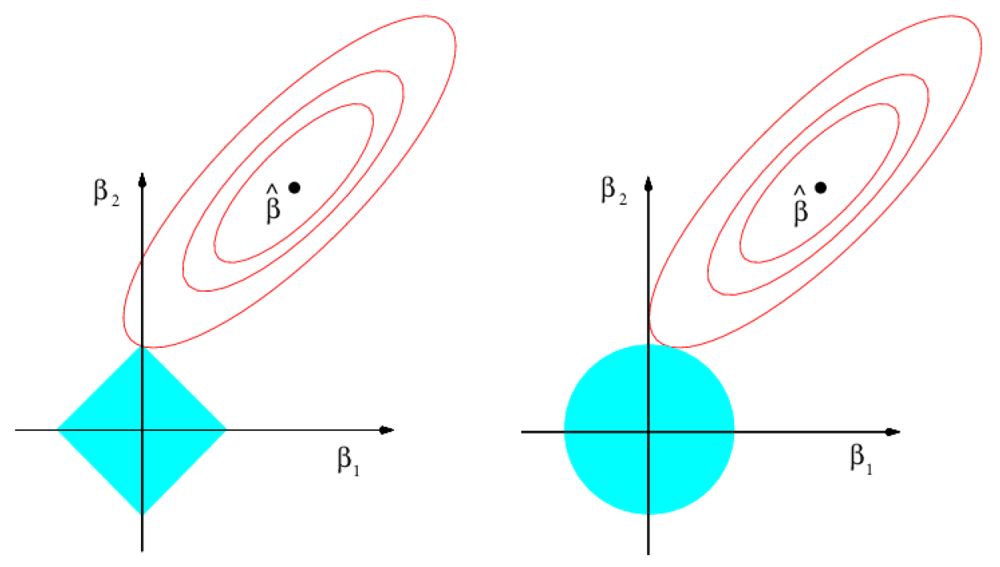

{:refdef: style="text-align:center"}
**Figure 6.8**
{: refdef}

*Tibshirani:* So on the right is ridge regression, and on the left is the Lasso. And this is a bit more math-y than most things in this course, but hang in there, and I think if you do, there'll be some payoff. So this picture is ridge regression. So what's going on here? First of all, $$p$$ is 2, so there's 2 coefficients. And I've indicated here the full least squares estimate, so there's no penalty. I just did least squares on the 2 variables. I'll call this solution $$\hat{\beta}$$, and that's this point. And now, the sums of squares in the RSS, the contours of the function, it's lowest here, because that's the least squares estimate. But now, as I move away, I think of this, like, as maybe a cereal bowl, and I slice the cereal bowl. Here the contours. So here's the value at which RSS is a bigger value. This next counter is a higher contour of RSS. So these are the contours of RSS as I move away from the minimum, OK? And this is the constraint region. Remember in ridge regression, in this formulation here says, you have a budget on the total sum of squares of the base. So the budget is the radius of a circle, right? And here, I have a fixed budget. And so, in words, the ridge problem says find me the first place these contours fit the constraint region. In other words, find me the smallest RSS you can get within the budget defined by this circle. That's ridge reggression. And the solution in this picture is right here. So this is the ridge estimates for this budget and the data, this particular data, and that the data is determining the shape of these contours, and the location of $$\hat{\beta}$$. So ridge regression says, find me the first place the contours hit this constraint region. It's this solution. And you can see, because the constraint region, the sum of squares, is a circle. This is where the sum of squares of $$\beta_1$$, $$\beta_2$$ is less than the budget. It's a circle, right? And unless you're very lucky that you're not going to hit exactly the place where one or the other is 0, right? Now, let's move over to the Lasso. Same picture, least squares, same thing. The sum of squares function is the same, all the same up here. But the constraint equation is now the sum of the absolute values. So rather than a circle, it's a diamond. A diamond has corners. So in this picture, I've hit this corner, and now I get a place where $$\hat{\beta}_1$$ is 0, all right? So here's the Lasso estimate. So in other words, to summarize, the absolute value's going to be a constraint region that has sharp corners. In high dimensions, you have edges and corners. And along an edge or a corner, if you hit there, you get a 0. So this is, geometrically, why you get sparsity in the Lasso. 

##### Slide 38:

*Tibshirani:* Here's our case. 

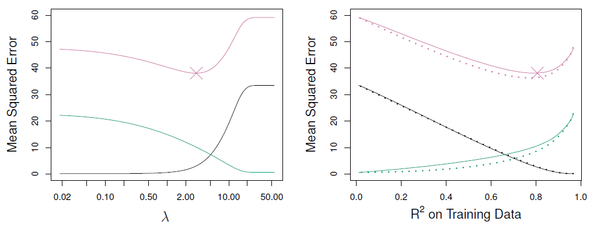

{:refdef: style="text-align:center"}
**Figure 6.9**-- *Black: Sqaured bias, Green: Variance, Purple: MSE* 
{: refdef
{:refdef: style="text-align:center"}}
*Comparison between lasso (solid) and ridge regression (dashed)*
{: refdef}

First of all, returning to the example where we had, was it, 45 variables and they all had nonzero coefficients. So now I'm looking at comparing the Lasso to ridge. So on the left picture, for the Lasso, we see the bias, variance, and mean square error, as a function of $$\lambda$$. And the right, we've superimposed the biased, variance, and mean square error of ridge regression with a broken line, and the Lasso. And we can see that, overall-- so again, the solid line here for mean square error is the Lasso, the broken line is ridge-- they're very similar. Ridge is a little better, perhaps, right? So we don't do much better. We don't do better at all with the Lasso here. And the reason is, is that the true model is not sparse. The true model actually involves 45 variables, all of which of the given nonzero coefficients in the population. So it's not surprising we don't do better than ridge in this case. 

*Daniela:* And one thing we should mention is, on this right-hand panel, the x-axis, is something we haven't seen before, which is the $$R^2$$ on the training data. And the reason we have that x-axis is, because in this figure, on the right-hand side, we're plotting both ridge regression and the Lasso. So it wouldn't make sense to show ridge regression and the Lasso with $$\lambda$$ on the x-axis, because the $$\lambda$$ means two different things for those two models. So when we look at $$R^2$$ on the trading data on the x-axis, that's kind of a universally sensible thing to measure, regardless of what the type of model is. (You must have drawn this picture in the book.0 Yeah, I made this picture, so I remember. Thank you. Yeah. OK. I would have noticed that detail otherwise.

##### Slide 39:

*Tibshirani:* OK. So now here's a situation where we do perform better with the Lasso.

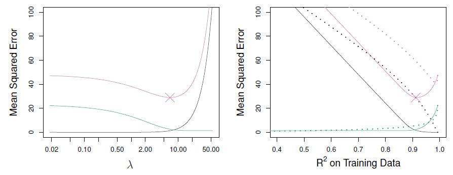

{:refdef: style="text-align:center"}
**Figure 6.10**
{: refdef}

And this is a case where, now, in the population, only two of the predictors have nonzero coefficients. So in the previous situation, it was dense, or non-sparse. This situation is sparse. There's only two predictors in the true model that are nonzero coefficients. And now, we can see what happens. Well, the Lasso's mean square error here is minimized for quite a large value of $$\lambda$$, because it wants to make the model sparse, as it needs to. There's only two nonzero coefficients. And now, when we compare the Lasso to ridge-- remember ridge is the broken line, and the Lasso is a solid line-- you can see we did quite a bit-- here's the Lasso's mean square area, and ridge is here. You can see we're doing quite a bit better using the Lasso in this situation. And again, it's not surprising. The true model is sparse. So it pays to use a technique which encourages sparse models coming out of its estimation. Whereas, with ridge, we don't get a sparse model, we get a dense model. 

##### Slide 40:

*Tibshirani:* So in conclusion, comparing these two techniques, as is usually the case in most things in statistics, and science in general, there's no simple rule that means that you should always use one technique over another. It depends. You always hear that from statisticians, it depends. Well, it depends on the situation. In this particular case, if the true model is quite dense, most predictors have nonzero coefficients, we expect to do better with ridge. If the true model is quite sparse, only few coefficients are nonzero, then the Lasso can be expected to do better. Of course, we don't know that usually. We hope, actually, that things are sparse, because life is simpler then. But going into a data analysis, we have no idea whether the true number of nonzero coefficients is large or small. So it's typical that you would apply both methods, and use cross-validation to determine the best model coming out of each method. And then compare the cross-validated error for the two methods.

## Tuning Parameter Selection for Ridge Regression and Lasso 

<iframe width="560" height="315" src="https://www.youtube.com/embed/xMKVUstjXBE" frameborder="0" allowfullscreen></iframe>

##### Slide 41:

*Tibshirani:* So let's talk a bit about selecting the tuning parameter for Ridge Regression and the Lasso. The first point is that it's important that the $$\lambda$$ very strongly determines the solution over a broad spectrum. When $$\lambda$$'s 0, we get full least squares. There's no regularization. When $$\lambda$$'s infinity, we get a 0 solution in both cases. So choosing $$\lambda$$ is extremely important. And cross validation is a good technique for doing that. Note, also, that we couldn't use the other methods, because the $$d$$ isn't known. What other methods am I talking about? $$C_p$$ and AIC and BIC-- they all require a number of parameters $$d$$. And it's not clear what $$d$$ is now. That's actually something interesting to think about. Suppose I've done a Ridge Regression. I've started with the 45 variables so I can acquire that data. I've used a certain $$\lambda$$. Let's go back to that just so I can point at something, an example. 

##### Jump to Slide 2:

*Tibshirani:* Here's our Ridge example. Suppose I decide to use the $$\lambda$$ of 100. And I'm here. And I ask you, what's for the $$d$$ for that model? How many parameters have I fit? Well, if I count the number of parameters, the number of nonzero coefficients, it's still the full number, 11, because none of the coefficients are 0. So in a sense, all of my variables are still there. So my $$d$$, number of parameters, is still $$p$$, 11. But that doesn't somehow seem right, because I've shrunken the coefficients, so the number of degrees of freedom isn't as large. So there's a bit of a subtle point here that the number of parameters is not just how many parameters I've used, but how I fit them. So with Ridge Regression and Lasso, the shrinkage actually affects the very idea of what we mean by number of parameters. 

##### Slide 41:

*Tibshirani:* So that was a long way of saying that for selecting the tuning parameter for Ridge Regression and Lasso, it's really important to use a method that doesn't require the value of $$d$$, because it's hard to know what $$d$$ is. So cross-validation fits the bill perfectly. We do exactly what we did for the other methods. For a subset selection, for example, we divide the data up into$$K$$parts. We'll say$$K$$equals 10. W fit the model on nine parts, say, we apply Ridge Regression for a whole range of $$\lambda$$s, for the nine parts. And then we record the error on the 10th part. We do that in turn for all 10 parts, playing the role of the validation set. And then we add up all the errors together, and we get a cross-validation curve as a function of $$\lambda$$. Same for the Lasso-- so conceptually, cross-validation is exactly the same as we applied it for other methods. 

##### Slide 42:

*Tibshirani:* So let's see what it looks here for Ridge Regression.

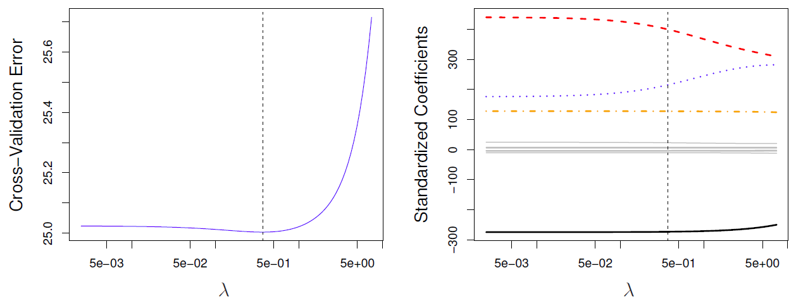

{:refdef: style="text-align:center"}
**Figure 6.11**
{: refdef}

Here's the result of cross-validation-- I'm not sure. It was either five or 10 fold. We can check. Here's cross-validation as a function of $$\lambda$$. Again, remember, $$\lambda$$ equals small means, essentially, the least squares model, full least squares over here. When $$\lambda$$ equals large, it means the coefficients have been driven to 0. So this is the cross-validation error as a function of $$\lambda$$. And the minimum is occurring around here, right around 0.05. Here's the same thing now, but we plot it as a functional of $$\lambda$$ of the standardized coefficient. So here are the coefficients for each of the predictors, their profiles, and we see how they vary as a function of $$\lambda$$. So again, over here, there's full least squares. And here, they've been moved to the right. They've shrunken. And at the minimum value of the curve, this broken line, we get a bunch of guys which are essentially 0, but not exactly 0, because this is Ridge, not Lasso. And then here are the coefficients for the three active variables. 

##### Slide 43:

*Tibshirani:* And this is the simulated data with N equals 50.

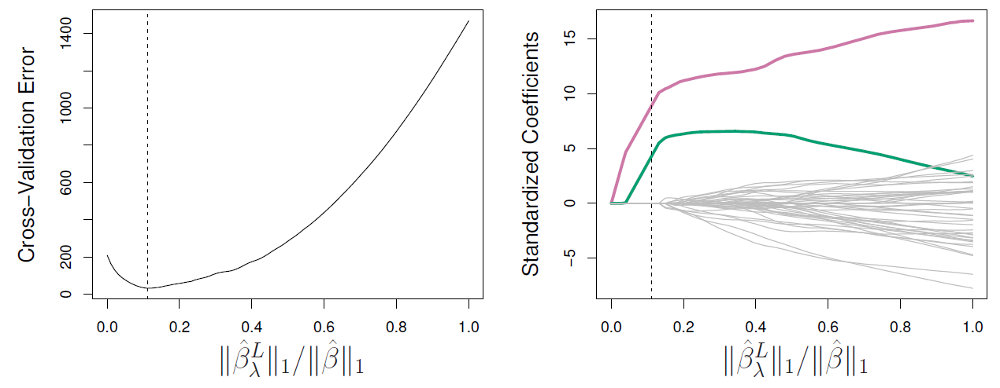

{:refdef: style="text-align:center"}
**Figure 6.12**-- *Left: 10-fold cross validation MSE for Lasso, Right: Corresponding lasso coefficients*
{: refdef}

I think there were two or three truly nonzero coefficients in the population. For the Lasso, this is now the result of cross-validation. So we plotted the cross-validation error versus the $$\ell1$$ norm of the Lasso solution divided by the $$\ell1$$ number of the full least squares solution. This is just to give you a convenient way of scaling the x-axis so that it goes from 0 to 1. The full least squares estimates gives a value of 1. And the estimates of zero give you a value of 0. And in between, we have the intermediate Lasso solutions. So here, it's a cross-validation curve. Again, it's got that U shape that Daniela mentioned before. And it's minimum is around here, about 0.1, which is quite severe shrinkage, which is good here, because we know that the true model has only three nonzero coefficients. (And I think it's actually two-- even better.) Two-- yeah, OK. Two coefficients-- very good, because here, we seem to have picked up exactly two nonzero coefficients, the green and the red. And the rest are exactly 0. So in this made up example, it's done exactly the right thing. It's found the correct two nonzero features and set everything else exactly equal to 0.

## Dimension Reduction

<iframe width="560" height="315" src="https://www.youtube.com/embed/QlyROnAjnEk" frameborder="0" allowfullscreen></iframe>

##### Slide 44:

*Daniela:* OK, so we've talked about subset selection methods, ridge regression and the Lasso. And now we're moving on to the last class of method that we're going to talk about in this lecture, which is dimension reduction. And so, if we remember, in the subset selection methods, we were just taking a subset of the predictors and using least squares to fit the model. And then in ridge regression and the Lasso, we were really doing something different, where we were taking all of the predictors, but we weren't using least squares. We were using a shrinkage approach to fit the model. And now we're going to do something different, which is we're going to use least squares, but we're not going to use least squares on the original predictors, $$X_1$$ through $$X_p$$. Instead, we're going to come up with new predictors, which are linear combinations of the original projectors. And we're going to use these new predictors to fit a linear model using least squares. So this is known as dimension reduction. And the reason it's called dimension reduction is because we're going to use those $$p$$ original predictors to fit a model using $$M$$ new predictors, where $$M$$ is going to be less than $$p$$.  So we're going to shrink the problem from one of $$p$$ predictors to one of $$M$$ predictors.

##### Slide 45:

*Daniela:* So in a little bit of detail here, we're going to define $$M$$ linear combinations $$Z_1$$ through $$Z_M$$, where $$M$$ is some number less than $$p$$. And these are going to be linear combinations of the original $$p$$ predictors.

$$Z_m=\displaystyle\sum_{j=1}^p\phi_{mj}X_j$$

So for instance, $$Z_M$$ is going to be some of the $$p$$ predictors where each predictor is multiplied by $$\phi_{mj}$$, where $$\phi_{mj}$$ is some constant. And in a minute, we'll talk about where this $$\phi_{mj}$$ comes from. But the point is, once we get our new predictor, $$Z_1$$ through $$Z_M$$, we're just going to fit a linear regression model using least squares. But instead of using the $$X$$s, we're going to use the $$Z$$s. So in this new least squares model, my predictors are going to be the $$Z$$s. And my coefficients are going to be $$\theta_0$$ through $$\theta_m$$.

$$y_i=\theta_0+\displaystyle\sum_{m=1}^{M}\theta_mz_{im}+\epsilon_i,  \quad i=1,\dotsc,n,$$

And the idea is that if I can just be really clever in how I choose this linear combinations, in particular, if I'm clever about how I choose these $$\phi_{mj}$$s, then I can actually beat least squares that I would have gotten if I had just used the raw predictors. 

##### Slide 46:

*Daniela:* So one thing that we should notice is that on the previous slide here, we had this summation over $$\theta_mz_{im}$$. And if we look at that a little bit more carefully, and we plug in the definition of $$z_{im}$$, which, remember, was just a linear combination of the original $$X$$s, and we switch the order the sums and we do a little bit of algebra, we see that what we actually have here is the sum over the $$p$$ predictors times this quantity times the $$p^{th}$$ predictor. 

$$\displaystyle\sum_{m=1}^M\theta_mz_{im}=\sum_{m=1}^M\theta_m\sum_{j=1}^P\phi_{mj}x_{ij}=\sum_{j=1}^p\sum_{m=1}^M\theta_m\phi_{mj}x_{ij}=\sum_{j=1}^P\beta_jx_{ij},\\ \text{ where }\beta_j=\sum_{m=1}^M\theta_m\phi_{mj}$$

So this is actually just a linear combination of the original $$X$$s where the linear combination involves a $$\beta_j$$ that's defined like this. So the point is that when I do this dimension reduction approach and I define these new $$Z$$s that are linear combinations of the $$X$$s, I'm actually going to fit a linear model that's linear in the original $$X$$s. But the $$\beta_j$$s in my model need to take a very, very specific form. So these dimension reduction approaches, they're giving me models fit by least squares, but I'm fitting the model not on the original predictors. It's on a new set of predictors. And I can think of it actually as ultimately a linear model on the original predictors, but using different coefficients that kind of take this funny form here. 

*Tibshirani:* So in a way, it's similar to ridge and Lasso, right? It's still least squares, it's still a linear model in all the variables, but there's a constraint on the coefficients. 

*Daniela:* That's exactly right. But we're getting a constraint a different way. We're not getting a constraint like in the ridge case by saying, OK, my sum of squared $$\beta$$s needs to be small. Instead, we're saying my $$\beta$$s need to take this really funny form, if you look at it. But it's got a simple interpretation in terms of least squares on a new set of features. And the idea here is really it boils down to the bias-variance trade-off. By saying that my $$\beta$$s need to take this particular form, I can win. I can get a model with low bias and also low variance relative to what I would have gotten if I had just done plain vanilla least squares on the original features. One thing that I should mention is that this is only going to work nicely if $$M$$ is less than $$p$$.  And instead, if my $$M$$ equaled $$p$$, then I would just end up with least squares. And this whole dimension reduction thing would have just given me least squares on the raw data.

## Principal Components Regression and Partial Least Squares 

<iframe width="560" height="315" src="https://www.youtube.com/embed/eYxwWGJcOfw" frameborder="0" allowfullscreen></iframe>

##### Slide 47:

*Daniela:* So by far, the most famous dimension reduction approach is principal component regression. And principal components regression involves a 2-step procedure. In step one we find what are called principal components of the data matrix $$x$$. And we're going to cover principal components in detail in chapter 10 of the textbook. And so I'm not going to cover that in great detail here. So in step one we get principal components, and then in step two we're just going to perform least squares regression using those principal components as predictors. So basically, principal components are an interesting idea. And the first principle component is just the linear combination of the variables that has the highest variance. The second principle component is the linear combination that has the large variance out of all linear combinations that are totally unrelated to the linear combination that we just got, and so on. And so the principal components give us linear combinations or dimensions of the data that are really high in variance and that are uncorrelated to the ones that we previously got. And so the idea is that if you give me a data set with 35 variables, I can compute a few principal components. And those might capture most of the variation in the data, but in a very succinct way involving just a few new variables, $$Z_1$$ through $$Z_3$$ or $$Z_1$$ through $$Z_4$$. 

##### Slide 48:

*Daniela:* So here's an example of principal components analysis on a very simple data set that we saw in chapter three already.

{:refdef: style="text-align:center"}
**Figure 6.13**
{: refdef}

And so what we're showing here is a plot where the x-axis shows population and the y-axis shows ad spending for 100 different cities. And so those are these purple dots. And so this is a simple data set with just $$p$$ equals two variables. And so I can say, all right, what's the linear combination of these variables that has the most variance? Or equivalently, what's the direction along which this data varies the most? And so we can see that the direction in which the data varies the most actually falls along this green line. This is really the direction with variation in the data. And so that's actually the first principal component direction. And then if we say, hey, what's the direction along which the data varies the most out of all directions that are uncorrelated with that first direction? That's this blue dashed line here. And so that's the second principle component in this data. So in this example, $$p$$ equals 2. And there's only two principal components. But in general in a data set with lots is variables, if $$p$$ is large there's a lot of principal components. And we can look at the first one, or the second one, or the third, or the fourth, and so on.

##### Slide 49:

*Daniela:* So here's sort of a zoom in a little bit on what's happening here.

{:refdef: style="text-align:center"}
**Figure 6.14**
{: refdef}

And the idea is, on the left hand side here we just have about 20 locations shown as purple circles. And the reason that this green line here is the first principle component is because it's the direction along which the data varies the most. It's the line such that the points are the most spread out possible along the line. If I drop each point-- oops-- if I drop each of these locations down to the line, then this sum of square distances is really as large as possible. And so all these little red lines indicate the distance from a location to the principal component line. It's actually the smallest possible, right? Oops, yeah. time I misspoke. This green line is the principal component. It's the direction along with the data varies the most. And it's also the direction along which the distances from the purple points to the green line, which I'm showing in red, is as small as possible. And on the right hand side here, I'm really seeing the same picture again. But now it's been rotated so that that principle component line is horizontal, just to make it a little easier to see. 

##### Slide 50:

*Daniela:* So if I want to understand these principle components better, I can actually plot each principal component.

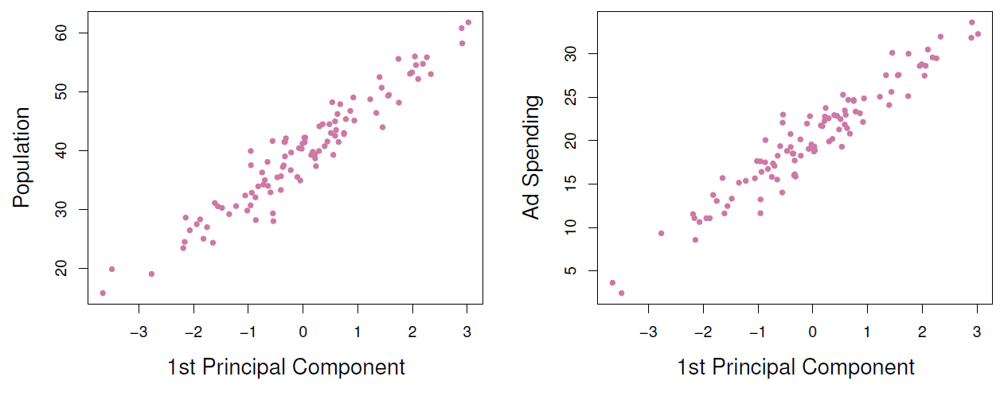

{:refdef: style="text-align:center"}
**Figure 6.15**
{: refdef}

So each linear combination of the variables that I got on the x-axis. And I can plot it against population and against ad spending. And what I can see is that the first principle component is really highly correlated with population and highly correlated with ad spending. And so what that means is that I'm really summarizing the data very well if, instead of using those original two variables, population and ad spending, I instead use just the first principle component. So that's suggests the idea, hey, if I want to predict some response like sales, instead of using population and ad spending to predict sales, I can just use the first principle component. I can just treat that as a predictor in a model, fit the model using least squares, and I bet those results are going to be pretty good. 

##### Slide 51:

*Daniela:* So now this figure is just like the previous one.

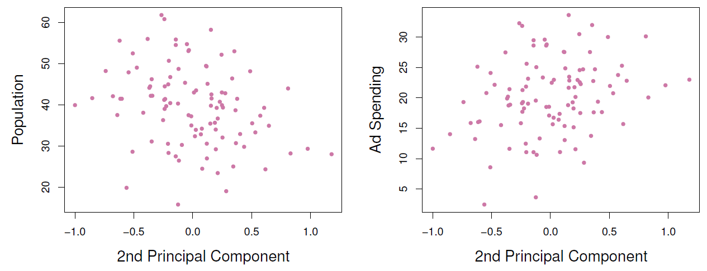

{:refdef: style="text-align:center"}
**Figure 6.16**
{: refdef}

But instead of showing the first principle component on the x-axis it's showing the second principle component against, again, population and ad spending. And we can see that there's very little relationship between population and the second principle component and between ad spending and the second principle component. So that suggests that really the first principle component here does a great job of summarizing the data. And in this case that's happened because population and ad spending are really correlated with each other. And so one new variable, which is the first principle component, can really summarize both of those two variables very well. 

##### Slide 52:

*Daniela:* So the idea is, I take my data. I get the first couple principal components, as many as I want. And I use those as predictors in a regression model that I fit using least squares. And that can actually in a lot of settings give really nice results. So here's an example on a simulated data set where I have a bunch of observations.

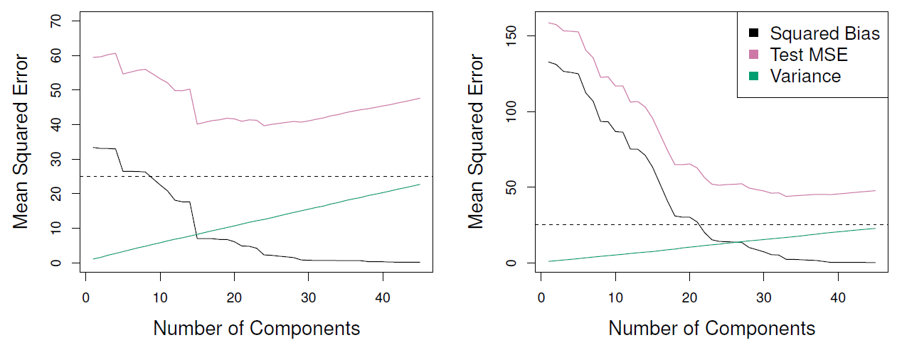

{:refdef: style="text-align:center"}
**Figure 6.17**
{: refdef}

And I perform principal components regression with various numbers of principal components. So over here I have one principal component all the way through to around 45 principal components in this example. And so what I'm plotting here is the bias shown in black. This is the bias. This is the variance in green. And this is the mean squared error. And so as I get more and more components in my model, as I use more and more principle components, I'm going to get less amounts bias. Because I'm going to be fitting a more and more complex model. But I'm going to pay a price in that my variance is going to increase as the number of components increases. And remember, the mean squared error is just the squared bias plus the variance. So my mean squared error, which is shown here in purple, has approximately that U shape that we've been talking about. And I can see that my mean squared error is really smallest for a model with around 18 principal components. So using principal components regression with 18 predictors works really well here. In this example over here, the situation's a little bit different. Now my mean squared error once again decreases as I add more components. But it doesn't really increase again. It's pretty flat from around here outwards. So any of these models looks around the same in terms of test mean squared error. And since I always prefer the simplest model possible, in this context I might choose maybe this model with around 25 components. 

*Tibshirani:* So the idea is to summarize-- right-- to summarize the features by the principle components, which are the combinations with the highest variance, right? Why is that a good idea? Or could it be a bad idea? 

*Daniela:* Yeah, that's a good question. And one thing that we notice here is that when I compute those principle components, I'm not actually looking at the response. I'm literally just looking at my predictors, my x's. And I'm looking for a linear combination of them that has high variance. And it's making this assumption that a linear combination of the predictors that has high variance is probably going to be associated with the response. And that's kind of a hunch that we often have as statisticians. It's an assumption we often make. But really, there's no reason that that has to be the case. And in fact, it might not be. 

*Tibshirani:* Well, so let me just draw a picture to talk about that a bit more. I'm just looking for some space. So if we think of our plot here, say there's two variables. And here's my scatter plot of points. And the first principle components direction is going to be along this red line. That's the first component. So as Daniella said, if we summarize these two variables by the principle component, we're really assuming that this direction variation's the important one. So we think of $$y$$ coming out of the slide, we're really assuming that the regression plane varies along the red line and doesn't vary in the orthogonal direction, right? Because if we choose one component we're going to ignore the second direction. Is that a good assumption? Well, it's not always going to be the case. But it tends to be quite reasonable. Because one way to think about it is if this is observational data, the fact that we've measured the variables at all probably means that they're likely to be important. We measure things in an experiment to predict something. The things we measure, we're more likely to measure things which are important. So the things that matter are probably going to vary in the direction of the response. Not always, but it's a good hunch that, all else equal, let's look in the direction of variation of the predictors to find the places where the responses is most likely to vary. OK, so let's go back to. Where were we? We were talking about the number of directions.

*Daniela:* Yeah. So when we perform principal components regression, we need to somehow select the number of directions m. And we just saw that the test mean squared error we want it to be as small as possible. So we've got to estimate the test mean squared error. 

##### Slide 53:

*Daniela:* And by now you've probably seen that Rob and I really prefer cross validation over any other approach. So we would suggest using cross validation in order to choose the number of principal component directions that you want to use. So here that's what we did on the credit data.

{:refdef: style="text-align:center"}
**Figure 6.18**
{: refdef}

So on the left hand side we can see the results of performing just plain principal components regression on the data. So for instance, if we want to look at the principal components regression model with six principal components, so $$M$$ equals 6, that's this blue line. And so we can see that a few of these coefficients are nonzero. And then a few others are basically zero. Over here we've got 11 components. And that's actually the full least squares model. Because when $$M$$ equals $$p$$ you've just got regular least squares on the original data. And we can on the right hand side see for each of those same models, we can see the cross validated mean squared error. So this is an estimate of the test error. And here we actually see something that's pretty disappointing. Remember we like to pick a model for which the mean squared error is the smallest possible. And so here, the mean squared error is really as small as possible when we have a model with 10 or 11 components. And remember, when $$M$$ equals 11, that is just going to be regular least squares on the original data. So basically, principal components regression just tells us to, when you choose the number of components by cross validation on this particular data set, it tells us to just forgot it and just do least squares on the original data. So this is sort of disappointing. It means that principal components regression doesn't give us any gains over just plain least squares that you guys saw in chapter three. But this is also something that happens in a lot of contexts. You can try to beat least squares, but it might not work on a particular data set. 

##### Slide 54:

*Daniela:* So as Rob mentioned, with principal components regression we're just coming up with these new transformed variables which were the principal components, just in a totally unsupervised way. We're just looking at the $$X$$ variables, and we're just going to cross our fingers that the directions on which the $$X$$ variables really vary a lot are the same directions in which the variables are correlated with the response $$Y$$. But if we don't want to just have to keep our fingers crossed and hope for the best, we can instead perform what's called partial least squares.

##### Slide 55:

*Daniela:* And partial least squares is just like principle components regression. But it selects these new predictors, $$Z_1$$ through $$Z_M$$, in a supervised way. It's going to choose $$Z_1$$ through $$Z_M$$ that are linear combinations of the original features. That are directions along which the original features vary a lot. But that are also directions that are related to $$Y$$. So instead of just looking for a direction in which $$Z$$ varies, we're going to look for a direction in which z varies that also has to be related to the response. And so the goal here is to be able to more effectively predict the response. Because we explicitly think about the response when we're choosing these new features $$Z_1$$ through $$Z_M$$. 

##### Slide 56:

*Daniela:* So the idea behind partial least squares is we get the first direction of partial least squares by doing a regression of $$Y$$ into $$X_1$$ that gives us $$\phi_1$$-1. We do a regression of $$Y$$ onto $$X_2$$, that gives us $$\phi_1$$-2. And so on until we do a regression of $$Y$$ onto $$X_p$$. And that gives us $$\phi_1$$-p. And so, in fact, the first principal component direction $$Z_1$$-- the first partial least squares direction that we get, $$Z_1$$, is really proportional to the correlation between $$Y$$ and the data matrix $$X$$. So that's how we get $$Z_1$$. And then we get the other partial least squares directions just by iterating this procedure. And so in principle, partial least squares seems like it should be a huge gain over principle components regression. Because we're choosing those $$Z$$'s in such a clever way that actually involves looking at the response, which seems like it can only help us. But in practice, we have found that partial least squares often does not give us a huge gain over principle components regression. 

*Tibshirani:* I think it's very similar to ridge aggression and PCR, principle components regression. So although some people do like partial least squares, I've never found it very useful. And founded that ridge and principle components regression work as well and are both simpler. And actually, one thing that's interesting is Rob mentioned ridge regression. And it might seem like going back, ridge regression is really different from principal components regression and partial least squares. But it turns out that mathematically these ideas are all very closely related. And principle components regression, for example, is kind of just a discrete version of ridge regression. Ridge regression is continuously shrinking variables, whereas principal components is doing it in a more choppy sort of way. Exactly. 

##### Slide 57:

*Daniela:* So we've covered a lot today. And now you've seen a lot of different model selection methods which are really useful in settings where you might have a lot of observations, but you have a lot of variables. So if someone comes to you with some data with a million observations on four variables, then do least squares. Knock yourself out. Or even use some of the approaches that you're going to see in Chapter seven, eight, and nine, which are even more flexible and more complex alternatives to least squares. But if someone comes to you with data with 400 observations and 300 variables, or even 30,000 variables, you're going to need ways to simplify the problem and to fit really simple models that are even simpler than what least squares is going to give you. And those are really some of the ideas that we covered today. So this is a really exciting topic. And a lot of modern statistical research really focuses on how we can improve prediction in settings like the ones we covered today, where we just want a simple model that's simpler than least squares. Because the least squares fit is really going to over fit the data. 
