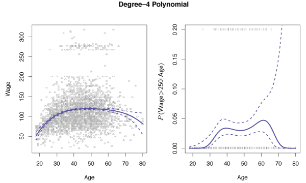
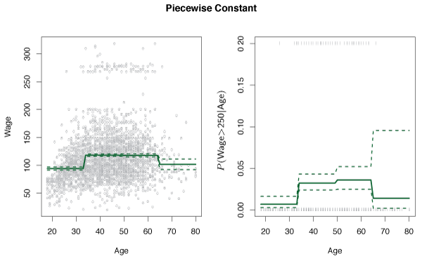
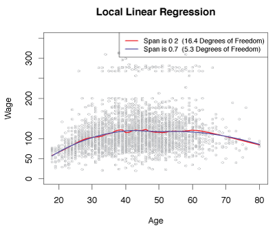

\newcommand{\Var}{\mathrm{Var}}
\newcommand{\MSE}{\mathrm{MSE}}
\newcommand{\Avg}{\mathrm{Avg}}
\newcommand{\Bias}{\mathrm{Bias}}

Linear models are simple to describe and implement, and have advantages in terms of interpretation and inference.
However, standard linear regression has significant limitations since the linearity assumption is almost always an approximation.
In this lesson the linearity assumption is relaxed while attempting to maintain as much interpretability as possible.
Simple extensions of linear models such as polynomial regression and step functions as well as more advanced approaches such as splines, local regression, and generalized additive models are explored.

## Polynomial Regression
*Polynomial regression* replaces the standard linear model with a polynomial function
$$
    y_i = \beta_0 + \beta_1x_i + \beta_2x_i^2 + \cdots + \beta_dx_i^d + \epsilon_i \>.
    \tag{7.1} \label{eq:polyReg}
$$
The coefficients can be estimated using least squares linear regression because equation $\eqref{eq:polyReg}$ is just a standard linear model with predictors $x_i, x_i^2, \ldots , x_i^d$. 
In practice, $d$ is typically no greater than 3 or 4 as the fit can become too flexible for large values. This leads to strange shapes arising for the fit and is especially noticeable near the boundary of the $X$ variable.

In the left panel of Figure 7.1, a fourth degree polynomial is fit by least squares regression (solid blue curve) to wage data as a function of age.
The wages appear to be from two distinct populations: *high earners* who are earning more than $250,000 per annum and *low earners*.
Wage can be treated as a binary variable by splitting it into these two populations and using logistic regression to predict the response with polynomial functions of age as predictors.
We must fit the model

$$
    \Pr(y_i > 250 \mid x_i) = \frac{\exp(\beta_0 + \beta_1x_i + \beta_2x_i^2 + \cdots + \beta_dx_i^d)}{1 + \exp(\beta_0 + \beta_1x_i + \beta_2x_i^2 + \cdots + \beta_dx_i^d)} \>.
    \tag{7.3}
$$
The fit of this equation is displayed in the right panel of figure 7.1.
The gray marks on the top and bottom reflect the ages of high earners and low earners.
The solid blue curve shows the probabilities of having high incomes as a function of age.

 

__Figure 7.1__ -- Left: *The solid blue curve is a degree-4 polynomial of wage (in thousands of dollars) as a function of age, fit by least squares. The dotted curves are an estimated 95% confidence interval.* Right: *The event that wage > 250 is modelled using logistic regression, again with a degree-4 polynomial. The fitted posterior probability of wage exceeding $250, 000 is shown in blue, along with an estimated 95% confidence interval.*

## Step Functions
Using polynomial functions of the features as predictors in a linear model imposes a *global* structure on the non-linear function of $X$.
*Step functions* can be used to avoid imposing global structure.
The range of $X$ is divided into *bins*, and a different constant is fit in each bin.

Cutpoints $c_1, c_2, \ldots, c_K$ in the range of $X$ are created, then $K+1$ new variables are constructed
$$
    \begin{align*}
        C_0(X) &= I(X<c_1), \\
        C_1(X) &= I(c_1 \leq X < c_2), \\
        C_2(X) &= I(c_2 \leq X < c_3), \\
        & \vdots \\
        C_{K-1}(X) &= I(c_{K-1} \leq X < c_K), \\
        C_K(X) &= I(C \geq C_K),
    \end{align*}
    \tag{7.4}
$$
where $I(\cdot)$ is an indicator function that equals 1 if the condition is true, and 0 otherwise.
For any value of $X$, $C_0(X) + C_1(X)+ \cdots + C_K(X) = 1$, since $X$ always falls in only one of the $K + 1$ intervals.
Least squares can be used to fit a linear model with predictors $C_1(X),C_2(X), \ldots ,C_K(X)$ of the form
$$
    y_i = \beta_0 + \beta_1C_1(x_i) + \beta_2C_2(x_i) + \cdots + \beta_KC_K(x_i) + \epsilon_i \>.
    \tag{7.5} \label{eq:stepReg}
$$
The $C_0(X)$ predictor is omitted as it would be redundant as an intercept term is already included.

For $X < c_1$, each predictor in the equation above is zero so $\beta_0$ is the average value of $Y$ for $X < c_1$. 
For $c_j \leq X < c_{j+1}$, equation $\eqref{eq:stepReg}$ predicts a response of $\beta_0 + \beta_j$ so $\beta_j$ reflects the average increase in $Y$ for $c_j \leq X < c_{j+1}$.

In the Figure 7.2, a step function is fit to the `wage` data.
A logistic regression model
$$
    \Pr(y_i > 250 \mid x_i) = \frac{\exp(\beta_0 + \beta_1C_1(x_i) + \cdots + \beta_KC_K(x_i))}{1 + \exp(\beta_0 + \beta_1C_1(x_i) + \cdots + \beta_KC_K(x_i))}
    \tag{7.6}
$$
is also fit to predict the probability that someone is a high earner.
One drawback of step functions is unless there are clear predictor cutpoints the performance is poor. 
The left panel of Figure 7.2 reflects this phenomenon as the first group does not show the tendency of wage to grow with age. 

 

__Figure 7.2__ -- Left: *The solid curve is the fitted value from a least squares regression of `wage` (in thousands of dollars) using step functions of `age`. The dotted curves are an estimated 95% confidence interval.* Right: *The event that `wage > 250` is modelled using logistic regression, again using step functions of `age`. The fitted posterior probability of `wage` exceeding $250,000 is shown, along with an estimated 95% confidence interval.*

## Basis Functions
The *basis function* approach generalizes the polynomial and piecewise-constant regression models.
A family of functions or transformation that can be applied to the variable $X$: $b_1(X), b_2(X), \ldots , b_K(X)$ are used to fit the model.
Instead of fitting a linear model in $X$, we fit the model
$$
    y_i = \beta_0 + \beta_1b_1(x_i) + \beta_2b_2(x_i) + \beta_3b_3(x_i) + \cdots + \beta_K b_K(x_i) + \epsilon_i
    \tag{7.7} \label{eq:basisReg}
$$
where $b_1(\cdot), b_2(\cdot), \ldots , b_K(\cdot)$ are fixed and known. 
For polynomial regression, the basis functions are $b_j(x_i) = x_i^j$, and for piecewise-constant they are $b_j(x_i) = I(c_j \le x_i < c_{j+1})$.

The basis function approach is like a standard linear model with predictors $b_1(x_i), b_2(x_i), \ldots, b_K(x_i)$. 
Therefore, least squares can be used to estimate the unknown coefficients in $\eqref{eq:basisReg}$.
This result is important because the inference tools for linear models, such as standard errors for coefficient estimates and F-statistics for model performance, can be used.

## Regression Splines

### Piecewise Polynomials
*Piecewise polynomial regression* involves fitting separate low-degree polynomials over different regions of $X$.
For example, a piecewise cubic polynomial works by fitting a cubic regression of the form
$$
    y_i = \beta_0 + \beta_1x_i + \beta_2x_i^2 + \beta_3x_i^3 + \epsilon_i
    \tag{7.8} \label{eq:PieceReg}
$$
where $\beta_0, \beta_1, \beta_2, \beta_3$ differ over different regions of $X$. 
The points where the coefficients change are called *knots*.

For example, a piecewise cubic with one knot at $x=c$ takes the form 
$$
    y_i = 
    \begin{cases}
        \beta_{01} + \beta_{11}x_i + \beta_{21}x_i^2 + \beta_{31}x_i^3 + \epsilon_i, & \text{if } x_i < c \\
        \beta_{02} + \beta_{12}x_i + \beta_{22}x_i^2 + \beta_{32}x_i^3 + \epsilon_i, & \text{if } x_i \geq c \>.
    \end{cases}
$$
The coefficients of the first polynomial function are $\beta_{01}, \beta_{11}, \beta_{21}, \beta_{31}$, while the second has coefficients $\beta_{02}, \beta_{12}, \beta_{22}, \beta_{32}$. 
Each function is fit by least squares applied to simple functions of the original predictor.

As the number of knots increases so does the flexibility of the model.
For $K$ distinct knots, $K+1$ different cubic polynomials are fit.

The top left panel of Figure 7.3 shows a piecewise cubic polynomial fit to a subset of the `Wage` data with one knot at `age=50`.
Clearly the fit does not do a good job as can be seen by the discontinuity at the knot.

### Constraints and Splines
By decreasing the flexibility of the model the discontinuity that arises from piecewise polynomial regression can be fixed.
This can be done by constraining the fitted curve to be *continuous* at the knot. The top right panel of Figure 7.3 shows the resulting fit by using this improvement although still looks strange as there is a sharp corner in the curve at the knot.

In the lower left plot, two constraints are imposed on the fit.
Both the first and second derivatives of the piecewise polynomials are continuous at `age=50`.
Under these constraints the fitted curve must be not only continuous at the knot but also *smooth*.
These constraints have reduced the degrees of freedom from eight in the top left plot to five degrees of freedom in the bottom left.
The curve in the bottom left is known as a *cubic spline* and requires $4 + K$ degrees of freedom for $K$ knots.

The lower right plot shows a linear spline that is continuous at the knot. 
The general definition of a degree-$d$ spline is that it is a piecewise degree-$d$ polynomial, with continuity in derivatives up to $d-1$ at each knot.
Therefore, a linear spline only requires continuity at each knot.

 

__Figure 7.3__ -- *Various piecewise polynomials are fit to a subset of the `Wage` data, with a knot at `age=50`.* Top Left: *The cubic polynomials are unconstrained.* Top Right: *The cubic polynomials are constrained to be continuous at `age=50`.* Bottom Left: *The cubic polynomials are constrained to be continuous and smooth.* Bottom Right: *A linear spline is shown, which is constrained to be continuous.*

### The Spline Basis Representation
A cubic spline with $K$ knots can be modeled as
$$
    y_i = \beta_0 + \beta_1b_1(x_i) + \beta_2b_2(x_i) + \cdots + \beta_{K+3}b_{K+3}(x_i) + \epsilon_i
    \tag{7.9}
$$
for some basis functions $b_1, b_2, \ldots , b_{K+3}$. 
The model can then be fit with least squares.

For cubic splines, we begin with the cubic polynomial basis, $x, x^2, x^3$, and then add a *truncated power basis* function for each knot. 
A truncated power basis function is defined as 
$$
    h(x,\xi) = (x - \xi)^3_+ = 
    \begin{cases}
        (x-\xi)^3 & \text{if } x > \xi \\
        0         & \text{otherwise}
    \end{cases}
    \tag{7.10}
$$
where $\xi$ is the knot. 
By adding a term of the form $\beta_4 h(x, \xi)$ to equation $\eqref{eq:PieceReg}$, the first two derivatives will be continuous.

To fit a cubic spline with $K$ knots, we use least squares regression with an intercept and $K+3$ predictors, $X,X^2,X^3, h(X, \xi_1), h(X, \xi_2), \ldots , h(X, \xi_K)$, where $\xi_1, \ldots, \xi_K$ are the knots.
This approach requires estimates for $K + 4$ regression coefficients, hence a $K$ knot cubic spline has $K+4$ degrees of freedom.

One drawback of splines is that they may have high variance near the boundaries of $X$. 
In Figure 7.4, `Wage` data is fit with three knots.
The confidence bands in the boundary appear fairly wild.
A *natural spline* is a regression spline with extra *boundary constraints* requiring the function to remain linear at the boundary, where $x < \xi_1$ or $x > \xi_K$.
This constraint means that natural splines generally produce more stable estimates at the boundaries.

 

__Figure 7.4__ -- *A cubic spline and a natural cubic spline, with three knots, fit to a subset of the* `Wage` *data.*

### Choosing the Number and Locations of the Knots
Generally, the knots are placed at uniform quantiles of the data. Software is able to do this automatically.

One way to determine the number of knots is to try different values of $K$ and see which curve looks the best.
A more objective approach is to use cross-validation.
With this method, we remove a portion of the data, fit a spline with a certain number of knots to the remaining data and use the spline to make predictions for the held-out portion.
This process is performed until all data points have been omitted once then the overall cross-validated RSS is computed. The number of knots that gives the smallest RSS is chosen.

### Comparison to Polynomial Regression
Regression splines often give superior results to polynomial regression because polynomials require high degrees to generate flexibility. 
By contrast, lower-degree splines can achieve flexibility by increasing $K$.
Splines are also able to place more knots over regions where $f$ appears to be changing rapidly.
Similarly, we can place less knots in more stable areas of $f$.

In Figure 7.7, a natural cubic spline with 15 degrees of freedom and a polynomial of degree 15 are used to fit the `Wage` data set.
The increased flexibility in the polynomial regression leads to a poor fit at the boundaries, while the natural cubic spline provides a reasonable fit.

 

__Figure 7.7__ -- *On the* `Wage` *data set, a natural cubic spline with 15 degrees of freedom is compared to a degree-15 polynomial. Polynomials can show wild behavior, especially near the tails.*

## Smoothing Splines

### An Overview of Smoothing Splines
When fitting a smooth curve to data we want a function, say $g(x)$, that fits the observed data well.
That is, we want $\mathrm{RSS} = \sum\limits_{i=1}^n(y_i - g(x_i))^2$ to be small.
However, if there are no constraints on $g(x_i)$, then we can always make RSS zero by choosing a function $g$ that *interpolates* all of the $y_i$.
This would overfit the data.
What we want is a function $g$ that makes RSS small but is also *smooth*.

One way to ensure smoothness is to find a function $g$ that minimizes
$$
    \sum_{i=1}^n (y_i - g(x_i))^2 + \lambda\int g''(t)^2 dt
    \tag{7.11} \label{eq:smoothSpline}
$$
where $\lambda \geq 0$ is a *tuning parameter*. 
The function $g$ that minimizes $\eqref{eq:smoothSpline}$ is known as a *smoothing spline*.

The $\sum\limits_{i=1}^n(y_i-g(x_i))^2$ term is a *loss function* that makes $g$ approximate the data well.
The $\lambda\int g''(t)^2dt$  is a *penalty term* that penalizes excessive variability in $g$. 
The second derivative reflects *roughness* in the function: its absolute value is large if $g(t)$ is very wiggly near $t$, and is small if $g(t)$ is not wiggly near $t$.

When $\lambda = 0$, the penalty term has no effect and so $g$ will exactly interpolate the training observations.
When $\lambda \to \infty$, $g$ will be perfectly smooth, that is it will be a straight line.
In fact, it will be the linear least squares line.
We can see that $\lambda$ controls the bias-variance trade-off.

The function $g(x)$ that minimizes $\eqref{eq:smoothSpline}$ is a piecewise cubic polynomial with knots at the distinct values $x_1, \ldots , x_n$, with continuous first and second derivatives at the knots. 
In addition, it is linear outside the extreme knots.
That is, $g(x)$ is a natural cubic spline with knots at $x_1, \ldots , x_n$. 
However, it is not the same natural cubic spline resulting from the basis function approach, but is a shrunken version of the natural cubic spline, with the $\lambda$ parameter influencing the magnitude of the shrinkage.

### Choosing the Smoothing Parameter $\lambda$
The tuning parameter $\lambda$ controls the roughness of the smoothing spline, and hence the *effective degrees of freedom*.
As $\lambda$ increases from 0 to $\infty$, the effective degrees of freedom, denoted $df_{\lambda}$, decreases from $n$ to 2.

The term $df_{\lambda}$ captures the flexibility of the smoothing spline. 
As $df_{\lambda}$ increases, flexibility increases, so bias falls and variances rises. 
Computing the effective degrees of freedom is a bit technical.
We can write
$$
    \hat{\mathbf{g}}_{\lambda} = \mathbf{S}_{\lambda}\mathbf{y}
    \tag{7.12}
$$
where $\hat{\mathbf{g}}$ is the solution to the equation $\eqref{eq:smoothSpline}$ --- that is, a $n$-vector of the fitted values of the smoothing spline at the training points $x_1, \ldots, x_n$ for a given value of $\lambda$.
This vector of fitted values can be expressed as an $n \times n$ matrix $\mathbf{S}_{\lambda}$ times the response vector $\mathbf{y}$. 
Then, the effective degrees of freedom is given by
$$
    df_{\lambda} = \sum_{i=1}^n\{\mathbf{S}_{\lambda}\}_{ii},
    \tag{7.13}
$$
the sum of the diagonal elements of the matrix $\mathbf{S}_{\lambda}$.

When fitting a smoothing spline, we do not need to select the number or location of the knots since there will be a knot at each of the training points, $x_1, \ldots, x_n$.
An optimal value for $\lambda$ must be found, as previously, the value of $\lambda$ that minimizes the cross-validated RSS is used.
For smoothing splines LOOCV can be computed at the same cost as computing a single fit, using the following formula:
$$
    \mathrm{RSS}_{cv}(\lambda) = \sum\limits_{i=1}^n(y_i - \hat{g}_{\lambda}^{(-i)}(x_i))^2 = \sum\limits_{i=1}^n\left[\frac{y_i - \hat{g}_{\lambda}(x_i)}{1 - \{\mathbf{S}_{\lambda}\}_{ii}}\right]^2 \>.
$$
$\hat{g}_{\lambda}^{(-i)}$ is the fitted value of the smoothing spline at $x_i$, where the fit uses all training points except the $i$th observation, $(x_i, y_i)$.
$\hat{g}_{\lambda}(x_i)$ is the smoothing spline function fit with all training data points and computed at $x_i$. 
Hence, this formula allows us to calculate all leave-one-out fits with only $\hat{g}_{\lambda}$, the original fit.

## Local Regression
*Local regression* is a different approach for fitting flexible non-linear functions, which involves computing the fit at a target point $x_0$ using only the nearby training observations.
We provide an example of local regression in Figure 7.9. 
The blue curve represents $f(x)$, the function used to produce the data. 
The light orange curve is the local regression estimate $\hat{f}(x)$. 
The orange colored points are those local to the target $x_0$, and are shown by the orange vertical line. 
The yellow bell-shape in the figure assigns weights to each point, decreasing to zero as the distance from the target $x_0$ increases. 
We generate $\hat{f}(x_0)$ at $x_0$ by fitting a weighted linear regression, represented by the orange line segment and then using in the target point $x_0$ to obtain the estimate $\hat{f}(x_0)$.

 

__Figure 7.9__ -- *Local regression illustrated on some simulated data, where the blue curve represents $f(x)$ from which the data was generated, and the light orange curve corresponds to the local regression estimate $\hat{f}(x)$. The orange colored points are local to the target point $x_0$, represented by the orange vertical line. The yellow bell-shape superimposed on the plot indicates weights assigned to each point, decreasing to zero with distance from the target point. The fit $\hat{f}(x_0)$ at $x_0$ is obtained by fitting a weighted linear regression (orange line segment), and using the fitted value at $x_0$ (orange solid dot) as the estimate  $\hat{f}(x_0)$.*
 

##### Algorithm 7.1 {-}
(1) Gather the fraction $s = k/n$ of training points whose $x_i$ are closest to $x_0$.
(2) Assign a weight $K_{i0} = K(x_i, x_0)$ to each point in this neighborhood, so that the point furthest from $x_0$ has weight zero, and the closest has the highest weight. All but these $k$ nearest neighbors get weight zero.
(3) Fit a *weighted least squares regression* of the $y_i$ on the $x_i$ using the aforementioned weights, by finding $\hat{\beta}_0$ and $\hat{\beta}_1$ that minimize
    $$
        \sum_{i=1}^n K_{i0}(y_i - \beta_0 - \beta_1 x_i)^2 \>.
        \tag{7.14}
    $$
(4) The fitted value at $x_0$ is given by $\hat{f}(x_0) = \hat{\beta}_0 + \hat{\beta}_1 x_0$.

The *span* $s$ plays a similar role to that of the tuning parameter $\lambda$ in smoothing splines; it controls the flexibility of the non-linear fit.
As $s$ decreases, the fit becomes more *local* and wiggly, while large $s$ produce a more global fit using most training data. 
Again, cross-validation can be used to choose $s$.

In Figure 7.10, local linear regression is used on the `Wage` data with $s = 0.7$ and $s = 0.2$.
As outlined above, the fit with $s = 0.7$ is smoother than the fit with $s = 0.2$.

 

__Figure 7.10__ -- *Local linear fits to the* `Wage` *data. The span specifies the fraction of the data used to compute the fit at each target point.*

## Generalized Additive Models
*Generalized additive models* (GAMs) extend the standard linear model by allowing non-linear functions of each variable, while maintaining *additivity*.

### GAMs for Regression Problems
We can extend the multiple linear regression model
$$
    y_i = \beta_0 + \beta_1x_{i1} + \beta_2x_{i2} + \cdots + \beta_px_{ip} + \epsilon_i
$$
to allow non-linear relationships between each feature and the response by substituting each linear component $\beta_jx_{ij}$ with a smooth non-linear function $f_j(x_{ij})$. 
Now, the model is written as
$$
    \begin{align*}
        y_i &= \beta_0 + \sum_{j=1}^p f_j(x_{ij}) + \epsilon_i \\
            &= \beta_0 + f_1(x_{i1}) + f_2(x_{i2}) + \cdots + f_p(x_{ip}) + \epsilon_i \>.
    \end{align*}
    \tag{7.15}
$$

#### Pros and Cons of GAMs {-}

##### Pros {-}

- GAMs allow us to fit a non-linear $f_j$ to each $X_j$, so that we can automatically model non-linear relationships that standard linear regression will miss.
- The non-linear fits may make more accurate predictions for $Y$.
- Because additivity is preserved, the effect of each $X_j$ on $Y$ can be examined individually by holding all other variables fixed.
- The smoothness of $f_j$ can be summarized by degrees of freedom.

##### Cons {-}

- GAMs are restricted to be additive. Important interactions may be missed. To overcome this issue, we can add interaction terms to GAM models by including additional predictors of the form $X_j \times X_k$ or interaction functions of the form $f_{jk}(X_j, X_k)$.

### GAMs for Classification Problems
GAMs can be used for classification problems where $Y$ is qualitative.
For simplicity, assume $Y$ is either zero or one and let $p(X) = \Pr(Y = 1 \mid X)$ represent the conditional probability that the response equals one given the predictors.
Recall the logistic regression model:
$$
    \log \left( \frac{p(X)}{1-p(X)} \right) = \beta_0 + \beta_1X_1 + \beta_2X_2 + \cdots + \beta_pX_p \>.
    \tag{7.17}\label{eq:logit}
$$
This *logit* is the log odds of $\Pr(Y = 1 \mid X)$ versus $\Pr(Y = 0 \mid X)$.
Equation $\eqref{eq:logit}$ represents the logit as a linear function of the predictors. 
This can be extended to permit non-linear relationships as
$$
    \log\left(\frac{p(X)}{1-p(X)}\right) = \beta_0 + f_1(X_1) + f_2(X_2) + \cdots + f_p(X_p) \>.
    \tag{7.18}\label{eq:logitNonLin}
$$
Equation $\eqref{eq:logitNonLin}$ is a logistic regression GAM and has the same pros and cons to those discussed above for quantitative responses.