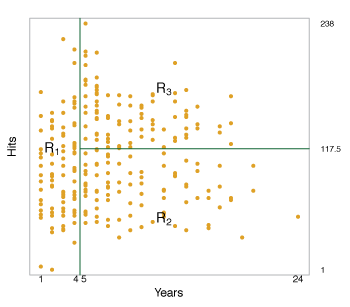
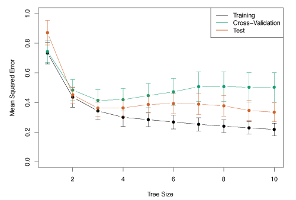
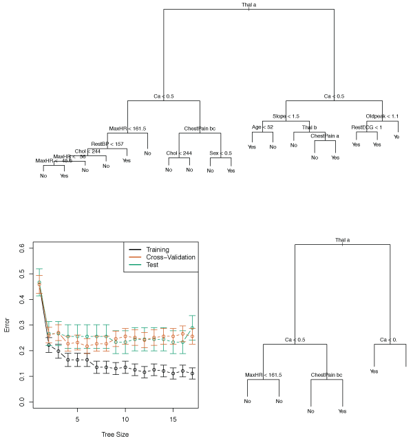

\newcommand{\Var}{\mathrm{Var}}
\newcommand{\MSE}{\mathrm{MSE}}
\newcommand{\Avg}{\mathrm{Avg}}
\newcommand{\Bias}{\mathrm{Bias}}

Tree-based methods segment the predictor space into simple regions. 
Since the set of splitting rules used to segment the predictor space can be summarized in a tree, these types of approaches are known as *decision tree* methods.

Tree-based methods are useful for interpretation although they do not perform as well as other supervised learning methods when it comes to prediction accuracy.
Combining large numbers of trees can improve the prediction accuracy at the expense of some loss of interpretability.

## The Basics of Decision Trees
Decision trees are useful for both regression and classification problems.

### Regression Trees
Consider the following example with the `Hitters` data for predicting the `Salary` of baseball players based on `Years` (their number of years playing in the major leagues) and `Hits` (number of hits made in previous year).
First, we log-transform `Salary` so its distribution has more of a bell-shape.

Figure 8.1 illustrates the splitting rules found by performing a regression tree fit to the data.
The top split assigns observations having `Years<4.5` to the left branch. 
The predicted salary for these players is the mean salary for players in the original dataset with `Years<4.5`.
The mean log salary is 5.107 or $\$1000 \times \mathrm{e}^{5.107} = \$165,\!164$.

Players with more than 4.5 years of experience are assigned to the right branch that is further subdivided by `Hits`.

 

__Figure 8.1__ -- *A regression tree for prediction the log salary of a baseball player, based on the number of years he has played in the major leagues and the number of hits he has made in the previous year.*
 

Overall, the tree segments the data into three regions
$$
    \begin{align*}
        R_1 &= \{X \mid \texttt{Years} < 4.5\} \\
        R_2 &= \{X \mid \texttt{Years} \geq 4.5, \texttt{Hits} < 117.5\} \\
        R_3 &= \{X \mid \texttt{Years} \geq 4.5, \texttt{Hits} \geq 117.5\},
    \end{align*}
$$
where the predicted salaries are $\$1000 \times \mathrm{e}^{5.107} = \$165,\!164$, $\$1000 \times \mathrm{e}^{5.999} = \$402,\!834$ and $\$1000 \times \mathrm{e}^{6.740} = \$845,\!346$ respectively.

Figure 8.2 illustrates how the data is separated in the decision tree.

 

__Figure 8.2__ -- *The tree-region partition for the* `Hitters` *data set from the regression tree illustrated in Figure 8.1.*
 

The regions $R_1, R_2, R_3$ are known as *terminal nodes* or *leaves* of the tree. 
The points inside the tree where the predictor space is split are called *internal nodes*.
In Figure 8.1, the two internal nodes are the points labeled with the text `Years<4.5` and `Hits<117.5`. 
The segments of the trees that connect the nodes are *branches*.

#### Prediction by Stratification of the Feature Space {-}
Building a regression tree can be broken into two main steps:

1. Divide the predictor space into $J$ distinct, non-overlapping regions, $R_1,R_2, \ldots ,R_J$.
2. For each observation in region $R_j$, the prediction is the mean of the response values for the training observations in $R_j$.

The goal of Step 1 is to divide the predictor space into high-dimensional rectangles or *boxes*.
This can be done by finding boxes $R_1, \ldots, R_J$ that minimize the RSS,
$$
    \sum_{j=1}^J \sum_{i \in R_j} (y_i - \hat{y_{R_j}})^2
    \tag{8.1}
$$
where $\hat{y}_{R_j}$ is the mean response for the training observations in the $j$th box.
Unfortunately, it is computationally infeasible to consider every partition of the feature space into $J$ boxes.
Instead a *top-down*, *greedy* approach known as *recursive binary splitting* is used.
Beginning at the top of the tree, the predictor space is successively split where each split is indicated by two new branches further down the tree.
It is *greedy* because at each step, the *best* split is made at that step rather than looking ahead for a split that will be better in a future step.

Recursive binary splitting first selects the predictor $X_j$ and cutpoint $s$ that results in a split of the predictor space into regions $\{X \mid X_j < s\}$ and $\{X \mid X_j \geq s\}$ that give the greatest possible reduction in RSS.
This is done by considering all predictors $X_1, \ldots, X_p$, and all possible values for the cutpoints $s$ for each predictor and selecting the predictor and cutpoint resulting in the lowest RSS.

For any $j$ and $s$, the half-planes are defined by
$$
    R_1(j,s) = \{X \mid X_j < s\} \text{ and } R_2(j,s) = \{X \mid X_j \geq s\},
    \tag{8.2}
$$
and we find the values of $j$ and $s$ that minimize
$$
    \sum_{i:\,x_i \in R_1(j,s)} (y_i - \hat{y}_{R_1})^2 +
    \sum_{i:\,x_i \in R_2(j,s)} (y_i - \hat{y}_{R_2})^2,
    \tag{8.3}
$$
where $\hat{y}_{R_1}$ is the average response of training observations in $R_1(j, s)$, and $\hat{y}_{R_2}$ is the average response of training observations in $R_2(j, s)$. 

Next, the above process is repeated, looking for the best predictor and best cutpoint to split the data further minimizing the RSS within each of the resulting regions.
This time, instead of splitting the entire predictor space, only one of the two previously generated regions is split, resulting in three regions.

Continuing the process, we split one of these three regions further, again minimizing the RSS.
The process is continued until a stopping condition is met.
For example, the process could continue until each region has no more than 5 observations.

After the splitting process has finished, the response prediction for each region is the mean of the training observations in that region.

Figure 8.3 illustrates this approach with five regions.

 

__Figure 8.3__ -- Top Left: *A partition of a two-dimensional feature space that could not result from recursive binary splitting.* Top Right: *The output of recursive binary splitting on a two dimensional example.* Bottom Left: *A tree corresponding to the partition in the top right panel* Bottom Right: *A perspective plot of the prediction surface corresponding to that tree.*

#### Tree Pruning {-}
The above process may result in a tree that overfits the data because it is too complex.
A smaller tree with fewer splits may lead to lower variance and better interpretability at the cost of a small increase in bias.

One strategy for producing a smaller tree is to begin with a very large tree $T_0$, and then *prune* it back to obtain a *subtree*.
To find the best subtree, we look for one that leads to the lowest test error rate.
Given a subtree, its test error can be estimated by cross-validation or the validation set approach.
However, estimating the cross-validation error for every possible subtree is computationally infeasible.

A pruning method known as *cost-complexity pruning*, or *weakest link pruning* provides a computationally feasible solution.
Rather than considering all possible subtrees, a sequence of trees indexed by a nonnegative tuning parameter $\alpha$ are considered.
For each value of $\alpha$, there is a subtree $T \subset T_0$ such that
$$
    \sum_{m = 1}^{|T|} \sum_{i:\, x_i \in R_m} (y_i - \hat{y}_{R_m})^2 + \alpha |T|
    \label{eq:pruneTree} \tag{8.4}
$$
is minimized.
The expression $|T|$ indicates the number of terminal nodes in the tree $T$, $R_m$ is the subset of the predictor space corresponding to the $m$th terminal node and $\hat{y}_{R_m}$ is the predicted response associated with $R_m$.
The tuning parameter $\alpha$ controls the trade-off between the complexity of a subtree and how well it fits the training data.
When $\alpha = 0$, $T = T_0$ because equation$~\eqref{eq:pruneTree}$ only measures the training error.
As $\alpha$ increases, there is a penalty for having a tree many terminal nodes and so$~\eqref{eq:pruneTree}$ will be minimized for a smaller subtree.
A value for $\alpha$ can be selected using a validation set of using cross-validation.
Algorithm 8.1 summarizes this process.

##### Algorithm 8.1 {-}
(1) Use recursive binary splitting to grow a large tree on the training data, stopping only when each terminal node has fewer than some minimum number of observations.
(2) Use cost complexity pruning on the large tree in order to obtain a sequence of best subtrees, as a function of $\alpha$.
(3) Use K-fold cross-validation to choose $\alpha$. For each $k = 1, \ldots, K$:
    (a) Repeat Steps 1 and 2 on the $\frac{K-1}{K}$th fraction of the training data, excluding the $k$th fold
    (b) Evaluate the mean squared prediction error on the data in the left-out $k$th fold, as a function of $\alpha$.
    
    Average the results, and pick $\alpha$ to minimize the average error.
(4) Return the subtree from Step 2 that corresponds to the chosen value of $\alpha$.

Figure 8.4 uses a regression tree analysis on the `Hitters` data. This shows the unpruned tree generated from top-down greedy splitting of the training data.

 

__Figure 8.4__ -- *Regression tree analysis for the* `Hitters` *data. The unpruned tree that results from top-down greedy splitting on the training data is shown.*
 

Figure 8.5 illustrates the use of six-fold cross-validation to estimate the cross-validated MSE as a function of $\alpha$.

 

__Figure 8.5__ -- *Regression tree analysis for the* `Hitters` *data. The training, cross-validation, and test MSE are shown as a function of the number of terminal nodes in the pruned tree*

### Classification Trees
*Classification trees* are analogous to regression trees, except they are used to predict a qualitative response.
For a classification tree, we predict that each observation belongs to the *most commonly occurring class* of training observations in the region to which it belongs.

A classification tree is constructed in a similar way to a regression tree.
Binary splitting is used however, in place of RSS the *classification error rate* is used.
The classification error rate is simply the fraction of training observations in a region that do not belong to the most common class:
$$
    E = 1 - \max_k (\hat{p}_{mk}),
    \tag{8.5}
$$
where $\hat{p}_{mk}$ is the proportion of training observations in the $m$th region that are from the $k$th class.
Unfortunately, classification error is not sensitive enough for tree-growing and in practice two other measures are used.

The *Gini index* is defined by
$$
    G = \sum_{k = 1}^K \hat{p}_{mk} (1 - \hat{p}_{mk}),
    \tag{8.6}
$$ measures the total variance across all $K$ classes.
When $G$ is small, the $\hat{p}_{mk}$'s are close to zero or one indicating that most of the points are from a single class.

An alternative to the Gini index is *cross-entropy*, given by
$$
    D = - \sum_{k = 1}^K \hat{p}_{mk} \log \hat{p}_{mk} \>.
    \tag{8.7}
$$
Since $0 \leq \hat{p}_{mk} \leq 1$, we also have $0 \leq -\hat{p}_{mk}\log \hat{p}_{mk}$. 
Therefore, cross-entropy will take a value near zero if the $\hat{p}_{mk}$'s are all near zero or one.

When constructing a classification tree, either the Gini index or cross-entropy are typically used to evaluate the quality of a particular split as they are more sensitive to node purity than the classification error rate.
When *pruning* a tree, any of the tree methods can be used.

Figure 8.6 shows an example of a classification tree for the `Heart` data set.
This data contains a binary outcome `HD` (heart disease) for 303 patients who had chest pain.
An outcome value of `Yes` indicates the presence of heart disease, while `No` means no heart disease.
There are 13 predictors including `Age`, `Sex`, `Chol` (cholesterol), and other heart and lung function measurements.
Cross-validation resulted in a tree with six terminal nodes.

 

__Figure 8.6__ -- Top: *The unpruned tree* Bottom Left: *Cross-validation error, training error, and test error for different sizes of the pruned tree* Bottom Right: *The pruned tree corresponding to the minimal cross-validation error.*

### Trees Versus Linear Models
The best model is always problem specific. 
If the relationship between the features and response is well approximated by a linear model, then linear regression will likely outperform a regression tree.
If there is a highly non-linear and complex relationship between features and response, then decision trees may perform better than classical approaches.
The relative performances of both approaches can be assessed by estimating test error and using either cross-validation or the validation set approach.

### Advantages and Disadvantages of Trees

#### Advantages {-}
- Trees are very easy to explain.
- Some believe that decision trees more closely resemble human decision-making than regression or classification approaches seen in previous lessons.
- Trees can be displayed graphically, and are easily interpreted.
- Trees can easily handle qualitative predictors without dummy variables.

#### Disadvantages {-}
- Trees generally do not have the same level of predictive accuracy as some of the other regression and classification approaches.

## Bagging, Random Forests, and Boosting
Bagging, random forests, and boosting use trees as building blocks to construct more powerful prediction models.

### Bagging
The bootstrap (introduced in Lesson 5) can be used to improve decision tree predictions.
Decision trees suffer from *high variance*.
*Bootstrap aggregation*, or *bagging*, is a general-purpose method for reducing the variance of a statistical learning method.

Recall that given a set of $n$ independent observations $Z_1, \dots ,Z_n$, each with variance $\sigma^2$, the variance of the mean $\bar{Z}$ is given by $\sigma^2/n$.
That is, *averaging a set of observation reduces variance*
One way to reduce the variance and increase prediction accuracy of a statistical learning method is to take many training sets from the population, build separate prediction models using each training set, and average the resulting predictions.
We can calculate $\hat{f}^1(x), \hat{f}^2(x), \dots, \hat{f}^B(x)$ using $B$ training sets, and average them giving a single low-variance statistical learning model, given by
$$
    \hat{f}_{\text{avg}}(x) = \frac{1}{B} \sum_{b=1}^B \hat{f}^b(x) \>.
$$
This is not practical as we generally do not have multiple training sets.
Instead, we can bootstrap, by taking repeated samples from a single training data set.
We generate $B$ different bootstrapped training data sets.
Our method is then training on the $b$th bootstrapped training set in order to get $\hat{f}^{*b}(x)$, and averaged over all prediction
$$
    \hat{f}_{\text{bag}}(x) = \frac{1}{B} \sum_{b=1}^B \hat{f}^{*b}(x) \>.
$$
This is called bagging.

Applying bagging to decision trees can improve predictions.
To apply bagging, we first build $B$ regression trees with $B$ bootstrapped training sets, then average the resulting predictions.
These trees are grown deep and are not pruned so each tree has high variance but low bias.
Averaging these $B$ trees reduces the variance and improves prediction accuracy.

Given a qualitative test observation, bagging can be extended by recording the class predicted by each of the $B$ trees, and taking a *majority vote*.

Figure 8.8 shows bagging used on the `Heart` data. The test error rate is shown as a function of $B$, the number of trees constructed using bootstrapped training data sets.

 

__Figure 8.8__ -- *Bagging and random forest results for the* `Heart` *data. The test error (black and orange) is shown as a function of $B$, the number of bootstrapped training sets used.*

#### Out-of-Bag (OOB) Error Estimation {-}
The test error of a bagged model can be estimated without the need to perform cross-validation or the validation set approach.
On average, each bagged tree makes use of around two-thirds of the observations.
The remaining one-third of the observations not used to fit a given bagged tree are referred to as the *out-of-bag* (OOB) observations.
The response for the $i$th observation can be predicted by using each of the trees in which that observation was OOB.
The OOB error is a valid estimate of the test error for the bagged mode, since the response for each observation is predicted using only the trees that were fit not using that observation.

#### Variable Importance Measures {-}
When a large number of trees are bagged, it is no longer possible to represent the resulting statistical learning method using a single tree and it is no longer clear which variables are the most important.

A summary of the importance of each predictor can be generated using RSS (regression trees) or the Gini index (classification trees).
We can record the total amount the RSS decreases due to splits over a given predictor, and take the average over all $B$ trees.
The greater the values, the more important a predictor.
For classification trees, we can sum the total amount the Gini index decreases by splits of a given predictor, averaged over all $B$ trees.

Figure 8.9 illustrates this idea on the `Heart` data.
The variables with the largest mean decreases in the Gini index are `Thal`, `Ca`, and `ChestPain`.

 

__Figure 8.9__ -- *A variable importance plot for the* `Heart` *data.*

### Random Forests
*Random forests* provide an improvement over bagged trees by *decorrelating* the trees.
Like bagging, many decision trees are constructed using bootstrapped training samples.
But when building the decision trees, each time a split in a tree is considered, a random subset of $m$ predictors are chosen from the full set of $p$ predictors as split candidates.
A new sample of $m$ predictors is taken at each split where typically $m \approx \sqrt{p}$.

The logic behind this idea is suppose there is one very strong predictor in the data set along with a number of other moderately strong predictors.
In the collection of bagged trees, most if not all of the bagged trees will look quite similar and hence will be highly correlated.
Averaging many highly correlated quantities does not lead to a large reduction in variance, defeating the purpose of bagging.

Random forests overcome this problem by forcing each split to only consider a subset of the predictors.
Therefore, on average $(p-m)/p$ of the splits will not consider the strong predictor.
This *decorrelates* the trees making the average of the resulting trees less variable and more reliable.

Figure 8.10 illustrates the advantage of random forests over bagging.
Random forests are used on the fifteen-class gene expression data set.
Each colored line represents a different value for $m$.
Random forests ($m < p$) are clearly better than bagging ($m = p$).
A single classification tree generates a test error rate of 45.7%.

 

__Figure 8.10__ -- *Results from random forests for the fifteen-class gene expression data set with $p=500$ predictors. The test error rate is displayed as a function of the number of trees.*

### Boosting
*Boosting* grows the trees *sequentially*: each tree is grown using information from old trees. Bootstrapping is not used, but all trees are fit on a modified version of the initial data set. 

##### Algorithm 8.2 {-}
1. Set $\hat{f}(x) = 0$ and $r_i = y_i$ for all $i$ in the training set.
2. For $b = 1, 2, \ldots, B$, repeat:
    (a) Fit a tree $\hat{f}^b$ with $d$ splits ($d+1$ terminal nodes) to the training data $(X,r)$.
    (b) Update $\hat{f}$ by adding in a shrunken version of the new tree:
        $$\hat{f}(x) \leftarrow \hat{f}(x) + \lambda \hat{f}^b(x) \>. \tag{8.10}$$
    (c) Update the residuals,
        $$r_i \leftarrow r_i - \lambda \hat{f}^b(x) \>. \tag{8.11}$$
3. Output the boosted model,
    $$\hat{f}(x) = \sum_{b=1}^B \lambda \hat{f}^b(x) \>. \tag{8.12}$$

The boosting approach works by fitting a decision tree to the residuals from the current model, rather than the outcome $Y$.
This new decision tree is then added into the fitted function in order to update the residuals.
Each tree can be small with only a few terminal nodes, determined by the parameter $d$.
By fitting small trees to the residuals, $\hat{f}$ slowly improves in areas it does not perform well.
The shrinkage parameter $\lambda$ slows the process allowing more and different shaped trees.
Statistical learning methods that learn slowly are generally strong. Boosting classification trees are built similarly to the regression trees. 

Boosting uses three tuning parameters: 

1. The number of trees $B$. Boosting can overfit if $B$ is too large, although this tends to occur slowly, if at all.
2. The shrinkage parameter $\lambda$, a small positive number. It controls the learning speed. Typical values are 0.01 or 0.001 and the right choice is problem specific.
3. The number $d$ of splits in the tree, which controls the complexity. $d=1$ often works well, in which case the tree is a *stump* with only a single split. More generally, $d$ is the *interaction depth*, and controls the interaction order of the boosted model, since $d$ splits can involve at most $d$ variables.

Because boosting considers previously grown trees, shallower trees are generally strong. Shallow trees are effective because they are more interpretable. Similarly, stumps generate an additive model. 

In Figure 8.11, boosting was applied to the fifteen-class cancer gene expression data set, in order to develop a classifier that can distinguish the normal class from the fourteen cancer classes.
The test error as a function of the total number of trees and the interaction depth $d$ is shown.

 

__Figure 8.11__ -- *Results from performing boosting and random forests on the fifteen-class gene expression data set. The test error is displayed as a function of the number of trees. For the two boosted models, $\lambda = 0.01$.*

