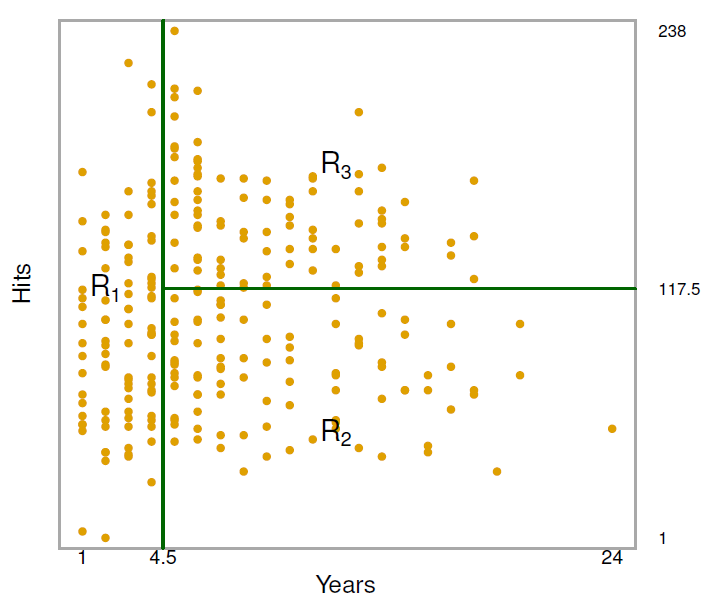
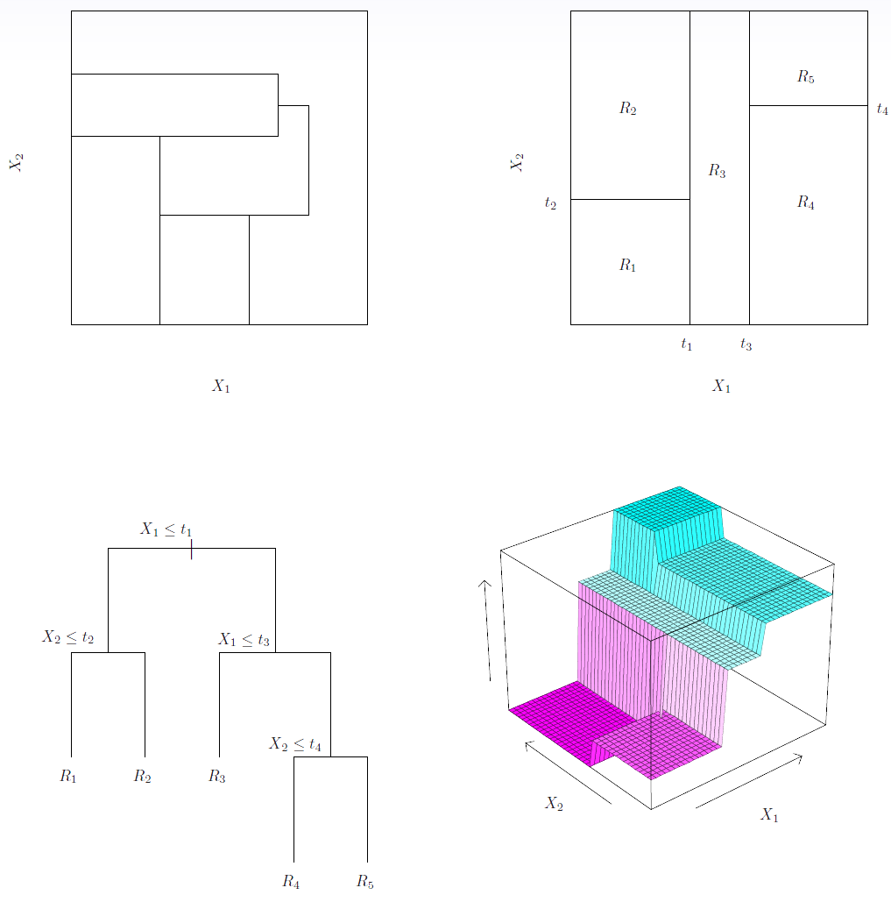
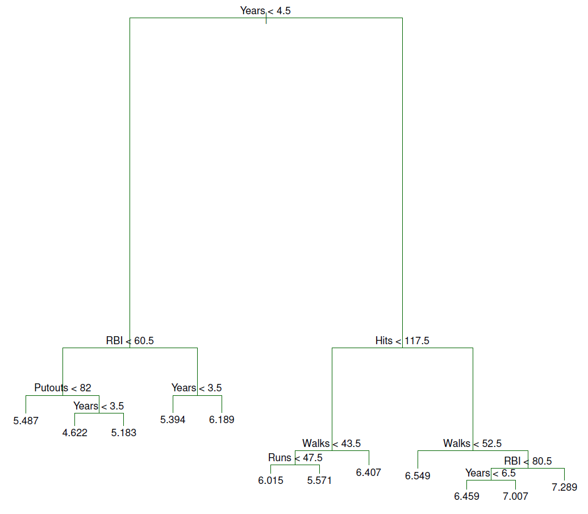
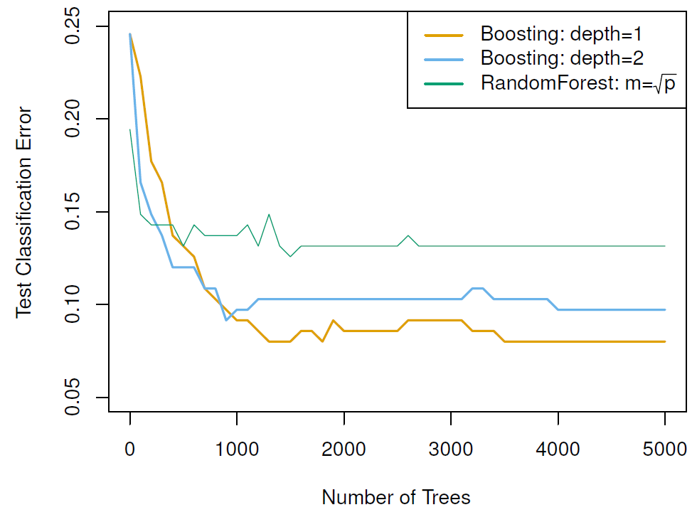
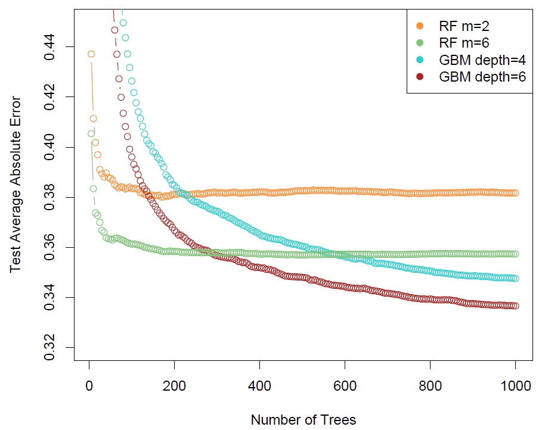
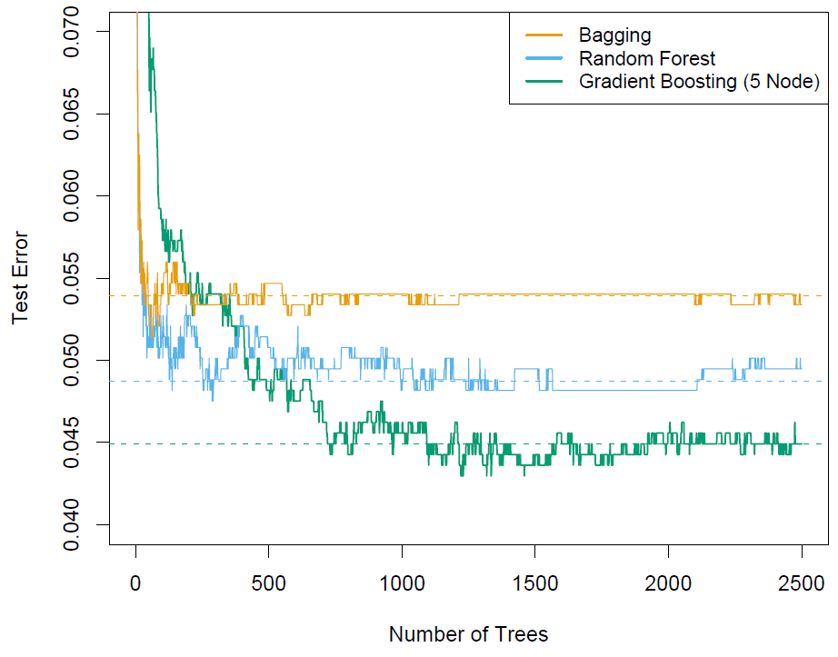

## Decision Trees

<iframe width="560" height="315" src="https://www.youtube.com/embed/6ENTbK3yQUQ?list=PL5-da3qGB5IB23TLuA8ZgVGC8hV8ZAdGh" frameborder="0" allowfullscreen></iframe>

##### Slide 1: 

*Tibshirani:* Welcome back. So today we're going to talk about chapter eight of the book, *Tree-based Methods for Regression and Classification*. And as you'll see, their methods for supervised learning was stratify or segment the predictor space in order to make predictions. And they form what are called decision trees in their stratification. And we'll talk about those methods, which are actually from the-- they started in the mid '80s, I'd say. And some of the names associated with that-- well, first of all, the software package which started in the method is called CART, the Classification Of Regression Trees. And the first two authors of CART are Leo Breiman, who is a well-known statistician from Berkeley, and Jerry Friedman who is our colleague here at Stanford. And Friedman, actually, was one of our teachers. Back in the '80s. Back in the '80s, when Trevor and I were graduate students here. And that's when the CART book came out. Right. And actually, we hope to talk to Jerry in this course. You'll get a chance to hear him talk about the development of trees and how that happened in the '80s. The first part of the section is on trees. And then we'll talk about bagging and boosting and random forests, which combine trees in a more modern way. 

*Hastie:* It's interesting because trees were used widely for a number of years as one of the primary learning tools. And now trees are used widely as building blocks in some of the more modern learning tools. So they've been around for a long time and they're going to stay around. 

##### Slide 2:

*Tibshirani:* So, in a little more detail, the good side of trees are, as you'll see, they're simple in a sense, especially if they're small. And hence, they can be useful for interpretation. But on the other hand, when you look at them as a supervised learning technique for prediction, they're not competitive with the best methods around. But they can be made competitive when they're combined in ensembles of trees. And we'll talk about that in the second part of the lecture, in particular, bagging, random forests, and boosting. And they were methods which were developed in the '90s and beyond, which improve the prediction performance of trees substantially. 

##### Slide 3: 

*Tibshirani:* So let's start at the beginning-- the basic idea of a decision tree. And this applies to both regression and classification. We'll start with regression, and a little later we'll consider classification. 

##### Slide 4: 

*Tibshriani:* Before we actually see a tree, let's think about how we would stratify some data. So here's the baseball data. 

{:refdef: style="text-align:center"}
**Figure 8.1**
{: refdef}

The response is salary, which we've color coded in this graph from low salary, being blue and green, to higher salary, being yellow and red, for baseball players. And each player has-- we measure two predictors. Number of years he's been the baseball league, and then the number of hits he hits per season. So we want to predict salary from those two predictors. So, if I asked you to stratify this population, and try to separate the high from low salary players, what would you do? If you look at it, looks like the higher salaries are up here, and the lower ones are maybe in this L-shape. So there's a place you might say, let's split around here. This split separates the predictor space into two regions. The higher salaries-- we'll see some yellow and red up here. Although it's mixed with some blue and green. And the lower ones on the left. So that does a pretty good job of putting up the low salary players on the left. Doesn't do a great job on the right, so we might do a further split-- Rob, it looks like you've cut at five years, there. So, years is number of years in the league? Right, now within the league, which makes sense because the players that are in the league longer can expect to have a higher salary. Whereas the ones in the league lower have a lower salary. Those with more years in the league seem to be a bit mixed. Right, they're a bit mixed, so it looks like our job isn't quite done. Maybe we could do a refinement by stratifying in this way. And now we have three regions. We've got the high salary players up here. And what are these players? These are ones who've been the league more than maybe around five years, and who have made more than maybe 125 hits. They're the ones who have the highest salary. And then the medium category, looks like it's down here. They've got also more than roughly five years of experience, but fewer number of hits. And the lower is on the left. So with just two simple cuts, you've made a pretty good segmentation there. Exactly. And this is the idea of a decision tree, which we'll actually see on the next slide. 

##### Slide 5: 

*Tibshirani:* When we applied a decision tree technique to that data, we got exactly this tree. 

{:refdef: style="text-align:center"}
**Figure 8.2**
{: refdef}

And this tree is very much like what I drew in the previous slide. On the next slide I've got a caption for this figure, and throughout the notes we have a detail caption for a lot of the figures. I'm not going to read out the caption in the course, but it's just there for your reference if you want to read the details. But let's look at this tree and interpret what it's saying-- what the layout is, first of all. So this is a series of splits. At the top we have all the data. And this year is less than 4.5 is a split. It's a partition-- on the left, the players who are in the league for less than 4.5 years. On the right, players in the league for more than 4.5 years. So this is pretty much the split we saw, that I made here, right? This split here is five, but it's roughly-- 4.5 is between 4 and 5 So this put at the top the tree is a partition into the left and right regions. So this tree says we're going to, first of all, going to split players on their years of experience. Those with fewer than 4.5 years are assigned to the left node, and those with more than 4.5 are assigned to the right. And what's that number at the bottom? The number at the bottom is the average log response. I think we took logs, here. So it's the average log salary of the players who fell into that bin. On the right, we do a further split on hits. Among the players who have more than 4.5 years experience, those who also have fewer than 117.5 hits are assigned to this branch, otherwise to this branch. So we end up with three bins from high salary, medium salary, and low salary. These are exactly the-- almost exactly the three regions I drew here, just by hand. 

##### Slide 7: 

*Tibshirani:* So here, actually, is the details - the partition that corresponds to that tree.

{:refdef: style="text-align:center"}
**Figure 8.3**
{: refdef}

And it's going to be very much like the one I drew by hand, with the splits been given-- there's the top split, and there's this split on the left. (This was found by an algorithm.) This was found by an algorithm. Actually, the algorithm we're going to describe is going to build a much larger tree, and then it's going to prune it from the bottom to give this three node tree. So the automatic algorithm is going to do what we looked-- and it has to be quite sensible this example to divide into three regions. 

##### Slide 8: 

*Tibshirani:* Some terminology, which I've already been using. The nodes at the bottom are called *terminal nodes* because they're terminal. They're not further split. You notice I'm calling these trees, but they're upside down, right? The leaves are at the bottom, rather than the top. It's just for convenience. The non-terminal nodes are called *internal nodes*, which, in this case, we have two internal nodes in our tree. The terminals nodes are the ones of interest because they're the ones that describe the partition of the predictor space. 

##### Slide 9: 

*Tibshirani:* So how do we interpret that tree? Well, we split first on years of experience, so that's saying the most important factors determining salary is years of experience. Those with less experience could have lower salary. On that left branch, we didn't split any further, so looks like the number of hits isn't as important in determining salary for the players of less experience. On the right, where we have the players with more experience, hits is important. So notice what we're saying here is that this is not a symmetric tree, right? We split once to give us the left bucket, but on the right we split again this bucket into two more buckets from hits. So the point being the number of hits seems to be important for those with more than 4.5 years of experience, but not important for those with fewer than 4.5. Now again, in this case, the point I said earlier-- it's a very simple tree, which makes it very easy to display and interpret. There's no equation. One thing that scares non-statistician collaborators that we have-- it scares them sometimes, if they don't know much math. You write an equation down for model-- it's intimidating. Not very attractive to them. One nice thing about a tree is that the tree is the model. This is the summary of the model, and we don't need an equation to summarize it. So it's something that's simple to understand by people who aren't comfortable with mathematics. On the other hand, it's probably much simpler than it deserves to be. And for that reason-- for one of those reasons, is that the prediction error of trees is not very good compared to other methods. And we'll see we can improve it substantially if we combine ensembles of trees. 

##### Slide 10: 

*Tibshirani:* So, I haven't said in detail how we actually got that tree. I said that the tree that we saw there actually-- it was very close to the one that we got just by intuitively splitting the feature space, but how does the automatic tree growing algorithm work? Well, the idea is, we want to divide the predictor space into non-overlapping regions. Some $$J$$ regions. Some number, $$J$$, which we'll have to pick, as well. In the case of the previous example, $$J$$ was three. And having grown the tree, the prediction, as we see in just the average of the response values, will fall into each of the terminal nodes. 

##### Slide 11: 

*Tibshriani:* But how we actually decide on the splits? On the shape? On the partition of the feature space? Well, if we thought-- in the most general way, we could think about trying to write the feature space into boxes. Meaning that the edges of the regions are parallel to the axes. We'd want to do that for interpretation. If we had a region which is a circle, it'd be really hard to interpret predictor space. Even turning ourselves into boxes, it turns out the tree building process is difficult. So let's pose exactly the problem that we might want to solve. If we define our boxes as $$R_1$$ through $$R_J$$ for some number of boxes, $$J$$. Then we might want to find the boxes so that if we sum up the variation of the observations around the mean of each box-- so the $$R_J$$ is the set of observations falling in the $$j^{\text{th}}$$ box, and $$\hat{y}_{R_J}$$ is the average of such of the response those observations.

$$\displaystyle\sum_{j=1}^J\sum_{i\in R_j}(y_i-\hat{y}_{R_J})^2$$

*Hastie:* So those are the averages at the terminal nodes in the tree. So each box represents one of those terminal leaves, where you're going to represent the observations by an average. 

*Tibshirani:* Right, and we have in this case $$j$$ such terminal leaves, and we're going to choose a set of boxes so the total variation of observations around their mean in a box is as small as possible. That makes sense, right? Because we want the boxes to be homogeneous, and to have observations which are very similar in each box. And across boxes, they'll be very different. So this looks like a reasonable way to pose the box-finding problem. 

##### Slide 12: 

*Tibshirani:* But it turns out, actually, that's too hard to solve, computationally. If you say, I want to find the 10 boxes that have the smallest values of this criterion, it's actually computationally infeasible. Well, 10 might be solvable, but certainly beyond 20 or 50, it's very hard. (Especially if you think about how many ways you could make boxes, the number just boggles. It gets big very fast.) Exactly. So trees use an approximation, sort of an obvious method. *Top down, greedy* approach. And it's top-down because it starts at the top with a whole set of observations, and then it splits them into two pieces, one a time at each level. It's greedy because it doesn't find the best split among all possible splits, but only the best split at the immediate place it's looking. So let's go through the details of the tree-growing process. I've got it on the slide, but it might be easier to go back to the little tree we have there, and just talk through it there. What we do is, we start at the top with the full set of data and all the predictors, and we look for the predictor and the split that produces the smallest criterion, the one we had written down, which is the sum of squares of each response around the average in the node. So we're going to make a split to produce two nodes. We'll look at all possible predictors and split points that produce the smallest criterion value. 

*Hastie:* So that's before we had three nodes here, so there would just be a mean in the left and a mean in the right. 

*Tibshirani:* Exactly, right. So we're starting with a full data with actually only one node. We're going to split it into two. And the winner was this. The predictor here was at 4.5, producing these two branches, the left and the right. And then the process is repeated. We look and find the best split we can among the left and right nodes. And the winner was hits, at 117.5. So again, in each case, we're doing the best we can in a greedy sense. That produced these three terminal nodes. So let's go back to the-

##### Slide 13: 

*Tibshirani:* So I've said that in more detail on this slide. One question is, when do we stop? We could decide to stop to do a small number of nodes, like create maybe three nodes, like in that tree, or we could grow a larger tree.

## Pruning a Decision Tree

<iframe width="560" height="315" src="https://www.youtube.com/embed/GfPR7Xhdokc?list=PL5-da3qGB5IB23TLuA8ZgVGC8hV8ZAdGh" frameborder="0" allowfullscreen></iframe>

##### Slide 14: 

*Hastie:* At any point, once a tree is built, you predict the test observation by passing it down the tree, obeying each of the splits. It'll end up in a terminal node, and then you'll use the mean of the training observations in that region to make the prediction. 

##### Slide 15: 

*Hastie:* Let's look at a slightly bigger example-- a cartoon example-- in the next slide. 

{:refdef: style="text-align:center"}
**Figure 8.4**
{: refdef}

First of all, in the slide, we show in the left panel here, a set of regions that couldn't be achieved by this process. So this one here could not be achieved because these aren't boxes that were obtained by sequentially splitting the data repeatedly, whereas the one on the right can. If you look at the one on the right in conjunction with the tree on the bottom left here, you'll see that the first split was made at $$t_1$$. So there's $$t_1$$ over there. And that was a split that broke this region-- we've got two variables, $$x_1$$ and $$x_2$$, here-- into a region to the left and to the right. So that's a partition. Then we have a split on $$x_1$$ at $$t_2$$. So that is this split over here. We divided that box into two. And so that takes care of the left. We've got region one and region two. Then, on the right end partition that we had by splitting $$t_1$$. We split $$x_1$$ again at $$t_3$$. So we make another vertical split here, that partitions-- let's draw these in-- And so that's a split at this internal node over here. And so that makes region three on the left. And on the right we're going to do one more split, and that's at $$t_4$$, on variable $$x_2$$, that divides that into two. So you can see, in the sequential, greedy fashion, we've subdivided the space, which is just two variables here, into five different regions. Now at each of the terminal nodes, we are going to approximate the regression function, in this case, by the mean of the training observations, that end up in these terminal nodes. So what that means is if you have a test observation, and you want to come and predict it, you're going to start at the top, and you're going to query what's its value for $$x_1$$. If it's less than $$t_1$$, you'll go to the left. Otherwise, you'll go to the right. Likewise, you'll answer each of the questions at each of the internal nodes, and you're going to end up in one of these regions. And then your prediction's going to be the mean in that region. So as a function, you can actually represent it nicely because it's just a two-dimensional function by this picture that we've got the right, here. And so it's a piecewise constant function. It's piecewise constant-- you can see. Here are the slices. This will be $$t_1$$, is this slice over here. This will be $$t_2$$. And this function is constant in each of the regions. And that's how are we're going to represent our function at the end of the day. 

##### Slide 17: 

*Tibshirani:* OK, so we've seen how we grow a tree. One question that arises is how large should the tree be? When should we stop growing the tree? Well, one possibility would just be to grow as large a tree as possible. At the extreme we could, for example, have a tree that had one observation each terminal node, or leaf. But that's going to overfit the data, producing poor test set performance. I say why? Well, I guess it's kind of obvious, right? If you have a tree that's so large that each observation has its own terminal node, it's going to have a training error of 0. But it's going to be adapted to that data very much. And it's going to overfit. When you give it new test data, you're probably going to have a quite higher error as a result. So, not a good idea to build as large a tree as possible. Another possibility would be to stop early. In other words, just keep splitting until it looks like no split helps in some sense, in terms of reducing the zero sum of squares, the criterion we saw before. But it turns out this strategy can be too short-sighted. It would very often stop too early because it looks like no good split is available, but actually if we kept splitting, we'd see a better split further down the tree. So it turns out that a better strategy is actually to grow a large tree, stopping only when a rule, for example, a simple one this uses, is a terminal node has to have no fewer than five observations, say. And then, with this large tree, which is probably too big, we prune it from the bottom to produce a tree-- a mid-size-- it tries to balance by some variance, and hence have lower prediction error than either the single node tree, or the extreme tree that as one observation-- one node per observation. (So, a very bushy tree has got high variances.) Right, it's got high variance. (It's overfitting the data.) A little bias, but is overfitting and probably not going to predict well. 

##### Slide 18: 

*Tibshirani:* So what's done in the CART software, for example, or the `tree` library in R, which we'll see, is this idea of building a large tree and then pruning it back. And the framework for that is called cost-complexity pruning, or weakest-link pruning. So for that, we do something actually very much like the lasso we saw for regression. We have the objective function, which is the fit.

$$\displaystyle\sum_{m=1}^{|T|}\sum_{i:x_i\in R_m}(y_i-\hat{y}_{R_m})^2+\alpha|T|$$

And remember the fit, we're going to measure in terms of the sum of squares of observations-- the response around their assigned terminal nodes. So our terminal nodes are $$R_1$$ through $$R_m$$. The number of terminal nodes we're going to denote by this notation-- looks like an absolute value, but this means the number of terminal nodes in the tree, $$T$$. So this is the sum of squares of observations around the mean of region $$m$$, which is one of terminal nodes. And we add them up over all the terminal nodes. So we want a tree which has small variance, but we also want to counterbalance the size of the tree. So we put a penalty on the total number of nodes on the tree, with a penalty parameter, which will estimate the cross-validation. Again, this is very much like the lasso, where we had a sum of squares of regression, and we penalized the sum of the absolute values of the coefficient, which is this complexity. So you want the coefficient to be small to avoid overfitting. Here, we want the size the tree to be small to avoid overfitting. So cost-complexity pruning is going to find the best value alpha by cross validation, and then we're going to pick the sub-tree in the large tree grown that has the smallest value of this criterion.

##### Slide 20: 

*Tibshirani:* So here's the summary of the tree-growing algorithm. Again, this is not something you would normally have to program yourself because software, which is available, for example, CART, or the `tree` software in R, it does all this cross-validation process for you. But it's good to see, at least once, what it's doing. So we build a large tree with a very simple stopping rule, again. For example, we stop it when the number of observations from a node is some minimum number, like 5. And then we prune the tree to find the best sub-tree. For that, we need to get an idea of the cost complexity parameter. The best trade off between fit and tree size. So for that we use cross validation, in a similar way that we've used it before, for regression. We divide the data into $$K$$ parts-- $$K$$ being maybe 5 or 10. We set aside one part. We fit trees of various sizes on the $$K - 1$$ parts, and then evaluate the prediction error on the part we've left out. 

*Hastie:* So that's clever. The whole thing is controlled by $$\alpha$$, then. $$\alpha$$ decides how big the tree is. And you use cross-validation just to pick $$\alpha$$. 

*Tibshirani:* Exactly, right. And so we choose the $$\alpha$$, and we'll see cross-validation occurs in a few slides. But it's going to tell us a good idea of the best value of $$\alpha$$ to trade off the fit with the size of the tree. Having chosen $$\alpha$$, we go back to the full tree and find the sub-tree that has the smallest-- (You mean the tree growing on all the training data.) Exactly. 

##### Slide 21: 

*Tibshirani:* So let's see what this looks like for the baseball data. So for illustration, we actually took the observations, divide them into a training set of 132 observations, and the remainder, 131, in a test set. Because we want to compare the cross-validation error, we're going to get, to the test error on the separate test set, just for illustration. We build a regression tree on the training set using cross-validation, and get an idea of the best cost-complexity parameter, $$\alpha$$, using six-fold cross-validation. And, by the way, 6 may seem like a funny number, but that's just because 6 divides into 132 exactly. 

##### Slide 22: 

*Tibshirani:* So this was the full tree, before pruning.

{:refdef: style="text-align:center"}
**Figure 8.5**
{: refdef}

So remember, we saw the top part of this tree before, right? We saw the top split and the right split, and this had all been pruned away. But now we're seeing the details of how we got to that three-node tree. Here's the large tree that we get. The only rule being that we don't split a terminal node that has fewer than, say, five observations. And that gave us this tree with how many nodes? 1, 2, 3, 4, 5, 6, 7, 8, 9, 10, 11, 12. But probably not all these are predictive. 

*Hastie:* Why are some of the arms of the tree long and some short, Rob? (Good question. Tell me why.) It's because the early splits, which have caused a big decrease in the sum of squares, they're depicted by long arms. And then, as we get down deeper, the incremental improvements get smaller and smaller. So that's depicted in the way that the tree's represented. (Was that your idea, or-- who thought of that?) Not me. (It's a good idea, though. Whoever the author of the tree-growing program at ARIS.)

##### Slide 23: 

*Tibshirani:* So here's the cross-validation, which is going to give us the pruned tree. 

{:refdef: style="text-align:center"}
**Figure 8.6**
{: refdef}

So what do we see here? We see, along the horizontal axis, tree size, which is the $$\alpha$$ parameter. So as we vary $$\alpha$$, it's in one to one correspondence with tree size. If $$\alpha$$ equals 0, there's no penalty to tree size. So we get the largest tree that we fit, which was about 12 terminal nodes. As we crank up $$\alpha$$ to be bigger and bigger, it puts more and more penalty on tree size, until eventually we're forced to the left hand side, here, we have actually just one node. There's no splits at all. So we're seeing the extreme from the full data set to the 12 terminal node tree. And let's look at the green curve is what we get from cross-validation. And it's minimized at around three terminal nodes. The training error-- I should have said this first-- we know that we can't use training error to choose a cost-complexity parameter, because the more we fit, the better it's going to look. And we see that here, right? The more we fit, the lower the error. So cross-validation, on the other hand, we fit for a while. It's happy with the splits, and then looks like it's overfitting. It's just increasing variance, and not helping prediction error. The test error, which we can evaluate here because what we've set aside a separate test set, is roughly tracking this curve. It's minimized maybe at around the same place. (So it looks like about three terminal nodes is good, which was the first tree we showed.) Exactly. So it was on the basis of this graph that we drew that three-node tree.

## Classification Trees and Comparison with Linear Models

<iframe width="560" height="315" src="https://www.youtube.com/embed/hPEJoITBbQ4?list=PL5-da3qGB5IB23TLuA8ZgVGC8hV8ZAdGh" frameborder="0" allowfullscreen></iframe>

##### Slide 24: 

*Hastie:* OK, so far we've been talking about regression trees. The response was quantitative. Salaries, in this case, of baseball players. Oftentimes, trees are used when the response is a categorical variable. And so then we call those classification trees. But you'll see the technology is very similar and we just have to change, essentially, the last function and how we measure good performance. So let's see how that goes. So we're going to predict, in a classification tree, each observation belonging to the most commonly occurring class. So that's what's going to happen in the terminal node of the tree. Instead of just giving the prediction being the mean, we're going to classify to the most common class. 

##### Slide 25: 

*Hastie:* We're going to grow the tree in the very same way as we did for regression trees. But we don't use residual sum of squares as a criterion for making the splits. We need a criterion that's more geared towards classification. So one thing you can do is at each internal node, you can just look at the classification error rate. And that's easy to compute. So suppose class $$k$$-- I beg your pardon. So suppose you got capital $$K$$ classes and you compute the proportion in the terminal node in each of the classes from 1 up to $$K$$. Well, the class you're going to classify to is the class that's got the largest of those probabilities, those proportions. And the area you're going to make is going to be 1 minus that maximum. 

$$E = 1 - \displaystyle\max_k(\hat{p}_{mk})$$

So all the ones that don't belong to the maximal class are going to be counted as errors. So you could use that to decide on the split. And so that's a proportion of errors you're going to make. But it turns out that that's a little bit jumpy and noisy. And it doesn't lead to a very smooth tree-growing process. And for that reason, some other measures are preferable. 

##### Slide 26:

*Hastie:* One measure is the *Gini index.*

$$G=\displaystyle\sum_{k=1}^K\hat{p}_{mk}(1-\hat{p}_{mk})$$

And it's a kind of variance measure across the classes. So you've got capital $$K$$ classes. Often, $$K$$ is 2, but not necessarily. And for those who know the binomial distribution, each of the terms here is like a binomial variance. And in fact, for the multinomial, this is the diagonal of-- these are on the diagonal of the covariance matrix. So this is a measure of total variability in that region. And if the Gini index is really small, what that means is pretty much one class is favored and all the rest are really small. 

*Tibshirani:* Whereas in the extreme case, Trevor, if the region is pure, so it's all one class, then one of those $$\hat{p}$$s would be 1. The rest will be 0. And $$G$$ will be 0. 

*Hastie:* That's a good point. And on the other hand, I guess if they're all equally distributed in the classes, this Gini index will be maximum. But it changes in a smooth way. So that's one of the criteria that are very popular. And it's also known as a purity index. It measures the purity of the class. An alternative is the deviance or cross-entropy.

$$D=-\displaystyle\sum_{k=1}^{K}\hat{p}_{mk}\text{log}\hat{p}_{mk}$$

And this is based on the binomial log likelihood or the multinomial log likelihood. And it's a measure that behaves rather similarly to the Gini index. And either of these are used and give very similar results. 

##### Slide 27: 

*Hastie:* So let's look at an example. We'll look at the heart data. These data have a binary response called HD. There's 303 patients. And they all represented with chest pains. So the outcome has a value Yes indicates a presence of heart disease based on an angiographic test, while no means no heart disease. For these data, there are 13 predictors. Amongst them age, sex, cholesterol, and other heart and lung function measurements. And so we ran the tree-growing process with cross-validation and we'll see what we get in the next figure. 

##### Slide 28: 

*Hastie:* At the top, you see the full tree grown to all the data.

{:refdef: style="text-align:center"}
**Figure 8.7**
{: refdef}

And you can see it's quite a bushy tree, with an early split on thall-(It's a thallium stress test.) A thallium stress test. OK. And then the left and right nodes were split on CA. Calcium, I think. Which is calcium. And then the subsequent splits-- it's hard to see. These pictures are in the book. So quite a bushy tree. And you see at the terminal nodes of this tree are the classifications No or Yes. So that means an observation that, for example, ended up in this leftmost terminal node here, the majority in that class were No's, no heart disease. And so the classification produced would be a No. Whereas the right-hand one here is a Yes. Interesting, this terminal node has two No's. So if they both predicted No, why was there a split here at all? Well, it must mean that one of these nodes is purer than the other. So even though they both ended up having a majority of No's, the one node was purer than the other node. And the Gini index would identify such a node. So this tree is probably too bushy. And so once again, cross-validation was used.

{:refdef: style="text-align:center"}
**Figure 8.8**
{: refdef}

And again, we see in the right-hand panel the results of cross-validation. And we see that the training error, the test error, and the validation error. Here, we've actually looked at the training error averaged over each of the cross-ventilation folds, which is why it's a little jumpy. And actually, even increases in one point here because the trees and the architecture of the trees are different in each of the folds. The cross-validation and test error, we had a left out test set here as well. Those curves look pretty much the same. And we end up seeing that a tree size of around about 6 tends to do well. These bars on these cross-validation and test curves are standard error bars. So there's quite a bit of variability here. The data set's not that big. And on the right here, we see the pruned back tree that's pruned back to size 6. Pruning was, again, governed by the complexity parameter $$\alpha$$. And this here will be a sub-three of the big tree grown, and that gave the best classification performance, which is estimated to be around about 25% error in this case. 

##### Slide 29: 

{:refdef: style="text-align:center"}
**Figure 8.9**-- *Top Row: true linear boundary, Bottom Row: true non-linear boundary*
{: refdef}

*Hastie:* In this figure, we show-- we compare trees with linear models. Trees aren't always the right thing to do. And so to contrast that, we look at two different scenarios. In these cartoons here, the truth is indicated by these two colors. In this top left panel, the truth is actually best depicted by a linear model. So the decision boundary in this case between the two classes is best given by a line. And in this case, a tree's not going to do very well. We see a tree's attempt to partition this space. And you know, while it does a valiant job, it just doesn't do well enough. Because it's confined to big, boxy regions. So there'd be a split over here, a split over there, and then this region was subdivided and that region was subdivided in an attempt to get at this linear decision boundary. So this would be classified as beige. This would be classified as green, beige, green, and so on, in a steppy fashion. On the other hand in the lower two panels, the optimal region is a blocky kind of partition region. And here, a linear model is not going to do well. In the next panel, we see the best linear approximation to this decision boundary. And it's Going to make lots of errors because with one single linear boundary, it's hard to approximate a rectangular region like this. And of course, in this one a tree will nail it. So with two splits, it can get the decision boundary perfectly. So some problems are more naturally suited to trees. Some problems aren't. And so the idea is we're going to think of trees as one tool in our toolbox and we'll use it where appropriate. But of course, we'll also bear in mind simpler linear models as well. 

##### Slide 30: 

*Tibshirani:* So just to wrap up the section on trees then, we've seen some-- there's advantages and disadvantages. In a sense, they're simple, if the trees are small, not too many terminal nodes. Because they're easy to display and to understand for non-specialists. For example, if we look back at this heart disease tree, the pruned one on the bottom right, a doctor might like this tree because it mimics in a sense the way his decision-making process might work. In other words, trying to decide whether a patient has heart disease, he might first do an initial test based on thallium stress test. And if they fail that test, then do a further test based on calcium and decide about the heart disease. If the test was passed, we might, again, do a calcium test, and then fall by some other criteria. So you stratify the population in a series of simple rules to try to determine whether a patient is of high or low risk. So for that reason, trees are popular because there's simplicity in the fact that they mimic the way some people make decisions as a series of splits. And they can be displayed in a simple tree, which means, again, they're attractive because there aren't equations to understand. They can also handle qualitative predictors without the need to create dummy variables. In other words, some of the categorical variables can have more than two levels. And you can split a categorical variable into two sets of subcategories. So these are all good things. The big downside is that they don't predict so well compared to more state-of-the-art methods. And we'll see, for example, for the heart data, that the prediction accuracy of a tree is not very good compared to other methods. The other methods we'll talk about now actually use trees, but in an ensemble. They combine trees. They build many trees on the same data, and then they average of combine them in some way. And in the process, they improve the prediction error substantially.

## Bootstrap Aggregation (Bagging) and Random Forests 

<iframe width="854" height="480" src="https://www.youtube.com/embed/lq_xzBRIWm4?list=PL5-da3qGB5IB23TLuA8ZgVGC8hV8ZAdGh" frameborder="0" allowfullscreen></iframe>

##### Slide 31: 

*Tibshirani:* The next topic is called *bagging*, or *bootstrap aggregation*, which is a way of using trees in ensemble, an average of trees to improve their prediction error. And as we'll see that the bagging methods-- well, I'll mention the bagging method is due to Leo Breiman and it's kind of a bootstrap process. The first time I saw this-- when would that have been, maybe the mid '90s-- I knew a lot about the bootstrap. Actually, I was a student of Brad Efron, who invented the bootstrap. And Brad and I wrote a book together on the bootstrap in the early '90s. And then when I saw the bag idea from Leo, I thought this looks really crazy. Usually the bootstrap is used to get the idea of standard errors or bias, but Leo wants to use bootstrap to produce a whole bunch of trees and to average them, which sounded really crazy to me. And it was a reminder to me that you see an idea that looks really crazy, it's got a reasonable chance of actually being really good. If things look very familiar, they're not likely to be big steps forward. This was a big step forward, and took me and others a long time to realize that. 

*Hastie:* And bagging, and we'll see random forests that we're going to talk about as well, they're used all over. And I just was at a talk the other day where random forest was the primary tool used in a big image classification problem. Using state of the art methods and random forest was at the heart of it. 

*Tibshirani:* So let's see what the bag idea is. It's a way of taking a bunch of independent observations and taking their average to reduce a variance. So just recall, if we had a bunch of observations $$Z_1$$ through $$Z_n$$, the independent observations with the variant $$\sigma^2$$, that if you take their average, the variance of the mean of the mean, $$\bar{y}$$, is $$\sigma^2$$ over $$n$$. So if I take an average of independent things, we reduce the variance by n. That's good. So what does that say to us in terms of supervised learning? It says that we had more than one training set, we could grow, for example, a tree on each training set and take the average tree. Right? Now that doesn't really help us probably because we don't have multiple training sets. Let's assume we just have our one available training set. 

##### Slide 32: 

*Tibshirani:* Bagging is going to try to achieve this now by taking, without new training sets, bootstrap samples to create sort of pseudo training sets. Grow a tree on each one and then take their average. That's the simple, but, I think, very clever idea of bagging. So we're going to take bootstrap samples from a training set of the same size as our original sample. That's the usual bootstrap. And I can maybe draw a little picture here just so we can think about it. Here's our original training set. We're going to draw bootstrap samples. Again, the samples taken with the placement of the same size from the original data set. And we'll take lots of them, maybe a few hundred. And for each one we're going to grow a tree using, for example, the procedure we just went over. On each of these training sets, we're going to get a little tree. They're actually quite big trees. Big trees. That's true. I said a little tree, but actually in fact, we don't need to worry about pruning the trees. We can grow large trees and when you average them, we'll reduce variance. We don't need to prune even. That's another happy coincidence. Notation wise, we'll call the tree that we grow on the $$B^{\text{th}}$$ tree-- again $$B$$ going from maybe 1 to 200-- $$\hat{f}^{*b}(x)$$.

$$\hat{f}_{\text{bag}}(x)=\frac{1}{B}\displaystyle\sum_{b=1}{B}\hat{f}^{*b}(x)$$

The prediction of feature $$x$$ for the $$B_3$$ we'll call $$\hat{f}^{*b}(x)$$. Our overall bagged estimate prediction is just the average. In other words, we grow these trees. We have a new $$x$$. And we want to predict an $$x$$. We ask each tree, what's your prediction for $$x$$? And that's $$\hat{f}^{*b}(x)$$. And we average the predictions. And that's called bagging. 

*Hastie:* It's a really clever idea. The whole idea of pruning a tree back was to reduce the variance, you pruned it back. But when you prune it back, you give it a lot of bias because you make it necessarily just a much coarser tree. So Breiman's idea was, don't prune back, have bushy trees, which tend to have low bias, and get rid of the variance by doing this averaging. 

*Tibshirani:* Right. And we can apply this regressional classification. Here I've basically, explicitly assumed we're doing regression. So that the prediction is actually a quantitative variable. But within classification, we can just do a majority vote. 

##### Slide 33: 

*Tibshirani:* We can have 200 trees. Since we have two classes, we make a prediction of each x. And we ask each tree, what's your class prediction? And suppose of the 200, 150 say class one and the other 50 say class two. And our prediction is class one. So we can just take a majority vote among the $$B$$ trees that we grow. 

##### Slide 34: 

*Tibshirani:* Here is actually the hard data. 

{:refdef: style="text-align:center"}
**Figure 8.10**
{: refdef}

This is the result of bagging the hard data. Along the horizontal axis, the number of trees which we grew up to 300 trees in this case. What do we see here? Well, we have the test error bagging first of all. Remember we had a test set aside. And it's the black curve. And its error is around little over 0.25. If we go over to the left here, we'll see actual results a of a single tree. In this case, bagging improved a single tree maybe just by 1% error. Actually the dotted line is a single tree. OK. Thank you. So the dotted line is a single tree. So it looks like we may have improved the prediction error by perhaps 1%. Not a great win in this one case. The random forest, which I'll talk about in a few slides, is a more advanced form of bagging where we do another trick of Breiman's that's going to improve things here by maybe another couple percent. 

*Hastie:* In this figure we've also got two error groups called out-of-bag, both for bagging and random forest. We'll describe it for bagging now. 

##### Slide 36: 

*Hastie:* So the out-of-bag error is a very important part of bagging and random forest. And it turns out it's an essentially free way of computing leave-one-out cross validation. And works as follows, each of those bootstraps samples includes about 2/3 of the observations. And about one third of the observations are left out. And, of course, for each bootstrap sample a different one third is left out. So suppose we want to compute the error for a particular observation. Well, we can take all the bootstrap samples that didn't include that observation, and we just average their predictions for that observation, and use them to predict that observation. Well that observation wouldn't have been in any of those training samples, and so that's a left-out error estimate. And so you can just accumulate those predictions in that fashion for each of the observations, and that's called an out-of-bag error. And if you think about it carefully, if $$B$$ is large, the number of trees is large. That's essentially leave-one-out cross validation. And it just comes for free. And so that's what was given in this slide here. For bagging, that's the green curve. And it's quite a bit lower than the black curve above, which is the error on the test set, the green curve. And, of course, there's variability in these because these are just samples of numbers. And so that variability is just due to the division of the test samples and the training samples. 

##### Slide 37: 

*Tibshirani:* OK. So the next study that Leo Breiman had a few years after bagging was called *random forest.* And the idea here is that we're taking an average, and an average will be lower if the things being averaged have lower correlation. So the idea of random forest is to build trees in such a way as to actually make the correlation between trees smaller. Even smaller than you get from bootstrapping. Exactly. Right. And again this is one of these ideas which when I first saw it at least looked really bizarre. But it's a very clever thing. So what is that idea? Well, the idea is we're going to do bagging exactly the way we did before, except with one change. When we build the trees and we make splits, every time we consider a split in a tree, we don't consider all possible predictors as we normally do with trees. But rather we select at random $$m$$ predictors among the $$p$$. And the $$m$$ is say typically about the square root of $$p$$, $$m\approx\sqrt{p}$$. So in other words if there's 100 predictors in our data set, every time we go to make a split we don't consider all 100, but rather we take a random subset of 10 of them. And the other 90 are not considered. Only the 10 are even allowed to be considered for the splits. And the random selection is made-- a new selection is made at every possible split. So again it seems kind of crazy to throw away most of the predictors at every split, but the effect of doing this is that it forces the trees to use different predictors to split at different times. And since we're going to build lots of trees, if a good predictor is left out at a given split, it's going to have lots of chances in that tree or in another trees to make an appearance. So although it seems crazy to throw away, in a sense, most of your predictors at every at every stage, since we're going to build a large number of trees and then take the average, it actually works out very well. (So even with the same training sample, if you grow two trees, you'll get two different trees because by chance it'll pick different variables each time.) OK, so let's see how random forest does in the hard data. Remember the bagging test error was about here, and random forest improves by maybe 1% or 2%. So again, by doing this trick of throwing away predictors we've decorrelated the trees and the resulting average seems a little better. And the out-of-bag estimate is also a little better than it was for bagging. 

##### Slide 38: 

*Tibshirani:* Our next example is a high-dimensional example from Chapter 8 on gene expression. So this is using the gene expression from 349 patients. These are cancer patients. Gene expression of 4,718 genes to predict their cancer class. And this is a common activity among people in statistical genomics to try to do the classification into things like cancer class based on the gene expression of genes in cells. So in this case, there is actually 15 classes. The one class is healthy or normal. And there's 14 different types of cancer. So we're going to apply the random forest method we just described to this high dimensional data. But instead of using the entire set of 4,718 genes, we're actually going to prescreen the genes. We're going to choose the genes having the highest variance across the training set. And it kind of makes sense if we want to reduce the number of genes to use a variance because if something has small variance across the training set, it's probably not very predictive. So choosing the ones that have the largest variance are the ones that are most likely to be predictive. Is that cheating, Rob? You went from 4,700 genes down to 500 genes. That's a good question? Is it cheating? Is it biasing things? Well, it's not because the class is not being used to choose the genes. It would've been a problem if we chose the genes that varied the most from one class to another. In other words, if we used the class label to choose the genes. But because we're just doing this just looking at the overall variance, without regard to the class label, this is fine. It's not going to bias our results. It's unsupervised screening. Exactly. So supervised screening would create some bias in our cross validation or the out-of-bag estimates. But if we do it unsupervised, it's no problem, which that's what we're doing here. So again, for comparison purposes, we divided the data into a training and a test set. We're going to apply random forest to the training set for three different values of the $$m$$, which is the number of variables that we choose at each split. The random number among which we're going to choose at each split. 

##### Slide 39 : 

*Tibshirani:* So let's see the results.

{:refdef: style="text-align:center"}
**Figure 8.11**
{: refdef}

The horizontal axis has a number of trees, total number of trees. We go up to about 500. On the left, we have the single tree results. So remember we've been saying quite often that the trees are attractive because they're interpretable, but they really don't often predict well. Here we see a case where they're predicting pretty badly. Here is the single tree. And its error is upwards of 50% or 60%. Now remember, there's 15 classes so an error of 60% or 70% isn't crazy because there's so many classes. But it's still not very good. 

*Hastie:* It's interesting, Rob, on how quickly the error comes down with random forests. And then sort of levels off. It doesn't take long before-- by about 100 trees it's kind of leveled off and not really changing that much. 

*Tibshirani:* Exactly. So and that levels around-- it looks like the best is around-- well, if we use $$m = p$$, which is just bagging, right? That means at every split, we're using all possible predictors or considering all possible predictors. That's bagging. Those are usual trees. That gives us the gold curve. Random forest, the green one, with the $$\sqrt{p}$$. That's where we're retaining $$\sqrt{p}$$ and throwing the rest away. You see it gives us an improvement of perhaps 3% or 4% over bagging. 

*Hastie:* One nice thing about random forest and bagging is that you can't overfit by putting in too many trees. The only benefit of adding more trees is it brings the variance down more. But at some point the variance just stops decreasing, and adding more trees doesn't help you at all, but it never will hurt you. So by looking at, for example, these out-of-bag errors, you can just decide when you've done enough.

## Boosting and Variable Importance

<iframe width="560" height="315" src="https://www.youtube.com/embed/U3MdBNysk9w?list=PL5-da3qGB5IB23TLuA8ZgVGC8hV8ZAdGh" frameborder="0" allowfullscreen></iframe>

##### Slide 41: 

*Hastie:* So our next topic is *boosting.* And boosting is a relatively new method as well. And similar to begging and random forest, it gives prediction models that are averages of over trees. But there's a fundamental difference. Random forest and bagging, the trees that are averaged are all equivalent and the averaging is just used to reduce variance. With boosting it's a *sequential* method. And each of the trees that's added into the mix is added to improve on the performance of the previous collection of trees. So that's a fundamental difference. 

##### Slide 42: 

*Hastie:* We'll look at first boosting for regression trees. It's simpler to explain there. And we just think of it as a sequential algorithm. And the bottom line is, with boosting what we do is we keep on fitting trees to the residuals. And so we improve the fit. And so we can describe that very easily here. We start off and we're trying to build a function $$\hat{f}(x)$$ which is going to be an average of trees. And this is evaluated at some point $$x$$, so we think of it as a function. It'll start off at zero. And the residuals will just be the data observations $$y_i$$. And what we're going to do is sequentially going from $$b$$, going from 1 up to capital $$B$$, we'll just keep on going. We going to fit a tree with $$d$$ splits, in other words $$d + 1$$ terminal nodes, to the training data $$x$$ and $$r$$, where $$r$$ is the current residual. Initially the residuals are just the observations. So we build a relatively small tree to the residuals. And then we're going to update the function by adding that tree into our current model.

$$\hat{f}(x)\leftarrow\hat{f}(x)+\lambda\hat{f}^b(x) \\ r_i\leftarrow r_i-\lambda\hat{f}^b(x_i)$$

So our current model starts off at 0. And now repeatedly we're going to add in the tree that we've just grown. And when we add it in we actually shrink it down by a factor $$\lambda$$. So there's these two components, growing a tree to the residuals and then adding in some shrunken version of it into your current model. Now, $$\lambda$$'s pretty small, right? We're going to see about 0.01, for example, as a value of $$\lambda$$? So really shrinking it down. And then, of course, you update the residuals. Because the residuals will be changed by a corresponding amount. And so you keep on doing that. Grow a tree to the residuals, add it into your function, down date the residuals, and continue. And you can see at the end of the day, your boosted model has this form. 

$$\hat{f}(x)=\displaystyle\sum_{b=1}{B}\lambda\hat{f}^b(x)$$

It's the sum of shrunken trees all $$B$$ of them growing to the data. Now, these trees are not independent of each other like they were in random forest and boosting, because each tree was growing to the residuals left over from the previous collection of trees.

##### Slide 43: 

*Tibshirani:* OK. So what's the idea behind this procedure? Well for a single tree, we can fit a large tree to the data. And if we fit the data hard with a large tree we can overfit. So in contrast, to the idea boosting is to learn more slowly. So we start with a $$y$$. We build the tree to $$y$$. And it can sometimes be a small tree. But rather than accept the full tree we shrink it back by a lot. By, for example, a factor of 0.01. And then we take residuals and repeat. So the idea being that instead of overfitting, we're going to fit very slowly. And at each tree try to pick up a small piece of the signal with the next tree. So instead of trying to grab a lot of signal with a large amount of fitting, it fits very slowly in small parts, shrinking each time in order to approximate the signal without overfitting. And as a nice consequence, we don't actually have to grow very large trees as we did in random forests. Quite often, smaller trees fit in this slow sequential manner will be very effective. 

##### Slide 44: 

*Hastie:* Boosting also works for classification. And it's similar in spirit but is slightly more complex. So we're not going to go in detail here. And in fact, we don't go into more detail in the textbook. But there's a details section in our other textbook, Elements of Statistical Learning, in chapter 10. And you can learn about how boosting works for classification. It doesn't stop you using boosting for classification. There's the R package `GBM` which we use in the exercises and in the examples. And we'll use in the R session. And that handles a variety of regression and classification problems. 

##### Slide 45: 

*Tibshirani:* So let's see the results of boosting for the gene expression data.

{:refdef: style="text-align:center"}
**Figure 8.12**
{: refdef}

These are test errors. The orange curve is boosting depth one. So what that means is actually each three has got a single split, sometimes called a stump. So a very, very simple tree which again might seem a little crazy, but we're going to use 5,000 of them. And when they're used in this sequential, slow fitting way it actually does quite well. The error's about, what's about 7% or 8%. Random forest was a little higher here. They're about 12% or 13%. Using a depth 2 tree, which means two splits, we do maybe a little worse than the simple stump model. So again, as it's quite striking that a very, very simple model applied in a slow and sequential way at the end of it we get an ensemble that actually predicts very well. (So Rob, it seems like the depth of the tree that you use in boosting becomes a tuning parameter.) Exactly. Well, thank you for the lead-in to the next slide, which is the tuning parameters. 

##### Slide 47: 

*Tibshirani:* So there's a bunch of turning parameters. Trevor just mentioned one, the depth. Actually, let me just put them all up. So the third one here I've written is what Trevor just mentioned. The *numbers of splits* of the tree is a tuning parameter. The *depth*, it's called, sometimes called $$d$$. If $$d$$ is 1 it's simply a stump, which we saw was successful in the previous example. And if $$d$$ is larger it allows that the interaction between predictors. So typically one tries a few values of $$d$$. Maybe $$d$$ equals 1, 2, 4, and 8. That might be a typical example depending on the size of your data set and the number of predictors. So if $$d$$ is 1, each little tree can only involve a single variable. Right. So it's actually an additive function of single variables. So there's no interactions allowed. And if $$d$$ equals 2 it can involve at most two variables. Right. So that's pairwise interactions. Interesting. So that's one tuning parameter. The *number of trees* is also a tuning parameter. (Unlike in random forest where the number of trees-- you just went far enough until you stopped getting the benefit of averaging.) I think it's still the case that the number of trees is not a hugely important parameter. It's possible to overfit. But it takes I think a very large number to typically start to cause overfitting. And here we see we're up to 5,000 and not much is really happening yet in terms of overfitting. 

*Hastie:* I think it especially depends on the problem. In some problems you'll see the curve's really going up. But with classification problems it often just levels out like that. So the other one is the *shrinkage parameter*, $$\lambda$$. Remember, every time we grow a tree we don't accept the full tree. Rather, we shrink it back by a quite small fraction. And typically, 0.01 or 0.001 are the choices one uses. So these 3 tuning parameters, one can just try few values of each one and look at the cross validation error over the grid to choose good sets of parameters. 

##### Slide 48: 

*Tibshirani:* So I have a couple more examples here actually from our earlier data mining book. This is the California housing data looking at the house prices. 

{:refdef: style="text-align:center"}
**Figure 8.13**-- *California Housing Data*
{: refdef}

And we have the test error here is a function of the number of trees for a number of methods we've talked about. Random forest $$m$$ equals 2. I have to remember how many variables there are. We'll have to look in chapter 15 of our book to check that. But using random forest with only two variables allowed at each split gives you an error of about 0.39. Random forest with more splits improve things about a bit. `GBM`, Gradient Boosting Machine, this is the R package that does boosting. We'll see in the lab. With depth 4 and 8, trees are doing somewhat better. (Looks like they're still on their way down as well.) Exactly. So maybe in this example one should have run even more trees. 

##### Slide 49: 

*Tibshirani:* Another example, this is the spam data from the earlier book chapter 15.

{:refdef: style="text-align:center"}
**Figure 8.14**-- *Spam Data*
{: refdef}

This is, again, a two class problem with about 50 predictors. What do we have here? Another case where a single tree is really not very good, right? We've been truncated the scale here because it's somewhere above 7%, single tree. Bagging. As we bag we level off at around 5.5%. Random forest, probably using the default or the square root of p as the number of predictors selected every node. Has an error, reduces that by - the scale's pretty depressed-- 0.5%. And then boosting 5 node trees gets another maybe 0.5%. So these two methods are quite good. And I think we've seen a lot of examples, they're pretty comparable, wouldn't you say, in performance? (Yeah. Those look like they might be two different curves. But actually if you do the proper statistical tests, they're not significantly different.) 

##### Slide 50: 

*Tibshirani:* This is the last topic. The importance of variables. How do you measure the importance of variables in trees, and bagging, and boosting, and random forest? Well, there's no single parameter, no coefficient with a standard error you can refer to. Because trees use variables in multiple places, right? Every time you split a variable could participate in the split. So what's done in bagging and random forests is one records the total drop in RSS for a given predictor over all splits in the tree. So we look at all the possible splits. We look to see whether the variable was involved in that split. If it was we measure how much it dropped the RSS. And that's average over all the trees. So the higher the better. And a similar thing with Gini index for classification trees. So what you get is essentially a qualitative ranking.

{:refdef: style="text-align:center"}
**Figure 8.15**-- *Heart Data*
{: refdef}

This is the variable importance for the heart data. And you can see the thallium stress test is at a variable importance of 100. Things are usually normalized so that to the top variable is 100. And you can see the other variables are indicated here in terms of their importance. From calcium down to variables with lower importance. 

*Hastie:* So these variable importance plots are quite an important part of the random forest toolkit. Also used in boosting. The same plot is used in boosting. 

##### Slide 51: 

*Tibshirani:* So to summarize, we've talked about decision trees and using ensembles of trees. On the plus side, they're simple and interpretable when they're small. As we've seen, in examples we've seen and other examples, they're often not very competitive in terms of prediction error. So some newer methods, bagging, random forest, and boosting, use trees in combination as an ensemble. And in the process they can improve prediction error quite considerably. And the result is that the last two methods we talked about, random forest and boosting, are really among the state-of-the-art techniques for supervised learning. So if you're interested in prediction, and really just prediction performance, they're very good techniques. For interpretation, as we've seen, they're more challenging.
