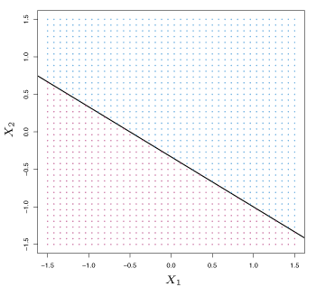
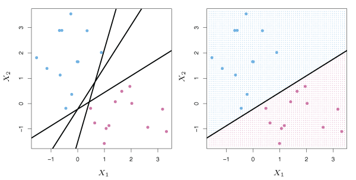

## Maximal Margin Classifier 

This section will define a hyperplane and introduce the concept of an optimal separating hyperplane.

### What is a Hyperplane?
In a $$p$$-dimensional space, a *hyperplane* is a flat affine subspace of dimension $$p - 1$$. 
For example, a two dimensional hyperplane is a line and a three dimensional hyperplane is a plane.

In two dimensions, a hyperplane is defined as all points $$(X_1, X_2)^T$$ that satisfy the equation
$$
    \beta_0 + \beta_1 X_1 + \beta_2 X_2 = 0
    \tag{9.1}
$$
for fixed parameters $$\beta_0, \beta_1, \beta_2$$. 

In $$p$$-dimensions, a hyperplane is defined as all points $$X = (X_1, X_2, \ldots, X_p)^T$$ that satisfy
$$
    \beta_0 + \beta_1 X_1 + \beta_2 X_2 + \cdots + \beta_p X_p = 0 \>.
    \label{eq:pHypPlane}\tag{9.2}
$$

Suppose that a point $$X$$ does not satisfy $$\eqref{eq:pHypPlane}$$; rather, 
$$
    \beta_0 + \beta_1 X_1 + \beta_2 X_2 + \cdots + \beta_p X_p > 0 \> .
    \tag{9.3}
$$
This tells us that $$X$$ lies to one side of the hyperplane.
On the other hand, if
$$
    \beta_0 + \beta_1 X_1 + \beta_2 X_2 + \cdots + \beta_p X_p < 0
    \tag{9.4}
$$
then $$X$$ lies on the other side of the hyperplane.
A hyperplane can be thought of as dividing a $$p$$-dimensional space into two halves.
A two-dimensional hyperplane (a line) is shown in Figure 9.1.

{:refdef: style="max-width:750px; margin:auto; text-align: center;"}
__Figure 9.1__ -- *The hyperplane (line)* $$1 + 2X_1 + 3X_2 = 0$$ *is shown. The blue region is the set of points for which* $$1 + 2X_1 + 3X_2 > 0$$ *, and the purple region is the set of points for which* $$1 + 2X_1 + 3X_2 < 0$$.
{: refdef}

### Classification Using a Separating Hyperplane
Consider a $$n \times p$$ data matrix $$\mathbf{X}$$ that consists of $$n$$ training observations in a $$p$$-dimensional space,
$$
    x_1 = 
    \begin{pmatrix}
        x_{11}\\
        \vdots\\
        x_{1p}
    \end{pmatrix}
    , \ldots, x_n = 
    \begin{pmatrix}
        x_{n1}\\
        \vdots\\
        x_{np}
    \end{pmatrix},
    \tag{9.5}
$$
and that these observations fall into two classes.
That is, $$y_1, \ldots, y_n \in \{-1, 1\}$$ where $$-1$$ represents one class and $$1$$ represents the other class.
Suppose we have a test observation, a $$p$$-vector of observed features $$x^* = (x_1^* \ldots x_p^*)^T$$.
The goal is to develop a classifier based on the training data that will correctly classify the test observation.

Suppose it is possible to construct a hyperplane that separates the training observations perfectly according to their class labels.
Then a separating plane has the property that
$$
    \beta_0 + \beta_1 x_{i1} + \beta_2 x_{i2} + \cdots + \beta_p x_{ip} > 0 \>\text{ if }\> y_i = 1
    \tag{9.6}
$$
and
$$
    \beta_0 + \beta_1 x_{i1} + \beta_2 x_{i2} + \cdots + \beta_p x_{ip} < 0 \>\text{ if }\> y_i = -1 \> .
    \tag{9.7}
$$
Equivalently, a separating plane has the property that
$$
    y_i(\beta_0 + \beta_1 x_{i1} + \beta_2 x_{i2} + \cdots + \beta_p x_{ip}) > 0
    \tag{9.8}
$$
for all $$i=1, \ldots, n$$.

If such a separating hyperplane exists, it can be used to construct a classifier where a test observation is assigned a class depending on which side of the hyperplane it is located.
The right panel of Figure 9.2 shows an example of such a classifier.
A test observation $$x^*$$ is assigned to a class based on the sign of $$f(X^*) = \beta_0+\beta_1 x_1^* +\beta_2 x_2^* + \cdots + \beta_p x_p^*$$.
If $$f(x^*)$$ is positive, then the test observation is assigned to class $$1$$, and if $$f(x^*)$$ is negative, it is assigned to class $$-1$$.
The *magnitude* of $$f(x^*)$$ is also useful in estimating the prediction accuracy.
If $$f(x^*)$$ is far from zero, $$x^*$$ lies far from the hyperplane and we can be confident about our class assignment.
If $$f(x^*)$$ is close to zero, the $$x^*$$ is near the hyperplane and we are less certain about the class assignment.

{:refdef: style="max-width:750px; margin:auto; text-align: center;"}
__Figure 9.2__ -- Left: *There are two classes of observations, shown in blue and purple, each of which has measurements on two variables. Three separating hyperplanes, out of many possible, are shown in black.* Right: *A separating hyperplane is shown in black. The blue and purple grid indicates the decision rule made by a classifier based on this separating hyperplane.*
{: refdef}

### The Maximal Margin Classifier
In general, if the data can be perfectly separated by a hyperplane, then there will exist an infinite number of such hyperplanes.
To construct a classifier, we must have a way to decide which of the infinite possible separating hyperplanes to use.

One choice is the *maximal margin hyperplane* (also known as the *optimal separating hyperplane*), which is the separating hyperplane that is farthest from the training observations.
Equivalently, it is the hyperplane with the maximal *margin*, meaning it has the greatest minimum distance to the training observations.
A test observation can then be classified based on which side of the maximal margin hyperplane it lies.
The maximal margin classifier often works well but can lead to overfitting when $$p$$ is large.

Figure 9.3 shows the maximal margin hyperplane for the data set from Figure 9.2.
We see that three observations are equidistant from the maximal margin hyperplane and line along the dashed lines.
These observations are known as *support vectors* since they "support" the maximal margin hyperplane.
If any of these three points move slightly, the maximal margin hyperplane will also move.
The maximal margin hyperplane depends only on the support vectors and movement in any of the other observations would not affect the separating hyperplane, as long as they do not cross the cross the boundary set by the margin.

{:refdef: style="max-width:750px; margin:auto; text-align: center;"}
__Figure 9.3__ -- *The maximal margin hyperplane is shown as a solid line. The margin is the distance from the solid line to either of the dashed lines. The two blue points and the purple point that line on the dashed lines are the support vectors.*
{: refdef}

### Construction of the Maximal Margin Classifier
Consider $$n$$ training observations $$x_1, \ldots, x_n \in \mathbb{R}^p$$ with associated class labels $$y_1, \ldots, y_n \in \{-1, 1\}$$. 
The maximal margin hyperplane is the solution to the optimization problem
$$
\begin{align*}
    &\underset{\beta_0, \beta_1, \ldots, \beta_p}{\text{maximize}}\>M \tag{9.9}\\
    &\text{subject to } \sum_{j=1}^p \beta_j^2 = 1, \tag{9.10}\\
    &y_i(\beta_0 + \beta_1 x_{i1} + \beta_2 x_{i2} + \cdots + \beta_p x_{ip}) \ge M \>\> \forall\>\> i=1,\ldots, n. \label{eq:911}\tag{9.11}
\end{align*}
$$
The constraint in $$\eqref{eq:911}$$ guarantees that each observation will be on the correct side of the hyperplane provided $$M > 0$$.
The second constraint allows us to express the perpendicular distance from observation $$i$$ to the hyperplane by
$$
    y_i(\beta_0 + \beta_1x_{i1} + \beta_2x_{i2} + \cdots + \beta_px_{ip}) \>.
$$
Hence, the second and third constraints place observations on the correct side of the hyperplane and at distances greater than or equal to $$M$$ away from the hyperplane. 
In this sense, $$M$$ is the width of the hyperplane margin. 
The optimization problem finds parameters $$\beta_0, \beta_1, \ldots , \beta_p$$ that maximize $$M$$. 

### The Non-Separable Case
Separating hyperplanes often do not exist.
In these cases, a maximal margin classifier also does not exist. 
Hence, the optimization problem defined above has no solution for $$M > 0$$. 
Figure 9.4 shows an example of this case.
The next section will extend the concept of a separating hyperplane in order to develop a hyperplane that *almost* separates the classes.

{:refdef: style="max-width:750px; margin:auto; text-align: center;"}
__Figure 9.4__ -- *The two classes of observations are not separable by a hyperplane, and so the maximal margin classifier cannot be used.*
{: refdef}

## Support Vector Classifiers

### Overview of the Support Vector Classifier
A classifier based on a separating hyperplane can be undesirable as it will perfectly classify all training observations.
This can lead to sensitivity to individual observations as is illustrated in Figure 9.5 where the addition of a single blue observation dramatically changes the maximal margin hyperplane.

{:refdef: style="max-width:750px; margin:auto; text-align: center;"}
__Figure 9.5__ -- Left: *Two classes of observations are shown in blue and purple, along with the maximal margin hyperplane.* Right: *An additional blue observation has been added, leading to a dramatic shift in the maximal margin hyperplane.*
{: refdef}

A hyperplane classifier that does not perfectly partition the observed data into two classes may be preferred as to

- reduce reliance on individual data points, and
- improve classification for the majority of training data points.

That is, misclassifying a few data points is worthwhile in order to do a better job classifying the remaining observations.

*Support vector classifiers* (sometimes called *soft margin classifiers*) do not aim to maximize the margin such that each data point is on the correct side of the hyperplane.
Instead, they allow some observations to lie on the incorrect side of the hyperplane.
An example is shown in Figure 9.6.

{:refdef: style="max-width:750px; margin:auto; text-align: center;"}
__Figure 9.6__ -- Left: *A support vector classifier fit to a small data set. The hyperplane is shown as a solid line and the margins are shown as dashed lines.* Right: *Same as left panel with two additional points on the wrong side of the hyperplane and the wrong side of the margin.*
{: refdef}

### Details of the Support Vector Classifier 
Support vector classifiers use a hyperplane that correctly divides most training observations into two classes. 
However, a few data points may be incorrectly classified. 
A support vector classifier is the solution to the optimization problem
$$
\begin{align*}
    &\underset{\beta_0, \beta_1, \ldots, \beta_p, \epsilon_1, \ldots, \epsilon_n}{\text{maximize}}\>M \label{eq:912} \tag{9.12}\\
    &\text{subject to } \sum_{j=1}^p \beta_j^2 = 1, \tag{9.13}\\
    &y_i(\beta_0 + \beta_1 x_{i1} + \beta_2 x_{i2} + \cdots + \beta_p x_{ip}) \ge M(1 - \epsilon_i), \label{eq:914} \tag{9.14}\\
    &\epsilon_i \ge 0, \> \sum_{i=1}^n \epsilon_i \le C, \label{eq:915} \tag{9.15}
\end{align*}
$$
where $$C \geq 0$$ is a tuning parameter. 
As in the maximal margin hyperplane, $$M$$ is the margin width, which is what we want to maximize.
In $$\eqref{eq:914}$$, $$\epsilon_1, \ldots , \epsilon_n$$ are *slack variables* that allow individual observations to be on the wrong side of the margin.
Once this optimization problem has been solved, a test observation $$x^*$$ is classified based on the sign of $$f(x^*) = \beta_0 + \beta_1x_1^* + \cdots + \beta_px_p^*$$.

In the optimization problem, the slack variable $$\epsilon_i$$ helps determine where observation $$i$$ lies relative to the hyperplane and margin. 

- If $$\epsilon_i = 0$$, the $$i$$th observation is on the correct side of the margin.
- If $$\epsilon_i > 0$$, the $$i$$th observation is on the wrong side of the margin and is said to *violate* the margin.
- If $$\epsilon_i > 1$$, the $$i$$th observation is on the wrong side of the hyperplane.

In $$\eqref{eq:914}$$, $$C$$ is an upper bound for the sum of the $$\epsilon_i$$'s.
$$C$$ can be thought of as a *budget* for the amount the margin can be violated by the observations.
If $$C = 0$$, $$\epsilon_1 = \dots = \epsilon_n = 0$$, and this reduces to the maximal margin hyperplane optimization problem. 
For $$C > 0$$, at most $$C$$ data points can lie on the incorrect side of the hyperplane, since data points on the wrong side of the hyperplane have $$\epsilon_i > 1$$, but $$\sum\limits_{i=1}^n\epsilon_i \leq C$$. 
As $$C$$ increases, more margin violations are allowed resulting in a wider margin.
As $$C$$ decreases, the margin narrows because violations are less accepted.

Figure 9.7 gives an example of how the value of $$C$$ affects the margin.

{:refdef: style="max-width:750px; margin:auto; text-align: center;"}
__Figure 9.7__ -- *A support vector classifier was fit using four different values for the tuning parameter $$C$$. The largest value used is in the top left panel and smaller values were used in the top right, bottom left and bottom right panels.*
{: refdef}

The value of $$C$$ influences the bias-variance trade-off and is typically selected with cross-validation. 
For small $$C$$, the model achieves tight margins with few violations, which generally results in low bias and high variance. 
For larger values of $$C$$, the margin is wider and more violations are permitted, resulting in a higher bias and often lower variance.

The solution to the optimization problem that defines support vector classifiers is only influenced by data points that either lie on the margin or that violate the margin. 
We define data points on the margin, or on the wrong side of the margin as *support vectors*.
Support vectors are the data points that, if altered, have an effect on the classifier.

## Support Vector Machines

### Classification with Non-Linear Decision Boundaries
The support vector classifier works well in the two-class setting when the boundary is linear.
In practice, non-linear boundaries often arise as is illustrated by the data in the left panel of Figure 9.8.
Support vector classifiers are not suitable for this scenario and are essentially useless at predicting the boundary.

{:refdef: style="max-width:750px; margin:auto; text-align: center;"}
__Figure 9.8__ -- Left: *The observations fall into two classes, with a non-linear boundary between them.* Right: *The support vector classifier seeks a linear boundary, and consequently performs very poorly.*
{: refdef}

By using quadratic, cubic or higher order polynomial functions of the predictions a better fit to the non-linear boundary can be obtained.
For example, instead of modelling a support vector classifier with $$p$$ features
$$
    X_1, X_2, \dots, X_p,
$$
we could use a support vector classifier with $$2p$$ features,
$$
    X_1, X_1^2, X_2, X_2^2, \ldots, X_p, X_p^2 \>.
$$
The optimization problem in $$\eqref{eq:912}$$--$$\eqref{eq:915}$$ then becomes
$$
\begin{align*}
    &\underset{\beta_0, \beta_{11}, \beta_{12}, \ldots, \beta_{p1}, \beta_{p2}, \epsilon_1, \ldots, \epsilon_2}{\text{maximize}} \> M \tag{9.16}\\
    &\text{subject to } y_i \left ( \beta_0 + \sum_{j=1}^p \beta_{j1}x_{ij} + \sum_{j=1}^p \beta_{j2} x_{ij}^2 \right ) \ge M(1 - \epsilon_i),\\
    &\sum_{i=1}^n \epsilon_i \le C, \> \epsilon_i \ge 0, \> \sum_{j=1}^p \sum_{k=1}^2 \beta_{jk}^2 = 1 \>.
\end{align*}
$$

Alternatively, other functions of the predictors could be considered rather than polynomials.
The support vector machine allows us to enlarge the feature space while maintaining computational efficiency.

### The Support Vector Machine
The *support vector machine* (SVM) extends support vector classifiers by enlarging the feature space in a specific way using *kernels*.

The solution to the support vector classification problem involves inner products of the observations.
The inner product of two vectors $$a$$ and $$b$$ is defined as $$\langle a, b \rangle = \sum_i a_i b_i$$.
The inner product of two observations  $$x_i, x_{i'}$$ is given by
$$
    \langle x_i,x_{i'}\rangle = \sum_{j=1}^p x_{ij}x_{i'j} \>.
    \label{eq:917} \tag{9.17}
$$

- The linear support vector classifier can be expressed as
$$
    f(x) = \beta_0 + \sum_{i=1}^n \alpha_i \langle x,x_i \rangle
    \label{eq:918} \tag{9.18}
$$
for $$n$$ parameters $$\alpha_i, i = 1, \ldots, n$$, one per training observation. 
- To estimate $$\alpha_1, \ldots, \alpha_n$$ and $$\beta_0$$, we only require the $$\binom{n}{2} = n(n-1)/2$$ inner products $$\langle x_i, x_{i'} \rangle$$ between each training observation pair.

It turns out that $$\alpha_i$$ is nonzero only for the support vectors in the solution.
Hence, non-support vector training observations have $$\alpha_i = 0$$. 
If $$\mathcal{S}$$ is the set of indices of these support points, we can express any solution function of the form $$\eqref{eq:918}$$ as
$$
    f(x) = \beta_0 + \sum_{i \in \mathcal{S}} \alpha_i \langle x_i, x_{i'} \rangle \>.
    \tag{9.19}
$$
Now suppose that whenever an inner product $$\eqref{eq:917}$$ appears in $$\eqref{eq:918}$$, or in a calculation of the solution for the support vector classifier, we replace it with a *generalization* of the inner product of the form
$$
    K(x_i, x_{i'}),
    \tag{9.20}
$$
where $$K$$ is some function called a *kernel*.
A kernel quantifies the similarity of two observations.
For example, we could let
$$
    K(x_i, x_{i'}) = \sum_{j=1}^p x_{ij} x_{i'j}
    \tag{9.12}
$$
which would give us the support vector classifier.
However, we could replace $$\sum_{j=1}^px_{ij}x_{i'j}$$ with
$$
    K(x_i, x_{i'}) = \left (1+ \sum_{j=1}^p x_{ij} x_{i'j} \right )^d \>.
    \tag{9.22}
$$
This is known as a *polynomial kernel* of degree $$d$$ where $$d$$ is a positive integer.
When $$d > 1$$ is used, the support vector classifier algorithm leads to a much more flexible decision boundary.
It is essentially fitting a support vector classifier in a higher-dimensional space involving polynomials of degree $$d$$.
Combining the support vector classifier with a non-linear kernel, the resulting classifier is known as a support vector machine.
In this case, the non-linear function has the form
$$
    f(x) = \beta_0 + \sum_{i \in \mathcal{S}} \alpha_i K(x, x_i) \>.
    \tag{9.23}
$$

The left panel of Figure 9.9 shows an example of a SVM with a polynomial kernel applied to the non-linear data from Figure 9.8.

{:refdef: style="max-width:750px; margin:auto; text-align: center;"}
__Figure 9.9__ -- Left: *A SVM with a polynomial kernel of degree 3 is applied to the non-linear data from Figure 9.8, resulting in a far more appropriate decision rule.* Right: *A SVM with a radial kernel is applied. In this example, either kernel is capable of capturing the decision boundary.*
{: refdef}

An alternative kernel is the *radial kernel* of the form
$$
    K(x_i, x_{i'}) = \exp \left(-\gamma \sum_{j=1}^p (x_{ij} - x_{i'j})^2 \right) \>,
    \tag{9.24}
$$
where $$\gamma > 0$$. 
The right panel of Figure 9.9 displays a SVM with a radial kernel on the same set of non-linear observations. 
In this case, the radial kernel also divides the two classes effectively. 

Kernels are computationally efficient as only $$K(x_i, x_{i'})$$ has to be computed for each pair of observations.

## SVMs with More than Two Classes
Separating hyperplanes do not generalize well when when there are more than two classes.
Two proposals for extending SVMs to the $$K$$-class case are the *one-versus-one* and *one-versus-all* approaches.

### One-Versus-One Classification
The $$\binom{K}{2}$$ SVMs for all pairs of classes are constructed.
For example, one SVM might compare the $$k$$th class, coded as $$+1$$ with the $$k'$$th class, coded as $$-1$$.
A test observation is classified using each of the $$\binom{K}{2}$$ classifiers, and we count the frequency of assignment to each of the $$K$$ classes.
The final classification is performed by assigning the test observation to the class for which it was most frequently assigned.

### One-Versus-All Classification
We fit $$K$$ SVMs, each comparing one of the $$K$$ classes to the other $$K-1$$ classes.
Let $$\beta_{0k}, \beta_{1k}, \ldots , \beta_{pk}$$ be the parameters that result from fitting a SVM comparing the $$k$$th classes (coded as $$+1$$) to the others (coded as $$-1$$).
Let $$x^*$$ be a test observation.
This observation is assigned to the class for which $$\beta_{0k}+\beta_{1k}x_1^* +\beta_{2k}x_2^* + \cdots + \beta_{pk}x_p^*$$ is largest.

## Relationship to Logistic Regression
It turns out that the optimization problem $$\eqref{eq:912}-\eqref{eq:915}$$ for fitting the support vector classifier $$f(X) = \beta_0 + \beta_1X_1 + \cdots + \beta_p X_p$$ can be written as
$$
    \underset{\beta_0, \beta_1, \ldots, \beta_p}{\text{minimize}} \left \{ \sum_{i=1}^n \max[0, 1-y_if(x_i)] + \lambda \sum_{j=1}^p \beta_j^2 \right\},
    \label{eq:925} \tag{9.25}
$$
where $$\lambda$$ is a nonnegative tuning parameter,
For large values of $$\lambda$$, $$\beta_1, \ldots, \beta_p$$ are small, more violations of the margin are tolerated, and a low-variance, high-bias classifier results.
When $$\lambda$$ is small, few violations to the margin will occur which leads to a high-variance but low-bias classifier.
So, small values of $$\lambda$$ are the same as small values of $$C$$ in $$\eqref{eq:915}$$.

The redefined optimization problem has the "Loss + Penalty" form:
$$
    \underset{\beta_0, \beta_1, \ldots, \beta_p}{\text{minimize}} \left \{ L(\mathbf{X}, \mathbf{y}, \beta) + \lambda P(\beta) \right \} \>.
    \tag{9.26}
$$
In this minimization problem, $$L(\mathbf{X}, \mathbf{y}, \beta)$$ is a loss function evaluating how well the model, with parameters $$\beta$$, fits the data $$(\mathbf{X}, \mathbf{y})$$. 
$$P(\beta)$$ is a penalty function on the vector $$\beta$$, which is supervised by tuning parameter $$\lambda$$. 
This form is very similar to ridge regression and the lasso. 

The loss function for $$\eqref{eq:925}$$ is
$$
    L(\mathbf{X}, \mathbf{y}, \beta) = \sum_{i=1}^n \max[0, 1-y_i(\beta_0 + \beta_1x_{i1} + \cdots + \beta_px_{ip})] \>.
$$
This is known as *hinge loss* and is similar to the logistic regression loss function.
An illustration of both is shown in Figure 9.12.

{:refdef: style="max-width:750px; margin:auto; text-align: center;"}
__Figure 9.12__ -- *The SVM and logistic regression loss function are compared as a function of* $$y_i(\beta_0 + \beta_1 x_{i1} + \cdots + \beta_p x_{ip})$$*.*
{: refdef}

With analogous loss functions, logistic regression and support vector classifiers generally have similar result. 
For well partitioned classes, SVMs are generally better models than logistic regression. 
However, for poorly separated classes, logistic regression performs better.

SVMs can be used for quantitative responses by using a technique called *support vector regression*. 
Support vector regression tries to estimate coefficients that minimize another loss function, where only residuals with absolute values in excess of some constant $$R>0$$ influence the loss function. 
