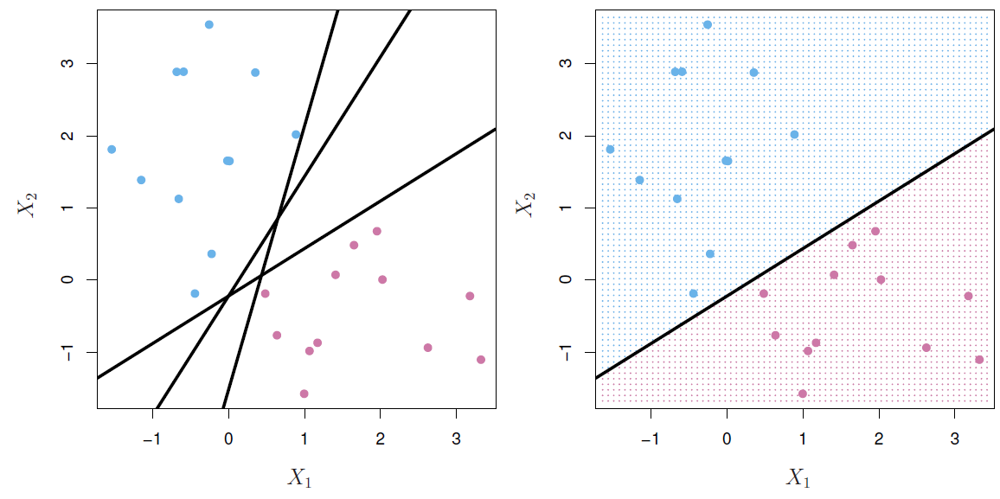
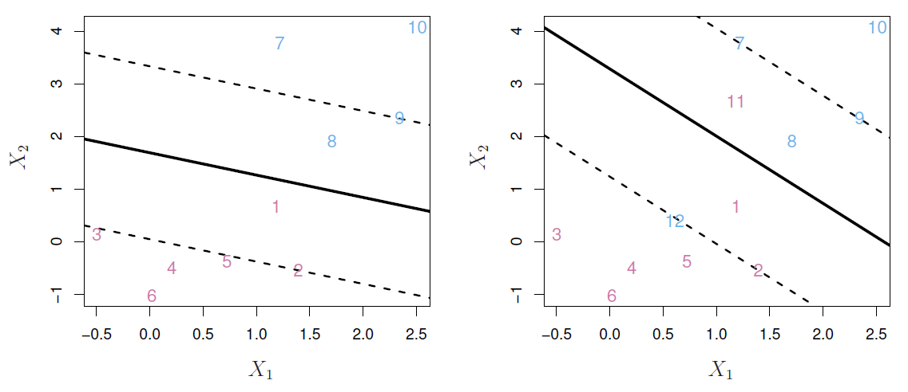
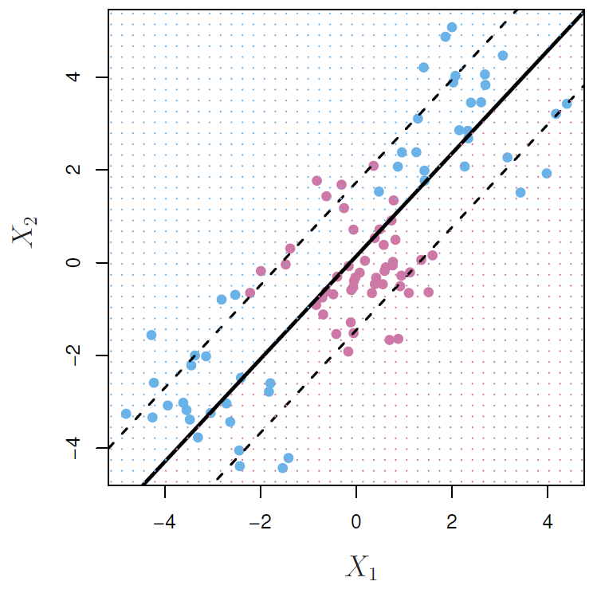
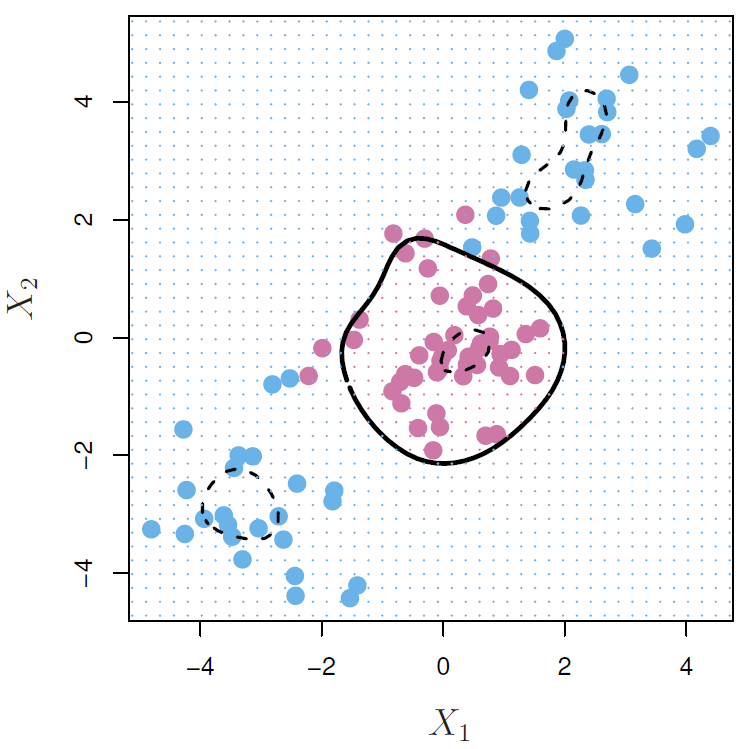
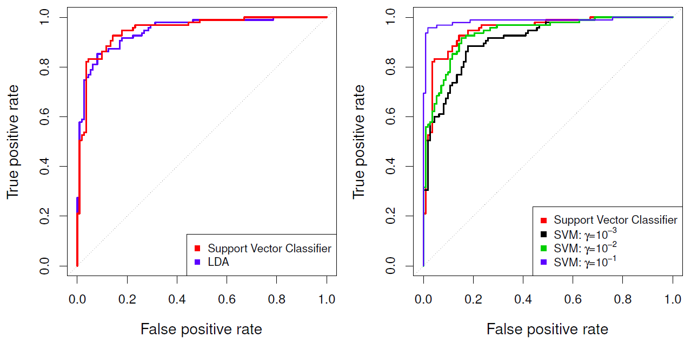
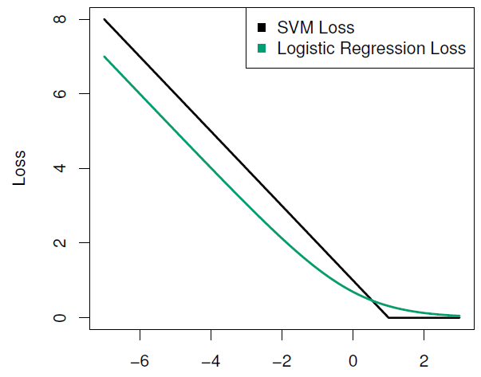

## Maximal Margin Classifier

<iframe width="560" height="315" src="https://www.youtube.com/embed/QpbynqiTCsY?list=PL5-da3qGB5IDl6MkmovVdZwyYOhpCxo5o" frameborder="0" allowfullscreen></iframe>

##### Slide 1: 

*Hastie:* OK, well, we're going to talk about support vector machines today, which is another way of doing classification. And it's a direct approach to the classification problem. In a single line, we try and find *a plane that separates the classes in feature space.* 

*Tibshirani:* Support vector machines are a very popular way of classifying. One reason for it is the name is very neat. You're probably thinking as you hear the title, support vector machines. So the word support is kind of interesting. And machine evokes something much larger and powerful. And we'll tell you where that name comes from as we talk about the method. It was actually due to Vapnik, an applied mathematician from the former Soviet Union, who came over to the United States around 1990 and developed the method with Cortes while working at Bell Labs where Trevor used to work. 

*Hastie:* Yes, they were at a lab down the road. And when they first came and talked about support vector machines and having this great new idea, I scoffed at it a little bit. And I thought, oh, yeah, another brazen claim by computer scientists. But it turns out it's pretty good. Right. And as you'll see, it's a unique kind of way-- it approached the classification problem in a way a computer scientist would approach it. There's no probability model as such, it really just looks for a hyperplane that separates the classes in a direct way. So they've been around for about 20 years now. And support vector machines are still firmly embedded in the community and considered one of the best ways of doing classification. So we're going to tell you about them today. The idea with support vector machines, as we said, is to find the plane that separates the classes in feature space. And we'll tell you what we mean by that by a plane and separation and so on. But the idea is natural. You try and separate the two classes. I mean, that's what we want to do when we classify. But you'll see we cannot always do that. And the technology gets creative in two ways. One is that we soften what we mean by separates and the other is that we enrich and enlarge a feature space so that the separation becomes possible. Before we can get into this, let's just talk about what is a hyperplane. 

##### Slide 2: 

*Hastie:* So I'll give you some technical definition, and then I'll show you a picture. So a hyperplane is in $$p$$ dimensions if you got $$p$$ features is a flat affine subspace of dimension $$p$$ minus 1. Well, if that didn't help you, let's just look a little bit deeper. In general, the equation of a hyperplane has the form as follows.

$$\beta_0+\beta_1X_1+\beta_2X_2+\dotsb+\beta_pX_p=0$$

It's an equation. Here's a linear equation that's equal to 0. It's a linear function. In two dimensions, a hyperplane will be a line. And that's the one I'll demonstrate in the next slide. And if $$\beta_0$$, which is called intercept, if that is 0, then the hyperplane goes through the origin. Otherwise it doesn't. And the vector $$\beta_1$$  through $$\beta_p$$, excluding $$\beta_0$$ , is called a normal vector. It points in a direction orthogonal to the surface of the hyperplane. 

##### Slide 3: 

*Hastie:* So that's have a look at the picture and see what we mean by that.

{:refdef: style="text-align:center"}
**Figure 9.1**
{: refdef}

So in this picture, the blue line is the hyperplane. We've got some points in the picture and we got-- there's the origin over here. And we've got this red line, which is the normal to the hyperplane. So it's orthogonal to the surface of the hyperplane. And the way we understand what's going on is as follows. For any given point-- so, for example, take this point of here-- we can project it onto the normal. So here see the orthogonal projection, the little right angle showing that we're projecting orthogonally onto this normal over here. And so we get the distance from the origin where this point projects. Well, in this case, the value that you get is 1.6. Well, that's actually the value of the function here. For the points beyond the hyperplane, the value of the function should end up to be 0. So which points are going to project onto this normal and have a value 0? Well, they're going to be all points on the hyperplane, because you can see there is a right angle there, too. So if we project this point, it's going to project over here. If we project this point, it's going to project over here. And the value of the function is 0 over here, so all these points end up having the function value 0. And so they're on the hyperplane. These points, on the other hand, don't. In this example, the direction-- the $$\beta_1$$  and $$\beta_2$$  are given by 0.8 and 0.6 in the bottom corner here. Those are the two values for $$\beta_1$$  and $$\beta_2$$  that define this normal. Well, if you check, you'll see that the sum of squares of $$\beta_1$$  and $$\beta_2$$  adds up to 1. That means that this $$\beta$$ is a unit vector. And so the direction vector's a unit vector. And when that's the case, there's something special happens. And that is that when you evaluate the function, the value that you get is actually the distance, Euclidean distance of the point from the hyperplane. Now, that's not too hard to prove, but we won't do that here. But for those of you who can do a little bit of calculus and know a bit of geometry, see if you can try and show that. It's not that hard. So this point is 1.6 units from the hyperplane. This point over here is minus 4 units from the hyperplane. So there's a sign in the distance. One side of the hyperplane it's going to be negative, the other side positive. All points on this side will end up having a positive distance, all points on this side a negative distance. And of course, all the points on the hyperplane are distance 0. So that's a little tutorial on hyperplanes. 

##### Slide 4: 

*Hastie:* So with that in place, we can now talk of separating hyperplanes. So in these two pictures, what we show-- a set of points.

{:refdef: style="text-align:center"}
**Figure 9.2**
{: refdef}

Some are colored blue. Some are colored a pinky, mauve color. And we've got three lines in this picture over here. And you'll notice that each of these three lines separates the blues from the mauves. This one does because there's all blue points on one side, all purple points on this side. So does this one and so does the other one. So all three of them separate the two classes. So in terms of making a classifier, in principle all three of those would do. If we pick one of them, we can say, well, that's going to defined the classified. It separates the two classes. Anything to this side, we can classify as blue. Anything to this side, we'll classify as purple. From what we've seen before, we know that on one side of the hyperplane the function's going to be positive and on the other side it's going to be negative. So what we can do is code the colored points. And those that are blue say we make them 1. And those that are mauve, we make them minus 1. And then we can say that if the $$Y$$ that we've made, $$Y$$ is plus or minus 1 times the value of the function is positive, then we classify each of the points perfectly because they're on the right side of the hyperplane. And the function itself evaluated at 0 is called a separating hyperplane. So that helps us define what we mean by separating hyperplane if this product is always positive, where we've coded the points as plus 1 and minus 1. Now, it's all very well coming up with a separating hyperplane, but we've got many to choose from. So if we had to choose, which one would we pick? 

##### Slide 6: 

*Hastie:* And so that brings us on to the idea of the maximal margin classifier.

{:refdef: style="text-align:center"}
**Figure 9.3**
{: refdef}

So the idea is the same set of points-- the idea is amongst all separating hyperplanes, find the one that makes the biggest margin or biggest gap between the two classes. And we've indicated over here, there's the hyperplane. In fact, this is the optimal one here found through an algorithm we'll tell you about. And you can see the hyperplane's exactly equidistant from the closest blue point and the closest mauve point. And that makes the biggest gap. So why is that interesting having the biggest gap? Well, the idea is simply that if you make a big gap on the training data-- these are training data-- hopefully, when you plot those points down there, you'll also make a big gap on them. That's the underlying though. Of course, from a statistics point of view, that's maybe not always going to make sense because it seems like there's overfitting. We're focusing on a few of the very closest points. But we'll see, in general, it seems to perform very well. So that's the idea of the maximal margin classifier. Now, how do you actually do that? Well, it's somewhat technical. You can set it up as an optimization problem. And this is how we do it.

$$\displaystyle\max_{\beta_0,\beta_1,\dotsc,\beta_p}M \\ \text{subject to }\sum_{j-1}^p\beta_j^2=1, \\ y_i(\beta_0+\beta_1x_1+\dotsb+\beta_px_{ip})\geq M$$

So first of all, we constrain the sum of squares of the betas to be one. Remember, these are the $$\beta$$s here. Not the $$\beta_0$$ . And if the sum of squares of these are 1, then the function evaluates to the distance if you multiply it by the wire $$Y_i$$, which is coded as plus 1 or minus 1. This here is the distance of the $$i^{\text{th}}$$ point from the current hyperplane defined by the $$\beta$$s. Now, we want to make-- and it's a sign distance. So if they're all positive, it means all the points on the correct side of the hyperplane. And if we want to maximize the margin, we want to find that hyperplane for which these distances are all as big as possible. So we want all of them to be bigger than some number $$M$$ and we're going to maximize that $$M$$. So we're going to find the parameters that gives us the largest $$M$$ such that for every point they're at least $$M$$ units from the hyperplane. So that's a nice mathematical way of defining the problem. To solve it, it actually goes a little bit beyond the scope of this class. So that's what you see the uphill car logo there that's in the book as well. The way it's phrased here, it's not quite a convex optimization problem. But you can rephrase it and make it one, and then you can solve it using software. And there's a function `svm` in R, for example, in the package with a strange name, me e1071. And we'll see when we do the labs that that's also the separating hyperplane problem. OK, so we've seen how to solve the separating hyperplane problem. We've got an algorithm for doing it. And it's a pretty slick algorithm. We get the maximal margin classifier. Well, we're going to see that that's not going to be good enough. And in the next section, we'll talk about what we do in cases when you cannot get a separating hyperplane. And we'll also talk about how we deal with noisy data as well.

## Support Vector Classifier

<iframe width="560" height="315" src="https://www.youtube.com/embed/xKsTsGE7KpI?list=PL5-da3qGB5IDl6MkmovVdZwyYOhpCxo5o" frameborder="0" allowfullscreen></iframe>

##### Slide 6: 

*Hastie:* We're going to see how we can extend our maximum margin classify now to deal with situations where you cannot separate the data well. So we'll start off, in the case where the data aren't separable at all as we see in this picture over here.

{:refdef: style="text-align:center"}
**Figure 9.4**
{: refdef}

OK, we're all good and well. What happens if the data aren't separable? I mean, it's a little bit wishful thinking that we can always separate the data perfectly on the hyperplane. So here's a similar picture to what we had before. In this case, the data aren't separable. You'll see. You cannot fit a hyperplane through these data and exactly separate them. You can try as much as you like. But there's maybe an attempt but no. It's obvious you're always going to get overlap. And this is often the case, especially if the number of points is large relative to the dimensions. On the other hand, for a lot of $$Y$$ data like in genomics and other kinds of problems, the number of sample points is less than the dimensions. And in general, when the number of sample points is less than the dimensions, you can always separate the data with a hyperplane. But when $$N$$ is much bigger than $$p$$, typically not. 

##### Slide 7: 

*Hastie:* So that's a problem we need to deal with. Another problem we're going to want to deal with is when you have noisy data. And so I alluded to that earlier. 

{:refdef: style="text-align:center"}
**Figure 9.5**
{: refdef}

So you know we've got our original data. And that's not too noisy. And we get a hyperplane over there. What happens if we add one more point, blue point? Here it is over here. And now we still want to separate in hyperplane. Well, just the presence of that one extra point means we've had to tilt the hyperplane quite dramatically to still get separation. So that's a little bit of crazy behavior, we'd say non-robust behavior, to the addition of one extra point. This point might be an outlier. And it's going to have a dramatic effect on the maximum margin classifier. So we want to be able to deal with both of these problems. This, what we call a support vector classifier, is going to do that. And it maximizes what we call a soft margin. So we're going to relax the idea of a separating hyperplane. 

##### Slide 8: 

*Hastie:* So here's the idea. We've got two pictures here. Both of them have soft margins. 

{:refdef: style="text-align:center"}
**Figure 9.6**
{: refdef}

In the left picture, the data actually are separable. But we've made the margin wider then we need to. And so we've got two points who are on the wrong side of their margins. Amongst the blue guys, this point here, number 8, is on the wrong side of the margin, this one. And amongst the pink guys, this guy's on the wrong side of the margin. But by getting the margin wider, we've had to put up with those two so-called errors. And so we call this a soft margin. And the idea is that making the soft margin wider, or smaller, is a way of kind of regularizing. Because once you allow some points to be on the wrong side of the margin, the margin gets determined by more than just the closest points. On the right plot, it's essential to have a soft margin. Because we cannot get a separating hyperplane. And so here we have a candidate hyperplane with its margins. And we see that there's several points on the wrong side. We've got a blue point on the wrong side of its margin over here. We've got a blue point on the wrong side of the decision boundary and on the wrong side of the margin. Likewise, there's a pink point on the wrong side of the decision boundary, also the wrong side of the margin. So these are called soft margins. And we need to modify the formulation of the problem to accommodate it. So part of the problem is the same. We're going to maximize $$M$$, subject to $$\displaystyle\sum_{j=1}^p\beta_j^2=1$$. 

$$y_i(\beta_0+\beta_1x_1+\dotsb+\beta_px_{ip})\geq M(1-\epsilon_i)$$

So that's a unit vector. Now, we want all the points, the distance of all the points, to be bigger than $$M$$ but discounted by a discount vector, 1 minus $$\epsilon_i$$. So we allow some slack. Some points needn't be exactly bigger than the margin. But there can be some slack. And how do we account for all the slack? We give ourselves a budget.

$$\epsilon_i\geq0,\displaystyle\sum_{i=1}^n\epsilon_i\geq C$$

We give ourselves a budget for the total amount of slack which, in this case, is $$C$$. So the $$\epsilon$$s tell us how much each point is allowed to be on the wrong side of its margin. It's a relative amount, relative to the margin. And we give ourselves a number $$C$$, a total amount of overlap. And then subject to that we're going to make the margin as wide as possible to get on either side of the margin. OK, again, convex optimization problem, we can solve using the `svm` package in R. $$C$$ is now a tuning parameter. And as we change $$C$$, the soft margin is going to get wider or smaller. 

##### Slide 9: 

*Hastie:* So as I said, it's a regularization parameter. And so here we've got four scenarios where we've changed $C$. 

{:refdef: style="text-align:center"}
**Figure 9.7**
{: refdef}

Here's the biggest $C$. And in fact, it's the biggest possible $C$ that's needed, because now all points are on the wrong side of the margin. And so there's an $$\epsilon$$ for every single point. So these $$\epsilon$$s you can think of as, let's do it in this picture over here, you can draw arrows which tells you the distance of each point from the margin. So there's one for this guy. And the length of these is proportional to the $$\epsilon$$s. And likewise for these guys. And as we tighten $C$, the margin gets tighter because we're allowing less and less overlap. And so that becomes a tuning parameter. We'll see a little bit later that, in effect, the number of points that are on the wrong side of the margin, with all the points inside the margin or on the wrong side of the margin, become the effective points that are controlling the orientation of the margin. So in some sense, the more points that are involved in the orientation of the margin, the more stable it becomes. And that means that $C$ gets bigger the more stable the margin becomes. And so there's going to be a kind of bias-variance trade off as we change $C$. So it is a regularization parameter. Rob? (I just had a question, actually. We're taking the Euclidean distance in all these pictures, does it matter if I standardize the variables first? Should I standardize the variables first?) That's a good point. Yes, I think you're right, Rob. The support vector machine treats all the variables as equals in a way. And so the units count. So good point, the variable should be standardized. If you remember when we did the last two in ridge regression, we said that was important there, too. Well, for the same reasons, it's important here. 

##### Slide 10: 

*Hastie:* Well, so, we've come up with a compromise when the points overlap. But in some cases, no matter how much we try it, a compromise isn't going to help. And so here's a fake situation, but it's a situation where having a soft margin doesn't help.

{:refdef: style="text-align:center"}
**Figure 9.8**
{: refdef}

You can see we've got the most set of points is exactly in the middle of a crowd of blues on one side, another crowd of blues on one the other side. And no matter what we do, we won't get a good classifier. What we'd like to do is bend the margin. And we're going to talk about ways of how we do that in the next segment.

## Kernels and Support Vector Machines

<iframe width="560" height="315" src="https://www.youtube.com/embed/dm32QvCW7wE?list=PL5-da3qGB5IDl6MkmovVdZwyYOhpCxo5o" frameborder="0" allowfullscreen></iframe>

##### Slide 11: 

*Hastie:* We saw there were situations where soft margin wasn't going to help us. And so we're going to find ways of overcoming this problem. And a natural way to do that is using feature expansion. So what we can do, one simple way, is a standard trick is enlarge the features by including transformations, such as polynomials. So we started off with, in this example, just $$X_1$$ and $$X_2$$. We can add in $$X_1^2$$, $$X_2^2$$, $$X_1^3$$, $$X_1X_2$$, and so on, polynomial expansions. So you can go from a $$p$$ dimensional space, in this case 2, to a higher dimensional space. And the more transform variables you add, the more likely you ought to be able to get separation in this higher dimensional space. (Let us notice that the $$M$$ in there, of course, is not the same $$M$$ as we use for margin.) Oh, good point, Rob. Maybe we should use different letter. Thank you. That was a bad choice of letter. (That's usually the kind of mistake I make. I'm glad I caught you on one finally.) It's the kind of mistake I hate making. So in larger feature space, and then fit a linear support vector machine in the enlarged space. And then when you project it down to the original space, it results in a non-linear decision boundary in the original space. So for example, suppose we use degree 2 polynomials. So we'll use $$X_1$$, $$X_2$$, $$X_1^2$$, $$X_2^2$$, and $$X_1$$ times $$X_2$$.

$$\beta_0+\beta_1X_1+\beta_2X_2+\beta_3X_1^2+\beta_4X_2^2+\beta_5X_1X_2=0$$

So that's a basis for fitting a general polynomial in two variables of degree 2. Well, in the enlarged space, the decision boundary would take this form. It's linear in the new variables. So there's a coefficient for each of them. So that was the form of our separate of a hyper plane. But, of course, in the original variables, it's non-linear, because we've got squares and cross products. 

##### Slide 12: 

*Hastie:* And this is what it results in for the same example that we saw.

{:refdef: style="text-align:center"}
**Figure 9.9**
{: refdef}

The decision boundary, you can see, it's kind of split in two now. So remember, how do we get these decision boundaries? In the five dimensional spaces, there's a single linear decision boundary. And we can color all the points on one side blue and on the other side mauve. Well, if you project it down into this 2-dimensional picture of the original variables, this is what it looks like. So these are conic sections of a quadratic polynomial. And this is what they look like. And it's curious because in the five dimensional space, there's a margin on either side of the linear boundary, which are the dotted lines. Well, they also project down. And so there's a pair of margins for this piece of the curve and one for this. You'll notice these are non-linear. And it even ends up in two pieces here. And importantly, in this case, this does a really good job in separating the two classes. Here's the equation.

$$\beta_0+\beta_1X_1+\beta_2X_2+\beta_3X_1^2+\beta_4X_2^2+\beta_5X_1X_2+\beta_6X_1^3+\beta_8X_1X_2^2+\beta_9X_1^2X_2=0$$

We used a cubic polynomial in this case. So there's nine transformed variables altogether. And so it starts getting a little unwieldy. The dimension of the spaces is getting a little bigger, but it solves the problem. 

##### Slide 13: 

*Hastie:* So we seem to have a way of getting around these situations where we can't separate the data. Now, polynomials aren't the greatest choice, because especially in higher dimensions, they get wild rather fast. We know, in regression, we don't like doing polynomial regression with degree bigger than 3. And if you've got a large $$p$$ to start with and if you have even cubic polynomial space, it's quite a lot of space. So it turns out there's a more elegant and controlled way to introduce nonlinearities in support vector classifies. And this is through the use of what's known as kernels. But before we get into these, we need to understand the role of inner products in support vector classifies. 

##### Slide 14: 

*Hastie:* So inner products, if you've got a set of vectors-- So we've got $$x_i$$ and $$x_{i'}$$. 

$$\langle x_i,x_{i'}\rangle=\displaystyle\sum_{j=1}^px_{ij}x_{i'j}$$

Now remember, $$x_i$$ is a $$p$$ vector. It's a set of variables for observation $$i$$. And $$x_{i'}$$ is another $$p$$ vector. And this angle notation means inner product between these two vectors. And it's just the sum of cross products of each of the individual components of the vector. So that's called the inner product between two vectors. And we write it in this compact way over here. So using that notation, we can write a linear support vector classify.

$$f(x)=\beta_0+\displaystyle\sum_{i=1}^n\alpha_i\langle x,x_i\rangle$$

You can write it in this form over here. And so here we have inner product between each of the $$x_i$$s in the data and the target point. So we're thinking this is a function of a new point $$x$$. And it turns out you can write the support vector classify solution in those forms. Now, you're not going to be able to see that just from looking at the formula for the linear function. This turns out to be how it comes out in the solution. But it's going to be important. It also turns out to estimate the parameters. So now, we've got $$n$$ parameters instead of the $$p$$. And $$n$$ could be bigger than $$p$$. To estimate the parameters, $$n\beta_0$$, all we need are all the pairwise inner products between all the endpoints in the data set. So there's going to be an $$n$$ by $$n$$ inner product matrix. And it turns out that if we have that and that's all we have, we can fit the support vector classifier and represent it in this form. And that's going to give us the same solution as what we had before. Now, when you do that, what happens is that many of the $$\alpha$$s end up being 0. Right, so here we put hats on the $$\alpha$$s. And many of them are 0. And so the only ones we need to include here are the ones that aren't 0. And so we call those the support set or the support vectors.

$$f(x)=\beta_0+\displaystyle\sum_{i\in\mathcal{S}}\hat{\alpha}_i\langle x,x_i\rangle$$

And so those are the $$\alpha$$s that are not 0. And each $$\alpha$$ is tied to one of the original points or vectors in the original data set. So we'll go back to slide eight and see which ones those are. So let's get back here to slide eight. Here's slide eight (Figure 9.6). 

##### Jump to Slide 8: 

*Hastie:* So which are the support vectors of the points with non-zero $$\alpha$$s? Well in this left picture over here, there is the two circle points. Those are support vectors, and also any points on the margin. So it looks like this one and this one and possibly this one. So in this case, there would be five support vectors. So of all the points in the picture, only 5 of them would have non-zeros $$\alpha$$s. And it sort of makes sense. Certainly the ones on the margin make sense, because they're defining the direction. But the ones inside are also going to define the direction. Because remember, they have these little $$\epsilon$$s tagged on to them. And so they're going to play some role in the definition of the direction. In this one over here, there's, 1, 2, 3, 4 5, 6, 7 support points. 

*Tibshirani:* And just add to that, if a point's not a support point, it means it's on the right side of its margin. And if we removed it but we kept it in the same area, it's not going to affect the solution. So they're not support points. And one more thing to add, this is a kind of sparsity, but it's kind of funny sparsity. Remember we talked about the lasso. It proves a sparse solution in the coefficients of the features. This is a kind of sparsity, but it's different. It's actually in the data space, because now we're assigning a weight to each data point. And some of these weights are 0. And the ones that are non-zero are called the support points. So it's sparsity, but in the data space, not the feature space. 

*Hastie:* That's a good point, Rob. And when you think of it like that, you say, suppose you had 1,000 points. And it ends up that there's 10 support points. You think, oh great, you could have thrown away the other 990 points. Well, not really. Because you had to have them all there to decide which ones would be the support points. Once you found them, you can throw them away. But it doesn't really help much in the computations. Right. 

##### Slide 14: 

*Hastie:* So it's a very interesting topic, support vector machines. And it took us awhile to understand the details. So that's inner products. And now, what about kernels? So from what we saw previously, if we can compute the inner products between all pairs of observations and if we can also compute the inner products between all the training observations and a new test point, then we can both fit the support vector machine and evaluate the function. 

##### Slide 15: 

*Hastie:* So this can be quite abstract. First of all, an inner product is like a similarity. And so if you didn't really have data and you just had pairwise similarities between observations, in principle, you could come up with a classify. And there have been some interesting examples of it. So it allows us to be a bit more abstract. But more importantly, there's some special kernel functions. A kernel function is a function of two arguments, in this case, two $$p$$ vectors. So it's called a bivariate function. And these kernels compute the inner products for us. And you might not even know what the feature space is in which they're computing the inner product, but they can be thought of doing that. But a concrete example is with polynomials. So here's a bivariate kernel function. 

$$K(x_i,x_{i'})=\left(1+\displaystyle\sum_{j=1}^px_{ij}x_{i'j}\right)^d$$

Look at it. This part is just the inner product between the original vectors, $$x_i$$ and $$x_{i'}$$. We add a 1 to it and we raise it all to the power $$d$$. And it turns out that this kernel computes the inner product in a feature expansion space that we get by expanding these vectors and these $$p$$ components into a basis for degree $$d$$ polynomials. Well, that can be a huge space. If $$p$$ is large and $$d$$ is large, the number of basis functions is actually $$p$$ plus $$d$$ choose $$d$$, $${p+d \choose d}$$, which grows very fast as $$p$$ and $$d$$ grow fast. So that's a very big dimensional space, potentially. But we don't need to actually visit that space because this function will compute those inner products. That's sort of like magic. You've got a kernel function the computes this inner product in this very high dimensional space. So try a little example with $$p$$ as 2, like in our example. We have two components in $$x$$ and $$d$$ is 2. And just expand this function and see what you get. And you'll see that, indeed, it does just what I said. And having done that, we can therefore compute the $$n$$ by $$n$$ in a product matrix for all the $$n$$ observations by evaluating this function at each pair. 

$$f(x)=\beta_0+\displaystyle\sum_{i\in\mathcal{S}}\hat{\alpha}_iK(x,x_i)$$

And then we get a solution which is of this form, because, again, $$K$$ is computing the inner product between the target point $$x$$ and each of the $$x_i$$s in the sample. And once again, these $$\alpha$$ are going to be non-zero for only those points in the support set. So that's where the kernel comes into the support vector machine. 

##### Slide 16: 

*Hastie:* One of the most popular kernels is called the radial kernel. And it's defined like this.

$$K(x_i,x_{i'})=\text{exp}(-\gamma\displaystyle\sum_{j=1}^p(x_{ij}-x_{i'j})^2)$$

{:refdef: style="text-align:center"}
**Figure 9.10**
{: refdef}

If you know what a multi-variant Gaussian distribution looks like, this is the important part of that distribution. It's the sum of squares between the components between $$x_i$$ and $$x_{i'}$$, each of the elements. There's a $$\gamma$$ here. So there's a tunable parameter that is raised to the power e. And this is our inner product in an abstract infinite dimensional feature space. So this is a very high dimensional space, so high we could never visit it. Yet, this kernel computes the inner product for us. And we therefore fit a support vector machine. And in our example where we had to the two classes separating the mauve class, the two blue classes, this is the solution that it gave. And again, it seems to have done a really good job. So something's got a little weird here. How can we fit models in an infinite dimensional feature space and not be over fitting the data? Well, it turns out that even though it's an infinite dimensional feature space, many of the dimensions are squashed down heavily, in fact, almost squashed down to 0. So it's a very high dimensional feature space, but most of the space is squashed down. And the dimensions that are squashed down tend to be the more wiggly dimensions. The smoother ones are squashed down less. You'll notice if you went through this little example over here, you'll notice that it did give you the inner product between a degree 2 polynomial, but there were coefficients in front of these. And those are what gives you the squashing factors. 

*Tibshirani:* So Trevor in that example, in polynomial kernels, I could take $$d$$ to be 1,000,000, right? (Yes.) I'm going to have a huge number polynomial functions. Which if I did with the feature expansion method, things would get out of control. So what happens here? (You'd run into trouble raising power to 1,000,000.) Yeah, with a polynomial kernel, I could get away with that. You can get away with it, yeah. And that's because of all the squishing. (Because of all the squishing there.) So radio kernels very popular. And it's one of the most popular kernels that's used for non-linear support vector machines. And there are other kernels, but this is the one people usually go to. And this $$\gamma$$ is a tuning parameter. And you can think of it-- it's like one over the standard deviation of the Gaussian. So if $$\gamma$$'s really large, it's like having a small standard deviation. And you get much more wiggly decision boundaries, whereas if $$\gamma$$'s small, the decision boundaries get smoother. So we're going to take this machinery in the next segment and look at an example.

## Example and Comparison with Logistic Regression 

<iframe width="560" height="315" src="https://www.youtube.com/embed/mI18GD4_ysE?list=PL5-da3qGB5IDl6MkmovVdZwyYOhpCxo5o" frameborder="0" allowfullscreen></iframe>

##### Slide 17: 

*Hastie:* OK. So we've learnt about support vector machines, in their full generality. Let's see how they work on a simple example, which is the heart data, where we've got a bunch of variables, not too many, 10 or so variables. 

{:refdef: style="text-align:center"}
**Figure 9.11**
{: refdef}

And there's two classes, heart disease or no heart disease, and we use the support vector machines to classify them. So in these two panels, we show the performance on the training data, and next slide will show on the test data. So what we are showing are ROC curves. So we've seen these before, but just to remind you, once we fit our function, which is initially going to be a linear function, we threshold at 0, and that's a decision boundary. If the function's bigger than 0, we'll classify to one class, otherwise, less than 0, to the other class. And you'll make a number of errors. You'll make some false positives and false negatives. Here we actually look at the false positives and the true positives. Well, as you change the threshold, you're going to change the false positives and true positives. And what the ROC curve does is trace out the true positives versus the false positives as you change the threshold, and that gives you a curve. And if you think about it, what you'd really like is a curve that really hugs this northwest corner. This one seems to be doing pretty well. OK? And a way of comparing classifiers is to see which one gets closer to the corner. So that's called an ROC curve. The name comes from an engineering term, but it's not really relevant in terms of how we use it today. And remember, the AUC, the Area Under the Curve, is the usual measure of how close the curve gets to the northwest corner. Good point, Rob. So AUC, Area Under the Curve, is a summary measure of how close you get to the corner here. If the area under the curve is 1, notice this is a unit cube, that means this curve exactly gets into the corner. And there's a 45-degree line. You should always be above the 45-degree line, so the AUC will be between 0.5 and 1. So in this left panel, we've got the linear support vector classifier. That's the rate curve. And we're comparing it to the linear discriminant analysis here, which is the blue curve. And on the training data, they do pretty much the same. Maybe the support vector's got a slight edge in a few places. In the left panel-- In the right panel. Sorry. In the right panel, we compare the linear support vector classifier, which is the rate curve, to the SVM using a radial kernel with different values of $$\gamma$$. And you'll notice that it's not monotone. So when $$\gamma$$ is 10 to the minus 1, we seem to do really well. When $$\gamma$$ is 10 to the minus 2, that's the green curve, we do worse than the red curve. And 10 to the minus 3 even worse again. So remember the larger $$\gamma$$, the more restrictive-- sorry, the more wiggly the decision boundary, and so this is ordered in complexity. So when $$\gamma$$ is large, 10 to the minus 1, we're doing the best. And then as we decreased $$\gamma$$, we start doing worse and worse. And the linear classifier sort of comes in between in the middle of that regime. Which means $$\gamma$$ is another tuning parameter for the support vector classifier. 

*Tibshirani:* And just keep in mind, is what they're telling us it's not really a fair comparison in the right panel because the $$\gamma$$ is smaller. It has more complexity, so it's going to fit more. And this is bigger? So a training error comparison isn't a fair comparison. 

*Hastie:* Right. So we didn't do it yet, but if we made $$\gamma$$ even much bigger, we'd probably get an area under the curve of 1. 

##### Slide 18: 

*Hastie:* So of course, we know we should look at test data, and so here we've put aside 80 observations as test observations and fit the classifiers on the training data, and now we look at ROC curves on the test data.

{:refdef: style="text-align:center"}
**Figure 9.12**
{: refdef}

And again, linear versus LDA, it looks like the support vector classifier does a little bit better just by a small amount. OK? But notice that this ROC curve is not as good as the previous one on the training data because that was over 1,500. And in the right-hand panel, we look at the different support vector machines again, and now the one with the biggest value of $$\gamma$$ actually does the worst. So while it was doing the best on the training data, it actually does the worst on the test data. And here, the linear support vector machine does pretty much the best, and the most regularized SVM is with $$\gamma$$ 10 to the minus-- can't see that number-- but 3 is doing about the same. OK. So these are tuning parameters, and we'd have to use all our usual tools for deciding if we had to pick a value for $$\gamma$$, we may use cross-validation or a validation data set to pick it, as well as the cost parameter $C$. So with a kernel, we've got two tuning parameters. With a linear support vector classifier, we've just got one, which is $C$. 

##### Slide 19: 

*Hastie:* OK. So everything we've talked about so far is for two classes, separating hyperplane, two classes. So what do we do if we have more than two classes? Well, unfortunately, things get a little bit ad hoc here, and so there's two general approaches. And the one's called OVA, One versus All. It's an acronym. And so the idea is you fit $$K$$ different 2-class support vector machine classifiers, each class versus the rest. So you just relabel all the other classes as a mega minus 1 class and say the target class as class plus 1. You fit the support vector classifier. And you do that with each of the classes as being the plus 1 and all the others being the minus 1. So that means you'll fit $$K$$ different classifiers, which means you'll have $$K$$ different functions. And now when you come to classify a new point, you evaluate those $$K$$ different functions, and you'll classify to the class which is the largest. So that's the one approach. And the other approach is OVO, which is One versus One, which means you do all $$K$$ choose 2 pairwise classifiers. So if $$K$$ is, for example, 10, that means you have to fit $$K$$ choose 2, which is-- 45. 45 classifiers. And so, obviously, that gets big as the number of classes gets big. And so now you've got all these pairwise classifiers. And to classify a new point, what you do is you evaluate every single one of these classifiers, and you see which class wins the most pairwise competitions, and that's the class to which you classify it. So may seem ad hoc. The actual mechanisms aren't quite as ad hoc as they sound, and so you can explain this from a somewhat theoretical point of view. But that's what gets done in practice, one of these two. If the number of classes is too large, usually OVA. Otherwise, OVO tends to get favored. 

##### Slide 20: 

*Hastie:* OK. We're near the end of this section. We'll end up by comparing the support vector machines to logistic regression. So remember, logistic regression solved classification problems by modeling the probabilities of the classes. With support vector machines, we're optimizing going directly for the decision boundary. They seem very different. But it turns out, they're not as different as one might think. So if we write the linear function in this form, $$f(X)=\beta_0+\beta_1X_1+\dotsb+\beta_pX_p$$, as we've done before, it turns out we can rephrase the optimization problem for the support vector classifier in the following form. 

$$\displaystyle\min_{\beta_0,\beta_1,\dotsc,\beta_p}\left\{\sum_{i=1}^n\max[0,1-y_if(x_i)]+\lambda\sum_{j=1}^p\beta_j^2\right\}$$

Now, this is somewhat technical, but there's a loss function between $$Y$$ and $$f(x)$$ summed over the observations. So this is similar to, but not the same as a log-likelihood. And there's a penalty on the coefficients. It looks like it's a quadratic penalty, like a ridge penalty here. And there's a tuning parameter, lambda. Now this loss function is a somewhat strange beast. It's known as the hinge loss. And maybe it's better just to show you a picture.

{:refdef: style="text-align:center"}
**Figure 9.13**
{: refdef}

So its primary argument is $$y$$ times $$f(x)$$. Remember, this is what we call now the margin. This is the quantity we'd like to be positive. And the bigger it is, the further a point is away from its margin. OK? So this is the loss that we assign to that quantity. In this formulation, if it's bigger than 1, we assign 0 loss. So that's 0 over here. But if it's less than 1, and particularly if it goes negative, it means in all these regimes you're on the wrong side of their margin, we pay an increase in linear loss. So that's called the hinge loss. And if you optimize this problem, this criterion with respect to the betas, the solution is equivalent to the support vector machine. (Well, that's not obvious, right? It's pretty hard. The derivation is not so easy.) Really, Rob? You can't see it just from looking? No, it's very hard. Well, it's not very hard, but it's quite hard to map this to the other one. But what's more important, and it's not necessarily that this is the way one does it, it's just illustrative because it allows us to compare to logistic regression. Of course, with logistic regression, we're also fitting a linear function, so the function looks the same. Remember, there the linear function was the logit of the probability of class 1 versus class minus 1, in this case. And for logistic regression, we could have a log likelihood plus a ridge penalty. And the log-likelihood is given by this green curve over here, and you'll notice it looks very similar. In this formulation, it tapers off to be horizontal over here, but asymptotes be linear over here. But instead of having the sharp corner over here, it has a gentler corner. Which means you can also think of logistic regression as having a kind of soft margin, and that it focuses more on points close to the margin than points further away. So there's a lot of similarity between logistic regression and support vector machines. And if you want to learn more about that, you may want to look at our book, Elements of Statistical Learning, where we go into this in a little bit more detail. 

*Tibshirani:* There's one thing to add. The fact that the hinge loss has that corner is what gives it the support vector property, right, the $$\alpha$$s, some of which are 0. Whereas the smooth loss doesn't have that property. You don't get support points. 

*Hastie:* Good point, Rob. And you may get points whose sort of weight gets close to 0, but not exactly 0. 

##### Slide 21: 

*Hastie:* OK. So which to use, support vector machine or logistic regression? We'll just sum up here. So if the classes are nearly separable, the support vector machine tends to do better than logistic regression, and so does linear discriminant analysis. Logistic regression actually breaks down if the classes are exactly separable. In that case, you'd have to use some kind of regularization with logistic regression. But that's a regime where support vector machines do well. When the classes aren't separable, where there's quite a bit of overlap, logistic regression, perhaps with a ridge penalty or with a Lasso penalty, tends to do better and is more useful. They're similar. The results will be similar. But it's more useful because it's actually estimating probabilities for you. For nonlinear boundaries, you can use kernel support vector machines, and they're popular. You can use the same kernels with logistic regression and LDA as well, but the computations tend to be more expensive. And so in those scenarios, support vector machines tend to be used. So here we are at the end of the session. Rob, do you have anything to add here? 

*Tibshirani:* Well, I was going to add about there's sort of a no free lunch principal. With support vector machines, we saw a way with kernels to get a solution, essentially, in high dimensions for free. But the one price you pay is you don't get a feature selection like you get for the Lasso for $$\ell1$$ penalties, right, where we supposedly put a penalty on the features, and as a result, a lot of the features are set to 0. With support vector machines, one disadvantage is it uses all the features, and it doesn't easily select which features are important. So for high-dimensional problems, that can be a drawback, not so much for the classification performance, but for the interpretation of the solution. The other point that Trevor mentioned about probability, that's really an important point. Like if you're working on a cancer diagnosis problem, very often you don't just want to classify, but you want to know the estimated class probabilities. Because if something's got a probability of being cancer of 0.51 as opposed to 0.99, the classification is the same, but the implications and the actual situation are very different. So class probabilities are very important, and support vector machines don't provide an easy way of getting those. 

*Hastie:* The community in support of vector machines have tried to address these problems with sort of post or ad hoc kind of add-ons, some equal to cursive feature elimination. And also, they have ways of actually getting probabilities by fitting logistic regressions after fitting support vector machines. But we can do that directly with, for example, Lasso-regularized logistic regression.
